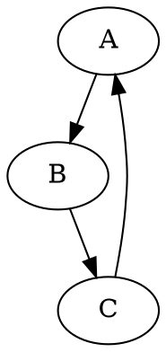

# Модуль для преобразования DOT-файлов в PNG-изображения

## Обзор

Модуль `dot` предоставляет функцию `dot2png`, которая конвертирует DOT-файлы в PNG-изображения с использованием библиотеки Graphviz.  

## Подробнее

Функция `dot2png` считывает DOT-файл, создает объект `Source` из его содержимого и рендерит его в PNG-файл.  Модуль также содержит код, который позволяет запускать преобразование из командной строки, передавая пути к входному DOT-файлу и выходному PNG-файлу в качестве аргументов.

## Функции

### `dot2png`

**Назначение**: Функция преобразует DOT-файл в PNG-изображение.

**Параметры**:
- `dot_file` (str): Путь к входному DOT-файлу.
- `png_file` (str): Путь, куда будет сохранен выходной PNG-файл.

**Возвращает**:
- `None`

**Вызывает исключения**:
- `FileNotFoundError`: Если DOT-файл не найден.
- `Exception`: При возникновении ошибок во время преобразования.

**Как работает функция**:
- Функция открывает DOT-файл и считывает его содержимое.
- Создает объект `Source` с помощью `Source(dot_content)`.
- Устанавливает формат вывода в `png` с помощью `source.format = 'png'`.
- Рендерит `source` в PNG-файл с помощью `source.render(png_file, cleanup=True)`.

**Примеры**:

```python
>>> dot2png('example.dot', 'output.png')

```

- Этот код конвертирует DOT-файл `example.dot` в PNG-изображение с именем `output.png`.



- Это пример содержимого DOT-файла для `example.dot`.

```bash
python dot2png.py example.dot output.png
```

- Эта команда из командной строки создаст PNG-файл `output.png` из графика, определенного в `example.dot`.

## Примеры вызова функции

```python
# Преобразует файл 'graph.dot' в файл 'graph.png'
dot2png('graph.dot', 'graph.png')

# Преобразует файл 'my_graph.dot' в файл 'output.png'
dot2png('my_graph.dot', 'output.png')