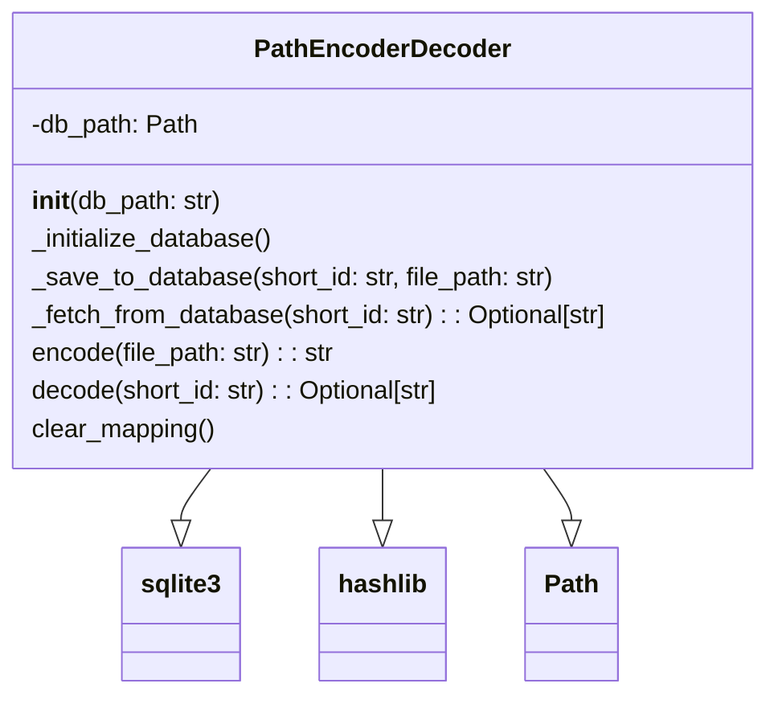

# Модуль кодирования и декодирования имен файлов

## Обзор

Модуль `encoder_decoder_file_names.py` предоставляет класс `PathEncoderDecoder`, который используется для кодирования и декодирования путей к файлам. Он использует базу данных SQLite для хранения соответствий между исходными путями файлов и их короткими идентификаторами, полученными на основе MD5-хешей. Это может быть полезно для сокращения длины путей файлов, упрощения их хранения или сокрытия реальной структуры файловой системы.

## Подробней

Этот модуль может использоваться в различных частях проекта `hypotez`, где требуется манипулировать путями к файлам. Он позволяет преобразовывать длинные и сложные пути в более короткие и простые идентификаторы, что может упростить работу с ними в различных контекстах, таких как конфигурационные файлы, базы данных или при передаче данных между компонентами системы.

## Классы

### `PathEncoderDecoder`

**Описание**: Класс `PathEncoderDecoder` предназначен для кодирования и декодирования путей файлов. Он использует базу данных SQLite для хранения соответствий между исходными путями и их короткими идентификаторами.

**Наследует**: Класс не наследует никаких классов.

**Атрибуты**:

- `db_path` (Path): Путь к файлу базы данных SQLite. По умолчанию 'path_mapping.db'.

**Принцип работы**:

Класс инициализируется с указанием пути к базе данных SQLite. При инициализации создается подключение к базе данных и таблица `path_mapping`, если она еще не существует. Таблица содержит два поля: `id` (короткий идентификатор пути) и `file_path` (полный путь к файлу).

Метод `encode` генерирует MD5-хеш от заданного пути файла, берет первые 8 символов хеша и сохраняет соответствие между коротким идентификатором и полным путем в базе данных.

Метод `decode` выполняет обратное преобразование: по заданному короткому идентификатору он извлекает из базы данных соответствующий полный путь к файлу.

Метод `clear_mapping` удаляет все записи из таблицы `path_mapping`, очищая тем самым все сохраненные соответствия.



## Методы класса

### `__init__`

```python
def __init__(self, db_path: str = 'path_mapping.db') -> None:
    """
    Инициализирует экземпляр класса PathEncoderDecoder.

    Args:
        db_path (str): Путь к базе данных SQLite. По умолчанию 'path_mapping.db'.

    Raises:
        sqlite3.Error: Если не удается подключиться к базе данных.

    Example:
        >>> encoder = PathEncoderDecoder(db_path='my_db.db')
    """
```

**Параметры**:

- `db_path` (str): Путь к базе данных SQLite. По умолчанию 'path_mapping.db'.

**Назначение**:

Инициализирует экземпляр класса `PathEncoderDecoder`, устанавливает путь к базе данных и вызывает метод `_initialize_database` для создания таблицы, если она не существует.

### `_initialize_database`

```python
def _initialize_database(self) -> None:
    """
    Инициализирует базу данных, создавая таблицу 'path_mapping', если она не существует.

    Args:
        Отсутствуют.

    Raises:
        sqlite3.Error: Если возникает ошибка при создании таблицы.

    Example:
        >>> encoder._initialize_database()
    """
```

**Параметры**:

- Отсутствуют.

**Назначение**:

Создает таблицу `path_mapping` в базе данных SQLite, если она еще не существует. Таблица содержит два поля: `id` (TEXT PRIMARY KEY) и `file_path` (TEXT NOT NULL).

### `_save_to_database`

```python
def _save_to_database(self, short_id: str, file_path: str) -> None:
    """
    Сохраняет соответствие между коротким идентификатором и путем к файлу в базе данных.

    Args:
        short_id (str): Короткий идентификатор пути.
        file_path (str): Полный путь к файлу.

    Raises:
        sqlite3.Error: Если возникает ошибка при выполнении запроса к базе данных.

    Example:
        >>> encoder._save_to_database('id-e1234567', 'src/test.txt')
    """
```

**Параметры**:

- `short_id` (str): Короткий идентификатор пути.
- `file_path` (str): Полный путь к файлу.

**Назначение**:

Сохраняет соответствие между `short_id` и `file_path` в базе данных.

### `_fetch_from_database`

```python
def _fetch_from_database(self, short_id: str) -> Optional[str]:
    """
    Извлекает путь к файлу из базы данных по короткому идентификатору.

    Args:
        short_id (str): Короткий идентификатор пути.

    Returns:
        Optional[str]: Полный путь к файлу, если идентификатор найден в базе данных, иначе None.

    Raises:
        sqlite3.Error: Если возникает ошибка при выполнении запроса к базе данных.

    Example:
        >>> encoder._fetch_from_database('id-e1234567')
        'src/test.txt'
    """
```

**Параметры**:

- `short_id` (str): Короткий идентификатор пути.

**Назначение**:

Извлекает `file_path` из базы данных по заданному `short_id`.

**Возвращает**:

- Полный путь к файлу (`str`) или `None`, если `short_id` не найден в базе данных.

### `encode`

```python
def encode(self, file_path: str) -> str:
    """
    Кодирует путь к файлу в короткий идентификатор, сохраняя соответствие в базе данных.

    Args:
        file_path (str): Полный путь к файлу.

    Returns:
        str: Короткий идентификатор пути.

    Raises:
        hashlib.Error: Если возникает ошибка при вычислении хеша.
        sqlite3.Error: Если возникает ошибка при сохранении данных в базе данных.

    Example:
        >>> encoder.encode('src/test.txt')
        'id-e1234567'
    """
```

**Параметры**:

- `file_path` (str): Полный путь к файлу.

**Назначение**:

Кодирует путь файла в короткий идентификатор, сохраняет соответствие в базе данных.

**Возвращает**:

- Короткий идентификатор (`str`).

### `decode`

```python
def decode(self, short_id: str) -> Optional[str]:
    """
    Декодирует короткий идентификатор обратно в путь к файлу.

    Args:
        short_id (str): Короткий идентификатор пути.

    Returns:
        Optional[str]: Полный путь к файлу, если идентификатор найден в базе данных, иначе None.

    Raises:
        sqlite3.Error: Если возникает ошибка при выполнении запроса к базе данных.

    Example:
        >>> encoder.decode('id-e1234567')
        'src/test.txt'
    """
```

**Параметры**:

- `short_id` (str): Короткий идентификатор пути.

**Назначение**:

Декодирует короткий идентификатор обратно в полный путь файла.

**Возвращает**:

- Полный путь к файлу (`str`) или `None`, если `short_id` не найден в базе данных.

### `clear_mapping`

```python
def clear_mapping(self) -> None:
    """
    Очищает таблицу соответствий в базе данных.

    Args:
        Отсутствуют.

    Raises:
        sqlite3.Error: Если возникает ошибка при выполнении запроса к базе данных.

    Example:
        >>> encoder.clear_mapping()
    """
```

**Параметры**:

- Отсутствуют.

**Назначение**:

Удаляет все записи из таблицы `path_mapping` в базе данных.

## Параметры класса

- `db_path` (Path): Путь к базе данных SQLite.
- `short_id (str)`: Короткий идентификатор пути, созданный на основе хеша.
- `file_path (str)`: Полный путь к файлу.
- `path_hash (str)`: MD5 хеш пути файла.
- `conn (sqlite3.Connection)`: Объект подключения к базе данных SQLite.
- `cursor (sqlite3.Cursor)`: Объект курсора для выполнения SQL запросов.
- `result (tuple)`: Результат выполнения SQL запроса (извлеченный из базы данных).

## Примеры

```python
from pathlib import Path
import hashlib
import sqlite3
from typing import Optional

class PathEncoderDecoder:
    def __init__(self, db_path: str = 'path_mapping.db') -> None:
        self.db_path = Path(db_path)
        self._initialize_database()

    def _initialize_database(self) -> None:
        conn = sqlite3.connect(self.db_path)
        cursor = conn.cursor()
        cursor.execute("""
            CREATE TABLE IF NOT EXISTS path_mapping (
                id TEXT PRIMARY KEY,
                file_path TEXT NOT NULL
            )
        """)
        conn.commit()
        conn.close()

    def _save_to_database(self, short_id: str, file_path: str) -> None:
        conn = sqlite3.connect(self.db_path)
        cursor = conn.cursor()
        cursor.execute("INSERT INTO path_mapping (id, file_path) VALUES (?, ?)", (short_id, file_path))
        conn.commit()
        conn.close()

    def _fetch_from_database(self, short_id: str) -> Optional[str]:
        conn = sqlite3.connect(self.db_path)
        cursor = conn.cursor()
        cursor.execute("SELECT file_path FROM path_mapping WHERE id = ?", (short_id,))
        result = cursor.fetchone()
        conn.close()
        if result:
            return result[0]
        return None

    def encode(self, file_path: str) -> str:
        path_hash = hashlib.md5(file_path.encode('utf-8')).hexdigest()
        short_id = f"id-{path_hash[:8]}"
        self._save_to_database(short_id, file_path)
        return short_id

    def decode(self, short_id: str) -> Optional[str]:
        return self._fetch_from_database(short_id)

    def clear_mapping(self) -> None:
        conn = sqlite3.connect(self.db_path)
        cursor = conn.cursor()
        cursor.execute("DELETE FROM path_mapping")
        conn.commit()
        conn.close()

# Пример использования
encoder_decoder = PathEncoderDecoder(db_path='test.db')

# Кодирование пути файла
encoded_path = encoder_decoder.encode('src/test.txt')
print(f"Encoded path: {encoded_path}")

# Декодирование короткого идентификатора
decoded_path = encoder_decoder.decode(encoded_path)
print(f"Decoded path: {decoded_path}")

# Очистка таблицы соответствий
encoder_decoder.clear_mapping()