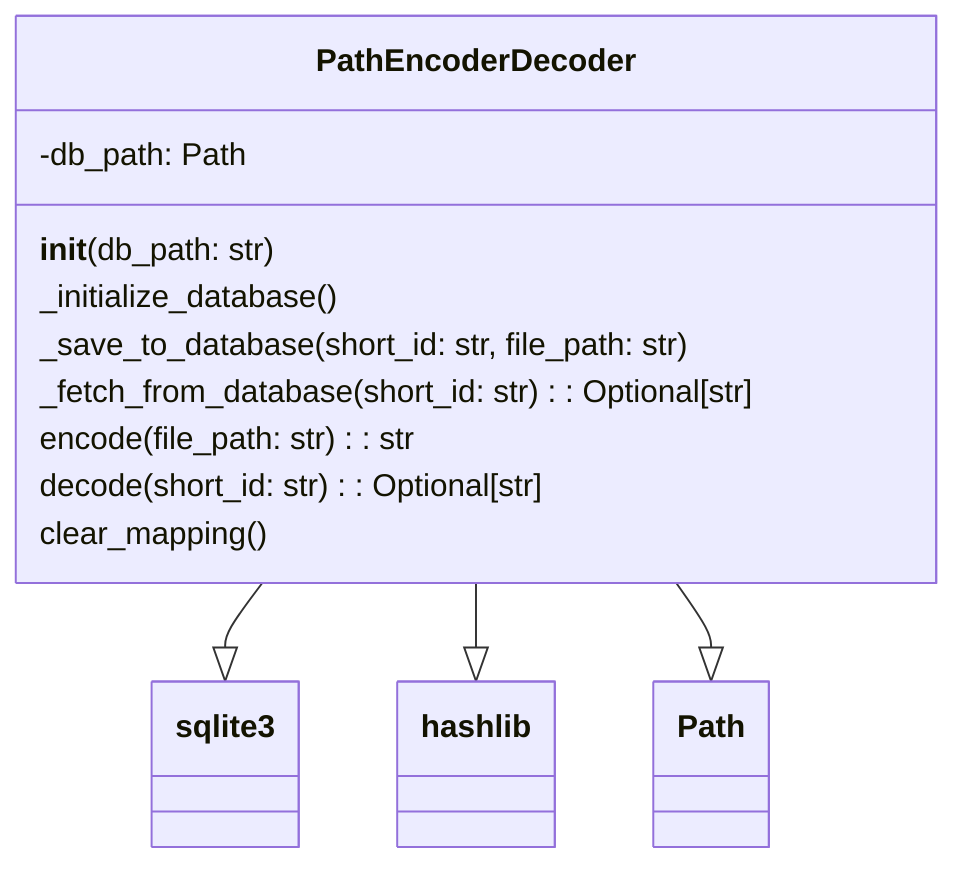

### Анализ кода `hypotez/toolbox/encoder_decoder_file_names.py`

#### 1. Блок-схема:

```mermaid
graph TD
    A[Начало] --> B{Инициализация PathEncoderDecoder};
    B --> C{Проверка наличия path_mapping.db};
    C -- Нет --> D[Создание path_mapping.db и таблицы path_mapping];
    C -- Да --> E[Подключение к path_mapping.db];
    E --> F{Вызов encode(file_path: str)};
    F --> G[Генерация MD5 хэша от file_path];
    G --> H[Формирование short_id];
    H --> I[Сохранение short_id и file_path в path_mapping];
    I --> J[Возврат short_id];
    F --> K{Вызов decode(short_id: str)};
    K --> L[Поиск file_path в path_mapping по short_id];
    L -- Найдено --> M[Возврат file_path];
    L -- Не найдено --> N[Возврат None];
    K --> O{Вызов clear_mapping()};
    O --> P[Удаление всех записей из path_mapping];
    P --> Q[Завершение];
```

**Примеры для каждого логического блока:**

- **Инициализация `PathEncoderDecoder`**: Создается объект класса, указывается путь к БД.
  ```python
  encoder_decoder = PathEncoderDecoder(db_path='test.db')
  ```
- **Проверка наличия `path_mapping.db`**: Проверяется, существует ли файл базы данных.
- **Создание `path_mapping.db` и таблицы `path_mapping`**: Если файла нет, он создается, и в нем создается таблица с полями `id` и `file_path`.
- **Подключение к `path_mapping.db`**: Устанавливается соединение с базой данных.
- **Вызов `encode(file_path: str)`**: Кодирование пути файла.
  ```python
  encoded_path = encoder_decoder.encode('src/test.txt')
  ```
- **Генерация MD5 хэша от `file_path`**: Вычисляется MD5 хэш от переданного пути.
- **Формирование `short_id`**: Создается короткий идентификатор на основе хэша.
- **Сохранение `short_id` и `file_path` в `path_mapping`**: Запись в таблицу соответствия между идентификатором и путем.
- **Возврат `short_id`**: Функция возвращает короткий идентификатор.
- **Вызов `decode(short_id: str)`**: Декодирование короткого идентификатора.
  ```python
  decoded_path = encoder_decoder.decode('id-e1234567')
  ```
- **Поиск `file_path` в `path_mapping` по `short_id`**: Поиск пути в базе данных по идентификатору.
- **Возврат `file_path`**: Функция возвращает путь файла.
- **Возврат `None`**: Если путь не найден, возвращается `None`.
- **Вызов `clear_mapping()`**: Очистка таблицы соответствий.
  ```python
  encoder_decoder.clear_mapping()
  ```
- **Удаление всех записей из `path_mapping`**: Очистка таблицы в базе данных.
- **Завершение**: Конец выполнения операций.

#### 2. Диаграмма:



**Объяснение зависимостей:**

- `PathEncoderDecoder` зависит от модулей `sqlite3`, `hashlib` и класса `Path` из модуля `pathlib`.
  - `sqlite3` используется для работы с базой данных SQLite, где хранятся соответствия между короткими идентификаторами и полными путями файлов.
  - `hashlib` применяется для создания MD5 хэшей, которые используются в качестве коротких идентификаторов.
  - `Path` используется для представления путей к файлам в файловой системе, что упрощает работу с путями.

#### 3. Объяснение:

- **Импорты:**

  *   `hashlib`: Используется для создания хэшей от путей файлов. В данном случае используется алгоритм MD5 для генерации короткого идентификатора пути.
  *   `sqlite3`: Используется для работы с SQLite базой данных. База данных хранит соответствия между полными путями файлов и их короткими идентификаторами.
  *   `pathlib.Path`: Используется для представления путей к файлам как объектов, что упрощает операции с путями.
  *   `typing.Optional`: Используется для указания, что функция может возвращать значение типа `str` или `None`.

- **Класс `PathEncoderDecoder`:**

  *   **Роль**: Кодирование и декодирование путей файлов, используя хэширование и сохранение соответствий в базе данных SQLite.
  *   **Атрибуты**:
    *   `db_path (Path)`: Путь к файлу базы данных SQLite.
  *   **Методы**:
    *   `__init__(self, db_path: str = 'path_mapping.db')`: Инициализация класса, создает подключение к базе данных и инициализирует таблицу, если она не существует.
    *   `_initialize_database(self)`: Создает таблицу `path_mapping` в базе данных, если она не существует. Таблица содержит поля `id` (TEXT PRIMARY KEY) и `file_path` (TEXT NOT NULL).
    *   `_save_to_database(self, short_id: str, file_path: str)`: Сохраняет соответствие между коротким идентификатором (`short_id`) и полным путем файла (`file_path`) в базе данных.
    *   `_fetch_from_database(self, short_id: str) -> Optional[str]`: Извлекает полный путь файла из базы данных по заданному короткому идентификатору. Возвращает `None`, если идентификатор не найден.
    *   `encode(self, file_path: str) -> str`: Кодирует путь файла в короткий идентификатор. Генерирует MD5 хэш от пути, берет первые 8 символов хэша и сохраняет соответствие в базе данных. Возвращает короткий идентификатор.
    *   `decode(self, short_id: str) -> Optional[str]`: Декодирует короткий идентификатор обратно в полный путь файла, используя базу данных.
    *   `clear_mapping(self)`: Очищает таблицу соответствий в базе данных.

- **Функции**:

  *   `__init__`:

    *   **Аргументы**: `db_path` (путь к базе данных, по умолчанию `'path_mapping.db'`).
    *   **Назначение**: Инициализирует экземпляр класса `PathEncoderDecoder`, устанавливает путь к базе данных и вызывает метод `_initialize_database` для создания таблицы, если она не существует.
  *   `_initialize_database`:

    *   **Аргументы**: Отсутствуют.
    *   **Назначение**: Создает таблицу `path_mapping` в базе данных SQLite, если она еще не существует.
  *   `_save_to_database`:

    *   **Аргументы**: `short_id` (короткий идентификатор пути), `file_path` (полный путь к файлу).
    *   **Назначение**: Сохраняет соответствие между `short_id` и `file_path` в базе данных.
  *   `_fetch_from_database`:

    *   **Аргументы**: `short_id` (короткий идентификатор пути).
    *   **Назначение**: Извлекает `file_path` из базы данных по заданному `short_id`.
    *   **Возвращаемое значение**: Полный путь к файлу (`str`) или `None`, если `short_id` не найден в базе данных.
  *   `encode`:

    *   **Аргументы**: `file_path` (полный путь к файлу).
    *   **Назначение**: Кодирует путь файла в короткий идентификатор, сохраняет соответствие в базе данных.
    *   **Возвращаемое значение**: Короткий идентификатор (`str`).
  *   `decode`:

    *   **Аргументы**: `short_id` (короткий идентификатор пути).
    *   **Назначение**: Декодирует короткий идентификатор обратно в полный путь файла.
    *   **Возвращаемое значение**: Полный путь к файлу (`str`) или `None`, если `short_id` не найден в базе данных.
  *   `clear_mapping`:

    *   **Аргументы**: Отсутствуют.
    *   **Назначение**: Удаляет все записи из таблицы `path_mapping` в базе данных.

- **Переменные**:

  *   `db_path (Path)`: Путь к базе данных SQLite.
  *   `short_id (str)`: Короткий идентификатор пути, созданный на основе хэша.
  *   `file_path (str)`: Полный путь к файлу.
  *   `path_hash (str)`: MD5 хэш пути файла.
  *   `conn (sqlite3.Connection)`: Объект подключения к базе данных SQLite.
  *   `cursor (sqlite3.Cursor)`: Объект курсора для выполнения SQL запросов.
  *   `result (tuple)`: Результат выполнения SQL запроса (извлеченный из базы данных).

- **Потенциальные ошибки и области для улучшения**:

  *   **Коллизии хэшей**: Использование первых 8 символов MD5 хэша может привести к коллизиям, когда разные пути файлов генерируют одинаковые короткие идентификаторы. Это можно улучшить, увеличив длину используемой части хэша или используя другой алгоритм хэширования.
  *   **Безопасность**: MD5 не является криптографически стойким хэшем, и его использование может представлять угрозу безопасности, если короткие идентификаторы используются для чего-либо, кроме простого сокрытия путей.
  *   **Обработка исключений**: В коде отсутствуют явные блоки `try...except` для обработки возможных исключений при работе с базой данных (например, ошибки подключения, ошибки выполнения запросов).
  *   **Производительность**: Для больших объемов данных, сохранение всех соответствий в SQLite может быть не самым эффективным решением. Можно рассмотреть использование других баз данных или механизмов хранения данных.

- **Взаимосвязь с другими частями проекта**:

  *   Этот модуль может использоваться в других частях проекта `hypotez`, где требуется хранить и обрабатывать пути к файлам, заменяя полные пути на короткие идентификаторы. Это может быть полезно для упрощения хранения путей в конфигурационных файлах или базах данных, а также для сокрытия структуры файловой системы.