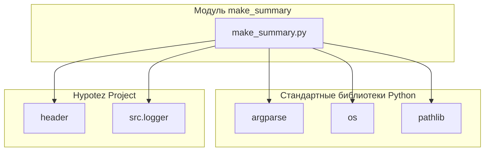

### Анализ кода модуля `make_summary.py`

## \\file /src/endpoints/hypo69/code_assistant/make_summary.py

### Качество кода:

-   **Соответствие стандартам**: 7/10
-   **Плюсы**:

    *   Подробное описание функциональности модуля.
    *   Использование `argparse` для обработки аргументов командной строки.
    *   Четкое разделение логики на отдельные функции.
-   **Минусы**:

    *   Отсутствует описание импортируемых модулей и их ролей (кроме `header`).
    *   Docstring для функции `_make_summary` не соответствует формату, отсутствует информация о вызываемых исключениях.
    *   В коде есть `print` для вывода сообщений, лучше использовать `logger`.
    *   Отсутствует обработка ошибок при создании директорий.

### Рекомендации по улучшению:

1.  **Добавить описание импортируемых модулей**:

    *   Указать, какие модули импортируются и для чего они используются.
2.  **Добавить описание констант, используемых в модуле**:

    *   Пояснить назначение константы `PROJECT_ROOT`.
3.  **Дополнить docstring для функции `_make_summary`**:

    *   Добавить описание вызываемых исключений, если они есть.
4.  **Использовать `logger` вместо `print`**:

    *   Заменить все `print` на `logger.info` или `logger.error` для единообразного логирования.
5.  **Добавить обработку ошибок при создании директорий**:

    *   Обернуть создание директории в блок `try...except` для обработки возможных исключений.

### Оптимизированный код:

```python
# -*- coding: utf-8 -*-

#! .pyenv/bin/python3

"""
module: src.endpoints.hypo69.code_assistant.make_summary
    :platform: Windows, Unix
    :synopsis: Модуль собирает файл `summary.md` для компиляции средствами `mdbook`
    Подробнее: https://chatgpt.com/share/6742f054-aaa0-800d-9f84-0ab035a2a2c2
"""

from pathlib import Path
import argparse
import os
from src.logger import logger  # Import the logger module
import header  # Импорт модуля, который определяет корневой путь проекта

# Используем корневой путь проекта
PROJECT_ROOT = header.__root__


def make_summary(docs_dir: Path, lang: str = 'en') -> None:
    """
    Создает файл SUMMARY.md, рекурсивно обходя папку.

    Args:
        docs_dir (Path): Путь к исходной директории 'src'.
        lang (str): Язык фильтрации файлов. Возможные значения: 'ru' или 'en'.
    """
    # Используем корневой путь для формирования пути к SUMMARY.md
    summary_file = prepare_summary_path(docs_dir)
    try:
        summary_file.parent.mkdir(parents=True, exist_ok=True)
        logger.info(f"Created directory: {summary_file.parent}")
    except OSError as ex:
        logger.error(f"Can't create folder {summary_file.parent=}", ex, exc_info=False)
    _make_summary(docs_dir, summary_file, lang)


def _make_summary(src_dir: Path, summary_file: Path, lang: str = 'en') -> bool:
    """
    Рекурсивно обходит папку и создает файл SUMMARY.md с главами на основе .md файлов.

    Args:
        src_dir (Path): Путь к папке с исходниками .md.
        summary_file (Path): Путь для сохранения файла SUMMARY.md.
        lang (str): Язык фильтрации файлов. Возможные значения: 'ru' или 'en'.

    Returns:
        bool: True в случае успешного создания SUMMARY.md, иначе False.
    """
    try:
        if summary_file.exists():
            logger.info(f"Файл {summary_file} уже существует. Его содержимое будет перезаписано.")

        with summary_file.open('w', encoding='utf-8') as summary:
            summary.write('# Summary\n\n')

            for path in sorted(src_dir.rglob('*.md')):
                if path.name == 'SUMMARY.md':
                    continue

                # Фильтрация файлов по языку
                if lang == 'ru' and not path.name.endswith('.ru.md'):
                    continue  # Пропускаем файлы без суффикса .ru.md
                elif lang == 'en' and path.name.endswith('.ru.md'):
                    continue  # Пропускаем файлы с суффикса .ru.md

                relative_path = path.relative_to(src_dir.parent)
                summary.write(f'- [{path.stem}]({relative_path.as_posix()})\n')
        logger.info(f"Successfully wrote to file: {summary_file}")
        return True
    except Exception as ex:
        logger.error(f"Ошибка создания файла `summary.md`: {ex}", exc_info=True)
        return False


def prepare_summary_path(src_dir: Path, file_name: str = 'SUMMARY.md') -> Path:
    """
    Формирует путь к файлу, заменяя часть пути 'src' на 'docs' и добавляя имя файла.

    Args:
        src_dir (Path): Исходный путь с 'src'.
        file_name (str): Имя файла, который нужно создать. По умолчанию 'SUMMARY.md'.

    Returns:
        Path: Новый путь к файлу.
    """
    # Используем корневой путь для формирования пути к SUMMARY.md
    new_dir = PROJECT_ROOT / 'docs'
    summary_file = new_dir / file_name
    return summary_file


if __name__ == '__main__':
    # Парсинг аргументов командной строки
    parser = argparse.ArgumentParser(description="Создание файла SUMMARY.md с фильтрацией по языку.")
    parser.add_argument('-lang', type=str, choices=['ru', 'en'], default='en', help="Язык фильтрации файлов (ru или en). По умолчанию 'en'.")
    parser.add_argument('src_dir', type=str, help="Путь к исходной директории 'src'.")
    args = parser.parse_args()

    # Преобразование пути в объект Path
    src_dir = PROJECT_ROOT / args.src_dir

    # Вызов функции make_summary с переданными аргументами
    make_summary(src_dir, args.lang)
```

### 1. Блок-схема

```mermaid
graph LR
    A[Начало] --> B{Аргументы командной строки};
    B -- Есть аргументы --> C{Определение целевого каталога};
    B -- Нет аргументов --> E[Вывод справки и завершение];
    C --> D{Создание целевого каталога (если необходимо)};
    D --> F{Формирование списка .md файлов};
    F --> G{Фильтрация файлов по языку};
    G -- Язык указан --> H{Формирование содержимого SUMMARY.md};
    G -- Язык не указан --> I[Включить все .md файлы];
    H --> J{Запись содержимого в SUMMARY.md};
    I --> J
    J --> K[Конец];
    K -- Успешно --> L[Файл SUMMARY.md создан];
    K -- Ошибка --> M[Вывод сообщения об ошибке];
```

**Примеры для логических блоков:**

-   **B{Аргументы командной строки}**:

    *   Пример: `python make_summary.py -lang ru src`
    *   Пример: `python make_summary.py -lang en docs`
-   **D{Создание целевого каталога (если необходимо)}**:

    *   Если каталога `docs` не существует, он будет создан.
-   **G{Фильтрация файлов по языку}**:

    *   Если указан `-lang ru`, то включаются только файлы с `.ru.md`.
    *   Если указан `-lang en`, то файлы с `.ru.md` исключаются.

## 2. Диаграмма зависимостей



**Объяснение зависимостей:**

-   **argparse**: Используется для обработки аргументов командной строки, позволяя скрипту принимать параметры, такие как язык и путь к исходному каталогу.
-   **os**: Предоставляет функции для взаимодействия с операционной системой, такие как работа с файловой системой (создание каталогов, обход дерева каталогов).
-   **pathlib**:  Облегчает работу с путями к файлам и каталогам, предоставляя объектно-ориентированный интерфейс.
-   **header**: Модуль, содержащий информацию о проекте, включая корневой путь.
-   **src.logger**: Модуль, предоставляющий функции для логирования сообщений.

## 3. Объяснение

**Импорты:**

-   `argparse`: Модуль используется для разбора аргументов командной строки, что позволяет пользователю указывать параметры, такие как язык и исходный каталог.
-   `os`: Модуль предоставляет функции для взаимодействия с операционной системой, включая работу с файловой системой.
-   `pathlib`: Модуль предоставляет классы для представления путей к файлам и каталогам, что упрощает работу с файловой системой.
-   `src.logger`: Используется для логирования сообщений о процессе выполнения скрипта, включая информацию об ошибках.
-   `header`: Модуль, содержащий информацию о проекте.

**Константы:**

-   `PROJECT_ROOT`:  Переменная, содержащая корневой путь проекта, полученный из модуля `header`.

**Функции:**

-   `make_summary(docs_dir: Path, lang: str = 'en') -> None`:

    *   **Аргументы:**

        *   `docs_dir` (Path): Путь к исходной директории 'src'.
        *   `lang` (str): Язык фильтрации файлов. Возможные значения: 'ru' или 'en'. По умолчанию 'en'.
    *   **Возвращаемое значение:** `None`.
    *   **Назначение:** Создает файл SUMMARY.md, рекурсивно обходя указанную директорию.
    *   **Пример:**

        ```python
        make_summary(Path('src'), 'ru')
        ```

-   `_make_summary(src_dir: Path, summary_file: Path, lang: str = 'en') -> bool`:

    *   **Аргументы:**

        *   `src_dir` (Path): Путь к папке с исходниками .md.
        *   `summary_file` (Path): Путь для сохранения файла SUMMARY.md.
        *   `lang` (str): Язык фильтрации файлов. Возможные значения: 'ru' или 'en'. По умолчанию 'en'.
    *   **Возвращаемое значение:** `bool`: True в случае успешного создания SUMMARY.md, иначе False.
    *   **Назначение**: Рекурсивно обходит папку и создает файл SUMMARY.md с главами на основе .md файлов.

-   `prepare_summary_path(src_dir: Path, file_name: str = 'SUMMARY.md') -> Path`:

    *   **Аргументы:**

        *   `src_dir` (Path): Исходный путь с 'src'.
        *   `file_name` (str): Имя файла, который нужно создать. По умолчанию 'SUMMARY.md'.
    *   **Возвращаемое значение:** `Path`: Новый путь к файлу.
    *   **Назначение**: Формирует путь к файлу, заменяя часть пути 'src' на 'docs' и добавляя имя файла.

**Переменные:**

-   Переменные используются внутри функций для хранения путей к файлам и содержимого файла `SUMMARY.md`.

**Потенциальные ошибки и области для улучшения:**

-   Отсутствует обработка ситуаций, когда указанный язык не поддерживается (например, если указан `-lang de`).
-   Нет проверки на существование исходных файлов перед их добавлением в `SUMMARY.md`.
-   Docstring функции `_make_summary` не соответствует формату, отсутствует информация о вызываемых исключениях.
-    Использовать `logger` вместо `print`

**Взаимосвязи с другими частями проекта:**

-   Модуль `make_summary.py` использует модуль `header` для получения корневого пути проекта, а также использует модуль `src.logger` для логирования. Этот модуль может использоваться для автоматической генерации документации для других модулей проекта, упрощая поддержку и обновление документации.