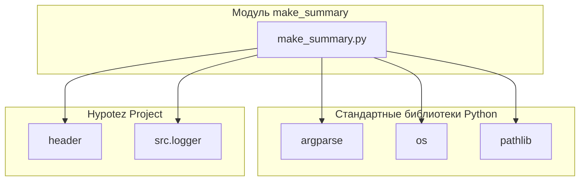

### Анализ кода модуля `make_summary.py`

#### 1. Блок-схема

```mermaid
graph LR
    A[Начало: Скрипт запускается] --> B{Указан ли путь к исходной директории 'src' и язык?};
    B -- Да --> C{Является ли указанный язык 'ru' или 'en'?};
    B -- Нет --> D[Использовать значения по умолчанию: язык = 'en', путь к 'src' должен быть указан];
    C -- Да --> E[Преобразование пути к 'src' в объект Path];
    C -- Нет --> F[Вывод сообщения об ошибке: Недопустимый язык];
    E --> G[Вызов функции make_summary(src_dir, lang)];
    G --> H[Функция make_summary вызывает prepare_summary_path(src_dir)];
    H --> I[Функция prepare_summary_path формирует путь к файлу SUMMARY.md в директории 'docs'];
    I --> J[Функция make_summary вызывает _make_summary(src_dir, summary_file, lang)];
    J --> K{Существует ли файл SUMMARY.md?};
    K -- Да --> L[Вывод предупреждения о перезаписи файла];
    K -- Нет --> M[Создание файла SUMMARY.md];
    M --> N[Запись заголовка '# Summary' в файл];
    N --> O[Рекурсивный обход директории 'src' в поиске файлов '.md'];
    O --> P{Имя файла 'SUMMARY.md'?};
    P -- Да --> Q[Пропустить файл];
    P -- Нет --> R{Фильтрация файлов по языку};
    R -- 'ru' --> S{Имя файла заканчивается на '.ru.md'?};
    S -- Да --> U[Формирование относительного пути к файлу];
    S -- Нет --> Q;
    R -- 'en' --> T{Имя файла заканчивается на '.ru.md'?};
    T -- Нет --> U;
    T -- Да --> Q;
    U --> V[Запись строки в файл SUMMARY.md в формате '- [path.stem](relative_path)'];
    V --> O;
    O -- Больше файлов нет --> W[Закрытие файла SUMMARY.md];
    W --> X[Завершение: Файл SUMMARY.md создан/перезаписан];
    F --> X;
    L --> M;

    style A fill:#f9f,stroke:#333,stroke-width:2px
    style X fill:#f9f,stroke:#333,stroke-width:2px
```

**Примеры для логических блоков:**

-   **B{Указан ли путь к исходной директории 'src' и язык?}**:

    *   Да: `python make_summary.py --lang ru src_dir`
    *   Нет: `python make_summary.py src_dir` (язык по умолчанию 'en')
-   **C{Является ли указанный язык 'ru' или 'en'?}**:

    *   Да: `--lang ru` или `--lang en`
    *   Нет: `--lang de` (вызовет ошибку, так как допустимые значения 'ru' или 'en')
-   **P{Имя файла 'SUMMARY.md'?}**:

    *   Да: Файл `SUMMARY.md` будет пропущен при обходе директории.
    *   Нет: Файлы, такие как `example.md` или `another.ru.md`, будут обработаны.
-   **S{Имя файла заканчивается на '.ru.md'?}**:

    *   Да: `example.ru.md` (файл будет включен, если указан язык 'ru')
    *   Нет: `example.md` (файл будет пропущен, если указан язык 'ru')
-   **T{Имя файла заканчивается на '.ru.md'?}**:

    *   Да: `example.ru.md` (файл будет пропущен, если указан язык 'en')
    *   Нет: `example.md` (файл будет включен, если указан язык 'en')

#### 2. Диаграмма зависимостей



**Объяснение зависимостей:**

-   **argparse**: Используется для обработки аргументов командной строки, позволяя скрипту принимать параметры, такие как язык и путь к исходному каталогу.
-   **os**: Предоставляет функции для взаимодействия с операционной системой, такие как работа с файловой системой (создание каталогов, обход дерева каталогов).
-   **pathlib**:  Облегчает работу с путями к файлам и каталогам, предоставляя объектно-ориентированный интерфейс.
-   **header**: Модуль, содержащий информацию о проекте, включая корневой путь.
-   **src.logger**: Модуль, предоставляющий функции для логирования сообщений.

#### 3. Объяснение

**Импорты:**

-   `from pathlib import Path`: Импортирует класс `Path` из модуля `pathlib`, который предоставляет способ представления путей к файлам и директориям и работы с ними.
-   `import argparse`: Импортирует модуль `argparse`, который используется для разбора аргументов командной строки.
-   `import header`: Импортирует модуль `header`, который, как предполагается, содержит информацию о корневом пути проекта.
-   `from src.logger import logger`: Импортирует модуль `logger` для логирования сообщений.

**Константы:**

-   `PROJECT_ROOT`:  Переменная, содержащая корневой путь проекта, полученный из модуля `header`.

**Функции:**

-   `make_summary(docs_dir: Path, lang: str = 'en') -> None`:

    *   **Аргументы:**

        *   `docs_dir` (Path): Путь к исходной директории 'src'.
        *   `lang` (str): Язык фильтрации файлов. Возможные значения: 'ru' или 'en'. По умолчанию 'en'.
    *   **Возвращаемое значение:** `None`.
    *   **Назначение:** Создает файл SUMMARY.md, рекурсивно обходя указанную директорию.
    *   **Пример:**

        ```python
        make_summary(Path('src'), 'ru')
        ```

        Эта функция создаст `SUMMARY.md` в директории `docs`, содержащий ссылки на все `.ru.md` файлы в директории `src` и ее поддиректориях.

-   `_make_summary(src_dir: Path, summary_file: Path, lang: str = 'en') -> bool`:

    *   **Аргументы:**

        *   `src_dir` (Path): Путь к папке с исходниками .md.
        *   `summary_file` (Path): Путь для сохранения файла SUMMARY.md.
        *   `lang` (str): Язык фильтрации файлов. Возможные значения: 'ru' или 'en'. По умолчанию 'en'.
    *   **Возвращаемое значение:** `bool`: True в случае успешного создания SUMMARY.md, иначе False.
    *   **Назначение**: Рекурсивно обходит папку и создает файл SUMMARY.md с главами на основе .md файлов.

-   `prepare_summary_path(src_dir: Path, file_name: str = 'SUMMARY.md') -> Path`:

    *   **Аргументы:**

        *   `src_dir` (Path): Исходный путь с 'src'.
        *   `file_name` (str): Имя файла, который нужно создать. По умолчанию 'SUMMARY.md'.
    *   **Возвращаемое значение:** `Path`: Новый путь к файлу.
    *   **Назначение**: Формирует путь к файлу, заменяя часть пути `src` на `docs` и добавляя имя файла.

**Переменные:**

-   `PROJECT_ROOT`:  Путь к корневой директории проекта. Определяется модулем `header`.
-   `args`: Объект, возвращаемый `parser.parse_args()`, содержащий значения аргументов командной строки.
    Атрибуты: `lang` (язык фильтрации), `src_dir` (путь к исходной директории).
-   `summary_file`: Объект `Path`, представляющий путь к файлу `SUMMARY.md`.
-   `relative_path`: Объект `Path`, представляющий относительный путь от `src_dir.parent` до текущего файла `.md`.

**Потенциальные ошибки и области для улучшения:**

-   Отсутствует обработка ситуаций, когда указанный язык не поддерживается (например, если указан `-lang de`).
-   Нет проверки на существование исходных файлов перед их добавлением в `SUMMARY.md`.

**Взаимосвязи с другими частями проекта:**

-   Модуль `make_summary.py` использует модуль `header` для получения корневого пути проекта, а также использует модуль `src.logger` для логирования. Этот модуль может использоваться для автоматической генерации документации для других модулей проекта, упрощая поддержку и обновление документации.