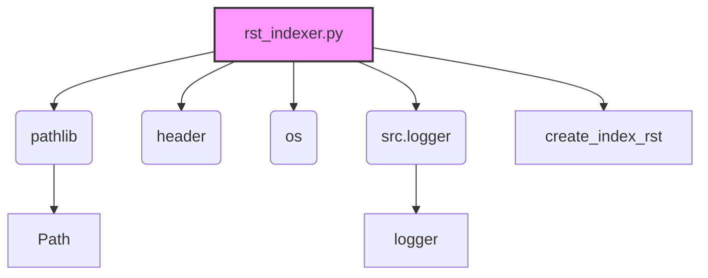

### Анализ кода `hypotez/toolbox/rst_indexer.py.md`

#### 1. Блок-схема

```mermaid
graph TD
    A[Начало: Вызов create_index_rst(start_dir)] --> B{Проверка существования docs_dir};
    B -- Нет --> C[Создание docs_dir];
    C --> D[Логирование: Создание каталога docs];
    B -- Да --> D;
    D --> E[Логирование: Начало создания index.rst];
    E --> F[Открытие index_file_path для записи];
    F --> G[Запись заголовка index.rst (Sphinx формат)];
    G --> H[Инициализация found_files = False];
    H --> I{Начало обхода os.walk(start_path)};
    I -- Для каждого root, _, files --> J[Фильтрация py_files: .py, без \'(\' и \')\'];
    J --> K{Если py_files не пуст};\n    K -- Да --> L[found_files = True];
    L --> M[Вычисление относительного пути rel_root];
    M --> N{Для каждого py_file в py_files};
    N --> O[Формирование module_path];
    O --> P[Удаление .py и замена os.sep на \'.\' в module_name];
    P --> Q[Запись module_name в index_file (Sphinx формат)];
    Q --> R[Логирование: Добавление Python файлов];
    N -- Конец цикла --> I;
    K -- Нет --> I;
    I -- Конец обхода --> S{Если not found_files};
    S -- Да --> T[Логирование: Нет Python файлов];
    T --> U[Запись сообщения "No modules found." в index_file];
    S -- Нет --> U;
    U --> V[Логирование: Успешная запись в файл];
    V --> W[Конец: Закрытие index_file];
    F -- Ошибка --> X[Логирование: Ошибка при создании index.rst];
    X --> Y[Выброс исключения];
```

#### 2. Диаграмма



#### Объяснение зависимостей:

*   `pathlib`:  Используется для работы с путями к файлам и директориям.
*   `header`:  Используется для получения корневого пути проекта.
*   `os`:  Используется для взаимодействия с операционной системой, в частности, для рекурсивного обхода директорий.
*   `src.logger`:  Используется для логирования информации о процессе создания `index.rst`.

### 3. Объяснение

#### Импорты:

*   `pathlib`:  Модуль для работы с путями к файлам и директориям.
*   `header`: Модуль, определяющий корневой путь проекта.
*   `os`: Модуль для взаимодействия с операционной системой.
*   `src.logger`: Модуль для логирования событий и ошибок.

#### Функции:

*   `create_index_rst(start_dir: str) -> None`:

    *   **Аргументы**:

        *   `start_dir` (str): Корневая директория для обхода.
    *   **Возвращает**:

        *   `None`
    *   **Назначение**:

        Рекурсивно обходит поддиректории указанной директории, находит Python файлы и создает `index.rst` файл, содержащий список этих файлов в формате `toctree` для Sphinx.

        *   **Как работает функция**:

        Функция `create_index_rst` выполняет следующие шаги:

        1.  Определяет пути к исходной директории, директории `docs` и файлу `index.rst`.
        2.  Создает директорию `docs`, если она не существует.
        3.  Открывает файл `index.rst` для записи.
        4.  Записывает заголовок и структуру `toctree` в файл.
        5.  Рекурсивно обходит все поддиректории, начиная с указанной.
        6.  Находит все Python-файлы в каждой директории.
        7.  Вычисляет относительный путь к каждому файлу и форматирует его имя для Sphinx.
        8.  Добавляет отформатированное имя модуля в `toctree`.
        9.  Если файлы не найдены, добавляет сообщение об этом в файл.
        10. Закрывает файл.

#### Переменные:

*   `start_dir`: Путь к корневой директории, с которой начинается обход.
*   `docs_dir`: Путь к директории, где будет создан `index.rst`.
*   `index_file_path`: Путь к файлу `index.rst`.
*   `found_files`: Флаг, указывающий, были ли найдены Python файлы.
*   `py_files`: Список Python файлов в текущей директории.
*   `rel_root`: Относительный путь к текущей директории.
*   `module_name`: имя модуля
*   `ex`: Обработка исключения

#### Потенциальные ошибки и области для улучшения:

*   **Обработка исключений**: Кроме общего блока `except Exception as ex:`, отсутствует более детальная обработка исключений, которые могут возникнуть при работе с файловой системой.
*    **Использование try ... except**: Используется `logger.error` , при возникновении ошибки в блоке `except Exception as ex:`,
*   **Жестко заданные пути**: Путь к директории `docs` жестко задан в коде. Было бы полезно сделать его более гибким.
*   **Неполная документация**: Описание некоторых переменных отсутствует.

#### Взаимосвязи с другими частями проекта:

*   Использует модуль `header` для получения корневого пути проекта.
*   Использует модуль `src.logger` для логирования.
*   Результатом работы скрипта является файл `index.rst`, который используется системой документации Sphinx.