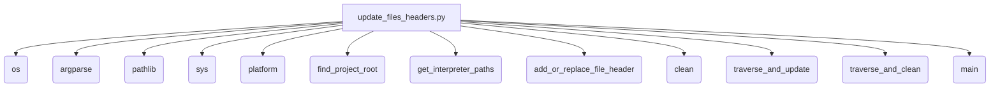

### Анализ кода `hypotez/toolbox/update_files_headers.py.md`

#### 1. Блок-схема

```mermaid
graph TD
    A[Начало] --> B{Определение root-папки проекта и списка исключаемых директорий};
    B --> C{Определение действия: Обновление или очистка?};
    C -- Обновление --> D{Обход директории и поддиректорий};
    D --> E{Найде Python-файл?};
    E -- Да --> F[add_or_replace_file_header(file_path, project_root, force_update)];
    F --> G{Открываем файл для чтения и записи};
    G --> H{Читаем строки файла и удаляем BOM};
    H --> I{Фильтруем строки, удаляя существующие заголовки};
    I --> J{Проверка необходимости обновления};
    J -- Не нужно --> K[Пропускаем файл];
    J -- Нужно --> L[Формируем новые строки заголовка];
    L --> M[Записываем новые строки в начало файла и обрезаем лишнее];
    E -- Нет --> D;
    D --> N{Обход завершён?};
    N -- Да --> End[Завершение];
    C -- Очистка --> O{Обход директории и поддиректорий};
    O --> P{Найде Python-файл?};
    P -- Да --> Q[clean(file_path)];
    Q --> R{Открываем файл для чтения и записи};
    R --> S{Читаем строки файла и удаляем BOM};
    S --> T{Фильтруем строки, заменяя строки заголовков на пустые строки};
    T --> U[Записываем отфильтрованные строки в файл и обрезаем лишнее];
    P -- Нет --> O;
    O --> V{Обход завершён?};
    V -- Да --> End;
```

**Примеры для каждого логического блока:**

-   **B (Определение root-папки проекта и списка исключаемых директорий)**:
    *   `PROJECT_ROOT_FOLDER = os.path.abspath('..')`
    *   `EXCLUDE_DIRS = ['venv', 'tmp', 'docs', 'data', '__pycache__','\.ipynb_checkpoints']`
-   **C (Определение действия: Обновление или очистка?)**:
    *   Основано на аргументах командной строки `--force-update` или `--clean`.
-   **D (Обход директории и поддиректорий)**:
    *   `for root, dirs, files in os.walk(directory):`
-   **E (Найде Python-файл?)**:
    *   `if file.endswith('.py'):`
-   **F (add\_or\_replace\_file\_header(file\_path, project\_root, force\_update))**:
    *   Вызов функции для добавления или замены заголовка.
-   **G (Открываем файл для чтения и записи)**:
    *   `with open(file_path, 'r+', encoding='utf-8') as file:`
-   **H (Читаем строки файла и удаляем BOM)**:
    *   `lines = file.readlines()`
    *   `cleaned_lines = [line.lstrip('\ufeff') for line in lines]`
-   **I (Фильтруем строки, удаляя существующие заголовки)**:
    *   `filtered_lines = [...]` - список строк, исключающих заголовки.
-   **J (Проверка необходимости обновления)**:
    *   Основано на сравнении существующих строк с новыми значениями для заголовков.
-   **K (Пропускаем файл)**:
    *   Если обновления не требуются, файл пропускается.
-   **L (Формируем новые строки заголовка)**:
    *   Создание списка новых строк для вставки в файл.
-   **M (Записываем новые строки в начало файла и обрезаем лишнее)**:
    *   `file.seek(0)`
    *   `file.writelines(new_lines + filtered_lines)`
    *   `file.truncate()`
-   **O (Обход директории и поддиректорий)**:
    *   `for root, dirs, files in os.walk(directory):`
-   **P (Найде Python-файл?)**:
    *   `if file.endswith('.py'):`
-   **Q (clean(file\_path))**:
    *   Вызов функции для очистки заголовков.
-   **R (Открываем файл для чтения и записи)**:
    *   `with open(file_path, 'r+', encoding='utf-8') as file:`
-   **S (Читаем строки файла и удаляем BOM)**:
    *   `lines = file.readlines()`
    *   `cleaned_lines = [line.lstrip('\ufeff') for line in lines]`
-   **T (Фильтруем строки, заменяя строки заголовков на пустые строки)**:
    *   `filtered_lines = [...]` - замена строк заголовка на `''`.
-   **U (Записываем отфильтрованные строки в файл и обрезаем лишнее)**:
    *   `file.seek(0)`
    *   `file.writelines(filtered_lines)`
    *   `file.truncate()`

### 2. Диаграмма



#### Объяснение зависимостей:

*   `os`:  Используется для взаимодействия с операционной системой, например, для работы с файловой системой (обход директорий, объединение путей).
*   `argparse`:  Используется для разбора аргументов командной строки.
*   `pathlib`:  Используется для представления путей к файлам и директориям в виде объектов.
*   `sys`:  Предоставляет доступ к некоторым переменным и функциям, взаимодействующим с интерпретатором Python.
*   `platform`:  Используется для определения операционной системы.

### 3. Объяснение

#### Импорты:

*   `os`:  Для операций с файловой системой (обход директорий).
*   `argparse`: Для разбора аргументов командной строки.
*   `pathlib`: Для работы с путями.
*   `sys`: Для взаимодействия с интерпретатором.
*   `platform`: Для определения операционной системы.

#### Функции:

*   `find_project_root(start_path: Path, project_root_folder: str) -> Path`:

    *   **Аргументы**:

        *   `start_path` (Path): Путь, с которого начинается поиск корневой директории.
        *   `project_root_folder` (str): Имя папки, которая считается корнем проекта.
    *   **Возвращает**:

        *   `Path`: Путь к корневой директории проекта.
    *   **Назначение**:

        Находит корневую директорию проекта, начиная с указанного пути и двигаясь вверх по дереву директорий.
*   `get_interpreter_paths(project_root: Path) -> tuple`:

    *   **Аргументы**:

        *   `project_root` (Path): Корневой путь проекта.
    *   **Возвращает**:

        *   `tuple`: Пути к интерпретаторам Python для Windows и Linux/macOS.
    *   **Назначение**:

        Возвращает пути к интерпретаторам Python для разных операционных систем.
*   `add_or_replace_file_header(file_path: str, project_root: Path, force_update: bool)`:

    *   **Аргументы**:

        *   `file_path` (str): Путь к файлу для обработки.
        *   `project_root` (Path): Корневой путь проекта.
        *   `force_update` (bool): Флаг, указывающий, нужно ли принудительно обновить заголовок.
    *   **Возвращает**:

        *   `None`
    *   **Назначение**:

        Добавляет или заменяет заголовок, строки интерпретатора и docstring модуля в указанном Python-файле.
*   `clean(file_path: str)`:

    *   **Аргументы**:

        *   `file_path` (str): Путь к файлу для очистки.
    *   **Возвращает**:

        *   `None`
    *   **Назначение**:

        Удаляет указанные строки заголовка из файла и заменяет их пустыми строками.
*   `traverse_and_update(directory: Path, force_update: bool)`:

    *   **Аргументы**:

        *   `directory` (Path): Путь к директории для обхода.
        *   `force_update` (bool): Флаг, указывающий, нужно ли принудительно обновить заголовок.
    *   **Возвращает**:

        *   `None`
    *   **Назначение**:

        Обходит указанную директорию и обновляет заголовки во всех Python-файлах.
*   `traverse_and_clean(directory: Path)`:

    *   **Аргументы**:

        *   `directory` (Path): Путь к директории для обхода.
    *   **Возвращает**:

        *   `None`
    *   **Назначение**:

        Обходит указанную директорию и очищает указанные заголовки из всех Python-файлов.
*   `main()`:

    *   **Аргументы**:

        *   Отсутствуют.
    *   **Возвращает**:

        *   `None`
    *   **Назначение**:

        Главная функция, которая выполняет разбор аргументов командной строки и запускает соответствующие операции (обновление или очистку заголовков).

#### Переменные:

*   `PROJECT_ROOT_FOLDER`: Имя директории, которая считается корнем проекта.
*   `EXCLUDE_DIRS`: Список директорий, которые исключаются из обработки.

#### Потенциальные ошибки и области для улучшения:

*   **Жестко заданные пути**: Многие пути и строки (например, пути к интерпретаторам, строки для добавления в заголовок) жестко заданы в коде. Было бы полезно вынести их в конфигурационный файл или переменные окружения.
*   **Обработка исключений**: Кроме общей обработки `IOError`, отсутствует более детальная обработка исключений, которые могут возникнуть при работе с файловой системой или при разборе аргументов командной строки.
*   **Обработка пустых файлов**: В коде не предусмотрена обработка пустых файлов, что может привести к неожиданному поведению.
*   **Упрощение логики фильтрации строк**:  Логика фильтрации строк для определения необходимости обновления или очистки заголовков может быть упрощена и сделана более читаемой.

#### Взаимосвязи с другими частями проекта:

*   Модуль использует `header` для получения корневого пути проекта, что предполагает наличие такого модуля в проекте.
*   Функция `clean` предназначена для очистки файлов, поэтому необходимо убедиться, что в коде используются те же строки (константы) для добавления заголовков в `add_or_replace_file_header`, так как иначе очистка не сработает.