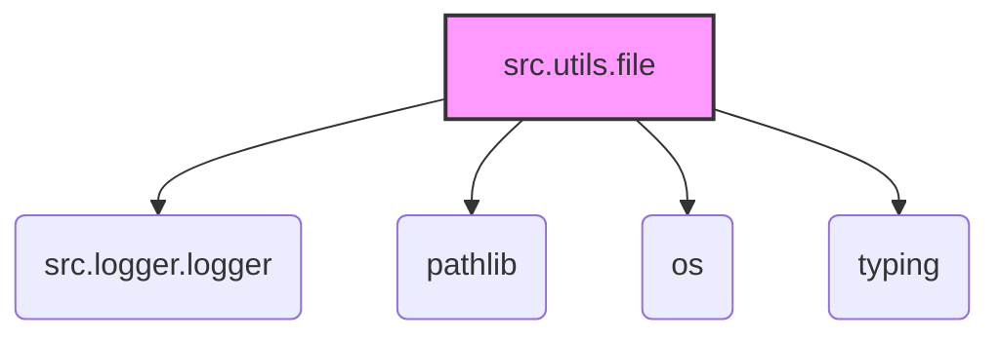

# Модуль для работы с файлами (file.py)

## Обзор

Модуль предоставляет набор утилит для выполнения операций с файлами, таких как сохранение, чтение и получение списков файлов. Поддерживает обработку больших файлов с использованием генераторов для экономии памяти.

## Подробней

Этот модуль предоставляет набор функций для работы с файлами, включая запись текста в файл, чтение текста из файла, получение списка файлов в директории и рекурсивное чтение текстовых файлов. Модуль предназначен для упрощения операций с файлами и предоставляет удобный интерфейс для работы с файловой системой.

## Функции

### `save_text_file`

**Назначение**: Сохраняет данные в текстовый файл.

```python
def save_text_file(
    data: str | list[str] | dict,
    file_path: str | Path,
    mode: str = 'w'
) -> bool:
    """
    Сохраняет данные в текстовый файл.

    Args:
        file_path (str | Path): Путь к файлу для сохранения.
        data (str | list[str] | dict): Данные для записи. Могут быть строкой, списком строк или словарем.
        mode (str, optional): Режим записи файла ('w' для записи, 'a' для добавления).
    Returns:
        bool: `True`, если файл успешно сохранен, `False` в противном случае.
    Raises:
        Exception: При возникновении ошибки при записи в файл.

    Example:
        >>> from pathlib import Path
        >>> file_path = Path('example.txt')
        >>> data = 'Пример текста'
        >>> result = save_text_file(file_path, data)
        >>> print(result)
        True
    """
    ...
```

**Параметры**:

-   `data` (str | list[str] | dict): Данные для записи. Могут быть строкой, списком строк или словарем.
-   `file_path` (str | Path): Путь к файлу для сохранения.
-   `mode` (str, optional): Режим записи файла ('w' для записи, 'a' для добавления). По умолчанию 'w'.

**Возвращает**:

-   `bool`: `True`, если файл успешно сохранен, `False` в противном случае.

**Как работает функция**:

1.  Принимает путь к файлу и данные для записи.
2.  Определяет тип данных и выполняет запись в файл соответствующим образом:
    -   Если данные - список, записывает каждую строку из списка в файл с новой строки.
    -   Если данные - словарь, записывает их в файл в формате JSON.
    -   В противном случае записывает данные как строку.
3.  Создает все необходимые родительские директории, если они не существуют.
4.  Логирует информацию об ошибках, используя `logger.error`.

### `read_text_file_generator`

**Назначение**: Читает содержимое файла(ов) или директории.

```python
def read_text_file_generator(
    file_path: str | Path,
    as_list: bool = False,
    extensions: Optional[list[str]] = None,
    chunk_size: int = 8192,
    recursive: bool = False,
    patterns: Optional[str | list[str]] = None,
) -> Generator[str, None, None] | str | list[str] | None:
    """
    Читает содержимое файла(ов) или директории.

        Args:
            file_path (str | Path): Путь к файлу или директории.
            as_list (bool, optional): Если `True`, то возвращает генератор строк или список строк, в зависимости от типа вывода.
            extensions (list[str], optional): Список расширений файлов для включения при чтении директории.
            chunk_size (int, optional): Размер чанка для чтения файла в байтах.
            recursive (bool, optional): Если `True`, то поиск файлов выполняется рекурсивно.
            patterns (str | list[str], optional): Шаблоны для фильтрации файлов при рекурсивном поиске.

        Returns:
            Generator[str, None, None] | str | list[str] | None:
            - Если `as_list` is True и `file_path` является файлом, возвращает генератор строк.
            - Если `as_list` is True и `file_path` является директорией и `recursive` is True, возвращает список строк.
            - Если `as_list` is False и `file_path` является файлом, возвращает строку.
            - Если `as_list` is False и `file_path` является директорией, возвращает объединенную строку.
            - Возвращает `None` в случае ошибки.
        Raises:
            Exception: При возникновении ошибки при чтении файла.

        Example:
            >>> from pathlib import Path
            >>> file_path = Path('example.txt')
            >>> content = read_text_file(file_path)
            >>> if content:
            ...    print(f'File content: {content[:100]}...')
            File content: Пример текста...
    Функция read_text_file может возвращать несколько разных типов данных в зависимости от входных параметров:

    Возвращаемые значения:
    ----------------------

    - Generator[str, None, None] (Генератор строк):
        Генератор при итерации выдаёт строки из файла(ов) по одной. Эффективно для работы с большими файлами, так как они не загружаются полностью в память.
        - Когда:
            file_path – это файл и as_list равен True.
            file_path – это директория, recursive равен True и as_list равен True. При этом в генератор попадают строки из всех найденных файлов.
            file_path – это директория, recursive равен False и as_list равен True. При этом в генератор попадают строки из всех найденных файлов в текущей директории.
        
    - str (Строка):
        Содержимое файла или объединенное содержимое всех файлов в виде одной строки.
        - Когда:
            file_path – это файл и as_list равен False.
            file_path – это директория, recursive равен False и as_list равен False. При этом возвращается объединенная строка, состоящая из содержимого всех файлов в директории, разделенных символами новой строки (\n).
            file_path – это директория, recursive равен True и as_list равен False. При этом возвращается объединенная строка, состоящая из содержимого всех файлов в директории и её поддиректориях, разделенных символами новой строки (\n).
 
    - list[str] (Список строк):
        Этот тип явно не возвращается функцией, однако когда file_path – это директория, recursive равен True и as_list равен True - функция возвращает генератор, который можно преобразовать в список при помощи list()
        - Когда:
            file_path – не является ни файлом, ни директорией.
            Произошла ошибка при чтении файла или директории (например, файл не найден, ошибка доступа и т.п.).


    Note:
        Если вы хотите прочитать содержимое файла построчно (особенно для больших файлов) используйте as_list = True. В этом случае вы получите генератор строк.
        Если вы хотите получить всё содержимое файла в виде одной строки используйте as_list = False.
        Если вы работаете с директорией, recursive = True будет обходить все поддиректории.
        extensions и patterns позволят вам фильтровать файлы при работе с директорией.
        chunk_size позволяет оптимизировать работу с большими файлами при чтении их по частям.
        None будет возвращён в случае ошибок.

    Важно помнить:
        В случае чтения директории, если as_list=False, функция объединяет все содержимое найденных файлов в одну строку. Это может потребовать много памяти, если файлов много или они большие.
        Функция полагается на другие функции-помощники (_read_file_lines_generator, _read_file_content, recursively_get_file_path, yield_text_from_files), которые здесь не определены и их поведение влияет на результат read_text_file.


    """
    ...
```

**Параметры**:

-   `file_path` (str | Path): Путь к файлу или директории.
-   `as_list` (bool, optional): Если `True`, возвращает содержимое в виде списка строк. По умолчанию `False`.
-   `extensions` (list[str], optional): Список расширений файлов для включения при чтении директории. По умолчанию `None`.
-   `chunk_size` (int, optional): Размер чанка для чтения файла в байтах. По умолчанию 8192.
-    `recursive` (bool, optional): Если `True`, то поиск файлов выполняется рекурсивно.
-   `patterns` (str | list[str], optional): Шаблоны для фильтрации файлов при рекурсивном поиске.

**Возвращает**:

-   `Generator[str, None, None] | str | list[str] | None`: В зависимости от входных параметров функция может возвращать:
    -   Генератор строк (если `as_list` is `True` и `file_path` является файлом, или если `file_path` является директорией и `recursive` is `True`).
    -   Строку (если `as_list` is `False` и `file_path` является файлом, или если `file_path` является директорией).
    -   Список строк (если `file_path` не является ни файлом, ни директорией, или произошла ошибка).
    -   `None` в случае ошибки.

**Как работает функция**:

1.  Принимает путь к файлу или директории, а также параметры для настройки чтения.
2.  Если указан файл:
    -   Открывает файл для чтения и возвращает его содержимое в виде строки или генератора строк (в зависимости от значения `as_list`).
3.  Если указана директория:
    -   Рекурсивно обходит директорию и считывает все файлы с указанными расширениями.
    -   Возвращает объединенное содержимое всех файлов в виде одной строки или генератора строк (в зависимости от значения `as_list`).
4.  Если указанный путь не является файлом или директорией, логирует ошибку и возвращает `None`.
5.  Логирует информацию об ошибках, используя `logger.error`.

### `read_text_file`

**Назначение**: Читает содержимое файла.

```python
def read_text_file(
    file_path: Union[str, Path],
    as_list: bool = False,
    extensions: Optional[list[str]] = None,
    exc_info: bool = True,
) -> str | list[str] | None:
    """
    Read the contents of a file.

    Args:
        file_path (str | Path): Path to the file or directory.
        as_list (bool, optional): If True, returns content as list of lines. Defaults to False.
        extensions (list[str], optional): List of file extensions to include if reading a directory. Defaults to None.
        exc_info (bool, optional): If True, logs traceback on error. Defaults to True.

    Returns:
        str | list[str] | None: File content as a string or list of lines, or None if an error occurs.
    """
    ...
```

**Параметры**:

-   `file_path` (str | Path): Путь к файлу или директории.
-   `as_list` (bool, optional): Если `True`, возвращает содержимое в виде списка строк. По умолчанию `False`.
-   `extensions` (list[str], optional): Список расширений файлов для включения при чтении директории. По умолчанию `None`.
-   `exc_info` (bool, optional): Включать ли информацию об исключении в логи. По умолчанию `True`.

**Возвращает**:

-   `str | list[str] | None`: Содержимое файла в виде строки или списка строк, или `None` в случае ошибки.

**Как работает функция**:

1.  Принимает путь к файлу или директории, а также параметры для настройки чтения.
2.  Если указан файл:
    -   Открывает файл для чтения и возвращает его содержимое в виде строки или списка строк (в зависимости от значения `as_list`).
3.  Если указана директория:
    -   Рекурсивно обходит директорию и считывает все файлы с указанными расширениями.
    -   Возвращает объединенное содержимое всех файлов в виде одной строки или списка строк (в зависимости от значения `as_list`).
4.  Если указанный путь не является файлом или директорией, логирует предупреждение и возвращает `None`.
5.  Логирует информацию об ошибках, используя `logger.error`.

### `yield_text_from_files`

**Назначение**: Читает содержимое файла и возвращает его в виде генератора строк или одной строки.

```python
def yield_text_from_files(
    file_path: str | Path,
    as_list: bool = False,
    chunk_size: int = 8192
) -> Generator[str, None, None] | str | None:
    """
    Читает содержимое файла и возвращает его в виде генератора строк или одной строки.

    Args:
        file_path (str | Path): Путь к файлу.
        as_list (bool, optional): Если True, возвращает генератор строк. По умолчанию False.
        chunk_size (int, optional): Размер чанка для чтения файла в байтах.

    Returns:
        Generator[str, None, None] | str | None: Генератор строк, объединенная строка или None в случае ошибки.

    Yields:
       str: Строки из файла, если as_list is True.

    Example:
        >>> from pathlib import Path
        >>> file_path = Path('example.txt')
        >>> for line in yield_text_from_files(file_path, as_list=True):
        ...     print(line)
        Первая строка файла
        Вторая строка файла
    """
    ...
```

**Параметры**:

-   `file_path` (str | Path): Путь к файлу.
-   `as_list` (bool, optional): Если `True`, возвращает генератор строк. По умолчанию `False`.
-   `chunk_size` (int, optional): Размер чанка для чтения файла в байтах.

**Возвращает**:

-   `Generator[str, None, None] | str | None`: Генератор строк, объединенная строка или None в случае ошибки.

**Yields**:
- str: Строки из файла, если as_list is True.

**Как работает функция**:

1.  Принимает путь к файлу, флаг `as_list` и размер чанка для чтения.
2.  Если указан файл:
    -   Открывает файл для чтения и возвращает его содержимое в виде генератора строк или одной строки (в зависимости от значения `as_list`).
3.  Логирует информацию об ошибках, используя `logger.error`.

### `_read_file_content`

**Назначение**: Читает содержимое файла по чанкам и возвращает как строку.

```python
def _read_file_content(file_path: Path, chunk_size: int) -> str:
    """
    Читает содержимое файла по чанкам и возвращает как строку.

    Args:
        file_path (Path): Путь к файлу для чтения.
        chunk_size (int): Размер чанка для чтения файла в байтах.
    Returns:
        str: Содержимое файла в виде строки.
    Raises:
        Exception: При возникновении ошибки при чтении файла.
    """
    ...
```

**Параметры**:

-   `file_path` (Path): Путь к файлу для чтения.
-   `chunk_size` (int): Размер чанка для чтения файла в байтах.

**Возвращает**:

-   `str`: Содержимое файла в виде строки.

**Как работает функция**:

1.  Открывает файл для чтения.
2.  Читает файл по частям (чанкам) указанного размера.
3.  Объединяет все чанки в одну строку и возвращает ее.

### `_read_file_lines_generator`

**Назначение**: Читает файл по строкам с помощью генератора.

```python
def _read_file_lines_generator(file_path: Path, chunk_size: int) -> Generator[str, None, None]:
    """
    Читает файл по строкам с помощью генератора.

    Args:
        file_path (Path): Путь к файлу для чтения.
        chunk_size (int): Размер чанка для чтения файла в байтах.
    Yields:
        str: Строки из файла.
    Raises:
        Exception: При возникновении ошибки при чтении файла.
    """
    ...
```

**Параметры**:

-   `file_path` (Path): Путь к файлу для чтения.
-   `chunk_size` (int): Размер чанка для чтения файла в байтах.

**Yields**:

- str: Строки из файла.

**Как работает функция**:

1.  Открывает файл для чтения.
2.  Читает файл по частям (чанкам) указанного размера.
3.  Разбивает каждый чанк на строки.
4.  Возвращает строки по одной с использованием `yield from`.

### `get_filenames_from_directory`

**Назначение**: Возвращает список имен файлов в директории, опционально отфильтрованных по расширению.

```python
def get_filenames_from_directory(
    directory: str | Path, ext: str | list[str] = '*'
) -> list[str]:
    """
    Возвращает список имен файлов в директории, опционально отфильтрованных по расширению.

    Args:
        directory (str | Path): Путь к директории для поиска.
        ext (str | list[str], optional): Расширения для фильтрации.
            По умолчанию '*'.

    Returns:
        list[str]: Список имен файлов, найденных в директории.

    Example:
        >>> from pathlib import Path
        >>> directory = Path('.')
        >>> get_filenames_from_directory(directory, ['.txt', '.md'])
        ['example.txt', 'readme.md']
    """
    ...
```

**Параметры**:

-   `directory` (str | Path): Путь к директории для поиска.
-   `ext` (str | list[str], optional): Расширения для фильтрации. По умолчанию '\*'.

**Возвращает**:

-   `list[str]`: Список имен файлов, найденных в директории.

**Как работает функция**:

1.  Проверяет, является ли указанный путь директорией. Если нет, логирует ошибку и возвращает пустой список.
2.  Формирует список расширений для фильтрации.
3.  Перебирает все элементы в директории.
4.  Если элемент является файлом и его расширение соответствует указанному, добавляет имя файла в список результатов.
5.  Логирует информацию об ошибках, используя `logger.error`.

### `recursively_yield_file_path`

**Назначение**: Рекурсивно возвращает пути ко всем файлам, соответствующим заданным шаблонам, в указанной директории.

```python
def recursively_yield_file_path(
    root_dir: str | Path, patterns: str | list[str] = '*'
) -> Generator[Path, None, None]:
    """
    Рекурсивно возвращает пути ко всем файлам, соответствующим заданным шаблонам, в указанной директории.

    Args:
        root_dir (str | Path): Корневая директория для поиска.
        patterns (str | list[str]): Шаблоны для фильтрации файлов.

    Yields:
        Path: Путь к файлу, соответствующему шаблону.

    Example:
        >>> from pathlib import Path
        >>> root_dir = Path('.')
        >>> for path in recursively_yield_file_path(root_dir, ['*.txt', '*.md']):
        ...    print(path)
        ./example.txt
        ./readme.md
    """
    ...
```

**Параметры**:

-   `root_dir` (str | Path): Корневая директория для поиска.
-   `patterns` (str | list[str]): Шаблоны для фильтрации файлов.

**Yields**:

-   `Path`: Путь к файлу, соответствующему шаблону.

**Как работает функция**:

1.  Преобразует `patterns` в список, если это строка.
2.  Рекурсивно обходит директорию `root_dir` и возвращает пути ко всем файлам, соответствующим указанным шаблонам.
3.  Использует `yield from` для возврата путей по одному.
4.  Логирует информацию об ошибках, используя `logger.error`.

### `recursively_get_file_path`

**Назначение**: Рекурсивно возвращает список путей ко всем файлам, соответствующим заданным шаблонам, в указанной директории.

```python
def recursively_get_file_path(
    root_dir: str | Path,
    patterns: str | list[str] = '*'
) -> list[Path]:
    """
    Рекурсивно возвращает список путей ко всем файлам, соответствующим заданным шаблонам, в указанной директории.

    Args:
        root_dir (str | Path): Корневая директория для поиска.
        patterns (str | list[str]): Шаблоны для фильтрации файлов.

    Returns:
        list[Path]: Список путей к файлам, соответствующим шаблонам.

    Example:
        >>> from pathlib import Path
        >>> root_dir = Path('.')
        >>> paths = recursively_get_file_path(root_dir, ['*.txt', '*.md'])
        >>> print(paths)
        [Path('./example.txt'), Path('./readme.md')]
    """
    ...
```

**Параметры**:

-   `root_dir` (str | Path): Корневая директория для поиска.
-   `patterns` (str | list[str]): Шаблоны для фильтрации файлов.

**Возвращает**:

-   `list[Path]`: Список путей к файлам, соответствующим шаблонам.

**Как работает функция**:

1.  Создает пустой список `file_paths` для хранения результатов.
2.  Преобразует `patterns` в список, если это строка.
3.  Рекурсивно обходит директорию `root_dir` и добавляет пути ко всем файлам, соответствующим указанным шаблонам, в список `file_paths`.
4.  Возвращает список `file_paths`.
5.  Логирует информацию об ошибках, используя `logger.error`.

### `recursively_read_text_files`

**Назначение**: Рекурсивно читает текстовые файлы из указанной корневой директории, соответствующие заданным шаблонам.

```python
def recursively_read_text_files(
    root_dir: str | Path,
    patterns: str | list[str],
    as_list: bool = False
) -> list[str]:
    """
    Рекурсивно читает текстовые файлы из указанной корневой директории, соответствующие заданным шаблонам.

    Args:
        root_dir (str | Path): Путь к корневой директории для поиска.
        patterns (str | list[str]): Шаблон(ы) имени файла для фильтрации.
             Может быть как одиночным шаблоном (например, '*.txt'), так и списком.
        as_list (bool, optional): Если True, то возвращает содержимое файла как список строк.
             По умолчанию `False`.

    Returns:
        list[str]: Список содержимого файлов (или список строк, если `as_list=True`),
         соответствующих заданным шаблонам.

    Example:
        >>> from pathlib import Path
        >>> root_dir = Path('.')
        >>> contents = recursively_read_text_files(root_dir, ['*.txt', '*.md'], as_list=True)
        >>> for line in contents:
        ...     print(line)
        Содержимое example.txt
        Первая строка readme.md
        Вторая строка readme.md
    """
    ...
```

**Параметры**:

-   `root_dir` (str | Path): Путь к корневой директории для поиска.
-   `patterns` (str | list[str]): Шаблоны для фильтрации файлов. Может быть как одиночным шаблоном (например, '\*.txt'), так и списком.
-   `as_list` (bool, optional): Если `True`, то возвращает содержимое файла как список строк. По умолчанию `False`.

**Возвращает**:

-   `list[str]`: Список содержимого файлов (или список строк, если `as_list=True`), соответствующих заданным шаблонам.

**Как работает функция**:

1.  Проверяет, является ли указанный путь директорией.
2.  Преобразует шаблоны в список, если это строка.
3.  Рекурсивно обходит указанную директорию, используя `os.walk`.
4.  Для каждого файла проверяет, соответствует ли его имя одному из шаблонов.
5.  Если файл соответствует шаблону, открывает его и считывает содержимое (в виде списка строк или одной строки, в зависимости от значения `as_list`).
6.  Возвращает список содержимого файлов.
7.  Логирует информацию об ошибках, используя `logger.error`.

### `get_directory_names`

**Назначение**: Возвращает список имен директорий из указанной директории.

```python
def get_directory_names(directory: str | Path) -> list[str]:
    """
    Возвращает список имен директорий из указанной директории.

    Args:
        directory (str | Path): Путь к директории, из которой нужно получить имена.

    Returns:
        list[str]: Список имен директорий, найденных в указанной директории.

    Example:
        >>> from pathlib import Path
        >>> directory = Path('.')
        >>> get_directory_names(directory)
        ['dir1', 'dir2']
    """
    ...
```

**Параметры**:

-   `directory` (str | Path): Путь к директории, из которой нужно получить имена.

**Возвращает**:

-   `list[str]`: Список имен директорий, найденных в указанной директории.

**Как работает функция**:

1.  Перебирает все элементы в указанной директории.
2.  Если элемент является директорией, добавляет его имя в список результатов.
3.  Логирует информацию об ошибках, используя `logger.error`.

### `remove_bom`

**Назначение**: Удаляет BOM (Byte Order Mark) из текстового файла или из всех файлов Python в директории.

```python
def remove_bom(path: str | Path) -> None:
    """
    Удаляет BOM из текстового файла или из всех файлов Python в директории.

    Args:
        path (str | Path): Путь к файлу или директории.

    Example:
        >>> from pathlib import Path
        >>> file_path = Path('example.txt')
        >>> with open(file_path, 'w', encoding='utf-8') as f:
        ...     f.write('\\ufeffПример текста с BOM')
        >>> remove_bom(file_path)
        >>> with open(file_path, 'r', encoding='utf-8') as f:
        ...     print(f.read())
        Пример текста с BOM
    """
    ...
```

**Параметры**:

-   `path` (str | Path): Путь к файлу или директории.

**Как работает функция**:

1.  Принимает путь к файлу или директории.
2.  Если указан файл:
    -   Открывает файл для чтения и записи.
    -   Удаляет BOM из содержимого файла.
    -   Записывает обновленное содержимое обратно в файл.
3.  Если указана директория:
    -   Рекурсивно обходит все файлы Python в директории.
    -   Для каждого файла выполняет удаление BOM.
4.  Логирует информацию об ошибках, используя `logger.error`.

### `main`

**Назначение**: Точка входа для удаления BOM в Python файлах.

```python
def main() -> None:
    """Entry point for BOM removal in Python files."""
    ...
```

**Как работает функция**:
*   Определяет корневую директорию для обработки.
*   Вызывает функцию `remove_bom` для удаления BOM из всех Python файлов, найденных в указанной директории.
## Переменные модуля

-   `MODE` (str): Определяет режим работы модуля (в данном случае, 'development').

## Пример использования

### Чтение текстового файла

```python
from src.utils.file import read_text_file
from pathlib import Path

file_path = Path("example.txt")
try:
    file_path.write_text("Hello, world!", encoding="utf-8")  # create test file
    content = read_text_file(file_path)
    print(content)
except Exception as ex:
    print(f"Ошибка: {ex}")
finally:
    if file_path.exists():
        file_path.unlink()  # delete test file
```

### Рекурсивное чтение текстовых файлов

```python
from src.utils.file import recursively_read_text_files
from pathlib import Path
import os

# Create test directory and files
root_dir = Path("test_dir")
root_dir.mkdir(exist_ok=True)

file1 = root_dir / "file1.txt"
file1.write_text("This is file1.", encoding="utf-8")
file2 = root_dir / "file2.md"
file2.write_text("This is file2.", encoding="utf-8")

# Read contents of all files in the directory
contents = recursively_read_text_files(root_dir, ["*.txt", "*.md"])
print(contents)

# Cleanup
os.remove(file1)
os.remove(file2)
os.rmdir(root_dir)
```

### Использование generator

```python
from src.utils.file import read_text_file_generator
from pathlib import Path

# Create test file
file_path = Path("test_file.txt")
file_path.write_text("line1\\nline2\\nline3", encoding="utf-8")

# Читаем файл построчно с помощью генератора
generator =  read_text_file_generator(file_path, as_list=True)
for line in generator:
    print(f"--> {line}")

# Cleanup
os.remove(file_path)
```

## Взаимосвязь с другими частями проекта

-   Модуль `src.utils.file` используется другими модулями проекта для выполнения операций с файлами.
-   Для логирования ошибок используется модуль `src.logger.logger`.

