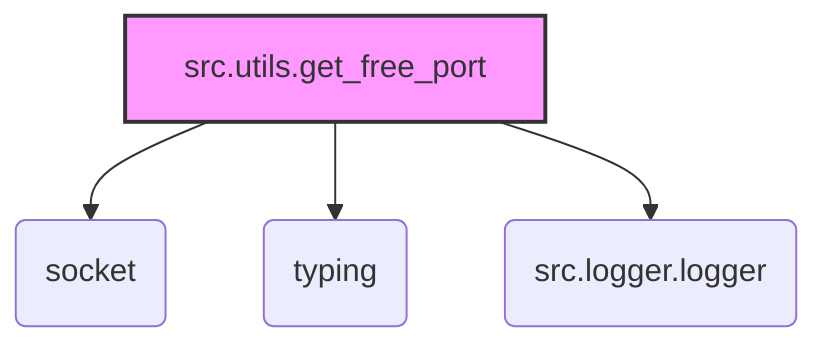

# Модуль для поиска свободного порта (get_free_port.py)

## Обзор

Этот модуль предоставляет функцию для поиска свободного порта на указанном хосте в заданном диапазоне портов. Если диапазон портов не указан, функция ищет первый доступный порт, начиная с 1024.

## Подробней

Модуль предназначен для автоматического поиска свободного порта, что полезно для приложений, которым необходимо динамически назначать порты для сетевых соединений. Функция `get_free_port` позволяет указать диапазон портов для поиска или использовать первый доступный порт.  Модуль использует модуль `src.logger.logger` для логирования ошибок.

## Функции

### `get_free_port`

**Назначение**: Находит и возвращает свободный порт в указанном диапазоне или первый доступный порт, если диапазон не указан.

```python
def get_free_port(host: str, port_range: Optional[str | List[str]] = None) -> int:
    """
    Finds and returns a free port within the specified range, or the first available port if no range is given.

    Args:
        host (str): The host address to check for available ports.
        port_range (Optional[str | List[str]], optional): A port range specified as a string "min-max" or a list of strings.
               E.g.: "3000-3999", ["3000-3999", "8000-8010"], None. Defaults to `None`.

    Returns:
        int: An available port number.

    Raises:
        ValueError: If no free port can be found within the specified range, or if the port range is invalid.
    """
    ...
```

**Параметры**:

-   `host` (str): Адрес хоста для проверки доступности портов.
-   `port_range` (Optional[str | List[str]]): Диапазон портов, указанный в виде строки "min-max" или списка строк. Например: `"3000-3999"`, `["3000-3999", "8000-8010"]`. По умолчанию `None`.

**Возвращает**:

-   `int`: Номер доступного порта.

**Вызывает исключения**:

-   `ValueError`: Если не найден свободный порт в указанном диапазоне, или если указан неверный формат диапазона портов.

**Как работает функция**:

1.  Определяет внутреннюю функцию `_is_port_in_use` для проверки, занят ли порт на указанном хосте.
2.  Определяет внутреннюю функцию `_parse_port_range` для преобразования строки диапазона портов в кортеж из минимального и максимального портов.
3.  Если указан `port_range`:
    -   Если `port_range` является строкой, пытается преобразовать его в диапазон портов с помощью `_parse_port_range`. Затем перебирает все порты в диапазоне и возвращает первый свободный порт, используя `_is_port_in_use`.
    -   Если `port_range` является списком, перебирает элементы списка. Каждый элемент должен быть строкой, представляющей диапазон портов. Для каждого диапазона выполняет те же действия, что и для одиночной строки.
    -   Если ни в одном из указанных диапазонов не найден свободный порт, вызывает исключение `ValueError`.
    -   Если `port_range` имеет неверный тип, вызывает исключение `ValueError`.
4.  Если `port_range` не указан, начинает поиск свободного порта с номера 1024 и увеличивает его, пока не найдет свободный порт. Если не удается найти свободный порт до 65535, вызывает исключение `ValueError`.
5.  Логирует информацию об ошибках, используя `logger.error`.

### `_is_port_in_use`

**Назначение**: Проверяет, используется ли указанный порт на заданном хосте.

```python
def _is_port_in_use(host: str, port: int) -> bool:
    """
    Checks if a given port is in use on the specified host.

    Args:
        host (str): The host address.
        port (int): The port number to check.

    Returns:
        bool: True if the port is in use, False otherwise.
    """
    ...
```

**Параметры**:

-   `host` (str): Адрес хоста.
-   `port` (int): Номер порта для проверки.

**Возвращает**:

-   `bool`: `True`, если порт используется, `False` - в противном случае.

**Как работает функция**:

1.  Создает сокет и пытается привязать его к указанному хосту и порту.
2.  Если привязка прошла успешно, значит порт свободен, и функция возвращает `False`.
3.  Если при привязке возникает исключение `OSError`, значит порт используется, и функция возвращает `True`.

### `_parse_port_range`

**Назначение**: Преобразует строку диапазона портов "min-max" в кортеж (min_port, max_port).

```python
def _parse_port_range(port_range_str: str) -> Tuple[int, int]:
    """
    Parses port range string "min-max" into a tuple (min_port, max_port).

    Args:
        port_range_str (str): The port range string.

    Returns:
        Tuple[int, int]: A tuple containing minimum and maximum port numbers.

    Raises:
        ValueError: If the port range string format is invalid.
    """
    ...
```

**Параметры**:

-   `port_range_str` (str): Строка диапазона портов.

**Возвращает**:

-   `Tuple[int, int]`: Кортеж, содержащий минимальный и максимальный номера портов.

**Вызывает исключения**:

-   `ValueError`: Если формат строки диапазона портов не верен.

**Как работает функция**:

1.  Разделяет строку `port_range_str` на две части по символу "-".
2.  Если количество частей не равно 2, вызывает исключение `ValueError`.
3.  Преобразует каждую часть в целое число.
4.  Проверяет, что минимальный порт меньше максимального. Если нет, вызывает исключение `ValueError`.
5.  Возвращает кортеж, содержащий минимальный и максимальный номера портов.
6.  Логирует информацию об ошибке, используя `logger.error`.

## Переменные модуля

В этом модуле нет глобальных переменных, кроме констант, определенных внутри функций.

## Пример использования

```python
from src.utils.get_free_port import get_free_port

# Поиск свободного порта в диапазоне 3000-3005
try:
    port = get_free_port('localhost', '3000-3005')
    print(f"Свободный порт: {port}")
except ValueError as e:
    print(f"Ошибка: {e}")

# Поиск первого свободного порта
try:
    port = get_free_port('localhost')
    print(f"Свободный порт: {port}")
except ValueError as e:
    print(f"Ошибка: {e}")
```

## Взаимосвязь с другими частями проекта

-   Модуль `src.utils.get_free_port` используется другими модулями проекта для получения свободного порта для сетевых соединений.
-   Для логирования ошибок используется модуль `src.logger.logger`.
-   Зависимость от модуля `header` не используется

