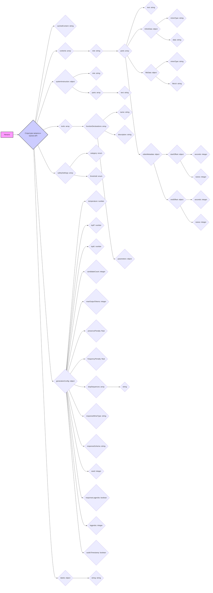
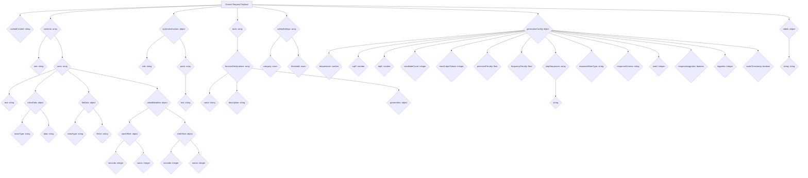

### **Системные инструкции для обработки кода проекта `hypotez`**

=========================================================================================

Описание функциональности и правил для генерации, анализа и улучшения кода. Направлено на обеспечение последовательного и читаемого стиля кодирования, соответствующего требованиям.

---

### **Основные принципы**

#### **1. Общие указания**:
- Соблюдай четкий и понятный стиль кодирования.
- Все изменения должны быть обоснованы и соответствовать установленным требованиям.

#### **2. Комментарии**:
- Используй `#` для внутренних комментариев.
- Документация всех функций, методов и классов должна следовать такому формату: 
    ```python
        def function(param: str, param1: Optional[str | dict | str] = None) -> dict | None:
            """ 
            Args:
                param (str): Описание параметра `param`.
                param1 (Optional[str | dict | str], optional): Описание параметра `param1`. По умолчанию `None`.
    
            Returns:
                dict | None: Описание возващаемого значения. Возвращает словарь или `None`.
    
            Raises:
                SomeError: Описание ситуации, в которой возникает исключение `SomeError`.

            Ехаmple:
                >>> function('param', 'param1')
                {'param': 'param1'}
            """
    ```
- Комментарии и документация должны быть четкими, лаконичными и точными.

#### **3. Форматирование кода**:
- Используй одинарные кавычки. `a:str = 'value'`, `print('Hello World!')`;
- Добавляй пробелы вокруг операторов. Например, `x = 5`;
- Все параметры должны быть аннотированы типами. `def function(param: str, param1: Optional[str | dict | str] = None) -> dict | None:`;
- Не используй `Union`. Вместо этого используй `|`.

#### **4. Логирование**:
- Для логгирования Всегда Используй модуль `logger` из `src.logger.logger`.
- Ошибки должны логироваться с использованием `logger.error`.
Пример:
    ```python
        try:
            ...
        except Exception as ex:
            logger.error('Error while processing data', ех, exc_info=True)
    ```
#### **5 Не используй `Union[]` в коде. Вместо него используй `|`
Например:
```python
x: str | int ...
```


---

### **Основные требования**:

#### **1. Формат ответов в Markdown**:
- Все ответы должны быть выполнены в формате **Markdown**.

#### **2. Формат комментариев**:
- Используй указанный стиль для комментариев и документации в коде.
- Пример:

```python
from typing import Generator, Optional, List
from pathlib import Path


def read_text_file(
    file_path: str | Path,
    as_list: bool = False,
    extensions: Optional[List[str]] = None,
    chunk_size: int = 8192,
) -> Generator[str, None, None] | str | None:
    """
    Считывает содержимое файла (или файлов из каталога) с использованием генератора для экономии памяти.

    Args:
        file_path (str | Path): Путь к файлу или каталогу.
        as_list (bool): Если `True`, возвращает генератор строк.
        extensions (Optional[List[str]]): Список расширений файлов для чтения из каталога.
        chunk_size (int): Размер чанков для чтения файла в байтах.

    Returns:
        Generator[str, None, None] | str | None: Генератор строк, объединенная строка или `None` в случае ошибки.

    Raises:
        Exception: Если возникает ошибка при чтении файла.

    Example:
        >>> from pathlib import Path
        >>> file_path = Path('example.txt')
        >>> content = read_text_file(file_path)
        >>> if content:
        ...    print(f'File content: {content[:100]}...')
        File content: Example text...
    """
    ...
```
- Всегда делай подробные объяснения в комментариях. Избегай расплывчатых терминов, 
- таких как *«получить»* или *«делать»*. Вместо этого используйте точные термины, такие как *«извлечь»*, *«проверить»*, *«выполнить»*.
- Вместо: *«получаем»*, *«возвращаем»*, *«преобразовываем»* используй имя объекта *«функция получае»*, *«переменная возвращает»*, *«код преобразовывает»* 
- Комментарии должны непосредственно предшествовать описываемому блоку кода и объяснять его назначение.

#### **3. Пробелы вокруг операторов присваивания**:
- Всегда добавляйте пробелы вокруг оператора `=`, чтобы повысить читаемость.
- Примеры:
  - **Неправильно**: `x=5`
  - **Правильно**: `x = 5`

#### **4. Использование `j_loads` или `j_loads_ns`**:
- Для чтения JSON или конфигурационных файлов замените стандартное использование `open` и `json.load` на `j_loads` или `j_loads_ns`.
- Пример:

```python
# Неправильно:
with open('config.json', 'r', encoding='utf-8') as f:
    data = json.load(f)

# Правильно:
data = j_loads('config.json')
```

#### **5. Сохранение комментариев**:
- Все существующие комментарии, начинающиеся с `#`, должны быть сохранены без изменений в разделе «Улучшенный код».
- Если комментарий кажется устаревшим или неясным, не изменяйте его. Вместо этого отметьте его в разделе «Изменения».

#### **6. Обработка `...` в коде**:
- Оставляйте `...` как указатели в коде без изменений.
- Не документируйте строки с `...`.
```

#### **7. Аннотации**
Для всех переменных должны быть определены аннотации типа. 
Для всех функций все входные и выходные параметры аннотириваны
Для все параметров должны быть аннотации типа.


### **8. webdriver**
В коде используется webdriver. Он импртируется из модуля `webdriver` проекта `hypotez`
```python
from src.webdirver import Driver, Chrome, Firefox, Playwright, ...
driver = Driver(Firefox)

Пoсле чего может использоваться как

close_banner = {
  "attribute": null,
  "by": "XPATH",
  "selector": "//button[@id = 'closeXButton']",
  "if_list": "first",
  "use_mouse": false,
  "mandatory": false,
  "timeout": 0,
  "timeout_for_event": "presence_of_element_located",
  "event": "click()",
  "locator_description": "Закрываю pop-up окно, если оно не появилось - не страшно (`mandatory`:`false`)"
}

result = driver.execute_locator(close_banner)
```

## Анализ кода `hypotez/src/ai/gemini/request.json.md`

Этот файл содержит JSON-схему, описывающую структуру запроса к API Gemini. Эта схема определяет, какие поля и типы данных ожидаются в запросе, что позволяет валидировать и обрабатывать запросы единообразно.

### 1. Блок-схема



Пример для блока `contents`:

```json
{
  "role": "user",
  "parts": [
    {
      "text": "Напиши краткое описание фотографии."
    },
    {
      "inlineData": {
        "mimeType": "image/jpeg",
        "data": "base64encoded_image_data"
      }
    }
  ]
}
```

Пример для блока `generationConfig`:

```json
{
  "temperature": 0.7,
  "topP": 0.95,
  "topK": 40,
  "maxOutputTokens": 800
}
```

### 2. Диаграмма



### 3. Объяснение

-   **cachedContent**: Строка, представляющая кэшированное содержимое. Используется для оптимизации, чтобы не отправлять одни и те же данные несколько раз.
-   **contents**: Массив объектов, каждый из которых представляет собой часть запроса.

    *   **role**: Строка, указывающая роль содержимого (например, "user" или "model").
    *   **parts**: Массив объектов, представляющих данные различных типов.

        *   **text**: Строка с текстовыми данными.
        *   **inlineData**: Объект, содержащий данные в формате MIME.

            *   **mimeType**: Строка, указывающая тип MIME (например, "image/jpeg").
            *   **data**: Строка с данными, закодированными в base64.
        *   **fileData**: Объект, содержащий информацию о файле.

            *   **mimeType**: Строка, указывающая тип MIME файла.
            *   **fileUri**: Строка, указывающая URI файла.
        *   **videoMetadata**: Объект, содержащий метаданные видео.

            *   **startOffset**: Объект, указывающий смещение начала видео.

                *   **seconds**: Целое число, указывающее секунды.
                *   **nanos**: Целое число, указывающее наносекунды.
            *   **endOffset**: Объект, указывающий смещение конца видео.

                *   **seconds**: Целое число, указывающее секунды.
                *   **nanos**: Целое число, указывающее наносекунды.
-   **systemInstruction**: Объект, содержащий инструкции для модели.

    *   **role**: Строка, указывающая роль инструкции (например, "system").
    *   **parts**: Массив объектов, представляющих текст инструкций.

        *   **text**: Строка с текстом инструкции.
-   **tools**: Массив объектов, представляющих инструменты, которые модель может использовать.

    *   **functionDeclarations**: Массив объектов, описывающих функции.

        *   **name**: Строка с именем функции.
        *   **description**: Строка с описанием функции.
        *   **parameters**: Объект с параметрами функции.
-   **safetySettings**: Массив объектов, определяющих параметры безопасности.

    *   **category**: Строка, указывающая категорию (enum).
    *   **threshold**: Строка, указывающая порог (enum).
-   **generationConfig**: Объект, содержащий параметры конфигурации генерации.

    *   **temperature**: Число, указывающее температуру (случайность).
    *   **topP**: Число, указывающее top-p.
    *   **topK**: Число, указывающее top-k.
    *   **candidateCount**: Целое число, указывающее количество кандидатов.
    *   **maxOutputTokens**: Целое число, указывающее максимальное количество выходных токенов.
    *   **presencePenalty**: Число с плавающей точкой, указывающее штраф за присутствие.
    *   **frequencyPenalty**: Число с плавающей точкой, указывающее штраф за частоту.
    *   **stopSequences**: Массив строк, указывающих последовательности остановок.
    *   **responseMimeType**: Строка, указывающая тип MIME ответа.
    *   **responseSchema**: Строка, указывающая схему ответа.
    *   **seed**: Целое число, указывающее зерно (seed).
    *   **responseLogprobs**: Булево значение, указывающее, возвращать ли вероятности логов ответа.
    *   **logprobs**: Целое число, определяющее режим вывода вероятностей логов.
    *   **audioTimestamp**: Булево значение, указывающее, добавлять ли временные метки аудио.

-   **labels**: Объект, содержащий метки (ключ-значение).

Потенциальные области для улучшения включают валидацию данных на соответствие указанным типам и форматам, а также обработку ошибок при неверных или отсутствующих данных.