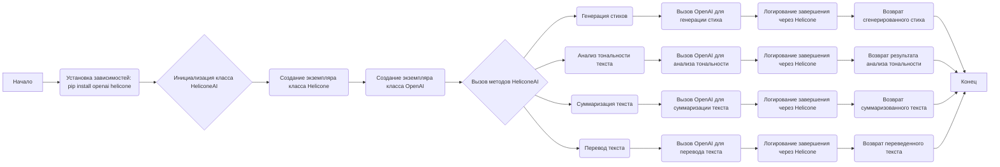
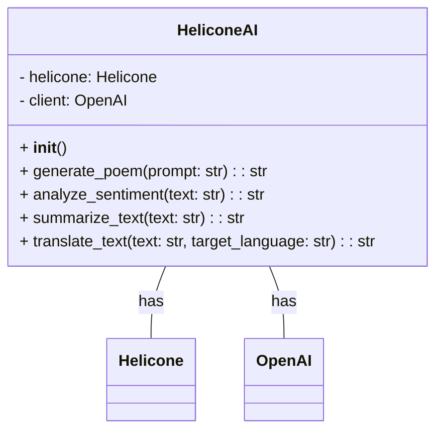

### **Системные инструкции для обработки кода проекта `hypotez`**

=========================================================================================

Описание функциональности и правил для генерации, анализа и улучшения кода. Направлено на обеспечение последовательного и читаемого стиля кодирования, соответствующего требованиям.

---

### **Основные принципы**

#### **1. Общие указания**:
- Соблюдай четкий и понятный стиль кодирования.
- Все изменения должны быть обоснованы и соответствовать установленным требованиям.

#### **2. Комментарии**:
- Используй `#` для внутренних комментариев.
- Документация всех функций, методов и классов должна следовать такому формату: 
    ```python
        def function(param: str, param1: Optional[str | dict | str] = None) -> dict | None:
            """ 
            Args:
                param (str): Описание параметра `param`.
                param1 (Optional[str | dict | str], optional): Описание параметра `param1`. По умолчанию `None`.
    
            Returns:
                dict | None: Описание возвращаемого значения. Возвращает словарь или `None`.
    
            Raises:
                SomeError: Описание ситуации, в которой возникает исключение `SomeError`.

            Ехаmple:
                >>> function('param', 'param1')
                {'param': 'param1'}
            """
    ```
- Комментарии и документация должны быть четкими, лаконичными и точными.

#### **3. Форматирование кода**:
- Используй одинарные кавычки. `a:str = 'value'`, `print('Hello World!')`;
- Добавляй пробелы вокруг операторов. Например, `x = 5`;
- Все параметры должны быть аннотированы типами. `def function(param: str, param1: Optional[str | dict | str] = None) -> dict | None:`;
- Не используй `Union`. Вместо этого используй `|`.

#### **4. Логирование**:
- Для логгирования Всегда Используй модуль `logger` из `src.logger.logger`.
- Ошибки должны логироваться с использованием `logger.error`.
Пример:
    ```python
        try:
            ...
        except Exception as ex:
            logger.error('Error while processing data', ех, exc_info=True)
    ```
#### **5 Не используй `Union[]` в коде. Вместо него используй `|`
Например:
```python
x: str | int ...
```


---

### **Основные требования**:

#### **1. Формат ответов в Markdown**:
- Все ответы должны быть выполнены в формате **Markdown**.

#### **2. Формат комментариев**:
- Используй указанный стиль для комментариев и документации в коде.
- Пример:

```python
from typing import Generator, Optional, List
from pathlib import Path


def read_text_file(
    file_path: str | Path,
    as_list: bool = False,
    extensions: Optional[List[str]] = None,
    chunk_size: int = 8192,
) -> Generator[str, None, None] | str | None:
    """
    Считывает содержимое файла (или файлов из каталога) с использованием генератора для экономии памяти.

    Args:
        file_path (str | Path): Путь к файлу или каталогу.
        as_list (bool): Если `True`, возвращает генератор строк.
        extensions (Optional[List[str]]): Список расширений файлов для чтения из каталога.
        chunk_size (int): Размер чанков для чтения файла в байтах.

    Returns:
        Generator[str, None, None] | str | None: Генератор строк, объединенная строка или `None` в случае ошибки.

    Raises:
        Exception: Если возникает ошибка при чтении файла.

    Example:
        >>> from pathlib import Path
        >>> file_path = Path('example.txt')
        >>> content = read_text_file(file_path)
        >>> if content:
        ...    print(f'File content: {content[:100]}...')
        File content: Example text...
    """
    ...
```
- Всегда делай подробные объяснения в комментариях. Избегай расплывчатых терминов, 
- таких как *«получить»* или *«делать»*. Вместо этого используйте точные термины, такие как *«извлечь»*, *«проверить»*, *«выполнить»*.
- Вместо: *«получаем»*, *«возвращаем»*, *«преобразовываем»* используй имя объекта *«функция получае»*, *«переменная возвращает»*, *«код преобразовывает»* 
- Комментарии должны непосредственно предшествовать описываемому блоку кода и объяснять его назначение.

#### **3. Пробелы вокруг операторов присваивания**:
- Всегда добавляйте пробелы вокруг оператора `=`, чтобы повысить читаемость.
- Примеры:
  - **Неправильно**: `x=5`
  - **Правильно**: `x = 5`

#### **4. Использование `j_loads` или `j_loads_ns`**:
- Для чтения JSON или конфигурационных файлов замените стандартное использование `open` и `json.load` на `j_loads` или `j_loads_ns`.
- Пример:

```python
# Неправильно:
with open('config.json', 'r', encoding='utf-8') as f:
    data = json.load(f)

# Правильно:
data = j_loads('config.json')
```

#### **5. Сохранение комментариев**:
- Все существующие комментарии, начинающиеся с `#`, должны быть сохранены без изменений в разделе «Улучшенный код».
- Если комментарий кажется устаревшим или неясным, не изменяйте его. Вместо этого отметьте его в разделе «Изменения».

#### **6. Обработка `...` в коде**:
- Оставляйте `...` как указатели в коде без изменений.
- Не документируйте строки с `...`.
```

#### **7. Аннотации**
Для всех переменных должны быть определены аннотации типа. 
Для всех функций все входные и выходные параметры аннотириваны
Для все параметров должны быть аннотации типа.


### **8. webdriver**
В коде используется webdriver. Он импртируется из модуля `webdriver` проекта `hypotez`
```python
from src.webdirver import Driver, Chrome, Firefox, Playwright, ...
driver = Driver(Firefox)

Пoсле чего может использоваться как

close_banner = {
  "attribute": null,
  "by": "XPATH",
  "selector": "//button[@id = 'closeXButton']",
  "if_list": "first",
  "use_mouse": false,
  "mandatory": false,
  "timeout": 0,
  "timeout_for_event": "presence_of_element_located",
  "event": "click()",
  "locator_description": "Закрываю pop-up окно, если оно не появилось - не страшно (`mandatory`:`false`)"
}

result = driver.execute_locator(close_banner)
```

## Анализ кода `hypotez/src/ai/helicone/README.MD`

Этот файл README.MD описывает интеграцию с Helicone.ai и OpenAI в проекте `hypotez`.

### 1. Блок-схема



### 2. Диаграмма



Объяснение зависимостей:

-   `HeliconeAI`: Класс, который интегрирует функциональность Helicone.ai и OpenAI.
-   `Helicone`: Класс, предоставляемый библиотекой `helicone`, используется для логирования завершений (completions).
-   `OpenAI`: Класс, предоставляемый библиотекой `openai`, используется для выполнения различных задач, таких как генерация текста, анализ тональности, суммаризация и перевод.

### 3. Объяснение

#### Импорты:

-   `from helicone import Helicone`: Импортирует класс `Helicone` из библиотеки `helicone`.  Этот класс используется для логирования запросов и ответов в Helicone.ai, что позволяет отслеживать использование OpenAI и анализировать данные.

-   `from openai import OpenAI`: Импортирует класс `OpenAI` из библиотеки `openai`. Этот класс используется для взаимодействия с API OpenAI, чтобы выполнять задачи, такие как генерация стихов, анализ тональности, суммаризация текста и перевод.

#### Классы:

-   `HeliconeAI`:
    -   Роль: Интеграция функциональности Helicone.ai и OpenAI.
    -   Атрибуты:
        -   `helicone`: Экземпляр класса `Helicone` для логирования.
        -   `client`: Экземпляр класса `OpenAI` для взаимодействия с OpenAI API.
    -   Методы:
        -   `__init__()`: Инициализирует класс, создавая экземпляры `Helicone` и `OpenAI`.
        -   `generate_poem(self, prompt: str) -> str`: Генерирует стихотворение на основе заданного запроса, используя модель `gpt-3.5-turbo`.
        -   `analyze_sentiment(self, text: str) -> str`: Анализирует тональность текста, используя модель `text-davinci-003`.
        -   `summarize_text(self, text: str) -> str`: Суммирует текст, используя модель `text-davinci-003`.
        -   `translate_text(self, text: str, target_language: str) -> str`: Переводит текст на указанный язык, используя модель `text-davinci-003`.
    -   Взаимодействие: Класс `HeliconeAI` использует классы `Helicone` и `OpenAI` для выполнения своих задач. Он создает экземпляры этих классов и вызывает их методы для генерации контента, анализа тональности, суммаризации и перевода текста, а также для логирования запросов и ответов.

#### Функции:

-   `generate_poem(self, prompt: str) -> str`:
    -   Аргументы:
        -   `prompt` (str): Запрос для генерации стихотворения.
    -   Возвращаемое значение:
        -   str: Сгенерированное стихотворение.
    -   Назначение: Генерирует стихотворение, используя OpenAI API.
    -   Пример:

        ```python
        poem = helicone_ai.generate_poem("Напиши мне стихотворение про кота.")
        print(poem)
        ```

-   `analyze_sentiment(self, text: str) -> str`:
    -   Аргументы:
        -   `text` (str): Текст для анализа тональности.
    -   Возвращаемое значение:
        -   str: Результат анализа тональности.
    -   Назначение: Анализирует тональность текста, используя OpenAI API.
    -   Пример:

        ```python
        sentiment = helicone_ai.analyze_sentiment("Сегодня был отличный день!")
        print(sentiment)
        ```

-   `summarize_text(self, text: str) -> str`:
    -   Аргументы:
        -   `text` (str): Текст для суммаризации.
    -   Возвращаемое значение:
        -   str: Суммированный текст.
    -   Назначение: Суммирует текст, используя OpenAI API.
    -   Пример:

        ```python
        summary = helicone_ai.summarize_text("Длинный текст для изложения...")
        print(summary)
        ```

-   `translate_text(self, text: str, target_language: str) -> str`:
    -   Аргументы:
        -   `text` (str): Текст для перевода.
        -   `target_language` (str): Язык, на который нужно перевести текст.
    -   Возвращаемое значение:
        -   str: Переведенный текст.
    -   Назначение: Переводит текст на указанный язык, используя OpenAI API.
    -   Пример:

        ```python
        translation = helicone_ai.translate_text("Hello, how are you?", "русский")
        print(translation)
        ```

#### Переменные:

-   `helicone_ai`: Экземпляр класса `HeliconeAI`, используемый для демонстрации работы методов класса.
-   `poem`: Переменная, хранящая сгенерированное стихотворение.
-   `sentiment`: Переменная, хранящая результат анализа тональности.
-   `summary`: Переменная, хранящая суммированный текст.
-   `translation`: Переменная, хранящая переведенный текст.

#### Потенциальные ошибки и области для улучшения:

1.  **Отсутствие обработки исключений**: В коде не предусмотрена обработка исключений, которые могут возникнуть при взаимодействии с API OpenAI или Helicone.ai.  Следует добавить блоки `try...except` для обработки возможных ошибок, таких как сетевые сбои, ошибки аутентификации или ошибки API.
2.  **Жестко заданные модели**: Использование жестко заданных моделей (например, `gpt-3.5-turbo` и `text-davinci-003`) может быть негибким.  Было бы полезно сделать выбор модели параметризуемым, чтобы можно было легко переключаться между различными моделями OpenAI.
3.  **Отсутствие документации типов**:  В коде отсутствуют аннотации типов, что может затруднить понимание типов данных и ожидаемых значений параметров и возвращаемых значений.  Рекомендуется добавить аннотации типов для повышения читаемости и поддерживаемости кода.
4.  **Отсутствие конфигурации**:  Параметры, такие как ключи API и другие настройки, жестко закодированы в коде.  Следует использовать конфигурационные файлы или переменные окружения для хранения этих параметров, чтобы их можно было легко изменять без изменения кода.
5. **Отсутствует логирование**: В случае возникновения проблем было бы полезно добавить логирование.

#### Цепочка взаимосвязей с другими частями проекта:

Этот код может быть связан с другими частями проекта `hypotez`, такими как:

-   Модули, использующие AI для генерации контента.
-   Модули, анализирующие данные с использованием AI.
-   Системы логирования и мониторинга, использующие Helicone.ai для отслеживания использования AI.