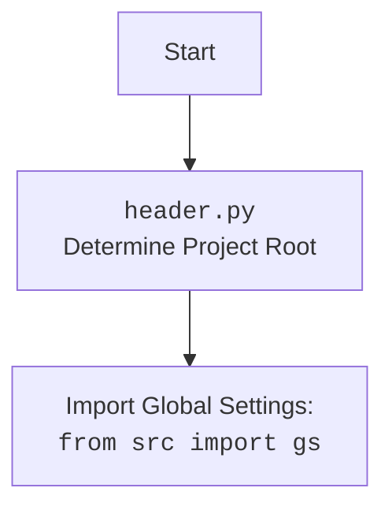

### **Системные инструкции для обработки кода проекта `hypotez`**

=========================================================================================

Описание функциональности и правил для генерации, анализа и улучшения кода. Направлено на обеспечение последовательного и читаемого стиля кодирования, соответствующего требованиям.

---

### **Основные принципы**

#### **1. Общие указания**:
- Соблюдай четкий и понятный стиль кодирования.
- Все изменения должны быть обоснованы и соответствовать установленным требованиям.

#### **2. Комментарии**:
- Используй `#` для внутренних комментариев.
- Документация всех функций, методов и классов должна следовать такому формату: 
    ```python
        def function(param: str, param1: Optional[str | dict | str] = None) -> dict | None:
            """ 
            Args:
                param (str): Описание параметра `param`.
                param1 (Optional[str | dict | str], optional): Описание параметра `param1`. По умолчанию `None`.
    
            Returns:
                dict | None: Описание возвращаемого значения. Возвращает словарь или `None`.
    
            Raises:
                SomeError: Описание ситуации, в которой возникает исключение `SomeError`.

            Ехаmple:
                >>> function('param', 'param1')
                {'param': 'param1'}
            """
    ```
- Комментарии и документация должны быть четкими, лаконичными и точными.

#### **3. Форматирование кода**:
- Используй одинарные кавычки. `a:str = 'value'`, `print('Hello World!')`;
- Добавляй пробелы вокруг операторов. Например, `x = 5`;
- Все параметры должны быть аннотированы типами. `def function(param: str, param1: Optional[str | dict | str] = None) -> dict | None:`;
- Не используй `Union`. Вместо этого используй `|`.

#### **4. Логирование**:
- Для логгирования Всегда Используй модуль `logger` из `src.logger.logger`.
- Ошибки должны логироваться с использованием `logger.error`.
Пример:
    ```python
        try:
            ...
        except Exception as ex:
            logger.error('Error while processing data', ех, exc_info=True)
    ```
#### **5 Не используй `Union[]` в коде. Вместо него используй `|`
Например:
```python
x: str | int ...
```


---

### **Основные требования**:

#### **1. Формат ответов в Markdown**:
- Все ответы должны быть выполнены в формате **Markdown**.

#### **2. Формат комментариев**:
- Используй указанный стиль для комментариев и документации в коде.
- Пример:

```python
from typing import Generator, Optional, List
from pathlib import Path


def read_text_file(
    file_path: str | Path,
    as_list: bool = False,
    extensions: Optional[List[str]] = None,
    chunk_size: int = 8192,
) -> Generator[str, None, None] | str | None:
    """
    Считывает содержимое файла (или файлов из каталога) с использованием генератора для экономии памяти.

    Args:
        file_path (str | Path): Путь к файлу или каталогу.
        as_list (bool): Если `True`, возвращает генератор строк.
        extensions (Optional[List[str]]): Список расширений файлов для чтения из каталога.
        chunk_size (int): Размер чанков для чтения файла в байтах.

    Returns:
        Generator[str, None, None] | str | None: Генератор строк, объединенная строка или `None` в случае ошибки.

    Raises:
        Exception: Если возникает ошибка при чтении файла.

    Example:
        >>> from pathlib import Path
        >>> file_path = Path('example.txt')
        >>> content = read_text_file(file_path)
        >>> if content:
        ...    print(f'File content: {content[:100]}...')
        File content: Example text...
    """
    ...
```
- Всегда делай подробные объяснения в комментариях. Избегай расплывчатых терминов, 
- таких как *«получить»* или *«делать»*. Вместо этого используйте точные термины, такие как *«извлечь»*, *«проверить»*, *«выполнить»*.
- Вместо: *«получаем»*, *«возвращаем»*, *«преобразовываем»* используй имя объекта *«функция получае»*, *«переменная возвращает»*, *«код преобразовывает»* 
- Комментарии должны непосредственно предшествовать описываемому блоку кода и объяснять его назначение.

#### **3. Пробелы вокруг операторов присваивания**:
- Всегда добавляйте пробелы вокруг оператора `=`, чтобы повысить читаемость.
- Примеры:
  - **Неправильно**: `x=5`
  - **Правильно**: `x = 5`

#### **4. Использование `j_loads` или `j_loads_ns`**:
- Для чтения JSON или конфигурационных файлов замените стандартное использование `open` и `json.load` на `j_loads` или `j_loads_ns`.
- Пример:

```python
# Неправильно:
with open('config.json', 'r', encoding='utf-8') as f:
    data = json.load(f)

# Правильно:
data = j_loads('config.json')
```

#### **5. Сохранение комментариев**:
- Все существующие комментарии, начинающиеся с `#`, должны быть сохранены без изменений в разделе «Улучшенный код».
- Если комментарий кажется устаревшим или неясным, не изменяйте его. Вместо этого отметьте его в разделе «Изменения».

#### **6. Обработка `...` в коде**:
- Оставляйте `...` как указатели в коде без изменений.
- Не документируйте строки с `...`.
```

#### **7. Аннотации**
Для всех переменных должны быть определены аннотации типа. 
Для всех функций все входные и выходные параметры аннотириваны
Для все параметров должны быть аннотации типа.


### **8. webdriver**
В коде используется webdriver. Он импртируется из модуля `webdriver` проекта `hypotez`
```python
from src.webdirver import Driver, Chrome, Firefox, Playwright, ...
driver = Driver(Firefox)

Пoсле чего может использоваться как

close_banner = {
  "attribute": null,
  "by": "XPATH",
  "selector": "//button[@id = 'closeXButton']",
  "if_list": "first",
  "use_mouse": false,
  "mandatory": false,
  "timeout": 0,
  "timeout_for_event": "presence_of_element_located",
  "event": "click()",
  "locator_description": "Закрываю pop-up окно, если оно не появилось - не страшно (`mandatory`:`false`)"
}

result = driver.execute_locator(close_banner)
```

### Анализ кода `hypotez/src/ai/helicone/helicone.py`

#### 1. Блок-схема:

```mermaid
graph LR
    A[Начало] --> B{Инициализация HeliconeAI}
    B --> C{Генерация стихотворения\n(generate_poem)}
    C --> D{Анализ тональности\n(analyze_sentiment)}
    D --> E{Изложение текста\n(summarize_text)}
    E --> F{Перевод текста\n(translate_text)}
    F --> G[Конец]

    subgraph Генерация стихотворения
        C --> C1[Вызов OpenAI API\n(chat.completions.create)]
        C1 --> C2{Получение ответа}
        C2 --> C3[Логирование ответа\n(helicone.log_completion)]
        C3 --> C4[Извлечение стихотворения]
        C4 --> C
    end

    subgraph Анализ тональности
        D --> D1[Вызов OpenAI API\n(completions.create)]
        D1 --> D2{Получение ответа}
        D2 --> D3[Логирование ответа\n(helicone.log_completion)]
        D3 --> D4[Извлечение тональности]
        D4 --> D
    end

    subgraph Изложение текста
        E --> E1[Вызов OpenAI API\n(completions.create)]
        E1 --> E2{Получение ответа}
        E2 --> E3[Логирование ответа\n(helicone.log_completion)]
        E3 --> E4[Извлечение изложения]
        E4 --> E
    end

    subgraph Перевод текста
        F --> F1[Вызов OpenAI API\n(completions.create)]
        F1 --> F2{Получение ответа}
        F2 --> F3[Логирование ответа\n(helicone.log_completion)]
        F3 --> F4[Извлечение перевода]
        F4 --> F
    end

    style A fill:#f9f,stroke:#333,stroke-width:2px
    style G fill:#f9f,stroke:#333,stroke-width:2px
```

#### 2. Диаграмма:

```mermaid
flowchart TD
    subgraph src.ai.helicone.helicone.py
    HeliconeAI --> Helicone
    HeliconeAI --> OpenAI
    HeliconeAI -- использует --> generate_poem
    HeliconeAI -- использует --> analyze_sentiment
    HeliconeAI -- использует --> summarize_text
    HeliconeAI -- использует --> translate_text
    end

    subgraph helicone
    Helicone -- логирует --> API_Response
    end
    
    OpenAI -- возвращает --> API_Response
    
    API_Response -- обрабатывается --> HeliconeAI
    
    subgraph main
    main -- создает --> HeliconeAI
    main -- вызывает --> generate_poem
    main -- вызывает --> analyze_sentiment
    main -- вызывает --> summarize_text
    main -- вызывает --> translate_text
    end
    
    header --> gs[Global Settings]
    
    style main fill:#f9f,stroke:#333,stroke-width:2px
```

**Объяснение зависимостей:**

-   `HeliconeAI`: Класс, который использует `Helicone` для логирования запросов и `OpenAI` для выполнения задач, связанных с обработкой текста.
-   `Helicone`: Класс для логирования ответов от OpenAI API.
-   `OpenAI`: Класс для взаимодействия с OpenAI API.
-   `header`: Используется для определения корневой директории проекта и импорта глобальных настроек.

Дополнительный блок `mermaid` для `header.py`:



#### 3. Объяснение:

**Импорты:**

*   `header`: Определяет корень проекта и импортирует глобальные настройки (`gs`).
*   `helicone`: Импортирует библиотеку `Helicone`, предназначенную для интеграции с Helicone AI.
*   `openai`: Импортирует библиотеку `OpenAI`, которая используется для взаимодействия с API OpenAI.

**Класс `HeliconeAI`:**

*   **Роль**: Предоставляет интерфейс для выполнения различных задач обработки текста с использованием OpenAI API и логированием через Helicone.
*   **Атрибуты**:
    *   `helicone`: Экземпляр класса `Helicone` для логирования.
    *   `client`: Экземпляр класса `OpenAI` для взаимодействия с OpenAI API.
*   **Методы**:
    *   `__init__(self)`: Инициализирует экземпляры `Helicone` и `OpenAI`.
    *   `generate_poem(self, prompt: str) -> str`: Генерирует стихотворение на основе заданного промпта с использованием OpenAI API.
    *   `analyze_sentiment(self, text: str) -> str`: Анализирует тональность текста с использованием OpenAI API.
    *   `summarize_text(self, text: str) -> str`: Создает краткое изложение текста с использованием OpenAI API.
    *   `translate_text(self, text: str, target_language: str) -> str`: Переводит текст на указанный язык с использованием OpenAI API.

**Функции:**

*   `generate_poem(self, prompt: str) -> str`:
    *   **Аргументы**:
        *   `prompt` (str): Текст запроса для генерации стихотворения.
    *   **Возвращаемое значение**:
        *   `str`: Сгенерированное стихотворение.
    *   **Назначение**: Генерирует стихотворение, используя OpenAI API, и логирует запрос с помощью Helicone.
    *   **Пример**:

    ```python
    poem = self.generate_poem("Напиши мне стихотворение про кота.")
    print(poem)
    ```

*   `analyze_sentiment(self, text: str) -> str`:
    *   **Аргументы**:
        *   `text` (str): Текст для анализа тональности.
    *   **Возвращаемое значение**:
        *   `str`: Результат анализа тональности.
    *   **Назначение**: Анализирует тональность текста, используя OpenAI API, и логирует запрос с помощью Helicone.
    *   **Пример**:

    ```python
    sentiment = self.analyze_sentiment("Сегодня был отличный день!")
    print(sentiment)
    ```

*   `summarize_text(self, text: str) -> str`:
    *   **Аргументы**:
        *   `text` (str): Текст для изложения.
    *   **Возвращаемое значение**:
        *   `str`: Краткое изложение текста.
    *   **Назначение**: Создает краткое изложение текста, используя OpenAI API, и логирует запрос с помощью Helicone.
    *   **Пример**:

    ```python
    summary = self.summarize_text("Длинный текст для изложения...")
    print(summary)
    ```

*   `translate_text(self, text: str, target_language: str) -> str`:
    *   **Аргументы**:
        *   `text` (str): Текст для перевода.
        *   `target_language` (str): Целевой язык перевода.
    *   **Возвращаемое значение**:
        *   `str`: Переведенный текст.
    *   **Назначение**: Переводит текст на указанный язык, используя OpenAI API, и логирует запрос с помощью Helicone.
    *   **Пример**:

    ```python
    translation = self.translate_text("Hello, how are you?", "русский")
    print(translation)
    ```

*   `main()`:
    *   **Назначение**: Создает экземпляр класса `HeliconeAI` и выполняет демонстрационные задачи, такие как генерация стихотворения, анализ тональности, изложение текста и перевод текста.

**Переменные:**

*   `helicone_ai`: Экземпляр класса `HeliconeAI`, используемый в функции `main()` для демонстрации возможностей.
*   `poem`: Результат генерации стихотворения.
*   `sentiment`: Результат анализа тональности.
*   `summary`: Результат изложения текста.
*   `translation`: Результат перевода текста.

**Потенциальные ошибки и области для улучшения:**

1.  **Обработка ошибок**: В коде отсутствует обработка исключений, которые могут возникнуть при вызове OpenAI API. Необходимо добавить блоки `try...except` для обработки возможных ошибок, таких как сетевые проблемы, ошибки аутентификации и т.д.
2.  **Конфигурация OpenAI**: Параметры OpenAI API (например, `api_key`) не конфигурируются через переменные окружения или конфигурационные файлы. Необходимо добавить возможность конфигурации через переменные окружения.
3.  **Логирование**: Используется только логирование завершения запроса. Желательно добавить логирование начала запроса, а также логирование ошибок.  Нужно использовать модуль `logger` из `src.logger.logger`.
4.  **Управление токенами**: В коде не предусмотрено управление количеством токенов, используемых при вызовах OpenAI API. Необходимо добавить возможность управления максимальным количеством токенов, чтобы избежать перерасхода средств.
5.  **Асинхронность**: Код выполняется синхронно. Для повышения производительности можно использовать асинхронные вызовы OpenAI API.

**Цепочка взаимосвязей с другими частями проекта:**

*   Данный модуль зависит от модулей `header` и библиотек `helicone` и `openai`.
*   `header` используется для определения корневой директории проекта и импорта глобальных настроек, что позволяет конфигурировать `HeliconeAI`.
*   `HeliconeAI` использует `Helicone` для логирования запросов и `OpenAI` для выполнения задач обработки текста, интегрируясь с внешними сервисами.