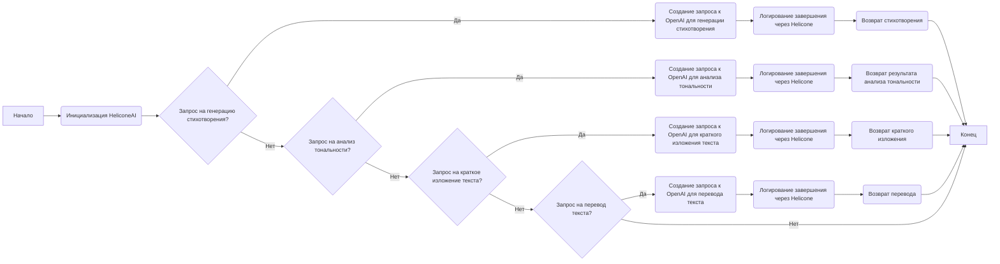
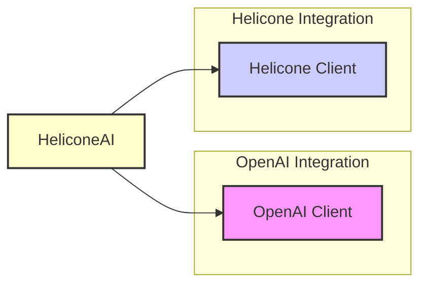

### **Системные инструкции для обработки кода проекта `hypotez`**

=========================================================================================

Описание функциональности и правил для генерации, анализа и улучшения кода. Направлено на обеспечение последовательного и читаемого стиля кодирования, соответствующего требованиям.

---

### **Основные принципы**

#### **1. Общие указания**:
- Соблюдай четкий и понятный стиль кодирования.
- Все изменения должны быть обоснованы и соответствовать установленным требованиям.

#### **2. Комментарии**:
- Используй `#` для внутренних комментариев.
- Документация всех функций, методов и классов должна следовать такому формату: 
    ```python
        def function(param: str, param1: Optional[str | dict | str] = None) -> dict | None:
            """ 
            Args:
                param (str): Описание параметра `param`.
                param1 (Optional[str | dict | str], optional): Описание параметра `param1`. По умолчанию `None`.
    
            Returns:
                dict | None: Описание возвращаемого значения. Возвращает словарь или `None`.
    
            Raises:
                SomeError: Описание ситуации, в которой возникает исключение `SomeError`.

            Ехаmple:
                >>> function('param', 'param1')
                {'param': 'param1'}
            """
    ```
- Комментарии и документация должны быть четкими, лаконичными и точными.

#### **3. Форматирование кода**:
- Используй одинарные кавычки. `a:str = 'value'`, `print('Hello World!')`;
- Добавляй пробелы вокруг операторов. Например, `x = 5`;
- Все параметры должны быть аннотированы типами. `def function(param: str, param1: Optional[str | dict | str] = None) -> dict | None:`;
- Не используй `Union`. Вместо этого используй `|`.

#### **4. Логирование**:
- Для логгирования Всегда Используй модуль `logger` из `src.logger.logger`.
- Ошибки должны логироваться с использованием `logger.error`.
Пример:
    ```python
        try:
            ...
        except Exception as ex:
            logger.error('Error while processing data', ех, exc_info=True)
    ```
#### **5 Не используй `Union[]` в коде. Вместо него используй `|`
Например:
```python
x: str | int ...
```


---

### **Основные требования**:

#### **1. Формат ответов в Markdown**:
- Все ответы должны быть выполнены в формате **Markdown**.

#### **2. Формат комментариев**:
- Используй указанный стиль для комментариев и документации в коде.
- Пример:

```python
from typing import Generator, Optional, List
from pathlib import Path


def read_text_file(
    file_path: str | Path,
    as_list: bool = False,
    extensions: Optional[List[str]] = None,
    chunk_size: int = 8192,
) -> Generator[str, None, None] | str | None:
    """
    Считывает содержимое файла (или файлов из каталога) с использованием генератора для экономии памяти.

    Args:
        file_path (str | Path): Путь к файлу или каталогу.
        as_list (bool): Если `True`, возвращает генератор строк.
        extensions (Optional[List[str]]): Список расширений файлов для чтения из каталога.
        chunk_size (int): Размер чанков для чтения файла в байтах.

    Returns:
        Generator[str, None, None] | str | None: Генератор строк, объединенная строка или `None` в случае ошибки.

    Raises:
        Exception: Если возникает ошибка при чтении файла.

    Example:
        >>> from pathlib import Path
        >>> file_path = Path('example.txt')
        >>> content = read_text_file(file_path)
        >>> if content:
        ...    print(f'File content: {content[:100]}...')
        File content: Example text...
    """
    ...
```
- Всегда делай подробные объяснения в комментариях. Избегай расплывчатых терминов, 
- таких как *«получить»* или *«делать»*. Вместо этого используйте точные термины, такие как *«извлечь»*, *«проверить»*, *«выполнить»*.
- Вместо: *«получаем»*, *«возвращаем»*, *«преобразовываем»* используй имя объекта *«функция получае»*, *«переменная возвращает»*, *«код преобразовывает»* 
- Комментарии должны непосредственно предшествовать описываемому блоку кода и объяснять его назначение.

#### **3. Пробелы вокруг операторов присваивания**:
- Всегда добавляйте пробелы вокруг оператора `=`, чтобы повысить читаемость.
- Примеры:
  - **Неправильно**: `x=5`
  - **Правильно**: `x = 5`

#### **4. Использование `j_loads` или `j_loads_ns`**:
- Для чтения JSON или конфигурационных файлов замените стандартное использование `open` и `json.load` на `j_loads` или `j_loads_ns`.
- Пример:

```python
# Неправильно:
with open('config.json', 'r', encoding='utf-8') as f:
    data = json.load(f)

# Правильно:
data = j_loads('config.json')
```

#### **5. Сохранение комментариев**:
- Все существующие комментарии, начинающиеся с `#`, должны быть сохранены без изменений в разделе «Улучшенный код».
- Если комментарий кажется устаревшим или неясным, не изменяйте его. Вместо этого отметьте его в разделе «Изменения».

#### **6. Обработка `...` в коде**:
- Оставляйте `...` как указатели в коде без изменений.
- Не документируйте строки с `...`.
```

#### **7. Аннотации**
Для всех переменных должны быть определены аннотации типа. 
Для всех функций все входные и выходные параметры аннотириваны
Для все параметров должны быть аннотации типа.


### **8. webdriver**
В коде используется webdriver. Он импртируется из модуля `webdriver` проекта `hypotez`
```python
from src.webdirver import Driver, Chrome, Firefox, Playwright, ...
driver = Driver(Firefox)

Пoсле чего может использоваться как

close_banner = {
  "attribute": null,
  "by": "XPATH",
  "selector": "//button[@id = 'closeXButton']",
  "if_list": "first",
  "use_mouse": false,
  "mandatory": false,
  "timeout": 0,
  "timeout_for_event": "presence_of_element_located",
  "event": "click()",
  "locator_description": "Закрываю pop-up окно, если оно не появилось - не страшно (`mandatory`:`false`)"
}

result = driver.execute_locator(close_banner)
```

### Анализ кода проекта `hypotez`

#### 1. **Блок-схема**



#### 2. **Диаграмма зависимостей**



Диаграмма показывает, что класс `HeliconeAI` зависит от двух основных компонентов:
- `OpenAI`: Клиент для взаимодействия с API OpenAI.
- `Helicone`: Клиент для логирования и мониторинга запросов через Helicone.ai.

#### 3. **Объяснение**

**Импорты:**
- `from helicone import Helicone`: Импортирует класс `Helicone` из библиотеки `helicone`. Этот класс используется для взаимодействия с сервисом Helicone.ai, который предназначен для логирования и мониторинга вызовов к OpenAI API.
- `from openai import OpenAI`: Импортирует класс `OpenAI` из библиотеки `openai`. Этот класс предоставляет интерфейс для работы с API OpenAI, позволяя выполнять различные задачи, такие как генерация текста, анализ тональности, создание кратких изложений и перевод.

**Класс `HeliconeAI`:**
- **Роль**: Класс `HeliconeAI` служит для упрощения взаимодействия с Helicone.ai и моделями OpenAI. Он предоставляет методы для выполнения различных задач обработки текста, таких как генерация стихов, анализ тональности, создание кратких изложений и перевод текста, а также логирует все запросы через Helicone.ai для мониторинга и анализа.
- **Атрибуты**:
  - `self.helicone`: Экземпляр класса `Helicone`, используемый для логирования завершений.
  - `self.client`: Экземпляр класса `OpenAI`, используемый для выполнения запросов к API OpenAI.
- **Методы**:
  - `__init__(self)`: Конструктор класса, инициализирует экземпляры `Helicone` и `OpenAI`.
  - `generate_poem(self, prompt: str) -> str`: Генерирует стихотворение на основе заданного промпта с использованием модели `gpt-3.5-turbo`. Возвращает сгенерированное стихотворение в виде строки.
    ```python
    def generate_poem(self, prompt: str) -> str:
        response = self.client.chat.completions.create(
            model="gpt-3.5-turbo",
            messages=[
                {"role": "user", "content": prompt}
            ]
        )
        self.helicone.log_completion(response)
        return response.choices[0].message.content
    ```
  - `analyze_sentiment(self, text: str) -> str`: Анализирует тональность заданного текста с использованием модели `text-davinci-003`. Возвращает результат анализа тональности в виде строки.
    ```python
    def analyze_sentiment(self, text: str) -> str:
        response = self.client.completions.create(
            model="text-davinci-003",
            prompt=f"Analyze the sentiment of the following text: {text}",
            max_tokens=50
        )
        self.helicone.log_completion(response)
        return response.choices[0].text.strip()
    ```
  - `summarize_text(self, text: str) -> str`: Создает краткое изложение заданного текста с использованием модели `text-davinci-003`. Возвращает краткое изложение в виде строки.
    ```python
    def summarize_text(self, text: str) -> str:
        response = self.client.completions.create(
            model="text-davinci-003",
            prompt=f"Summarize the following text: {text}",
            max_tokens=100
        )
        self.helicone.log_completion(response)
        return response.choices[0].text.strip()
    ```
  - `translate_text(self, text: str, target_language: str) -> str`: Переводит заданный текст на указанный целевой язык с использованием модели `text-davinci-003`. Возвращает переведенный текст в виде строки.
    ```python
    def translate_text(self, text: str, target_language: str) -> str:
        response = self.client.completions.create(
            model="text-davinci-003",
            prompt=f"Translate the following text to {target_language}: {text}",
            max_tokens=200
        )
        self.helicone.log_completion(response)
        return response.choices[0].text.strip()
    ```

**Функции:**
- `def main()`: Главная функция, демонстрирующая использование класса `HeliconeAI`. Создает экземпляр класса, генерирует стихотворение, анализирует тональность текста, создает краткое изложение текста и переводит текст. Выводит результаты на экран.
  ```python
  def main():
      helicone_ai = HeliconeAI()

      poem = helicone_ai.generate_poem("Напиши мне стихотворение про кота.")
      print("Generated Poem:\n", poem)

      sentiment = helicone_ai.analyze_sentiment("Сегодня был отличный день!")
      print("Sentiment Analysis:\n", sentiment)

      summary = helicone_ai.summarize_text("Длинный текст для изложения...")
      print("Summary:\n", summary)

      translation = helicone_ai.translate_text("Hello, how are you?", "русский")
      print("Translation:\n", translation)

  if __name__ == "__main__":
      main()
  ```

**Переменные:**
- `helicone_ai`: Экземпляр класса `HeliconeAI`, используемый для выполнения запросов к OpenAI API и логирования через Helicone.ai.
- `poem`: Строка, содержащая сгенерированное стихотворение.
- `sentiment`: Строка, содержащая результат анализа тональности.
- `summary`: Строка, содержащая краткое изложение текста.
- `translation`: Строка, содержащая переведенный текст.

**Потенциальные ошибки и области для улучшения:**
- **Обработка ошибок**: В коде не предусмотрена обработка возможных ошибок при взаимодействии с API OpenAI и Helicone.ai.
- **Параметризация моделей**: Жестко заданы модели `gpt-3.5-turbo` и `text-davinci-003`.
- **Лимиты токенов**: Жестко заданы лимиты токенов для разных задач.

**Взаимосвязи с другими частями проекта:**
- Данный код является частью модуля `src.ai.helicone`, который предназначен для интеграции с Helicone.ai и OpenAI. Он может быть использован в других частях проекта для выполнения задач обработки текста с логированием через Helicone.ai.