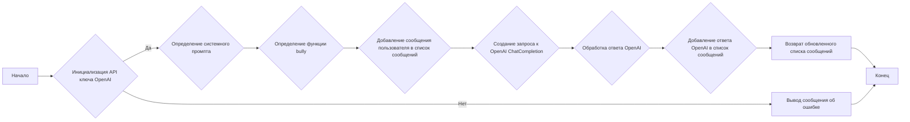
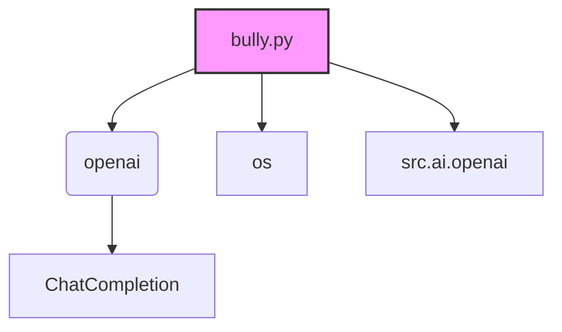

### **Системные инструкции для обработки кода проекта `hypotez`**

=========================================================================================

Описание функциональности и правил для генерации, анализа и улучшения кода. Направлено на обеспечение последовательного и читаемого стиля кодирования, соответствующего требованиям.

---

### **Основные принципы**

#### **1. Общие указания**:
- Соблюдай четкий и понятный стиль кодирования.
- Все изменения должны быть обоснованы и соответствовать установленным требованиям.

#### **2. Комментарии**:
- Используй `#` для внутренних комментариев.
- Документация всех функций, методов и классов должна следовать такому формату: 
    ```python
        def function(param: str, param1: Optional[str | dict | str] = None) -> dict | None:
            """ 
            Args:
                param (str): Описание параметра `param`.
                param1 (Optional[str | dict | str], optional): Описание параметра `param1`. По умолчанию `None`.
    
            Returns:
                dict | None: Описание возвращаемого значения. Возвращает словарь или `None`.
    
            Raises:
                SomeError: Описание ситуации, в которой возникает исключение `SomeError`.

            Ехаmple:
                >>> function('param', 'param1')
                {'param': 'param1'}
            """
    ```
- Комментарии и документация должны быть четкими, лаконичными и точными.

#### **3. Форматирование кода**:
- Используй одинарные кавычки. `a:str = 'value'`, `print('Hello World!')`;
- Добавляй пробелы вокруг операторов. Например, `x = 5`;
- Все параметры должны быть аннотированы типами. `def function(param: str, param1: Optional[str | dict | str] = None) -> dict | None:`;
- Не используй `Union`. Вместо этого используй `|`.

#### **4. Логирование**:
- Для логгирования Всегда Используй модуль `logger` из `src.logger.logger`.
- Ошибки должны логироваться с использованием `logger.error`.
Пример:
    ```python
        try:
            ...
        except Exception as ex:
            logger.error('Error while processing data', ех, exc_info=True)
    ```
#### **5 Не используй `Union[]` в коде. Вместо него используй `|`
Например:
```python
x: str | int ...
```


---

### **Основные требования**:

#### **1. Формат ответов в Markdown**:
- Все ответы должны быть выполнены в формате **Markdown**.

#### **2. Формат комментариев**:
- Используй указанный стиль для комментариев и документации в коде.
- Пример:

```python
from typing import Generator, Optional, List
from pathlib import Path


def read_text_file(
    file_path: str | Path,
    as_list: bool = False,
    extensions: Optional[List[str]] = None,
    chunk_size: int = 8192,
) -> Generator[str, None, None] | str | None:
    """
    Считывает содержимое файла (или файлов из каталога) с использованием генератора для экономии памяти.

    Args:
        file_path (str | Path): Путь к файлу или каталогу.
        as_list (bool): Если `True`, возвращает генератор строк.
        extensions (Optional[List[str]]): Список расширений файлов для чтения из каталога.
        chunk_size (int): Размер чанков для чтения файла в байтах.

    Returns:
        Generator[str, None, None] | str | None: Генератор строк, объединенная строка или `None` в случае ошибки.

    Raises:
        Exception: Если возникает ошибка при чтении файла.

    Example:
        >>> from pathlib import Path
        >>> file_path = Path('example.txt')
        >>> content = read_text_file(file_path)
        >>> if content:
        ...    print(f'File content: {content[:100]}...')
        File content: Example text...
    """
    ...
```
- Всегда делай подробные объяснения в комментариях. Избегай расплывчатых терминов, 
- таких как *«получить»* или *«делать»*. Вместо этого используйте точные термины, такие как *«извлечь»*, *«проверить»*, *«выполнить»*.
- Вместо: *«получаем»*, *«возвращаем»*, *«преобразовываем»* используй имя объекта *«функция получае»*, *«переменная возвращает»*, *«код преобразовывает»* 
- Комментарии должны непосредственно предшествовать описываемому блоку кода и объяснять его назначение.

#### **3. Пробелы вокруг операторов присваивания**:
- Всегда добавляйте пробелы вокруг оператора `=`, чтобы повысить читаемость.
- Примеры:
  - **Неправильно**: `x=5`
  - **Правильно**: `x = 5`

#### **4. Использование `j_loads` или `j_loads_ns`**:
- Для чтения JSON или конфигурационных файлов замените стандартное использование `open` и `json.load` на `j_loads` или `j_loads_ns`.
- Пример:

```python
# Неправильно:
with open('config.json', 'r', encoding='utf-8') as f:
    data = json.load(f)

# Правильно:
data = j_loads('config.json')
```

#### **5. Сохранение комментариев**:
- Все существующие комментарии, начинающиеся с `#`, должны быть сохранены без изменений в разделе «Улучшенный код».
- Если комментарий кажется устаревшим или неясным, не изменяйте его. Вместо этого отметьте его в разделе «Изменения».

#### **6. Обработка `...` в коде**:
- Оставляйте `...` как указатели в коде без изменений.
- Не документируйте строки с `...`.
```

#### **7. Аннотации**
Для всех переменных должны быть определены аннотации типа. 
Для всех функций все входные и выходные параметры аннотириваны
Для все параметров должны быть аннотации типа.


### **8. webdriver**
В коде используется webdriver. Он импртируется из модуля `webdriver` проекта `hypotez`
```python
from src.webdirver import Driver, Chrome, Firefox, Playwright, ...
driver = Driver(Firefox)

Пoсле чего может использоваться как

close_banner = {
  "attribute": null,
  "by": "XPATH",
  "selector": "//button[@id = 'closeXButton']",
  "if_list": "first",
  "use_mouse": false,
  "mandatory": false,
  "timeout": 0,
  "timeout_for_event": "presence_of_element_located",
  "event": "click()",
  "locator_description": "Закрываю pop-up окно, если оно не появилось - не страшно (`mandatory`:`false`)"
}

result = driver.execute_locator(close_banner)
```

## Анализ кода `hypotez/src/ai/openai/bully.py`

### 1. Блок-схема



**Примеры:**

*   **A (Начало)**: Начало выполнения скрипта.
*   **B (Инициализация API ключа OpenAI)**: Проверяется, установлен ли API-ключ OpenAI. Если да, то программа продолжает выполнение. Если нет, выводится сообщение об ошибке.
    *   Пример: `openai.API_KEY = "YOUR_API_KEYS_OPENAI"`
*   **C (Определение системного промпта)**: Определяется системный промпт, который задает роль и задачу для OpenAI.
    *   Пример: `system_prompt = "You are an expert on hate speech..."`
*   **E (Определение функции bully)**: Определяется функция `bully`, которая принимает сообщение пользователя и список сообщений в качестве аргументов.
    *   Пример: `def bully(user_message="Hello!", messages=[{"system": "user", "content": system_prompt}]):`
*   **F (Добавление сообщения пользователя в список сообщений)**: Сообщение пользователя добавляется в список сообщений для отправки в OpenAI.
    *   Пример: `messages.append({"role": "user", "content": user_message})`
*   **G (Создание запроса к OpenAI ChatCompletion)**: Создается запрос к OpenAI ChatCompletion с указанием модели и списка сообщений.
    *   Пример: `completion = openai.ChatCompletion.create(model="gpt-3.5-turbo", messages=messages)`
*   **H (Обработка ответа OpenAI)**: Полученный ответ от OpenAI обрабатывается.
    *   Пример: `completion.choices[0].message`
*   **I (Добавление ответа OpenAI в список сообщений)**: Ответ OpenAI добавляется в список сообщений.
    *   Пример: `messages.append({"role": "user", "content": completion.choices[0].message})`
*   **J (Возврат обновленного списка сообщений)**: Функция возвращает обновленный список сообщений.
    *   Пример: `return messagess`
*   **K (Конец)**: Завершение выполнения скрипта.

### 2. Диаграмма



**Объяснение зависимостей:**

*   **bully.py**: Основной скрипт, содержащий функцию `bully`.
*   **openai**:  Библиотека OpenAI для взаимодействия с API. Здесь используется для создания чат-запросов (`ChatCompletion`).
*   **os**:  Стандартная библиотека Python для взаимодействия с операционной системой. В данном коде не используется напрямую, но импортирована. Возможно, планировалось использование для работы с переменными окружения.
*   **src.ai.openai**:  Внутренний модуль проекта `hypotez`, который предположительно содержит дополнительную функциональность для работы с OpenAI. В данном коде не используется напрямую, но импортирован.
*   **ChatCompletion**:  Класс из библиотеки `openai`, используемый для создания чат-запросов и получения ответов от языковой модели.

### 3. Объяснение

*   **Импорты:**
    *   `os`: Импортируется модуль `os`, который предоставляет функции для взаимодействия с операционной системой. Однако в предоставленном коде он не используется. Возможно, он был импортирован для других целей, например, для работы с переменными окружения.
    *   `src.ai.openai`: Импортируется модуль `src.ai.openai`.  В предоставленном коде он не используется, но, вероятно, содержит вспомогательные функции для работы с OpenAI в рамках проекта `hypotez`.
    *   `openai`: Импортируется библиотека `openai`, которая предоставляет интерфейс для работы с API OpenAI. Используется для создания запросов к языковой модели и получения ответов.

*   **Переменные:**
    *   `openai.API_KEY`:  Глобальная переменная, которая должна содержать API-ключ OpenAI. **Важно:** В предоставленном коде значение захардкожено как `"YOUR_API_KEYS_OPENAI"`. Это небезопасно и должно быть изменено на получение ключа из переменной окружения или другого безопасного источника.
    *   `system_prompt`: Строковая переменная, содержащая системный промпт для OpenAI. Системный промпт задает роль и задачу для языковой модели. В данном случае, модель должна выступать в роли эксперта по ненавистническим высказываниям и генерировать примеры буллинга.
    *   `user_message`: Строковая переменная, содержащая сообщение пользователя. По умолчанию имеет значение `"Hello!"`.
    *   `messages`: Список словарей, представляющий историю сообщений в диалоге с OpenAI. Каждый словарь содержит ключи `"role"` (роль отправителя: `"user"` или `"system"`) и `"content"` (текст сообщения).
    *   `completion`: Объект, возвращаемый функцией `openai.ChatCompletion.create()`. Содержит информацию об ответе OpenAI, включая текст сообщения, использованную модель и другую метаинформацию.

*   **Функции:**

    *   `bully(user_message: str = "Hello!", messages: list = [{"system": "user", "content": system_prompt}]) -> list`:
        *   **Аргументы:**
            *   `user_message (str)`: Сообщение пользователя. По умолчанию `"Hello!"`.
            *   `messages (list)`: Список сообщений, представляющий историю диалога. По умолчанию содержит только системный промпт.
        *   **Возвращаемое значение:**
            *   `list`: Обновленный список сообщений, включающий сообщение пользователя и ответ OpenAI.  **Внимание:** В коде опечатка, возвращается `messagess` вместо `messages`.
        *   **Назначение:**
            Функция `bully` отправляет сообщение пользователя в OpenAI, используя заданный системный промпт, и возвращает обновленный список сообщений, включающий сообщение пользователя и ответ OpenAI.
        *   **Пример:**
            ```python
            messages = bully("Tell me how to insult someone.")
            print(messages)
            ```

*   **Потенциальные ошибки и области для улучшения:**

    *   **Безопасность API-ключа:**  API-ключ OpenAI захардкожен в коде. Это небезопасно. Ключ должен быть получен из переменной окружения или другого безопасного источника.
    *   **Отсутствие обработки ошибок:**  В коде отсутствует обработка ошибок, которые могут возникнуть при взаимодействии с API OpenAI (например, ошибки сети, ошибки аутентификации, превышение лимита запросов).
    *   **Опечатка в возвращаемом значении:** В коде функции `bully` возвращается `messagess` вместо `messages`.
    *   **Отсутствие аннотаций типов:** Для параметров функции `bully` отсутствуют аннотации типов, что снижает читаемость и усложняет отладку кода.
        *    `def bully(user_message="Hello!", messages=[{"system": "user", "content": system_prompt}]):`
    *   **Неиспользуемый импорт `os` и `src.ai.openai`:** Модули `os` и `src.ai.openai` импортируются, но не используются в коде. Следует удалить неиспользуемые импорты.

*   **Взаимосвязи с другими частями проекта:**

    *   Файл `bully.py` расположен в директории `src/ai/openai`, что указывает на его принадлежность к модулю, отвечающему за AI-функциональность, связанную с OpenAI.  Этот модуль, вероятно, содержит другие файлы, реализующие различную функциональность, связанную с OpenAI (например, генерация текста, анализ текста, классификация текста).
    *   Импорт `src.ai.openai` предполагает наличие других модулей или функций внутри этого пакета, которые могут использоваться совместно с `bully.py`.