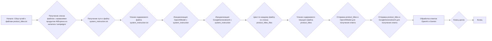
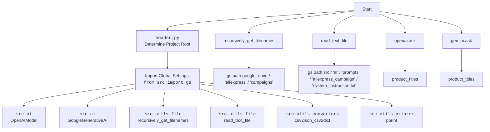

### **Системные инструкции для обработки кода проекта `hypotez`**

=========================================================================================

Описание функциональности и правил для генерации, анализа и улучшения кода. Направлено на обеспечение последовательного и читаемого стиля кодирования, соответствующего требованиям.

---

### **Основные принципы**

#### **1. Общие указания**:
- Соблюдай четкий и понятный стиль кодирования.
- Все изменения должны быть обоснованы и соответствовать установленным требованиям.

#### **2. Комментарии**:
- Используй `#` для внутренних комментариев.
- Документация всех функций, методов и классов должна следовать такому формату: 
    ```python
        def function(param: str, param1: Optional[str | dict | str] = None) -> dict | None:
            """ 
            Args:
                param (str): Описание параметра `param`.
                param1 (Optional[str | dict | str], optional): Описание параметра `param1`. По умолчанию `None`.
    
            Returns:
                dict | None: Описание возвращаемого значения. Возвращает словарь или `None`.
    
            Raises:
                SomeError: Описание ситуации, в которой возникает исключение `SomeError`.

            Ехаmple:
                >>> function('param', 'param1')
                {'param': 'param1'}
            """
    ```
- Комментарии и документация должны быть четкими, лаконичными и точными.

#### **3. Форматирование кода**:
- Используй одинарные кавычки. `a:str = 'value'`, `print('Hello World!')`;
- Добавляй пробелы вокруг операторов. Например, `x = 5`;
- Все параметры должны быть аннотированы типами. `def function(param: str, param1: Optional[str | dict | str] = None) -> dict | None:`;
- Не используй `Union`. Вместо этого используй `|`.

#### **4. Логирование**:
- Для логгирования Всегда Используй модуль `logger` из `src.logger.logger`.
- Ошибки должны логироваться с использованием `logger.error`.
Пример:
    ```python
        try:
            ...
        except Exception as ex:
            logger.error('Error while processing data', ех, exc_info=True)
    ```
#### **5 Не используй `Union[]` в коде. Вместо него используй `|`
Например:
```python
x: str | int ...
```


---

### **Основные требования**:

#### **1. Формат ответов в Markdown**:
- Все ответы должны быть выполнены в формате **Markdown**.

#### **2. Формат комментариев**:
- Используй указанный стиль для комментариев и документации в коде.
- Пример:

```python
from typing import Generator, Optional, List
from pathlib import Path


def read_text_file(
    file_path: str | Path,
    as_list: bool = False,
    extensions: Optional[List[str]] = None,
    chunk_size: int = 8192,
) -> Generator[str, None, None] | str | None:
    """
    Считывает содержимое файла (или файлов из каталога) с использованием генератора для экономии памяти.

    Args:
        file_path (str | Path): Путь к файлу или каталогу.
        as_list (bool): Если `True`, возвращает генератор строк.
        extensions (Optional[List[str]]): Список расширений файлов для чтения из каталога.
        chunk_size (int): Размер чанков для чтения файла в байтах.

    Returns:
        Generator[str, None, None] | str | None: Генератор строк, объединенная строка или `None` в случае ошибки.

    Raises:
        Exception: Если возникает ошибка при чтении файла.

    Example:
        >>> from pathlib import Path
        >>> file_path = Path('example.txt')
        >>> content = read_text_file(file_path)
        >>> if content:
        ...    print(f'File content: {content[:100]}...')
        File content: Example text...
    """
    ...
```
- Всегда делай подробные объяснения в комментариях. Избегай расплывчатых терминов, 
- таких как *«получить»* или *«делать»*. Вместо этого используйте точные термины, такие как *«извлечь»*, *«проверить»*, *«выполнить»*.
- Вместо: *«получаем»*, *«возвращаем»*, *«преобразовываем»* используй имя объекта *«функция получае»*, *«переменная возвращает»*, *«код преобразовывает»* 
- Комментарии должны непосредственно предшествовать описываемому блоку кода и объяснять его назначение.

#### **3. Пробелы вокруг операторов присваивания**:
- Всегда добавляйте пробелы вокруг оператора `=`, чтобы повысить читаемость.
- Примеры:
  - **Неправильно**: `x=5`
  - **Правильно**: `x = 5`

#### **4. Использование `j_loads` или `j_loads_ns`**:
- Для чтения JSON или конфигурационных файлов замените стандартное использование `open` и `json.load` на `j_loads` или `j_loads_ns`.
- Пример:

```python
# Неправильно:
with open('config.json', 'r', encoding='utf-8') as f:
    data = json.load(f)

# Правильно:
data = j_loads('config.json')
```

#### **5. Сохранение комментариев**:
- Все существующие комментарии, начинающиеся с `#`, должны быть сохранены без изменений в разделе «Улучшенный код».
- Если комментарий кажется устаревшим или неясным, не изменяйте его. Вместо этого отметьте его в разделе «Изменения».

#### **6. Обработка `...` в коде**:
- Оставляйте `...` как указатели в коде без изменений.
- Не документируйте строки с `...`.
```

#### **7. Аннотации**
Для всех переменных должны быть определены аннотации типа. 
Для всех функций все входные и выходные параметры аннотириваны
Для все параметров должны быть аннотации типа.


### **8. webdriver**
В коде используется webdriver. Он импртируется из модуля `webdriver` проекта `hypotez`
```python
from src.webdirver import Driver, Chrome, Firefox, Playwright, ...
driver = Driver(Firefox)

Пoсле чего может использоваться как

close_banner = {
  "attribute": null,
  "by": "XPATH",
  "selector": "//button[@id = 'closeXButton']",
  "if_list": "first",
  "use_mouse": false,
  "mandatory": false,
  "timeout": 0,
  "timeout_for_event": "presence_of_element_located",
  "event": "click()",
  "locator_description": "Закрываю pop-up окно, если оно не появилось - не страшно (`mandatory`:`false`)"
}

result = driver.execute_locator(close_banner)
```

## Анализ кода `hypotez/src/ai/openai/model/_experiments/model_train_for_aliexpress.py`

### 1. Блок-схема



**Примеры для логических блоков:**

-   **B**: `product_titles_files = recursively_get_filenames(gs.path.google_drive / 'aliexpress' / 'campaigns', 'product_titles.txt')` - Функция `recursively_get_filenames` извлекает список путей ко всем файлам `product_titles.txt` в указанной директории. Например, `product_titles_files` может быть `['/path/to/file1/product_titles.txt', '/path/to/file2/product_titles.txt']`.
-   **D**: `system_instruction = read_text_file(system_instruction_path)` - Функция `read_text_file` считывает содержимое файла `system_instruction.txt`. Например, `system_instruction` может быть строкой с инструкциями для модели: `"Ты - опытный помощник по продажам AliExpress..."`.
-   **I**: `response_openai = openai.ask(product_titles)` - Метод `ask` объекта `OpenAIModel` принимает строку `product_titles` и возвращает ответ от модели OpenAI. Например, `response_openai` может быть строкой: `"Топ-5 товаров для вашего магазина: ..."`.

### 2. Диаграмма



### 3. Объяснение

**Импорты:**

-   `header`: Предположительно, определяет корень проекта. Подробности о `header.py` будут ниже.
-   `from src import gs`: Импортирует глобальные настройки (`gs`) из пакета `src`. Эти настройки могут включать пути к директориям и другие глобальные параметры.
-   `from src.ai import OpenAIModel, GoogleGenerativeAI`: Импортирует классы `OpenAIModel` и `GoogleGenerativeAI` из модуля `src.ai`. Эти классы, вероятно, являются обертками для взаимодействия с моделями OpenAI и Gemini соответственно.
-   `from src.utils.file import recursively_get_filenames, read_text_file`: Импортирует функции `recursively_get_filenames` и `read_text_file` из модуля `src.utils.file`. Первая рекурсивно ищет файлы с заданным именем в директории, вторая читает содержимое текстового файла.
-   `from src.utils.convertors import csv2json_csv2dict`: Импортирует функцию `csv2json_csv2dict` из модуля `src.utils.convertors`. Вероятно, эта функция преобразует CSV-данные в JSON или словарь.
-   `from src.utils.printer import pprint`: Импортирует функцию `pprint` из модуля `src.utils.printer`. Эта функция используется для "pretty printing" (красивого вывода) данных.

**Переменные:**

-   `product_titles_files: list`: Список путей к файлам `product_titles.txt`, полученный с помощью `recursively_get_filenames`.
-   `system_instruction_path`: Путь к файлу `system_instruction.txt`, содержащему инструкции для моделей OpenAI и Gemini.
-   `system_instruction: str`: Содержимое файла `system_instruction.txt`, считанное с помощью `read_text_file`.
-   `openai`: Экземпляр класса `OpenAIModel`, инициализированный с инструкциями из `system_instruction`.
-   `gemini`: Экземпляр класса `GoogleGenerativeAI`, инициализированный с инструкциями из `system_instruction`.
-   `file`: Переменная цикла, представляющая текущий файл `product_titles.txt`.
-   `product_titles`: Содержимое текущего файла `product_titles.txt`, считанное с помощью `read_text_file`.
-   `response_openai`: Ответ, полученный от модели OpenAI.
-   `response_gemini`: Ответ, полученный от модели Gemini.

**Функциональность:**

1.  **Поиск файлов с названиями продуктов**: Скрипт начинает с поиска всех файлов `product_titles.txt` в каталоге `aliexpress/campaigns` на Google Drive, используя функцию `recursively_get_filenames`.
2.  **Чтение системных инструкций**: Затем он считывает содержимое файла `system_instruction.txt`, который содержит инструкции для моделей OpenAI и Gemini.
3.  **Инициализация моделей**: Инициализирует модели OpenAI и Gemini с использованием прочитанных инструкций.
4.  **Обработка файлов с названиями продуктов**: Перебирает каждый найденный файл `product_titles.txt`, считывает его содержимое и отправляет в модели OpenAI и Gemini для получения ответов.
5.  **Получение ответов от моделей**: Получает ответы от моделей OpenAI и Gemini.

**Потенциальные ошибки и области для улучшения:**

-   Обработка ошибок: Отсутствует явная обработка исключений при чтении файлов или при взаимодействии с моделями OpenAI и Gemini.
-   Логирование: Отсутствует логирование действий, что затрудняет отладку и мониторинг.
-   Обработка ответов: Не показана обработка и использование ответов от моделей (`...`).
-   Аннотации типов: В коде местами отсутствуют аннотации типов, что снижает читаемость и возможность статического анализа.

**Взаимосвязи с другими частями проекта:**

-   Этот скрипт использует глобальные настройки из `src.gs`, что позволяет ему получать доступ к путям к директориям и другим параметрам конфигурации.
-   Он использует модули `OpenAIModel` и `GoogleGenerativeAI` из `src.ai` для взаимодействия с соответствующими моделями.
-   Он использует утилиты из `src.utils.file` для работы с файлами и `src.utils.printer` для форматированного вывода данных.

```mermaid
flowchart TD
    Start --> Header[<code>header.py</code><br> Determine Project Root]
    Header --> import_gs[Import Global Settings: <br><code>from src import gs</code>]