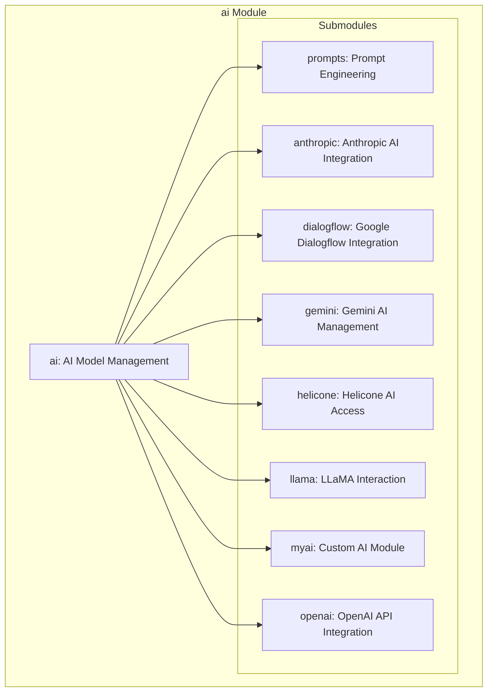

### **Системные инструкции для обработки кода проекта `hypotez`**

=========================================================================================

Описание функциональности и правил для генерации, анализа и улучшения кода. Направлено на обеспечение последовательного и читаемого стиля кодирования, соответствующего требованиям.

---

### **Основные принципы**

#### **1. Общие указания**:
- Соблюдай четкий и понятный стиль кодирования.
- Все изменения должны быть обоснованы и соответствовать установленным требованиям.

#### **2. Комментарии**:
- Используй `#` для внутренних комментариев.
- Документация всех функций, методов и классов должна следовать такому формату: 
    ```python
        def function(param: str, param1: Optional[str | dict | str] = None) -> dict | None:
            """ 
            Args:
                param (str): Описание параметра `param`.
                param1 (Optional[str | dict | str], optional): Описание параметра `param1`. По умолчанию `None`.
    
            Returns:
                dict | None: Описание возвращаемого значения. Возвращает словарь или `None`.
    
            Raises:
                SomeError: Описание ситуации, в которой возникает исключение `SomeError`.

            Ехаmple:
                >>> function('param', 'param1')
                {'param': 'param1'}
            """
    ```
- Комментарии и документация должны быть четкими, лаконичными и точными.

#### **3. Форматирование кода**:
- Используй одинарные кавычки. `a:str = 'value'`, `print('Hello World!')`;
- Добавляй пробелы вокруг операторов. Например, `x = 5`;
- Все параметры должны быть аннотированы типами. `def function(param: str, param1: Optional[str | dict | str] = None) -> dict | None:`;
- Не используй `Union`. Вместо этого используй `|`.

#### **4. Логирование**:
- Для логгирования Всегда Используй модуль `logger` из `src.logger.logger`.
- Ошибки должны логироваться с использованием `logger.error`.
Пример:
    ```python
        try:
            ...
        except Exception as ex:
            logger.error('Error while processing data', ех, exc_info=True)
    ```
#### **5 Не используй `Union[]` в коде. Вместо него используй `|`
Например:
```python
x: str | int ...
```


---

### **Основные требования**:

#### **1. Формат ответов в Markdown**:
- Все ответы должны быть выполнены в формате **Markdown**.

#### **2. Формат комментариев**:
- Используй указанный стиль для комментариев и документации в коде.
- Пример:

```python
from typing import Generator, Optional, List
from pathlib import Path


def read_text_file(
    file_path: str | Path,
    as_list: bool = False,
    extensions: Optional[List[str]] = None,
    chunk_size: int = 8192,
) -> Generator[str, None, None] | str | None:
    """
    Считывает содержимое файла (или файлов из каталога) с использованием генератора для экономии памяти.

    Args:
        file_path (str | Path): Путь к файлу или каталогу.
        as_list (bool): Если `True`, возвращает генератор строк.
        extensions (Optional[List[str]]): Список расширений файлов для чтения из каталога.
        chunk_size (int): Размер чанков для чтения файла в байтах.

    Returns:
        Generator[str, None, None] | str | None: Генератор строк, объединенная строка или `None` в случае ошибки.

    Raises:
        Exception: Если возникает ошибка при чтении файла.

    Example:
        >>> from pathlib import Path
        >>> file_path = Path('example.txt')
        >>> content = read_text_file(file_path)
        >>> if content:
        ...    print(f'File content: {content[:100]}...')
        File content: Example text...
    """
    ...
```
- Всегда делай подробные объяснения в комментариях. Избегай расплывчатых терминов, 
- таких как *«получить»* или *«делать»*
-  . Вместо этого используйте точные термины, такие как *«извлечь»*, *«проверить»*, *«выполнить»*.
- Вместо: *«получаем»*, *«возвращаем»*, *«преобразовываем»* используй имя объекта *«функция получае»*, *«переменная возвращает»*, *«код преобразовывает»* 
- Комментарии должны непосредственно предшествовать описываемому блоку кода и объяснять его назначение.

#### **3. Пробелы вокруг операторов присваивания**:
- Всегда добавляйте пробелы вокруг оператора `=`, чтобы повысить читаемость.
- Примеры:
  - **Неправильно**: `x=5`
  - **Правильно**: `x = 5`

#### **4. Использование `j_loads` или `j_loads_ns`**:
- Для чтения JSON или конфигурационных файлов замените стандартное использование `open` и `json.load` на `j_loads` или `j_loads_ns`.
- Пример:

```python
# Неправильно:
with open('config.json', 'r', encoding='utf-8') as f:
    data = json.load(f)

# Правильно:
data = j_loads('config.json')
```

#### **5. Сохранение комментариев**:
- Все существующие комментарии, начинающиеся с `#`, должны быть сохранены без изменений в разделе «Улучшенный код».
- Если комментарий кажется устаревшим или неясным, не изменяйте его. Вместо этого отметьте его в разделе «Изменения».

#### **6. Обработка `...` в коде**:
- Оставляйте `...` как указатели в коде без изменений.
- Не документируйте строки с `...`.
```

#### **7. Аннотации**
Для всех переменных должны быть определены аннотации типа. 
Для всех функций все входные и выходные параметры аннотириваны
Для все параметров должны быть аннотации типа.


### **8. webdriver**
В коде используется webdriver. Он импртируется из модуля `webdriver` проекта `hypotez`
```python
from src.webdirver import Driver, Chrome, Firefox, Playwright, ...
driver = Driver(Firefox)

Пoсле чего может использоваться как

close_banner = {
  "attribute": null,
  "by": "XPATH",
  "selector": "//button[@id = 'closeXButton']",
  "if_list": "first",
  "use_mouse": false,
  "mandatory": false,
  "timeout": 0,
  "timeout_for_event": "presence_of_element_located",
  "event": "click()",
  "locator_description": "Закрываю pop-up окно, если оно не появилось - не страшно (`mandatory`:`false`)"
}

result = driver.execute_locator(close_banner)
```

### **Анализ кода `hypotez/src/ai/openai/readme.ru.md`**

#### **1. Блок-схема**

```mermaid
graph TD
    A[Начало: Обзор модуля ai] --> B(Подмодули: prompts, anthropic, dialogflow, gemini, helicone, llama, myai, openai)
    B --> C{Выбор подмодуля}
    C -- prompts --> D[Создание и настройка подсказок]
    C -- anthropic --> E[Интеграция с моделями Anthropic]
    C -- dialogflow --> F[Интеграция с Google Dialogflow]
    C -- gemini --> G[Управление подключениями к моделям Gemini]
    C -- helicone --> H[Подключение к моделям Helicone]
    C -- llama --> I[Взаимодействие с LLaMA]
    C -- myai --> J[Пользовательские конфигурации моделей]
    C -- openai --> K[Интеграция с API OpenAI (GPT)]
    D --> L[Настройка входных данных для моделей ИИ]
    E --> M[Выполнение задач с моделями Anthropic]
    F --> N[Поддержка NLU и разговорного ИИ]
    G --> O[Поддержка приложений с моделями Gemini]
    H --> P[Доступ к функциям моделей Helicone]
    I --> Q[Задачи с LLaMA]
    J --> R[Реализация уникальных функций ИИ]
    K --> S[Доступ к моделям OpenAI для различных задач]
    L --> T[Повышение точности и релевантности ответов]
    M --> T
    N --> T
    O --> T
    P --> T
    Q --> T
    R --> T
    S --> T
    T --> Z[Конец: Обработка данных и генерация ответов]
```

#### **2. Диаграмма**



Объяснение зависимостей:

-   `ai` (AI Model Management): Основной модуль, который управляет всеми подмодулями, связанными с различными моделями ИИ.
-   `prompts` (Prompt Engineering): Отвечает за создание и настройку подсказок для моделей ИИ.
-   `anthropic` (Anthropic AI Integration): Обеспечивает интеграцию с моделями Anthropic.
-   `dialogflow` (Google Dialogflow Integration): Интегрируется с Google Dialogflow для обработки естественного языка и разговорного ИИ.
-   `gemini` (Gemini AI Management): Управляет подключениями к моделям Gemini.
-   `helicone` (Helicone AI Access): Подключается к моделям Helicone.
-   `llama` (LLaMA Interaction): Взаимодействует с LLaMA (Large Language Model Meta AI).
-   `myai` (Custom AI Module): Пользовательский модуль ИИ для специализированных конфигураций.
-   `openai` (OpenAI API Integration): Интегрируется с API OpenAI для доступа к различным моделям (например, GPT).

#### **3. Объяснение**

-   **Импорты**: В предоставленном коде отсутствуют явные импорты, так как это обзорная документация модуля `ai`. Каждый подмодуль (например, `openai`, `anthropic`) будет содержать свои собственные импорты, специфичные для его функциональности. Например, подмодуль `openai` может импортировать библиотеки для работы с API OpenAI (например, `openai` Python-пакет) и другими компонентами `src.`.
-   **Классы**: В данном коде классы не описаны. Предполагается, что каждый из подмодулей содержит классы для управления соответствующими моделями ИИ и API. Например, подмодуль `openai` может иметь класс `OpenAIClient`, который инкапсулирует логику взаимодействия с API OpenAI.
-   **Функции**: В данном коде функции не описаны. Каждый подмодуль будет содержать функции, специфичные для его задач. Например, подмодуль `openai` может иметь функцию `generate_text`, которая отправляет запрос в API OpenAI для генерации текста на основе предоставленной подсказки.
-   **Переменные**: В данном коде переменные не описаны. Предполагается, что каждый из подмодулей использует переменные для хранения конфигураций, API-ключей и других параметров, необходимых для работы с соответствующими моделями ИИ.

**Цепочка взаимосвязей с другими частями проекта**:

Модуль `ai` является ключевым компонентом проекта `hypotez`, отвечающим за интеграцию с различными моделями ИИ. Он взаимодействует с другими частями проекта следующим образом:

1.  **`src.prompts`**: Подмодуль `prompts` может использоваться другими модулями для создания и управления подсказками, которые затем передаются в модели ИИ через модуль `ai`.
2.  **`src.config`**: Модуль `ai` может использовать конфигурационные файлы из `src.config` для хранения API-ключей, параметров моделей и других настроек.
3.  **`src.data`**: Модуль `ai` может обрабатывать данные из `src.data` для анализа и генерации ответов с использованием моделей ИИ.
4.  **`src.logger.logger`**: Все ошибки должны логироваться с использованием `logger.error`.

**Потенциальные ошибки и области для улучшения**:

1.  Отсутствие подробной документации для каждого подмодуля, классов и функций.
2.  Необходимость стандартизации обработки ошибок и логирования во всех подмодулях.
3.  Рассмотреть возможность использования абстрактных классов и интерфейсов для обеспечения единообразного взаимодействия с различными моделями ИИ.