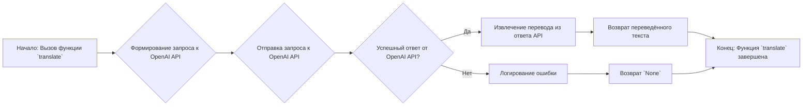
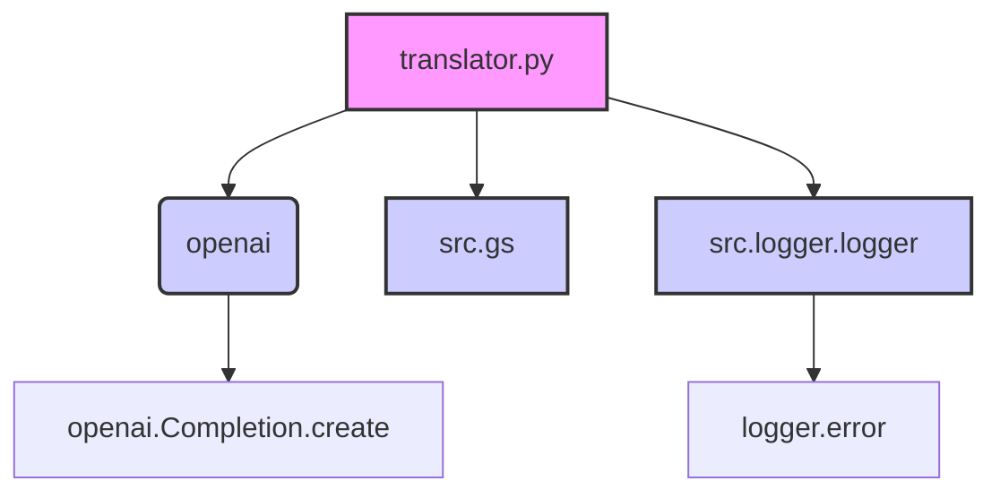

### **Системные инструкции для обработки кода проекта `hypotez`**

=========================================================================================

Описание функциональности и правил для генерации, анализа и улучшения кода. Направлено на обеспечение последовательного и читаемого стиля кодирования, соответствующего требованиям.

---

### **Основные принципы**

#### **1. Общие указания**:
- Соблюдай четкий и понятный стиль кодирования.
- Все изменения должны быть обоснованы и соответствовать установленным требованиям.

#### **2. Комментарии**:
- Используй `#` для внутренних комментариев.
- Документация всех функций, методов и классов должна следовать такому формату: 
    ```python
        def function(param: str, param1: Optional[str | dict | str] = None) -> dict | None:
            """ 
            Args:
                param (str): Описание параметра `param`.
                param1 (Optional[str | dict | str], optional): Описание параметра `param1`. По умолчанию `None`.
    
            Returns:
                dict | None: Описание возвращаемого значения. Возвращает словарь или `None`.
    
            Raises:
                SomeError: Описание ситуации, в которой возникает исключение `SomeError`.

            Ехаmple:
                >>> function('param', 'param1')
                {'param': 'param1'}
            """
    ```
- Комментарии и документация должны быть четкими, лаконичными и точными.

#### **3. Форматирование кода**:
- Используй одинарные кавычки. `a:str = 'value'`, `print('Hello World!')`;
- Добавляй пробелы вокруг операторов. Например, `x = 5`;
- Все параметры должны быть аннотированы типами. `def function(param: str, param1: Optional[str | dict | str] = None) -> dict | None:`;
- Не используй `Union`. Вместо этого используй `|`.

#### **4. Логирование**:
- Для логгирования Всегда Используй модуль `logger` из `src.logger.logger`.
- Ошибки должны логироваться с использованием `logger.error`.
Пример:
    ```python
        try:
            ...
        except Exception as ex:
            logger.error('Error while processing data', ех, exc_info=True)
    ```
#### **5 Не используй `Union[]` в коде. Вместо него используй `|`
Например:
```python
x: str | int ...
```


---

### **Основные требования**:

#### **1. Формат ответов в Markdown**:
- Все ответы должны быть выполнены в формате **Markdown**.

#### **2. Формат комментариев**:
- Используй указанный стиль для комментариев и документации в коде.
- Пример:

```python
from typing import Generator, Optional, List
from pathlib import Path


def read_text_file(
    file_path: str | Path,
    as_list: bool = False,
    extensions: Optional[List[str]] = None,
    chunk_size: int = 8192,
) -> Generator[str, None, None] | str | None:
    """
    Считывает содержимое файла (или файлов из каталога) с использованием генератора для экономии памяти.

    Args:
        file_path (str | Path): Путь к файлу или каталогу.
        as_list (bool): Если `True`, возвращает генератор строк.
        extensions (Optional[List[str]]): Список расширений файлов для чтения из каталога.
        chunk_size (int): Размер чанков для чтения файла в байтах.

    Returns:
        Generator[str, None, None] | str | None: Генератор строк, объединенная строка или `None` в случае ошибки.

    Raises:
        Exception: Если возникает ошибка при чтении файла.

    Example:
        >>> from pathlib import Path
        >>> file_path = Path('example.txt')
        >>> content = read_text_file(file_path)
        >>> if content:
        ...    print(f'File content: {content[:100]}...')
        File content: Example text...
    """
    ...
```
- Всегда делай подробные объяснения в комментариях. Избегай расплывчатых терминов, 
- таких как *«получить»* или *«делать»*. Вместо этого используйте точные термины, такие как *«извлечь»*, *«проверить»*, *«выполнить»*.
- Вместо: *«получаем»*, *«возвращаем»*, *«преобразовываем»* используй имя объекта *«функция получае»*, *«переменная возвращает»*, *«код преобразовывает»* 
- Комментарии должны непосредственно предшествовать описываемому блоку кода и объяснять его назначение.

#### **3. Пробелы вокруг операторов присваивания**:
- Всегда добавляйте пробелы вокруг оператора `=`, чтобы повысить читаемость.
- Примеры:
  - **Неправильно**: `x=5`
  - **Правильно**: `x = 5`

#### **4. Использование `j_loads` или `j_loads_ns`**:
- Для чтения JSON или конфигурационных файлов замените стандартное использование `open` и `json.load` на `j_loads` или `j_loads_ns`.
- Пример:

```python
# Неправильно:
with open('config.json', 'r', encoding='utf-8') as f:
    data = json.load(f)

# Правильно:
data = j_loads('config.json')
```

#### **5. Сохранение комментариев**:
- Все существующие комментарии, начинающиеся с `#`, должны быть сохранены без изменений в разделе «Улучшенный код».
- Если комментарий кажется устаревшим или неясным, не изменяйте его. Вместо этого отметьте его в разделе «Изменения».

#### **6. Обработка `...` в коде**:
- Оставляйте `...` как указатели в коде без изменений.
- Не документируйте строки с `...`.
```

#### **7. Аннотации**
Для всех переменных должны быть определены аннотации типа. 
Для всех функций все входные и выходные параметры аннотириваны
Для все параметров должны быть аннотации типа.


### **8. webdriver**
В коде используется webdriver. Он импртируется из модуля `webdriver` проекта `hypotez`
```python
from src.webdirver import Driver, Chrome, Firefox, Playwright, ...
driver = Driver(Firefox)

Пoсле чего может использоваться как

close_banner = {
  "attribute": null,
  "by": "XPATH",
  "selector": "//button[@id = 'closeXButton']",
  "if_list": "first",
  "use_mouse": false,
  "mandatory": false,
  "timeout": 0,
  "timeout_for_event": "presence_of_element_located",
  "event": "click()",
  "locator_description": "Закрываю pop-up окно, если оно не появилось - не страшно (`mandatory`:`false`)"
}

result = driver.execute_locator(close_banner)
```

## Анализ кода `hypotez/src/ai/openai/translator.py`

### 1. Блок-схема



**Примеры для каждого логического блока:**

-   **A (Начало):** `translate(text="Hello, world!", source_language="English", target_language="Russian")`
-   **B (Формирование запроса):** Формируется строка запроса, включающая текст, исходный язык и целевой язык.
    Пример: `"Translate the following text from English to Russian:\n\nHello, world!\n\nTranslation:"`
-   **C (Отправка запроса):** Отправка сформированного запроса к OpenAI API с использованием `openai.Completion.create`.
-   **D (Успешный ответ?):** Проверка, что API вернул ответ без ошибок. Если произошла ошибка (например, проблемы с аутентификацией или лимитами), переходим к блоку G.
-   **E (Извлечение перевода):** Извлечение переведённого текста из структуры ответа, полученной от API.
    Пример: `translation = response.choices[0].text.strip()`
-   **F (Возврат перевода):** Возврат извлечённого переведённого текста.
    Пример: `"Привет, мир!"`
-   **G (Логирование ошибки):** В случае ошибки логируется сообщение об ошибке с использованием `logger.error`.
-   **H (Возврат `None`):** Возврат `None` в случае ошибки.
-   **I (Конец):** Завершение работы функции.

### 2. Диаграмма



**Объяснение зависимостей:**

-   `translator.py`: Основной модуль, содержащий функцию `translate`.
-   `openai`: Библиотека для взаимодействия с OpenAI API. Используется для отправки запросов на перевод текста.
    -   `openai.Completion.create`: Метод для создания запроса к OpenAI Completion API, который используется для генерации текста, в данном случае - перевода.
-   `src.gs`: Модуль глобальных настроек (`gs` - global settings) проекта. Используется для получения ключа API OpenAI.
-   `src.logger.logger`: Модуль логирования. Используется для записи ошибок, возникающих в процессе перевода.
    -   `logger.error`: Функция логирования ошибок.

### 3. Объяснение

#### Импорты:

-   `import openai`: Импортирует библиотеку `openai`, необходимую для взаимодействия с OpenAI API.  Она позволяет отправлять запросы к моделям OpenAI для выполнения различных задач, таких как перевод текста.
-   `from src import gs`: Импортирует модуль `gs` из пакета `src`. Модуль `gs` содержит глобальные настройки и учетные данные, включая ключ API OpenAI.  Это обеспечивает доступ к API без жесткого кодирования ключа в коде.
-   `from src.logger.logger import logger`: Импортирует объект `logger` из модуля `src.logger.logger`.  Этот объект используется для логирования информации о работе модуля, включая ошибки.

#### Классы:

В данном коде классы явно не используются.

#### Функции:

-   `translate(text: str, source_language: str, target_language: str) -> str | None`:
    -   **Аргументы:**
        -   `text` (`str`): Текст, который необходимо перевести.
        -   `source_language` (`str`): Язык исходного текста.
        -   `target_language` (`str`): Язык, на который необходимо перевести текст.
    -   **Возвращаемое значение:**
        -   `str`: Переведённый текст в случае успеха.
        -   `None`: В случае возникновения ошибки.
    -   **Назначение:**
        Функция принимает текст и информацию о языках, формирует запрос к OpenAI API для перевода текста, обрабатывает ответ и возвращает переведённый текст.  В случае ошибки логирует информацию об ошибке и возвращает `None`.
    -   **Пример:**

        ```python
        source_text: str = "Привет, как дела?"
        source_language: str = "Russian"
        target_language: str = "English"
        translation: str | None = translate(source_text, source_language, target_language)
        if translation:
            print(f"Translated text: {translation}")
        ```

#### Переменные:

-   `openai.api_key`:  Глобальная переменная, устанавливающая ключ API для OpenAI.  Этот ключ получается из `gs.credentials.openai`, что позволяет безопасно хранить и использовать учетные данные.
-   `prompt`:  Строка, содержащая запрос к OpenAI API.  Она формируется на основе входного текста, исходного и целевого языков.
-   `response`:  Объект, содержащий ответ от OpenAI API после отправки запроса.
-   `translation`:  Строка, содержащая переведённый текст, извлечённый из ответа API.

#### Потенциальные ошибки и области для улучшения:

-   **Обработка ошибок:**  В блоке `except` логируется только общая информация об ошибке.  Было бы полезно логировать более специфичные детали ошибки, чтобы упростить отладку.
-   **Конфигурация модели:**  Модель `"text-davinci-003"` жёстко задана в коде.  Было бы лучше сделать выбор модели конфигуриемым параметром, возможно, через модуль `gs`.
-   **Параметры API:**  Некоторые параметры OpenAI API, такие как `max_tokens` и `temperature`, также жёстко заданы.  Рассмотрите возможность сделать их конфигурируемыми.
-   **Проверка входных данных:**  Не хватает проверки входных данных.  Например, можно добавить проверку, что `text` не пустой, а `source_language` и `target_language` являются допустимыми кодами языков.

#### Взаимосвязи с другими частями проекта:

-   Модуль `translator.py` зависит от модуля `gs` для получения учетных данных OpenAI.  Это позволяет централизованно управлять учетными данными и избежать их дублирования в коде.
-   Модуль использует `src.logger.logger` для логирования ошибок, что позволяет собирать информацию о работе модуля и упрощает отладку.
-   Этот модуль может использоваться другими частями проекта для перевода текста, например, для локализации веб-страниц или документов.