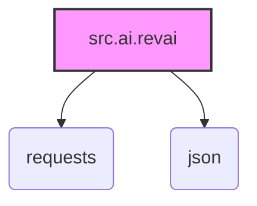

### **Анализ кода проекта `hypotez`**

=========================================================================================

Этот документ предоставляет анализ предоставленного фрагмента кода, описывающего функциональность `revai` в проекте `hypotez`.

---

### **1. Блок-схема**

```mermaid
graph LR
    A[Начало] --> B{revai (rev.com)};
    B --> C[Описание: Модель для работы со звуковыми файлами];
    C --> D[Ссылки на документацию API rev.com];
    D --> E[Конец];
```

**Описание блоков:**

*   **A (Начало)**: Начало процесса анализа.
*   **B (revai (rev.com))**: Указывает на использование модели `revai` от `rev.com`.
    *   _Пример_: Модель `revai` используется для транскрибирования записей звонков.
*   **C (Описание: Модель для работы со звуковыми файлами)**: Описывает назначение модели – работа со звуковыми файлами переговоров, совещаний, звонков и т.п.
    *   _Пример_: Обработка аудиофайлов с совещаний для последующего анализа ключевых тем.
*   **D (Ссылки на документацию API rev.com)**: Указывает на ссылки на документацию API для `rev.com`.
    *   _Пример_: Использование документации для изучения параметров запросов к API.
*   **E (Конец)**: Конец процесса анализа.

---

### **2. Диаграмма зависимостей**

В предоставленном коде нет инструкций импорта, поэтому диаграмма зависимостей отсутствует. Однако, если бы были импорты, диаграмма `mermaid` выглядела бы следующим образом (пример):



**Объяснение:**

*   `src.ai.revai`: Представляет модуль `revai` в проекте `hypotez`.
*   `requests`: Библиотека Python для отправки HTTP-запросов. Используется для взаимодействия с API `rev.com`.
*   `json`: Модуль для работы с данными в формате JSON. Используется для обработки ответов от API `rev.com`.

---

### **3. Объяснение**

*   **Описание**:
    *   Данный фрагмент кода описывает интеграцию модели `revai` (от `rev.com`) в проект `hypotez`. `revai` предназначена для работы со звуковыми файлами, такими как записи переговоров, совещаний и звонков. Код содержит ссылки на документацию API `rev.com`, что позволяет разработчикам ознакомиться с функциональностью и параметрами API.

*   **Импорты**:
    *   В предоставленном фрагменте кода нет импортов. Однако, если бы они были, например, `requests` и `json`, их назначение было бы следующим:
        *   `requests`: Для отправки HTTP-запросов к API `rev.com`. Это необходимо для загрузки аудиофайлов и получения результатов транскрипции.
        *   `json`: Для обработки данных, полученных от API `rev.com`, которые обычно представлены в формате JSON.

*   **Классы**:
    *   В данном фрагменте кода нет определения классов.

*   **Функции**:
    *   В данном фрагменте кода нет определения функций.

*   **Переменные**:
    *   В данном фрагменте кода нет переменных.

*   **Потенциальные ошибки и области для улучшения**:
    *   Отсутствие обработки ошибок: В реальном коде необходимо предусмотреть обработку ошибок при взаимодействии с API `rev.com`, таких как сетевые сбои, неправильные ключи API и т.д.
    *   Аутентификация: Необходимо явно указать, как происходит аутентификация при взаимодействии с API `rev.com`.

*   **Взаимосвязи с другими частями проекта**:
    *   Модуль `revai` может быть связан с другими частями проекта `hypotez`, например, с модулями для обработки и анализа текста, полученного в результате транскрипции аудиофайлов. Он также может быть связан с модулями для хранения и управления данными.
    *   Для начала работы с `revai`, потребуется создать класс, который будет инкапсулировать логику работы с API `rev.com`. Этот класс будет использовать библиотеки `requests` для отправки запросов и `json` для обработки ответов.