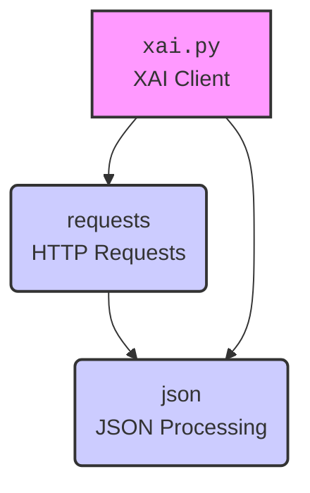

### **Анализ кода проекта `hypotez`**

=========================================================================================

Этот документ представляет собой анализ Markdown-файла `hypotez/src/ai/xai/readme.ru.md`, содержащего описание Python-клиента для взаимодействия с API xAI.

---

### **1. Блок-схема**

```mermaid
graph LR
    A[Начало] --> B(Установка зависимостей: `pip install requests`)
    B --> C{Инициализация класса `XAI` с API-ключом}
    C --> D{Создание списка сообщений (messages)}
    D --> E{Выбор метода API: `chat_completion` или `stream_chat_completion`}
    E --> F{Завершение чата (`chat_completion`)}
    E --> G{Потоковая передача завершения чата (`stream_chat_completion`)}
    F --> H(Обработка ответа `completion_response`)
    G --> I(Обработка потокового ответа `stream_response`)
    H --> J[Вывод `completion_response`]
    I --> K{Цикл по строкам в `stream_response`}
    K --> L{Проверка `line.strip()`}
    L -- Не пусто --> M(Преобразование `json.loads(line)`)
    M --> N[Вывод `json.loads(line)`]
    L -- Пусто --> K
    N --> K
    J --> End[Конец]
    K --> End
```

Пример для каждого логического блока:

- **Установка зависимостей**: Пользователь запускает `pip install requests` для установки необходимых библиотек.
- **Инициализация класса `XAI`**:
  ```python
  from xai import XAI
  api_key = "your_api_key_here"
  xai = XAI(api_key)
  ```
- **Создание списка сообщений**:
  ```python
  messages = [
      {"role": "system", "content": "You are Grok..."},
      {"role": "user", "content": "What is the answer..."}
  ]
  ```
- **Завершение чата**:
  ```python
  completion_response = xai.chat_completion(messages)
  print("Non-streaming response:", completion_response)
  ```
- **Потоковая передача завершения чата**:
  ```python
  stream_response = xai.stream_chat_completion(messages)
  for line in stream_response:
      if line.strip():
          print(json.loads(line))
  ```

---

### **2. Диаграмма**



**Объяснение зависимостей:**

- **`xai.py`**:  Предполагаемый модуль, содержащий класс `XAI`, который является основным клиентом для взаимодействия с API xAI.
- **`requests`**: Библиотека Python, используемая для выполнения HTTP-запросов. Класс `XAI` использует её для отправки запросов к API xAI.
- **`json`**:  Встроенный модуль Python для работы с данными в формате JSON. Используется для обработки и сериализации/десериализации данных, отправляемых и получаемых от API xAI. В данном случае, используется для `json.loads(line)` для обработки потокового ответа.

---

### **3. Объяснение**

#### **Обзор**

Файл `readme.ru.md` предоставляет обзор, инструкции по установке и примеры использования Python-клиента для API xAI. Клиент позволяет отправлять запросы для завершения чата и потоковой передачи ответов.

#### **Импорты**

- **`json`**: Используется для обработки данных JSON, особенно при потоковой передаче ответов.
- **`xai`**:  Предполагается, что это модуль, содержащий класс `XAI`, который является основным интерфейсом для взаимодействия с API xAI.

#### **Класс `XAI`**

- **Роль**: Предоставляет интерфейс для взаимодействия с API xAI.
- **Атрибуты**:
  - `api_key`: Ключ API для аутентификации запросов.
- **Методы**:
  - `chat_completion(messages)`: Отправляет запрос на завершение чата и возвращает ответ.
  - `stream_chat_completion(messages)`: Отправляет запрос на потоковую передачу завершения чата и возвращает генератор ответов.

#### **Функции (методы класса `XAI`)**

- **`chat_completion(messages)`**:
  - **Аргументы**:
    - `messages` (list): Список словарей, представляющих сообщения в чате.
  - **Возвращаемое значение**:
    - `str`: Ответ от API xAI.
  - **Назначение**: Отправляет запрос к API xAI для генерации ответа на основе предоставленных сообщений.
  - **Пример**:
    ```python
    completion_response = xai.chat_completion(messages)
    print("Non-streaming response:", completion_response)
    ```

- **`stream_chat_completion(messages)`**:
  - **Аргументы**:
    - `messages` (list): Список словарей, представляющих сообщения в чате.
  - **Возвращаемое значение**:
    - `generator`: Генератор, выдающий строки ответа от API xAI.
  - **Назначение**: Отправляет запрос к API xAI для потоковой передачи ответа на основе предоставленных сообщений.
  - **Пример**:
    ```python
    stream_response = xai.stream_chat_completion(messages)
    for line in stream_response:
        if line.strip():
            print(json.loads(line))
    ```

#### **Переменные**

- `api_key` (str): Ключ API для аутентификации.
- `messages` (list): Список сообщений для отправки в API xAI.
- `completion_response` (str): Ответ от API xAI при использовании `chat_completion`.
- `stream_response` (generator): Генератор, выдающий строки ответа от API xAI при использовании `stream_chat_completion`.

#### **Потенциальные ошибки и области для улучшения**

- **Обработка ошибок**: В примере кода отсутствует явная обработка ошибок.  Следует добавить блоки `try...except` для обработки возможных исключений при выполнении HTTP-запросов и обработке ответов JSON.
- **Конфиденциальность API-ключа**: API-ключ жестко закодирован в примере.  Рекомендуется использовать переменные окружения или другие безопасные способы хранения и передачи ключа API.
- **Зависимости**: Обязательно указывать версию пакета `requests` в файле зависимостей, чтобы обеспечить воспроизводимость окружения.

#### **Взаимосвязи с другими частями проекта**

- Этот клиент может быть использован в других частях проекта `hypotez` для интеграции с моделями xAI.  Например, для реализации чат-ботов, автоматической генерации контента и других задач, требующих взаимодействия с API xAI.

---