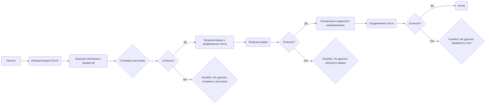
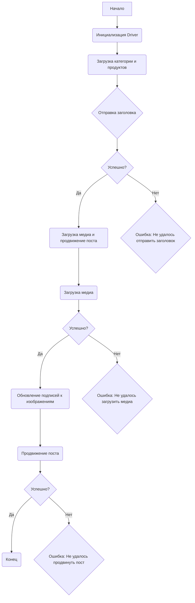

### **Системные инструкции для обработки кода проекта `hypotez`**

=========================================================================================

Описание функциональности и правил для генерации, анализа и улучшения кода. Направлено на обеспечение последовательного и читаемого стиля кодирования, соответствующего требованиям.

---

### **Основные принципы**

#### **1. Общие указания**:
- Соблюдай четкий и понятный стиль кодирования.
- Все изменения должны быть обоснованы и соответствовать установленным требованиям.

#### **2. Комментарии**:
- Используй `#` для внутренних комментариев.
- Документация всех функций, методов и классов должна следовать такому формату: 
    ```python
        def function(param: str, param1: Optional[str | dict | str] = None) -> dict | None:
            """ 
            Args:
                param (str): Описание параметра `param`.
                param1 (Optional[str | dict | str], optional): Описание параметра `param1`. По умолчанию `None`.
    
            Returns:
                dict | None: Описание возвращаемого значения. Возвращает словарь или `None`.
    
            Raises:
                SomeError: Описание ситуации, в которой возникает исключение `SomeError`.

            Ехаmple:
                >>> function('param', 'param1')
                {'param': 'param1'}
            """
    ```
- Комментарии и документация должны быть четкими, лаконичными и точными.

#### **3. Форматирование кода**:
- Используй одинарные кавычки. `a:str = 'value'`, `print('Hello World!')`;
- Добавляй пробелы вокруг операторов. Например, `x = 5`;
- Все параметры должны быть аннотированы типами. `def function(param: str, param1: Optional[str | dict | str] = None) -> dict | None:`;
- Не используй `Union`. Вместо этого используй `|`.

#### **4. Логирование**:
- Для логгирования Всегда Используй модуль `logger` из `src.logger.logger`.
- Ошибки должны логироваться с использованием `logger.error`.
Пример:
    ```python
        try:
            ...
        except Exception as ex:
            logger.error('Error while processing data', ех, exc_info=True)
    ```
#### **5 Не используй `Union[]` в коде. Вместо него используй `|`
Например:
```python
x: str | int ...
```


---

### **Основные требования**:

#### **1. Формат ответов в Markdown**:
- Все ответы должны быть выполнены в формате **Markdown**.

#### **2. Формат комментариев**:
- Используй указанный стиль для комментариев и документации в коде.
- Пример:

```python
from typing import Generator, Optional, List
from pathlib import Path


def read_text_file(
    file_path: str | Path,
    as_list: bool = False,
    extensions: Optional[List[str]] = None,
    chunk_size: int = 8192,
) -> Generator[str, None, None] | str | None:
    """
    Считывает содержимое файла (или файлов из каталога) с использованием генератора для экономии памяти.

    Args:
        file_path (str | Path): Путь к файлу или каталогу.
        as_list (bool): Если `True`, возвращает генератор строк.
        extensions (Optional[List[str]]): Список расширений файлов для чтения из каталога.
        chunk_size (int): Размер чанков для чтения файла в байтах.

    Returns:
        Generator[str, None, None] | str | None: Генератор строк, объединенная строка или `None` в случае ошибки.

    Raises:
        Exception: Если возникает ошибка при чтении файла.

    Example:
        >>> from pathlib import Path
        >>> file_path = Path('example.txt')
        >>> content = read_text_file(file_path)
        >>> if content:
        ...    print(f'File content: {content[:100]}...')
        File content: Example text...
    """
    ...
```
- Всегда делай подробные объяснения в комментариях. Избегай расплывчатых терминов, 
- таких как *«получить»* или *«делать»*
-  . Вместо этого используйте точные термины, такие как *«извлечь»*, *«проверить»*, *«выполнить»*.
- Вместо: *«получаем»*, *«возвращаем»*, *«преобразовываем»* используй имя объекта *«функция получае»*, *«переменная возвращает»*, *«код преобразовывает»* 
- Комментарии должны непосредственно предшествовать описываемому блоку кода и объяснять его назначение.

#### **3. Пробелы вокруг операторов присваивания**:
- Всегда добавляйте пробелы вокруг оператора `=`, чтобы повысить читаемость.
- Примеры:
  - **Неправильно**: `x=5`
  - **Правильно**: `x = 5`

#### **4. Использование `j_loads` или `j_loads_ns`**:
- Для чтения JSON или конфигурационных файлов замените стандартное использование `open` и `json.load` на `j_loads` или `j_loads_ns`.
- Пример:

```python
# Неправильно:
with open('config.json', 'r', encoding='utf-8') as f:
    data = json.load(f)

# Правильно:
data = j_loads('config.json')
```

#### **5. Сохранение комментариев**:
- Все существующие комментарии, начинающиеся с `#`, должны быть сохранены без изменений в разделе «Улучшенный код».
- Если комментарий кажется устаревшим или неясным, не изменяйте его. Вместо этого отметьте его в разделе «Изменения».

#### **6. Обработка `...` в коде**:
- Оставляйте `...` как указатели в коде без изменений.
- Не документируйте строки с `...`.
```

#### **7. Аннотации**
Для всех переменных должны быть определены аннотации типа. 
Для всех функций все входные и выходные параметры аннотириваны
Для все параметров должны быть аннотации типа.


### **8. webdriver**
В коде используется webdriver. Он импртируется из модуля `webdriver` проекта `hypotez`
```python
from src.webdirver import Driver, Chrome, Firefox, Playwright, ...
driver = Driver(Firefox)

Пoсле чего может использоваться как

close_banner = {
  "attribute": null,
  "by": "XPATH",
  "selector": "//button[@id = 'closeXButton']",
  "if_list": "first",
  "use_mouse": false,
  "mandatory": false,
  "timeout": 0,
  "timeout_for_event": "presence_of_element_located",
  "event": "click()",
  "locator_description": "Закрываю pop-up окно, если оно не появилось - не страшно (`mandatory`:`false`)"
}

result = driver.execute_locator(close_banner)
```

## Анализ кода `hypotez/src/endpoints/advertisement/facebook/scenarios/post_message_async.ru.md`

### 1. Блок-схема



Примеры для каждого логического блока:

-   **A (Начало)**: Начало выполнения скрипта, например, запуск скрипта `post_message_async.py`.
-   **B (Инициализация Driver)**: Создание экземпляра класса `Driver` из модуля `src.webdriver.driver`. Пример: `driver = Driver(browser_name="Chrome")`.
-   **C (Загрузка категории и продуктов)**: Загрузка данных о категории и продуктах из внешних источников или конфигурационных файлов. Пример: `category = SimpleNamespace(title="Заголовок", description="Описание"); products = [SimpleNamespace(image_path="path/to/image.jpg")]`.
-   **D (Отправка заголовка)**: Вызов функции `post_title(driver, category)` для отправки заголовка и описания.
-   **E (Успешно?)**: Проверка, успешно ли отправлен заголовок. Если `post_title` возвращает `True`, то "Да", иначе "Нет".
-   **F (Загрузка медиа и продвижение поста)**: Вызов функции `promote_post(driver, category, products)` для загрузки медиафайлов и продвижения поста.
-   **G (Ошибка: Не удалось отправить заголовок)**: Логирование ошибки, если заголовок не был отправлен.
-   **H (Загрузка медиа)**: Вызов функции `upload_media(driver, products)` для загрузки медиафайлов (изображений, видео).
-   **I (Успешно?)**: Проверка, успешно ли загружены медиафайлы. Если `upload_media` возвращает `True`, то "Да", иначе "Нет".
-   **J (Обновление подписей к изображениям)**: Вызов функции `update_images_captions(driver, products, textarea_list)` для добавления/обновления подписей к загруженным изображениям.
-   **K (Ошибка: Не удалось загрузить медиа)**: Логирование ошибки, если медиафайлы не были загружены.
-   **L (Продвижение поста)**: Завершение процесса продвижения поста.
-   **M (Успешно?)**: Проверка, успешно ли продвинут пост. Если функция `promote_post` возвращает `True`, то "Да", иначе "Нет".
-   **N (Конец)**: Завершение выполнения скрипта.
-   **O (Ошибка: Не удалось продвинуть пост)**: Логирование ошибки, если пост не был продвинут.

### 2. Диаграмма



В данной диаграмме `mermaid` отражена логика работы скрипта. Каждый блок представляет собой шаг процесса, а стрелки указывают на последовательность выполнения.

Зависимости:

-   `src.webdriver.driver.Driver`: Класс для управления веб-драйвером (например, Chrome, Firefox).
-   `types.SimpleNamespace`: Класс для создания простых объектов с атрибутами.
-   `post_title`, `upload_media`, `update_images_captions`, `promote_post`: Функции, определенные в модуле (предположительно, в `src.endpoints.advertisement.facebook.post_message_async`), которые выполняют основные действия скрипта.

### 3. Объяснение

#### Импорты:

-   Нет явных импортов в предоставленном коде. Однако, анализ подразумевает использование следующих модулей:
    -   `src.webdriver.driver.Driver`: Используется для инициализации и управления веб-браузером через WebDriver. Позволяет выполнять действия на веб-странице, такие как ввод текста, нажатие кнопок, загрузка файлов и т.д.
    -   `types.SimpleNamespace`: Используется для создания простых объектов, которые могут хранить данные о категориях и продуктах. Упрощает передачу данных между функциями.
    -   `List` и другие элементы из `typing`: Используются для аннотации типов.

#### Классы:

-   `Driver`: Класс из `src.webdriver.driver`, предназначенный для управления веб-драйвером. Атрибуты и методы этого класса позволяют взаимодействовать с веб-страницей.
-   `SimpleNamespace`: Используется для создания объектов, хранящих данные о категориях и продуктах.

#### Функции:

-   `post_title(d: Driver, category: SimpleNamespace) -> bool`:
    -   Аргументы:
        -   `d`: Экземпляр класса `Driver`, предоставляющий доступ к управлению веб-браузером.
        -   `category`: Объект `SimpleNamespace`, содержащий данные о категории (заголовок, описание).
    -   Возвращает: `True`, если заголовок успешно отправлен, иначе `False`.
    -   Назначение: Отправляет заголовок и описание в поле сообщения на Facebook.
-   `upload_media(d: Driver, products: List[SimpleNamespace], no_video: bool = False) -> bool`:
    -   Аргументы:
        -   `d`: Экземпляр класса `Driver`.
        -   `products`: Список объектов `SimpleNamespace`, содержащих пути к медиафайлам.
        -   `no_video`: Флаг, указывающий, следует ли пропускать загрузку видео.
    -   Возвращает: `True`, если медиафайлы успешно загружены, иначе `False`.
    -   Назначение: Загружает медиафайлы (изображения, видео) на пост Facebook.
-   `update_images_captions(d: Driver, products: List[SimpleNamespace], textarea_list: List[WebElement]) -> None`:
    -   Аргументы:
        -   `d`: Экземпляр класса `Driver`.
        -   `products`: Список объектов `SimpleNamespace`, содержащих данные для подписей.
        -   `textarea_list`: Список элементов `textarea`, в которые нужно добавить подписи.
    -   Возвращает: `None`.
    -   Назначение: Обновляет подписи к загруженным изображениям.
-   `promote_post(d: Driver, category: SimpleNamespace, products: List[SimpleNamespace], no_video: bool = False) -> bool`:
    -   Аргументы:
        -   `d`: Экземпляр класса `Driver`.
        -   `category`: Объект `SimpleNamespace`, содержащий данные о категории.
        -   `products`: Список объектов `SimpleNamespace`, содержащих данные о продуктах.
        -   `no_video`: Флаг, указывающий, следует ли пропускать загрузку видео.
    -   Возвращает: `True`, если пост успешно продвинут, иначе `False`.
    -   Назначение: Управляет процессом продвижения поста, включая загрузку медиафайлов и публикацию.

#### Переменные:

-   `driver`: Экземпляр класса `Driver`, используемый для взаимодействия с веб-страницей.
-   `category`: Объект `SimpleNamespace`, содержащий данные о категории (заголовок, описание).
-   `products`: Список объектов `SimpleNamespace`, содержащих данные о продуктах (пути к медиафайлам, описания).
-   `textarea_list`: Список элементов `textarea` на веб-странице, используемых для ввода подписей к изображениям.

#### Потенциальные ошибки и области для улучшения:

-   Отсутствует обработка исключений в коде, что может привести к неожиданному завершению скрипта при возникновении ошибок (например, при недоступности веб-страницы или отсутствии элементов).
-   Жестко заданные пути к файлам и элементам веб-страницы могут привести к проблемам при изменении структуры веб-страницы.
-   Необходимо добавить логирование действий скрипта для упрощения отладки и мониторинга.

#### Взаимосвязи с другими частями проекта:

-   Скрипт использует класс `Driver` из модуля `src.webdriver.driver`, который отвечает за взаимодействие с веб-браузером. Это позволяет абстрагироваться от конкретной реализации веб-драйвера (например, Chrome, Firefox) и упрощает перенос скрипта на другие платформы.
-   Данные о категориях и продуктах хранятся в объектах `SimpleNamespace`, что упрощает передачу данных между функциями. Эти данные могут быть загружены из внешних источников, таких как файлы JSON или базы данных.
-   Скрипт взаимодействует с веб-страницей Facebook, используя локаторы элементов. Эти локаторы могут быть определены в отдельных файлах конфигурации и загружены в скрипт во время выполнения.