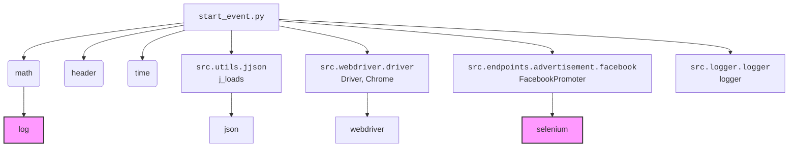
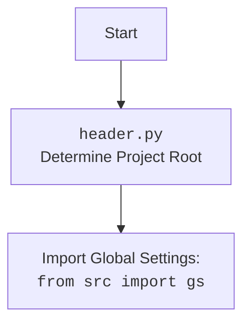

### **Системные инструкции для обработки кода проекта `hypotez`**

=========================================================================================

Описание функциональности и правил для генерации, анализа и улучшения кода. Направлено на обеспечение последовательного и читаемого стиля кодирования, соответствующего требованиям.

---

### **Основные принципы**

#### **1. Общие указания**:
- Соблюдай четкий и понятный стиль кодирования.
- Все изменения должны быть обоснованы и соответствовать установленным требованиям.

#### **2. Комментарии**:
- Используй `#` для внутренних комментариев.
- Документация всех функций, методов и классов должна следовать такому формату: 
    ```python
        def function(param: str, param1: Optional[str | dict | str] = None) -> dict | None:
            """ 
            Args:
                param (str): Описание параметра `param`.
                param1 (Optional[str | dict | str], optional): Описание параметра `param1`. По умолчанию `None`.
    
            Returns:
                dict | None: Описание возвращаемого значения. Возвращает словарь или `None`.
    
            Raises:
                SomeError: Описание ситуации, в которой возникает исключение `SomeError`.

            Ехаmple:
                >>> function('param', 'param1')
                {'param': 'param1'}
            """
    ```
- Комментарии и документация должны быть четкими, лаконичными и точными.

#### **3. Форматирование кода**:
- Используй одинарные кавычки. `a:str = 'value'`, `print('Hello World!')`;
- Добавляй пробелы вокруг операторов. Например, `x = 5`;
- Все параметры должны быть аннотированы типами. `def function(param: str, param1: Optional[str | dict | str] = None) -> dict | None:`;
- Не используй `Union`. Вместо этого используй `|`.

#### **4. Логирование**:
- Для логгирования Всегда Используй модуль `logger` из `src.logger.logger`.
- Ошибки должны логироваться с использованием `logger.error`.
Пример:
    ```python
        try:
            ...
        except Exception as ex:
            logger.error('Error while processing data', ех, exc_info=True)
    ```
#### **5 Не используй `Union[]` в коде. Вместо него используй `|`
Например:
```python
x: str | int ...
```


---

### **Основные требования**:

#### **1. Формат ответов в Markdown**:
- Все ответы должны быть выполнены в формате **Markdown**.

#### **2. Формат комментариев**:
- Используй указанный стиль для комментариев и документации в коде.
- Пример:

```python
from typing import Generator, Optional, List
from pathlib import Path


def read_text_file(
    file_path: str | Path,
    as_list: bool = False,
    extensions: Optional[List[str]] = None,
    chunk_size: int = 8192,
) -> Generator[str, None, None] | str | None:
    """
    Считывает содержимое файла (или файлов из каталога) с использованием генератора для экономии памяти.

    Args:
        file_path (str | Path): Путь к файлу или каталогу.
        as_list (bool): Если `True`, возвращает генератор строк.
        extensions (Optional[List[str]]): Список расширений файлов для чтения из каталога.
        chunk_size (int): Размер чанков для чтения файла в байтах.

    Returns:
        Generator[str, None, None] | str | None: Генератор строк, объединенная строка или `None` в случае ошибки.

    Raises:
        Exception: Если возникает ошибка при чтении файла.

    Example:
        >>> from pathlib import Path
        >>> file_path = Path('example.txt')
        >>> content = read_text_file(file_path)
        >>> if content:
        ...    print(f'File content: {content[:100]}...')
        File content: Example text...
    """
    ...
```
- Всегда делай подробные объяснения в комментариях. Избегай расплывчатых терминов, 
- таких как *«получить»* или *«делать»*. Вместо этого используйте точные термины, такие как *«извлечь»*, *«проверить»*, *«выполнить»*.
- Вместо: *«получаем»*, *«возвращаем»*, *«преобразовываем»* используй имя объекта *«функция получае»*, *«переменная возвращает»*, *«код преобразовывает»* 
- Комментарии должны непосредственно предшествовать описываемому блоку кода и объяснять его назначение.

#### **3. Пробелы вокруг операторов присваивания**:
- Всегда добавляйте пробелы вокруг оператора `=`, чтобы повысить читаемость.
- Примеры:
  - **Неправильно**: `x=5`
  - **Правильно**: `x = 5`

#### **4. Использование `j_loads` или `j_loads_ns`**:
- Для чтения JSON или конфигурационных файлов замените стандартное использование `open` и `json.load` на `j_loads` или `j_loads_ns`.
- Пример:

```python
# Неправильно:
with open('config.json', 'r', encoding='utf-8') as f:
    data = json.load(f)

# Правильно:
data = j_loads('config.json')
```

#### **5. Сохранение комментариев**:
- Все существующие комментарии, начинающиеся с `#`, должны быть сохранены без изменений в разделе «Улучшенный код».
- Если комментарий кажется устаревшим или неясным, не изменяйте его. Вместо этого отметьте его в разделе «Изменения».

#### **6. Обработка `...` в коде**:
- Оставляйте `...` как указатели в коде без изменений.
- Не документируйте строки с `...`.
```

#### **7. Аннотации**
Для всех переменных должны быть определены аннотации типа. 
Для всех функций все входные и выходные параметры аннотириваны
Для все параметров должны быть аннотации типа.


### **8. webdriver**
В коде используется webdriver. Он импртируется из модуля `webdriver` проекта `hypotez`
```python
from src.webdirver import Driver, Chrome, Firefox, Playwright, ...
driver = Driver(Firefox)

Пoсле чего может использоваться как

close_banner = {
  "attribute": null,
  "by": "XPATH",
  "selector": "//button[@id = 'closeXButton']",
  "if_list": "first",
  "use_mouse": false,
  "mandatory": false,
  "timeout": 0,
  "timeout_for_event": "presence_of_element_located",
  "event": "click()",
  "locator_description": "Закрываю pop-up окно, если оно не появилось - не страшно (`mandatory`:`false`)"
}

result = driver.execute_locator(close_banner)
```

### Анализ кода `start_event.py`

#### 1. Блок-схема

```mermaid
graph LR
    A[Инициализация Driver(Chrome)] --> B(Загрузка URL: "https://facebook.com");
    C{Цикл: while True};
    C --> D[Логирование: "waikig up"];
    D --> E[promoter.run_events];
    E --> F[Логирование: "going to sleep"];
    F --> G[time.sleep(7200)];
    G --> C;
    C -- KeyboardInterrupt --> H[Логирование: "Campaign promotion interrupted."];
```

**Примеры для каждого логического блока:**

*   **A**: `d = Driver(Chrome)` - Создает экземпляр веб-драйвера Chrome.
*   **B**: `d.get_url(r"https://facebook.com")` - Открывает указанный URL в браузере, управляемом драйвером.
*   **C**: `while True:` - Бесконечный цикл, который выполняется до прерывания.
*   **D**: `logger.debug(f"waikig up {time.strftime('%H:%M:%S')}", None, False)` - Логирует сообщение о пробуждении с текущим временем.
*   **E**: `promoter.run_events(events_names=events_names, group_file_paths=filenames)` - Запускает процесс продвижения событий в Facebook.
*   **F**: `logger.debug(f"going to sleep at {time.strftime('%H:%M:%S')}", None, False)` - Логирует сообщение о засыпании с текущим временем.
*   **G**: `time.sleep(7200)` - Приостанавливает выполнение программы на 7200 секунд (2 часа).
*   **H**: `logger.info("Campaign promotion interrupted.")` - Логирует сообщение о прерывании продвижения кампании при получении `KeyboardInterrupt`.

#### 2. Диаграмма



**Объяснение зависимостей:**

*   `math`: Используется для математических операций, в частности, импортируется функция `log`.
*   `header`: Предположительно, содержит общие настройки или функции, связанные с заголовками HTTP-запросов.
*   `time`: Используется для работы со временем, например, для логирования времени начала и окончания работы.
*   `src.utils.jjson.j_loads`: Функция для загрузки данных из JSON-файлов.
*   `src.webdriver.driver.Driver`, `Chrome`: Классы для управления веб-браузером Chrome через WebDriver.
*   `src.endpoints.advertisement.facebook.FacebookPromoter`: Класс, отвечающий за продвижение событий в Facebook.
*   `src.logger.logger.logger`: Объект для логирования сообщений о работе скрипта.

Дополнительный `mermaid` flowchart для `header.py`:



#### 3. Объяснение

**Импорты:**

*   `math`: Импортируется для использования математических функций, в частности `log`, хотя в данном коде она не используется.
*   `header`: Импортируется, вероятно, для каких-то общих настроек или функций. Без контекста содержимого `header.py` сложно сказать точнее.
*   `time`: Импортируется для работы со временем, например, для получения текущего времени для логирования и для приостановки выполнения скрипта.
*   `src.utils.jjson.j_loads`: Импортируется для загрузки данных из JSON-файлов. Это упрощает чтение конфигурационных файлов.
*   `src.webdriver.driver.Driver`, `Chrome`: Импортируются для управления браузером Chrome через WebDriver. Класс `Driver` предоставляет интерфейс для управления браузером, а `Chrome` - конкретная реализация для Chrome.
*   `src.endpoints.advertisement.facebook.FacebookPromoter`: Импортируется класс `FacebookPromoter`, который отвечает за продвижение событий в Facebook. Этот класс, вероятно, содержит методы для авторизации в Facebook, поиска групп и публикации событий.
*   `src.logger.logger.logger`: Импортируется объект `logger` для логирования сообщений о работе скрипта. Это позволяет отслеживать ход выполнения скрипта и выявлять ошибки.

**Классы:**

*   `FacebookPromoter`:
    *   **Роль**: Отвечает за продвижение событий в Facebook.
    *   **Атрибуты**: `d` (экземпляр `Driver`), `group_file_paths` (список путей к файлам с информацией о группах), `no_video` (флаг, указывающий, нужно ли избегать видео).
    *   **Методы**: `run_events` (запускает продвижение событий).
    *   **Взаимодействие**: Использует `Driver` для управления браузером и `logger` для логирования.
*   `Driver`:
    *   **Роль**: Абстракция для управления веб-драйвером.
    *   **Атрибуты**: (зависят от реализации).
    *   **Методы**: `get_url` (открывает URL в браузере), `execute_locator` (выполняет поиск элемента на странице).
    *   **Взаимодействие**: Используется `FacebookPromoter` для управления браузером.

**Функции:**

*   Отсутствуют функции, определенные в данном скрипте. Используются функции из импортированных модулей.

**Переменные:**

*   `d`: Экземпляр класса `Driver`, используется для управления браузером Chrome.
*   `filenames`: Список имен файлов, содержащих информацию о группах Facebook.
*   `excluded_filenames`: Список исключенных файлов.
*   `events_names`: Список имен событий для продвижения.
*   `promoter`: Экземпляр класса `FacebookPromoter`, используемый для продвижения событий в Facebook.

**Потенциальные ошибки и области для улучшения:**

*   Отсутствует обработка исключений при работе с файлами `filenames`. Если какой-то из файлов не будет найден, скрипт завершится с ошибкой.
*   Использование `while True` без возможности завершения цикла (кроме `KeyboardInterrupt`) может привести к нежелательному поведению.
*   Не используется функция `log` из модуля `math`, импорт можно убрать.
*   В блоке логирования `logger.debug` не указан тип передаваемой информации. Возможно, стоит добавить тип, например `str`.

**Взаимосвязи с другими частями проекта:**

*   Скрипт использует `src.webdriver.driver` для управления браузером, что позволяет автоматизировать действия в Facebook.
*   Он использует `src.endpoints.advertisement.facebook.FacebookPromoter` для выполнения конкретных задач по продвижению, таких как публикация событий в группах.
*   Он использует `src.logger.logger` для логирования, что помогает отслеживать и отлаживать процесс продвижения.
*   Он использует `src.utils.jjson.j_loads` для загрузки конфигурационных файлов, что упрощает настройку скрипта.