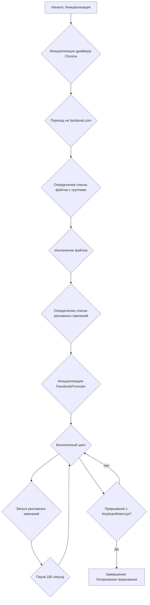
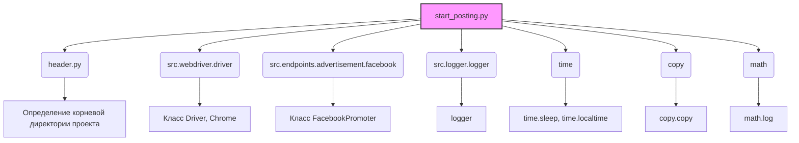
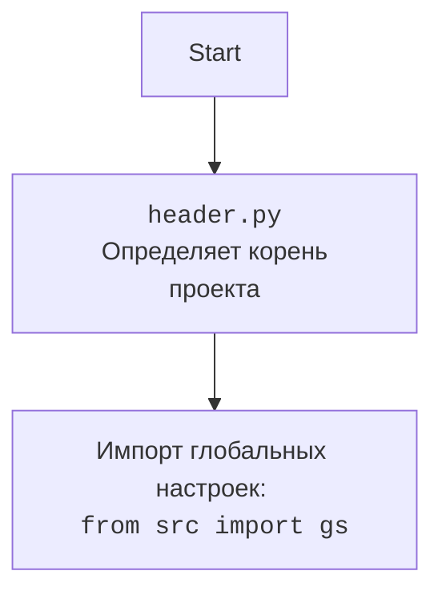

### **Системные инструкции для обработки кода проекта `hypotez`**

=========================================================================================

Описание функциональности и правил для генерации, анализа и улучшения кода. Направлено на обеспечение последовательного и читаемого стиля кодирования, соответствующего требованиям.

---

### **Основные принципы**

#### **1. Общие указания**:
- Соблюдай четкий и понятный стиль кодирования.
- Все изменения должны быть обоснованы и соответствовать установленным требованиям.

#### **2. Комментарии**:
- Используй `#` для внутренних комментариев.
- Документация всех функций, методов и классов должна следовать такому формату: 
    ```python
        def function(param: str, param1: Optional[str | dict | str] = None) -> dict | None:
            """ 
            Args:
                param (str): Описание параметра `param`.
                param1 (Optional[str | dict | str], optional): Описание параметра `param1`. По умолчанию `None`.
    
            Returns:
                dict | None: Описание возвращаемого значения. Возвращает словарь или `None`.
    
            Raises:
                SomeError: Описание ситуации, в которой возникает исключение `SomeError`.

            Ехаmple:
                >>> function('param', 'param1')
                {'param': 'param1'}
            """
    ```
- Комментарии и документация должны быть четкими, лаконичными и точными.

#### **3. Форматирование кода**:
- Используй одинарные кавычки. `a:str = 'value'`, `print('Hello World!')`;
- Добавляй пробелы вокруг операторов. Например, `x = 5`;
- Все параметры должны быть аннотированы типами. `def function(param: str, param1: Optional[str | dict | str] = None) -> dict | None:`;
- Не используй `Union`. Вместо этого используй `|`.

#### **4. Логирование**:
- Для логгирования Всегда Используй модуль `logger` из `src.logger.logger`.
- Ошибки должны логироваться с использованием `logger.error`.
Пример:
    ```python
        try:
            ...
        except Exception as ex:
            logger.error('Error while processing data', ех, exc_info=True)
    ```
#### **5 Не используй `Union[]` в коде. Вместо него используй `|`
Например:
```python
x: str | int ...
```


---

### **Основные требования**:

#### **1. Формат ответов в Markdown**:
- Все ответы должны быть выполнены в формате **Markdown**.

#### **2. Формат комментариев**:
- Используй указанный стиль для комментариев и документации в коде.
- Пример:

```python
from typing import Generator, Optional, List
from pathlib import Path


def read_text_file(
    file_path: str | Path,
    as_list: bool = False,
    extensions: Optional[List[str]] = None,
    chunk_size: int = 8192,
) -> Generator[str, None, None] | str | None:
    """
    Считывает содержимое файла (или файлов из каталога) с использованием генератора для экономии памяти.

    Args:
        file_path (str | Path): Путь к файлу или каталогу.
        as_list (bool): Если `True`, возвращает генератор строк.
        extensions (Optional[List[str]]): Список расширений файлов для чтения из каталога.
        chunk_size (int): Размер чанков для чтения файла в байтах.

    Returns:
        Generator[str, None, None] | str | None: Генератор строк, объединенная строка или `None` в случае ошибки.

    Raises:
        Exception: Если возникает ошибка при чтении файла.

    Example:
        >>> from pathlib import Path
        >>> file_path = Path('example.txt')
        >>> content = read_text_file(file_path)
        >>> if content:
        ...    print(f'File content: {content[:100]}...')
        File content: Example text...
    """
    ...
```
- Всегда делай подробные объяснения в комментариях. Избегай расплывчатых терминов, 
- таких как *«получить»* или *«делать»*. Вместо этого используйте точные термины, такие как *«извлечь»*, *«проверить»*, *«выполнить»*.
- Вместо: *«получаем»*, *«возвращаем»*, *«преобразовываем»* используй имя объекта *«функция получае»*, *«переменная возвращает»*, *«код преобразовывает»* 
- Комментарии должны непосредственно предшествовать описываемому блоку кода и объяснять его назначение.

#### **3. Пробелы вокруг операторов присваивания**:
- Всегда добавляйте пробелы вокруг оператора `=`, чтобы повысить читаемость.
- Примеры:
  - **Неправильно**: `x=5`
  - **Правильно**: `x = 5`

#### **4. Использование `j_loads` или `j_loads_ns`**:
- Для чтения JSON или конфигурационных файлов замените стандартное использование `open` и `json.load` на `j_loads` или `j_loads_ns`.
- Пример:

```python
# Неправильно:
with open('config.json', 'r', encoding='utf-8') as f:
    data = json.load(f)

# Правильно:
data = j_loads('config.json')
```

#### **5. Сохранение комментариев**:
- Все существующие комментарии, начинающиеся с `#`, должны быть сохранены без изменений в разделе «Улучшенный код».
- Если комментарий кажется устаревшим или неясным, не изменяйте его. Вместо этого отметьте его в разделе «Изменения».

#### **6. Обработка `...` в коде**:
- Оставляйте `...` как указатели в коде без изменений.
- Не документируйте строки с `...`.
```

#### **7. Аннотации**
Для всех переменных должны быть определены аннотации типа. 
Для всех функций все входные и выходные параметры аннотириваны
Для все параметров должны быть аннотации типа.


### **8. webdriver**
В коде используется webdriver. Он импртируется из модуля `webdriver` проекта `hypotez`
```python
from src.webdirver import Driver, Chrome, Firefox, Playwright, ...
driver = Driver(Firefox)

Пoсле чего может использоваться как

close_banner = {
  "attribute": null,
  "by": "XPATH",
  "selector": "//button[@id = 'closeXButton']",
  "if_list": "first",
  "use_mouse": false,
  "mandatory": false,
  "timeout": 0,
  "timeout_for_event": "presence_of_element_located",
  "event": "click()",
  "locator_description": "Закрываю pop-up окно, если оно не появилось - не страшно (`mandatory`:`false`)"
}

result = driver.execute_locator(close_banner)
```

## Анализ кода `start_posting.py`

### 1. Блок-схема



**Примеры для логических блоков:**

-   **B**: `d = Driver(Chrome)` - Создается экземпляр драйвера Chrome для управления браузером.
-   **C**: `d.get_url(r"https://facebook.com")` - Открывается сайт Facebook в браузере, управляемом драйвером.
-   **D**: `filenames:list[str] = ["usa.json", ...]` - Список JSON-файлов, содержащих информацию о группах Facebook для постинга.
-   **F**: `campaigns:list = ['brands', ...]` - Список названий рекламных кампаний.
-   **G**: `promoter:FacebookPromoter = FacebookPromoter(d, group_file_paths=filenames, no_video = True)` - Создается экземпляр класса `FacebookPromoter` с передачей драйвера, списка файлов и флага `no_video`.
-   **I**: `promoter.run_campaigns(campaigns = copy.copy(campaigns), group_file_paths = filenames)` - Запускаются рекламные кампании в группах Facebook.
-   **J**: `time.sleep(180)` - Приостановка выполнения скрипта на 180 секунд.
-   **L**: `logger.info("Campaign promotion interrupted.")` - В случае прерывания скрипта с клавиатуры, в лог записывается сообщение.

### 2. Диаграмма



**Объяснение зависимостей:**

*   `header.py`: Определяет корневую директорию проекта, что необходимо для правильной работы с путями к файлам.
*   `src.webdriver.driver`: Содержит классы для управления веб-браузером, такие как `Driver` и `Chrome`. Используется для автоматизации действий в браузере Facebook.
*   `src.endpoints.advertisement.facebook`: Содержит класс `FacebookPromoter`, который отвечает за запуск рекламных кампаний в Facebook.
*   `src.logger.logger`: Модуль для логирования событий и ошибок.
*   `time`: Используется для приостановки выполнения скрипта на заданное время.
*   `copy`: Используется для создания копии списка кампаний, чтобы избежать изменения исходного списка.
*    `math`: Используется для вычисления логарифмов (в данном коде напрямую не видно использования, но он импортирован).

Дополнительный блок `mermaid` для `header.py`:



### 3. Объяснение

**Импорты:**

*   `from math import log`: Импортируется функция `log` из модуля `math`.  В данном коде не используется.
*   `import header`: Импортируется модуль `header`, вероятно, содержащий общие функции или переменные.
*   `import time`: Импортируется модуль `time` для работы со временем, в частности, для приостановки выполнения скрипта (`time.sleep`).
*   `import copy`: Импортируется модуль `copy` для создания копий объектов. Используется для копирования списка кампаний.
*   `from src.webdriver.driver import Driver, Chrome`: Импортируются классы `Driver` и `Chrome` из модуля `src.webdriver.driver`. `Driver` представляет собой абстракцию для управления веб-браузером, а `Chrome` - конкретная реализация для браузера Chrome.
*   `from src.endpoints.advertisement.facebook import FacebookPromoter`: Импортируется класс `FacebookPromoter` из модуля `src.endpoints.advertisement.facebook`. Этот класс отвечает за запуск рекламных кампаний в Facebook.
*   `from src.logger.logger import logger`: Импортируется объект `logger` из модуля `src.logger.logger`. Используется для логирования событий и ошибок.

**Классы:**

*   `FacebookPromoter`: Класс, отвечающий за запуск рекламных кампаний в Facebook.
    *   Атрибуты: принимает драйвер веб-браузера, список файлов с группами Facebook и флаг `no_video`.
    *   Методы: `run_campaigns`.
    *   Взаимодействие: использует `Driver` для взаимодействия с Facebook, читает данные о группах из файлов, использует `logger` для логирования.
*   `Driver`: Класс, представляющий собой драйвер веб-браузера.
    *   Атрибуты: определяет тип браузера (в данном случае Chrome).
    *   Методы: `get_url`.
    *   Взаимодействие: управляет браузером, открывает страницы.

**Функции:**

*   `None`: в данном коде нет объявленных функций, но используются методы классов.
*   `time.sleep(seconds)`: Приостанавливает выполнение скрипта на указанное количество секунд.
*   `copy.copy(object)`: Создает поверхностную копию объекта.

**Переменные:**

*   `d: Driver`: Объект класса `Driver`, представляющий собой драйвер браузера Chrome.
*   `filenames: list[str]`: Список имен файлов, содержащих информацию о группах Facebook для размещения рекламы.
*   `excluded_filenames: list[str]`: Список исключенных файлов.
*   `campaigns: list`: Список названий рекламных кампаний.
*   `promoter: FacebookPromoter`: Объект класса `FacebookPromoter`, отвечающий за запуск рекламных кампаний.

**Потенциальные ошибки и области для улучшения:**

*   Отсутствие обработки исключений при чтении файлов JSON.
*   Жестко заданные пути к файлам. Рекомендуется использовать относительные пути или хранить пути в конфигурационном файле.
*   Отсутствие логирования ошибок при выполнении `promoter.run_campaigns`.
*   Не используется импортированная библиотека `math`. Необходимо либо использовать ее, либо удалить импорт.
*   В коде присуствует `...` как указатель отсутствия реализации. Необходимо реализовать эту часть или удалить.

**Взаимосвязи с другими частями проекта:**

*   Модуль `src.webdriver.driver` предоставляет интерфейс для управления браузером, который используется классом `FacebookPromoter`.
*   Модуль `src.endpoints.advertisement.facebook` содержит логику для запуска рекламных кампаний в Facebook.
*   Модуль `src.logger.logger` используется для логирования событий и ошибок, что позволяет отслеживать работу скрипта и выявлять проблемы.