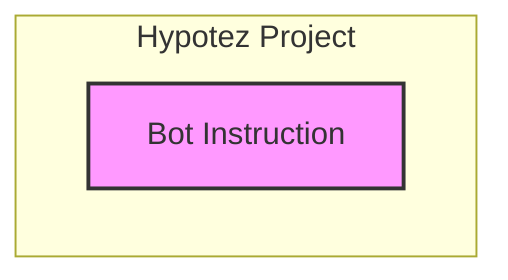

### **Анализ кода инструкции бота `hypotez`**

=========================================================================================

Этот анализ предназначен для подробного изучения функциональности инструкций бота, а также для предоставления блок-схемы, диаграммы зависимостей и детального объяснения каждой части кода.

---

### **1. Блок-схема**

```mermaid
flowchart LR
    A[Начало: Ожидание команды пользователя] --> B{Команда?};
    B -- Да --> C[Определение команды];
    B -- Нет --> A;

    C --> D{Команда "!hi"?};
    D -- Да --> E[Вывод приветствия];
    D -- Нет --> F{Команда "!train"?};

    F -- Да --> G[Тренировка модели];
    G --> H{Источник данных?};
    H -- Файл --> I[Чтение данных из файла];
    H -- Директория --> J[Чтение данных из директории];
    H -- Вложение --> K[Чтение данных из вложения];
    F -- Нет --> L{Команда "!test"?};

    L -- Да --> M[Тестирование модели];
    M --> N[Чтение тестовых данных];
    L -- Нет --> O{Команда "!archive"?};

    O -- Да --> P[Архивация файлов];
    P --> Q[Выбор директории для архивации];
    O -- Нет --> R{Команда "!select_dataset"?};
    
    R -- Да --> S[Выбор набора данных];
    S --> T[Указание директории и положительных примеров];
    R -- Нет --> U{Команда "!instruction"?};
    
    U -- Да --> V[Вывод инструкции];
    U -- Нет --> W[Неизвестная команда];
    W --> A;

    E --> A;
    I --> G;
    J --> G;
    K --> G;
    N --> M;
    Q --> P;
    T --> S;
    V --> A;
```

**Примеры логических блоков:**

*   **Приветствие:**
    ```
    !hi
    ```
    Бот отвечает приветствием пользователю.
*   **Обучение модели:**
    ```
    !train data.txt data_dir positive_label attachment.txt
    ```
    Бот начинает тренировку модели, используя данные из указанного файла, директории или вложения, и положительные примеры.
*   **Тестирование модели:**
    ```
    !test test_data.json
    ```
    Бот тестирует модель, используя данные из указанного JSON-файла.
*   **Архивация директории:**
    ```
    !archive backup_dir
    ```
    Бот архивирует файлы, находящиеся в указанной директории.
*   **Выбор датасета:**
    ```
    !select_dataset path/to/positive positive_label
    ```
    Бот выбирает датасет для обучения из указанной директории с положительными примерами.
*   **Вывод инструкции:**
    ```
    !instruction
    ```
    Бот выводит справку по доступным командам.

### **2. Диаграмма зависимостей**



**Объяснение диаграммы:**

*   `A[Bot Instruction]`: Представляет текущий модуль, отвечающий за анализ предоставленных команд.
*   Диаграмма показывает, что инструкции бота не зависят от внешних модулей и являются самодостаточными.

### **3. Объяснение**

Этот код представляет собой набор инструкций (команд), которые может понимать и выполнять бот. Каждая строка начинается с `!`, что указывает на команду, за которой следуют аргументы, необходимые для выполнения этой команды.

*   **Импорты:**
    *   В данном коде отсутствуют явные импорты. Это означает, что функциональность, описанная в инструкциях, либо встроена в самого бота, либо использует стандартные библиотеки.
*   **Классы:**
    *   В данном коде нет определения классов.
*   **Функции:**
    *   Инструкции определяют, какие функции должен выполнять бот в ответ на конкретные команды.
    *   Например, команда `!train` вызывает функцию тренировки модели.
*   **Переменные:**
    *   `data`, `data_dir`, `positive`, `attachment`, `test_data`, `directory`, `path_to_dir_positive` — переменные, передаваемые в команды для указания входных данных, директорий и т.д.
*   **Потенциальные ошибки и области для улучшения:**
    *   **Обработка ошибок:** Важно предусмотреть обработку ошибок при выполнении каждой команды. Например, если файл, указанный в команде `!train`, не существует, бот должен выдать соответствующее сообщение об ошибке.
    *   **Валидация входных данных:** Необходимо проверять входные данные на соответствие ожидаемым типам и форматам.
    *   **Безопасность:** Следует учитывать вопросы безопасности, особенно при работе с командами, позволяющими архивировать или выбирать файлы.

### **Взаимосвязь с другими частями проекта**

*   Этот код инструкций является частью подсистемы обработки команд бота. Он определяет, как бот реагирует на пользовательский ввод. Сами команды могут быть реализованы в других модулях проекта `hypotez`, например, в модулях машинного обучения или работы с файловой системой.