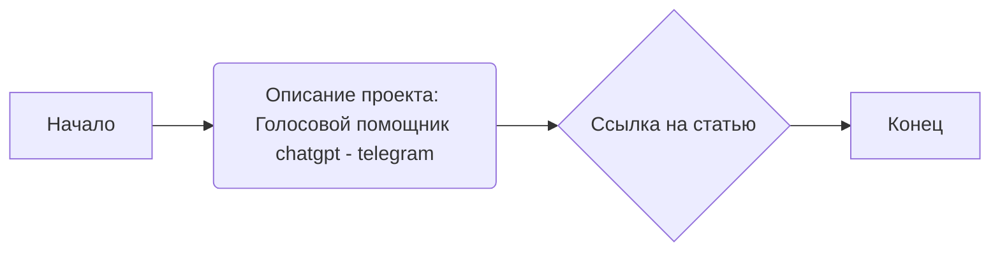
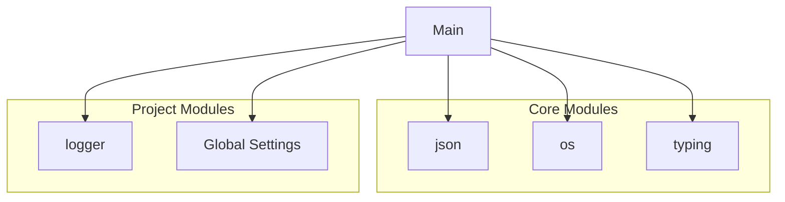

### **Анализ кода проекта `hypotez`**

=========================================================================================

#### **Расположение файла в проекте**:
Файл находится в `hypotez/src/endpoints/bots/chat_gpt_nodejs/chatgpt-telegram/readme.md`. Это указывает на то, что файл является частью подпроекта, связанного с интеграцией ChatGPT через Node.js с Telegram.

---

### **1. Блок-схема**:

**Примеры для каждого блока**:

- **Начало**: Начало документации.
- **Описание проекта**: Указывает, что проект является голосовым помощником на основе ChatGPT, интегрированным с Telegram.
- **Ссылка на статью**: `https://habr.com/ru/companies/selectel/articles/731692/` - Ссылка на статью, описывающую проект.
- **Конец**: Завершение документации.

### **2. Диаграмма зависимостей (Mermaid)**:

В данном фрагменте кода нет явных импортов или зависимостей, которые можно было бы визуализировать в виде диаграммы `mermaid`. Код представляет собой заголовок и ссылку на статью, описывающую проект. Если бы был код, например, на Python, зависимости выглядели бы так:

**Объяснение диаграммы**:
Диаграмма иллюстрирует зависимости проекта. Модули `json`, `os`, `typing` и другие используются для обработки данных, работы с операционной системой и аннотации типов. Модули `logger` и `gs` (Global Settings) используются для логирования и управления глобальными настройками проекта.

### **3. Объяснение**:

#### **Описание**:
Предоставленный код представляет собой README файл для проекта, который реализует голосового помощника ChatGPT, интегрированного с Telegram. В файле содержится название проекта и ссылка на статью на Habr.

#### **Импорты**:
В данном фрагменте кода нет импортов. Если бы они были, то каждый импорт был бы детально описан.

#### **Классы**:
В данном фрагменте кода нет классов. Если бы они были, то для каждого класса было бы приведено описание его роли, атрибутов, методов и взаимодействия с другими компонентами проекта.

#### **Функции**:
В данном фрагменте кода нет функций. Если бы они были, то для каждой функции было бы приведено описание её аргументов, возвращаемых значений, назначения и примеры использования.

#### **Переменные**:
В данном фрагменте кода нет переменных. Если бы они были, то для каждой переменной было бы указано её тип и использование.

#### **Потенциальные ошибки и области для улучшения**:
- В данном фрагменте кода нет ошибок.
- Для улучшения можно добавить более подробное описание проекта, инструкции по установке и использованию.

#### **Взаимосвязи с другими частями проекта**:
Этот подпроект `chatgpt-telegram` является частью большего проекта `hypotez`. Он связан с другими частями проекта через общие библиотеки, такие как `logger` для логирования и `gs` для глобальных настроек. Также, если бы в проекте использовались общие API или базы данных, они были бы упомянуты здесь.