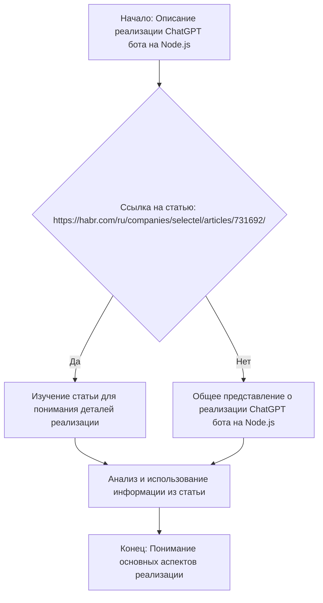
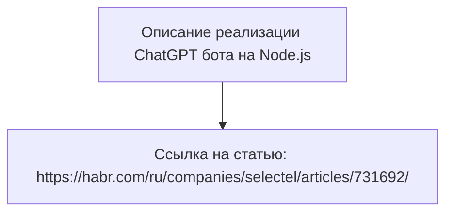

### Анализ кода проекта `hypotez`

=========================================================================================

#### Расположение файла в проекте:
`hypotez/src/endpoints/bots/chat_gpt_nodejs/readme.ru.md`

### 1. Блок-схема

**Описание рабочего процесса:**
Представленный код является текстовым описанием реализации ChatGPT бота с использованием Node.js, а также ссылкой на статью. Блок-схема будет отражать этот процесс.

**Примеры для каждого логического блока:**
- **A (Начало):** Пользователь начинает с чтения описания о реализации ChatGPT бота на Node.js.
- **B (Ссылка на статью):** Проверяется наличие ссылки на статью для получения подробной информации.
- **C (Изучение статьи):** Если ссылка есть, пользователь изучает статью для получения деталей реализации.
- **D (Общее представление):** Если ссылки нет, пользователь формирует общее представление на основе описания.
- **E (Анализ и использование):** Информация анализируется и используется для понимания основных аспектов реализации.
- **F (Конец):** Пользователь получает понимание основных аспектов реализации ChatGPT бота на Node.js.

### 2. Диаграмма

Представленный код не содержит импортов или зависимостей, поэтому диаграмма `mermaid` будет отображать только общую структуру документа.

**Объяснение:**
- **A**: Описание реализации ChatGPT бота на Node.js.
- **B**: Ссылка на статью, предоставляющая подробную информацию о реализации.

### 3. Объяснение

- **Описание**: Код представляет собой текстовое описание реализации ChatGPT бота с использованием Node.js и ссылку на статью.
- **Назначение**: Предоставить информацию о том, как реализовать ChatGPT бота на Node.js, и направить пользователя к дополнительным ресурсам (статье).

**Потенциальные области для улучшения:**
- Добавить больше деталей о конкретных шагах и технологиях, используемых в реализации.
- Предоставить примеры кода для лучшего понимания процесса.