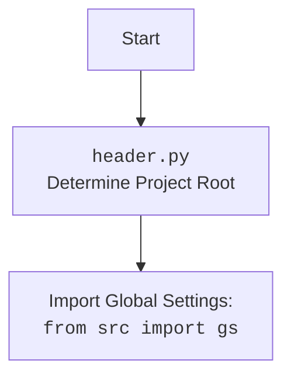

### **Системные инструкции для обработки кода проекта `hypotez`**

=========================================================================================

Описание функциональности и правил для генерации, анализа и улучшения кода. Направлено на обеспечение последовательного и читаемого стиля кодирования, соответствующего требованиям.

---

### **Основные принципы**

#### **1. Общие указания**:
- Соблюдай четкий и понятный стиль кодирования.
- Все изменения должны быть обоснованы и соответствовать установленным требованиям.

#### **2. Комментарии**:
- Используй `#` для внутренних комментариев.
- Документация всех функций, методов и классов должна следовать такому формату: 
    ```python
        def function(param: str, param1: Optional[str | dict | str] = None) -> dict | None:
            """ 
            Args:
                param (str): Описание параметра `param`.
                param1 (Optional[str | dict | str], optional): Описание параметра `param1`. По умолчанию `None`.
    
            Returns:
                dict | None: Описание возвращаемого значения. Возвращает словарь или `None`.
    
            Raises:
                SomeError: Описание ситуации, в которой возникает исключение `SomeError`.

            Ехаmple:
                >>> function('param', 'param1')
                {'param': 'param1'}
            """
    ```
- Комментарии и документация должны быть четкими, лаконичными и точными.

#### **3. Форматирование кода**:
- Используй одинарные кавычки. `a:str = 'value'`, `print('Hello World!')`;
- Добавляй пробелы вокруг операторов. Например, `x = 5`;
- Все параметры должны быть аннотированы типами. `def function(param: str, param1: Optional[str | dict | str] = None) -> dict | None:`;
- Не используй `Union`. Вместо этого используй `|`.

#### **4. Логирование**:
- Для логгирования Всегда Используй модуль `logger` из `src.logger.logger`.
- Ошибки должны логироваться с использованием `logger.error`.
Пример:
    ```python
        try:
            ...
        except Exception as ex:
            logger.error('Error while processing data', ех, exc_info=True)
    ```
#### **5 Не используй `Union[]` в коде. Вместо него используй `|`
Например:
```python
x: str | int ...
```


---

### **Основные требования**:

#### **1. Формат ответов в Markdown**:
- Все ответы должны быть выполнены в формате **Markdown**.

#### **2. Формат комментариев**:
- Используй указанный стиль для комментариев и документации в коде.
- Пример:

```python
from typing import Generator, Optional, List
from pathlib import Path


def read_text_file(
    file_path: str | Path,
    as_list: bool = False,
    extensions: Optional[List[str]] = None,
    chunk_size: int = 8192,
) -> Generator[str, None, None] | str | None:
    """
    Считывает содержимое файла (или файлов из каталога) с использованием генератора для экономии памяти.

    Args:
        file_path (str | Path): Путь к файлу или каталогу.
        as_list (bool): Если `True`, возвращает генератор строк.
        extensions (Optional[List[str]]): Список расширений файлов для чтения из каталога.
        chunk_size (int): Размер чанков для чтения файла в байтах.

    Returns:
        Generator[str, None, None] | str | None: Генератор строк, объединенная строка или `None` в случае ошибки.

    Raises:
        Exception: Если возникает ошибка при чтении файла.

    Example:
        >>> from pathlib import Path
        >>> file_path = Path('example.txt')
        >>> content = read_text_file(file_path)
        >>> if content:
        ...    print(f'File content: {content[:100]}...')
        File content: Example text...
    """
    ...
```
- Всегда делай подробные объяснения в комментариях. Избегай расплывчатых терминов, 
- таких как *«получить»* или *«делать»*. Вместо этого используйте точные термины, такие как *«извлечь»*, *«проверить»*, *«выполнить»*.
- Вместо: *«получаем»*, *«возвращаем»*, *«преобразовываем»* используй имя объекта *«функция получае»*, *«переменная возвращает»*, *«код преобразовывает»* 
- Комментарии должны непосредственно предшествовать описываемому блоку кода и объяснять его назначение.

#### **3. Пробелы вокруг операторов присваивания**:
- Всегда добавляйте пробелы вокруг оператора `=`, чтобы повысить читаемость.
- Примеры:
  - **Неправильно**: `x=5`
  - **Правильно**: `x = 5`

#### **4. Использование `j_loads` или `j_loads_ns`**:
- Для чтения JSON или конфигурационных файлов замените стандартное использование `open` и `json.load` на `j_loads` или `j_loads_ns`.
- Пример:

```python
# Неправильно:
with open('config.json', 'r', encoding='utf-8') as f:
    data = json.load(f)

# Правильно:
data = j_loads('config.json')
```

#### **5. Сохранение комментариев**:
- Все существующие комментарии, начинающиеся с `#`, должны быть сохранены без изменений в разделе «Улучшенный код».
- Если комментарий кажется устаревшим или неясным, не изменяйте его. Вместо этого отметьте его в разделе «Изменения».

#### **6. Обработка `...` в коде**:
- Оставляйте `...` как указатели в коде без изменений.
- Не документируйте строки с `...`.
```

#### **7. Аннотации**
Для всех переменных должны быть определены аннотации типа. 
Для всех функций все входные и выходные параметры аннотириваны
Для все параметров должны быть аннотации типа.


### **8. webdriver**
В коде используется webdriver. Он импртируется из модуля `webdriver` проекта `hypotez`
```python
from src.webdirver import Driver, Chrome, Firefox, Playwright, ...
driver = Driver(Firefox)

Пoсле чего может использоваться как

close_banner = {
  "attribute": null,
  "by": "XPATH",
  "selector": "//button[@id = 'closeXButton']",
  "if_list": "first",
  "use_mouse": false,
  "mandatory": false,
  "timeout": 0,
  "timeout_for_event": "presence_of_element_located",
  "event": "click()",
  "locator_description": "Закрываю pop-up окно, если оно не появилось - не страшно (`mandatory`:`false`)"
}

result = driver.execute_locator(close_banner)
```

## Анализ кода `telegram_bot_trainger.py`

### 1. Блок-схема

```mermaid
graph TD
    A[Start] --> B{Receive Telegram Update};
    B -- Command (/start, /help) --> C{CommandHandler};
    C -- /start --> D[start(update, context): Send greeting message];
    C -- /help --> E[help_command(update, context): Send help message];
    B -- Document --> F{MessageHandler (filters.Document.ALL)};
    F --> G[handle_document(update, context): Process document];
    G --> H[Download file];
    H --> I[Read file content];
    I --> J[model.send_message(content)];
    J --> K[Reply with response];
    B -- Text Message --> L{MessageHandler (filters.TEXT)};
    L --> M[handle_message(update, context): Process text message];
    M --> N[model.send_message(text)];
    N --> O[Reply with response];
    B -- Voice Message --> P{MessageHandler (filters.VOICE)};
    P --> Q[handle_voice(update, context): Process voice message];
    Q --> R[Recognize speech from voice];
    R --> S[model.send_message(recognized text)];
    S --> T[Reply with response];
    T --> U[text_to_speech(response)];
    U --> V[Reply with audio];
    D --> W[End];
    E --> W;
    K --> W;
    O --> W;
    V --> W;
```

**Примеры для каждого логического блока:**

*   **Receive Telegram Update (B):** Пользователь отправляет сообщение боту.
*   **CommandHandler (C):** Пользователь отправляет команду `/start`.
*   **start(update, context) (D):** Бот отправляет приветственное сообщение.
*   **MessageHandler (filters.TEXT) (L):** Пользователь отправляет текстовое сообщение "Привет!".
*   **handle_message(update, context) (M):** Бот получает текст "Привет!".
*   **model.send\_message(text) (N):** Модель обрабатывает текст "Привет!".
*   **Reply with response (O):** Бот отправляет ответ, например, "Здравствуйте! Как я могу вам помочь?".
*   **MessageHandler (filters.VOICE) (P):** Пользователь отправляет голосовое сообщение.
*   **handle\_voice(update, context) (Q):** Бот обрабатывает голосовое сообщение.
*   **Recognize speech from voice (R):** Голосовое сообщение преобразуется в текст.
*    **text\_to\_speech(response) (U):** Преобразование ответа модели в речь.
*   **Reply with audio (V):** Бот отправляет голосовое сообщение с ответом.
*   **MessageHandler (filters.Document.ALL) (F):** Пользователь отправляет файл.
*   **handle\_document(update, context) (G):** Бот обрабатывает отправленный файл.
*   **Download file (H):** Файл скачивается на сервер.
*   **Read file content (I):** Содержимое файла считывается.
*   **model.send\_message(content) (J):** Модель обучается на содержимом файла.
*   **Reply with response (K):** Бот отправляет ответ об успешном обучении.

### 2. Диаграмма

```mermaid
flowchart TD
    subgraph telegram
        Update
        CallbackContext
    end
    
    Start[Start Bot] --> ApplicationBuilder
    ApplicationBuilder --> Application
    Application --> CommandHandlerStart
    Application --> CommandHandlerHelp
    Application --> MessageHandlerText
    Application --> MessageHandlerVoice
    Application --> MessageHandlerDocument
    MessageHandlerText --> handle_message
    MessageHandlerVoice --> handle_voice
    MessageHandlerDocument --> handle_document
    CommandHandlerStart --> start
    CommandHandlerHelp --> help_command
    
    subgraph handlers
        start --> UpdateReplyText1[update.message.reply_text('Hello!')]
        help_command --> UpdateReplyText2[update.message.reply_text('Available commands...')]
        handle_message --> ModelSendMessageText[model.send_message(text_received)]
        ModelSendMessageText --> UpdateReplyText3[update.message.reply_text(response)]
        handle_voice --> VoiceGetFile[update.message.voice.get_file()]
        VoiceGetFile --> Recognizer[recognizer(audio_url=voice_file.file_path)]
        Recognizer --> ModelSendMessageVoice[model.send_message(message)]
        ModelSendMessageVoice --> UpdateReplyText4[update.message.reply_text(response)]
        UpdateReplyText4 --> TextToSpeech[text_to_speech(response)]
         TextToSpeech --> UpdateReplyAudio[update.message.reply_audio(audio=open(tts_file_path, 'rb'))]
        handle_document --> DocumentGetFile[update.message.document.get_file()]
        DocumentGetFile --> DownloadToDrive[file.download_to_drive()]
        DownloadToDrive --> ReadFile[open(tmp_file_path, 'r')]
        ReadFile --> ModelSendMessageFile[model.send_message(f"Обучение модели на следующем содержимом:{file_content}")]
        ModelSendMessageFile --> UpdateReplyText5[update.message.reply_text(response)]
    end
    
    subgraph ai_model
        Model
    end
    
    subgraph utils
        j_loads_ns
        j_dumps
        text_to_speech
        recognizer
    end
    
    Application --> RunPolling
```

#### Объяснение зависимостей:

*   **telegram**: `Update` и `CallbackContext` являются классами из библиотеки `python-telegram-bot` и используются для обработки входящих обновлений от Telegram.
*   **handlers**: Функции `start`, `help_command`, `handle_message`, `handle_voice` и `handle_document` обрабатывают различные типы входящих сообщений и команд.
*   **ai\_model**: `Model` - это класс из `src.ai.openai.model.training`, который отвечает за взаимодействие с моделью машинного обучения.
*   **utils**: `j_loads_ns` и `j_dumps` используются для работы с JSON, `text_to_speech` и `recognizer` используются для преобразования текста в речь и наоборот.



### 3. Объяснение

#### Импорты:

*   `pathlib.Path`: Используется для работы с путями к файлам и директориям.
*   `tempfile`: Используется для создания временных файлов и директорий.
*   `asyncio`: Используется для асинхронного программирования.
*   `telegram`: Основные классы для работы с Telegram API (`Update`, `ext.Application`, `ext.CommandHandler`, `ext.MessageHandler`, `ext.filters`, `ext.CallbackContext`).
*   `header`:  Предположительно, содержит общие настройки и функции для проекта `hypotez`.
*   `src.gs`:  Глобальные настройки проекта.
*   `src.ai.openai.model.training.Model`: Класс для взаимодействия с моделью OpenAI для обучения.
*   `src.utils.jjson.j_loads_ns`, `src.utils.jjson.j_dumps`: Функции для удобной работы с JSON, включая загрузку и сохранение.
*   `src.logger.logger.logger`: Объект логгера для записи информации о работе бота.
*   `speech_recognition as sr`: Библиотека для распознавания речи.
*   `requests`: Библиотека для выполнения HTTP-запросов, используется для скачивания файлов.
*   `pydub`: Библиотека для обработки аудиофайлов.
*   `gtts`: Библиотека для преобразования текста в речь.
*   `src.utils.convertors.tts.recognizer`, `src.utils.convertors.tts.text_to_speech`: Функции для распознавания речи и преобразования текста в речь.

#### Переменные:

*   `TELEGRAM_TOKEN`: Токен Telegram бота, полученный из глобальных настроек (`gs.credentials.telegram.bot_token`).
*   `model`: Экземпляр класса `Model` из `src.ai.openai.model.training`, используемый для отправки сообщений и обучения модели.

#### Функции:

*   `start(update: Update, context: CallbackContext) -> None`:
    *   Аргументы:
        *   `update (Update)`: Объект, представляющий входящее обновление от Telegram.
        *   `context (CallbackContext)`: Объект контекста, используемый для передачи информации между обработчиками.
    *   Возвращаемое значение: `None`.
    *   Назначение: Обрабатывает команду `/start`, отправляя приветственное сообщение пользователю.
    *   Пример: Когда пользователь отправляет команду `/start`, бот отвечает сообщением "Hello! I am your simple bot. Type /help to see available commands.".

*   `help_command(update: Update, context: CallbackContext) -> None`:
    *   Аргументы:
        *   `update (Update)`: Объект, представляющий входящее обновление от Telegram.
        *   `context (CallbackContext)`: Объект контекста, используемый для передачи информации между обработчиками.
    *   Возвращаемое значение: `None`.
    *   Назначение: Обрабатывает команду `/help`, отправляя сообщение со списком доступных команд.
    *   Пример: Когда пользователь отправляет команду `/help`, бот отвечает сообщением "Available commands:\n/start - Start the bot\n/help - Show this help message".

*   `handle_message(update: Update, context: CallbackContext) -> None`:
    *   Аргументы:
        *   `update (Update)`: Объект, представляющий входящее обновление от Telegram.
        *   `context (CallbackContext)`: Объект контекста, используемый для передачи информации между обработчиками.
    *   Возвращаемое значение: `None`.
    *   Назначение: Обрабатывает текстовые сообщения, отправляя их в модель и отправляя ответ пользователю.
    *   Пример: Когда пользователь отправляет сообщение "Привет!", бот отправляет это сообщение в модель, получает ответ и отправляет его пользователю.

*   `handle_voice(update: Update, context: CallbackContext) -> None`:
    *   Аргументы:
        *   `update (Update)`: Объект, представляющий входящее обновление от Telegram.
        *   `context (CallbackContext)`: Объект контекста, используемый для передачи информации между обработчиками.
    *   Возвращаемое значение: `None`.
    *   Назначение: Обрабатывает голосовые сообщения, распознает речь, отправляет текст в модель и отправляет голосовой ответ пользователю.
    *   Пример: Когда пользователь отправляет голосовое сообщение, бот преобразует его в текст, отправляет текст в модель, получает ответ, преобразует ответ в речь и отправляет голосовое сообщение пользователю.

*   `handle_document(update: Update, context: CallbackContext) -> None`:
    *   Аргументы:
        *   `update (Update)`: Объект, представляющий входящее обновление от Telegram.
        *   `context (CallbackContext)`: Объект контекста, используемый для передачи информации между обработчиками.
    *   Возвращаемое значение: `None`.
    *   Назначение: Обрабатывает документы (файлы), скачивает файл, считывает его содержимое, отправляет содержимое в модель для обучения и отправляет ответ пользователю.
    *   Пример: Когда пользователь отправляет текстовый файл, бот скачивает файл, считывает его содержимое, отправляет содержимое в модель для обучения и отправляет пользователю сообщение об успешном обучении.

*   `main() -> None`:
    *   Аргументы: Нет.
    *   Возвращаемое значение: `None`.
    *   Назначение: Инициализирует и запускает Telegram бота. Регистрирует обработчики команд и сообщений, а также запускает процесс получения обновлений от Telegram.

#### Классы:

*   `Model`:
    *   Роль: Взаимодействие с моделью OpenAI для обучения и получения ответов.
    *   Атрибуты: Зависит от реализации в `src.ai.openai.model.training`.
    *   Методы:
        *   `send_message(text)`: Отправляет текст в модель и получает ответ.

#### Потенциальные ошибки и области для улучшения:

1.  **Обработка ошибок**: В коде отсутствует явная обработка ошибок, например, при скачивании файлов, распознавании речи или взаимодействии с моделью. Необходимо добавить блоки `try...except` для обработки возможных исключений и логирования ошибок с использованием `logger.error`.
2.  **Временные файлы**: Временные файлы, созданные при обработке документов и голосовых сообщений, не удаляются после использования.  Необходимо добавить удаление временных файлов после завершения обработки.
3.  **Безопасность**: Необходимо убедиться, что токен Telegram бота (`TELEGRAM_TOKEN`) хранится в безопасном месте и не раскрывается в коде.
4.  **Обработка исключений**:  При скачивании файла может возникнуть исключение. Нужно добавить `try..except` блок.
5.  **Аннотации типов**:  Не у всех переменных есть аннотации типов.

#### Цепочка взаимосвязей с другими частями проекта:

*   Бот использует глобальные настройки из `src.gs` для получения токена Telegram.
*   Бот использует класс `Model` из `src.ai.openai.model.training` для взаимодействия с моделью OpenAI.
*   Бот использует функции `j_loads_ns` и `j_dumps` из `src.utils.jjson` для работы с JSON.
*   Бот использует функции `recognizer` и `text_to_speech` из `src.utils.convertors.tts` для преобразования речи в текст и наоборот.
*   Бот использует `logger` из `src.logger.logger` для логирования событий и ошибок.