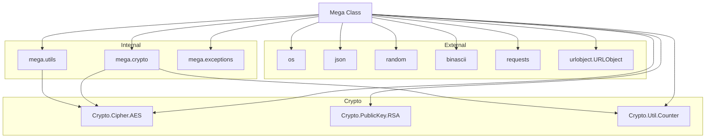

### **Системные инструкции для обработки кода проекта `hypotez`**

=========================================================================================

Описание функциональности и правил для генерации, анализа и улучшения кода. Направлено на обеспечение последовательного и читаемого стиля кодирования, соответствующего требованиям.

---

### **Основные принципы**

#### **1. Общие указания**:
- Соблюдай четкий и понятный стиль кодирования.
- Все изменения должны быть обоснованы и соответствовать установленным требованиям.

#### **2. Комментарии**:
- Используй `#` для внутренних комментариев.
- Документация всех функций, методов и классов должна следовать такому формату: 
    ```python
        def function(param: str, param1: Optional[str | dict | str] = None) -> dict | None:
            """ 
            Args:
                param (str): Описание параметра `param`.
                param1 (Optional[str | dict | str], optional): Описание параметра `param1`. По умолчанию `None`.
    
            Returns:
                dict | None: Описание возвращаемого значения. Возвращает словарь или `None`.
    
            Raises:
                SomeError: Описание ситуации, в которой возникает исключение `SomeError`.

            Ехаmple:
                >>> function('param', 'param1')
                {'param': 'param1'}
            """
    ```
- Комментарии и документация должны быть четкими, лаконичными и точными.

#### **3. Форматирование кода**:
- Используй одинарные кавычки. `a:str = 'value'`, `print('Hello World!')`;
- Добавляй пробелы вокруг операторов. Например, `x = 5`;
- Все параметры должны быть аннотированы типами. `def function(param: str, param1: Optional[str | dict | str] = None) -> dict | None:`;
- Не используй `Union`. Вместо этого используй `|`.

#### **4. Логирование**:
- Для логгирования Всегда Используй модуль `logger` из `src.logger.logger`.
- Ошибки должны логироваться с использованием `logger.error`.
Пример:
    ```python
        try:
            ...
        except Exception as ex:
            logger.error('Error while processing data', ех, exc_info=True)
    ```
#### **5 Не используй `Union[]` в коде. Вместо него используй `|`
Например:
```python
x: str | int ...
```


---

### **Основные требования**:

#### **1. Формат ответов в Markdown**:
- Все ответы должны быть выполнены в формате **Markdown**.

#### **2. Формат комментариев**:
- Используй указанный стиль для комментариев и документации в коде.
- Пример:

```python
from typing import Generator, Optional, List
from pathlib import Path


def read_text_file(
    file_path: str | Path,
    as_list: bool = False,
    extensions: Optional[List[str]] = None,
    chunk_size: int = 8192,
) -> Generator[str, None, None] | str | None:
    """
    Считывает содержимое файла (или файлов из каталога) с использованием генератора для экономии памяти.

    Args:
        file_path (str | Path): Путь к файлу или каталогу.
        as_list (bool): Если `True`, возвращает генератор строк.
        extensions (Optional[List[str]]): Список расширений файлов для чтения из каталога.
        chunk_size (int): Размер чанков для чтения файла в байтах.

    Returns:
        Generator[str, None, None] | str | None: Генератор строк, объединенная строка или `None` в случае ошибки.

    Raises:
        Exception: Если возникает ошибка при чтении файла.

    Example:
        >>> from pathlib import Path
        >>> file_path = Path('example.txt')
        >>> content = read_text_file(file_path)
        >>> if content:
        ...    print(f'File content: {content[:100]}...')
        File content: Example text...
    """
    ...
```
- Всегда делай подробные объяснения в комментариях. Избегай расплывчатых терминов, 
- таких как *«получить»* или *«делать»*. Вместо этого используйте точные термины, такие как *«извлечь»*, *«проверить»*, *«выполнить»*.
- Вместо: *«получаем»*, *«возвращаем»*, *«преобразовываем»* используй имя объекта *«функция получае»*, *«переменная возвращает»*, *«код преобразовывает»* 
- Комментарии должны непосредственно предшествовать описываемому блоку кода и объяснять его назначение.

#### **3. Пробелы вокруг операторов присваивания**:
- Всегда добавляйте пробелы вокруг оператора `=`, чтобы повысить читаемость.
- Примеры:
  - **Неправильно**: `x=5`
  - **Правильно**: `x = 5`

#### **4. Использование `j_loads` или `j_loads_ns`**:
- Для чтения JSON или конфигурационных файлов замените стандартное использование `open` и `json.load` на `j_loads` или `j_loads_ns`.
- Пример:

```python
# Неправильно:
with open('config.json', 'r', encoding='utf-8') as f:
    data = json.load(f)

# Правильно:
data = j_loads('config.json')
```

#### **5. Сохранение комментариев**:
- Все существующие комментарии, начинающиеся с `#`, должны быть сохранены без изменений в разделе «Улучшенный код».
- Если комментарий кажется устаревшим или неясным, не изменяйте его. Вместо этого отметьте его в разделе «Изменения».

#### **6. Обработка `...` в коде**:
- Оставляйте `...` как указатели в коде без изменений.
- Не документируйте строки с `...`.
```

#### **7. Аннотации**
Для всех переменных должны быть определены аннотации типа. 
Для всех функций все входные и выходные параметры аннотириваны
Для все параметров должны быть аннотации типа.


### **8. webdriver**
В коде используется webdriver. Он импртируется из модуля `webdriver` проекта `hypotez`
```python
from src.webdirver import Driver, Chrome, Firefox, Playwright, ...
driver = Driver(Firefox)

Пoсле чего может использоваться как

close_banner = {
  "attribute": null,
  "by": "XPATH",
  "selector": "//button[@id = 'closeXButton']",
  "if_list": "first",
  "use_mouse": false,
  "mandatory": false,
  "timeout": 0,
  "timeout_for_event": "presence_of_element_located",
  "event": "click()",
  "locator_description": "Закрываю pop-up окно, если оно не появилось - не страшно (`mandatory`:`false`)"
}

result = driver.execute_locator(close_banner)
```

## Анализ кода `hypotez/src/endpoints/bots/google_drive/mega/mega.py`

### 1. Блок-схема

```mermaid
graph TD
    A[Начало] --> B{Выбор действия: login_user, login_ephemeral, download_from_url, uploadfile};
    
    B -- login_user --> C[login_user(email: str, password: str): Аутентификация пользователя по email и паролю];
    C --> D{Успешная аутентификация?};
    D -- Да --> E[Сохранение master_key и sid];
    D -- Нет --> F[Выброс исключения MegaIncorrectPasswordExcetion];
    E --> G[Завершение login_user];
    F --> G[Завершение login_user];
    
    B -- login_ephemeral --> H[login_ephemeral(): Аутентификация пользователя с использованием эфемерных ключей];
    H --> I[Генерация случайных ключей];
    I --> J[Запрос к API для получения user_handle];
    J --> K[Сохранение master_key];
    K --> L[Завершение login_ephemeral];
    
    B -- download_from_url --> M[download_from_url(url: str): Загрузка файла по публичной ссылке];
    M --> N[Извлечение file_id и file_key из URL];
    N --> O[Вызов download_file с параметром public=True];
    O --> P[Завершение download_from_url];
    
    B -- uploadfile --> Q[uploadfile(filename: str, dst: str | None): Загрузка файла на MEGA];
    Q --> R{dst указан?};
    R -- Нет --> S[Получение root_id];
    R -- Да --> T[Использовать указанный dst];
    S --> T[Использовать root_id в качестве dst];
    T --> U[Открытие файла для чтения];
    U --> V[Запрос к API для получения URL загрузки];
    V --> W[Шифрование файла по частям];
    W --> X[Отправка частей файла на URL загрузки];
    X --> Y[Запрос к API для завершения загрузки];
    Y --> Z[Завершение uploadfile];

    P --> AA{public=True?};
    AA -- Да --> BB[API запрос с 'g': 1, 'p': file_id];
    AA -- Нет --> CC[API запрос с 'g': 1, 'n': file_id];
    BB --> DD[Расшифровка данных и сохранение файла];
    CC --> DD[Расшифровка данных и сохранение файла];
    DD --> EE[Возврат file_name];
    
    G --> End;
    L --> End;
    Z --> End;
    EE --> End;
    End[Конец];
```

### 2. Диаграмма



**Объяснение зависимостей:**

-   **Crypto:**
    *   `Crypto.Cipher.AES`: Используется для шифрования и расшифрования данных с использованием алгоритма AES.
    *   `Crypto.PublicKey.RSA`: Используется для работы с RSA ключами, в частности, для расшифрования RSA приватного ключа.
    *   `Crypto.Util.Counter`: Используется для создания счетчика для режима шифрования AES CTR.
-   **External:**
    *   `os`: Используется для работы с операционной системой, например, для получения размера файла и формирования путей.
    *   `json`: Используется для сериализации и десериализации данных в формате JSON при взаимодействии с API MEGA.
    *   `random`: Используется для генерации случайных чисел, например, для создания `seqno` и ключей.
    *   `binascii`: Используется для преобразования между двоичными и ASCII представлениями данных.
    *   `requests`: Используется для выполнения HTTP запросов к API MEGA.
    *   `urlobject.URLObject`: Используется для парсинга URL.
-   **Internal:**
    *   `mega.crypto`: Содержит функции для криптографических операций, специфичных для MEGA, такие как подготовка ключа, хеширование, шифрование и расшифрование ключей и атрибутов.
    *   `mega.utils`: Содержит утилиты для преобразования данных, такие как преобразование между a32 (массив 32-битных целых чисел) и строками, base64 кодирование/декодирование, и получение чанков данных.
    *   `mega.exceptions`: Определяет пользовательские исключения для обработки ошибок, связанных с API MEGA.
- `Mega Class`: Класс `Mega` зависит от всех вышеперечисленных модулей для выполнения различных операций, таких как аутентификация, скачивание и загрузка файлов.

### 3. Объяснение

#### Импорты:

*   `os`: Модуль для работы с операционной системой, используется для получения размера файла (`os.path.getsize`) и управления путями к файлам (`os.path.join`, `os.path.basename`).
*   `json`: Модуль для работы с JSON, используется для сериализации и десериализации данных при взаимодействии с API.
*   `random`: Модуль для генерации случайных чисел, используется для создания случайных идентификаторов (`seqno`) и ключей шифрования.
*   `binascii`: Модуль для работы с двоичными данными, используется для преобразования данных из шестнадцатеричного представления в двоичное и наоборот.
*   `requests`: Модуль для выполнения HTTP-запросов.
*   `urlobject.URLObject`: Модуль для работы с URL, используется для парсинга URL публичных ссылок MEGA.
*   `Crypto.Cipher.AES`: Модуль для шифрования и расшифрования данных с использованием алгоритма AES.
*   `Crypto.PublicKey.RSA`: Модуль для работы с RSA ключами.
*   `Crypto.Util.Counter`: Модуль для создания счетчика, используемого в режиме шифрования AES CTR.
*   `mega.crypto`: Модуль, содержащий функции для криптографических операций, специфичных для MEGA.
    *   `prepare_key`: Функция для подготовки ключа на основе пароля пользователя.
    *   `stringhash`: Функция для вычисления хеша строки.
    *   `encrypt_key`: Функция для шифрования ключа.
    *   `decrypt_key`: Функция для расшифрования ключа.
    *   `enc_attr`: Функция для шифрования атрибутов файла.
    *   `dec_attr`: Функция для расшифрования атрибутов файла.
    *   `aes_cbc_encrypt_a32`: Функция для шифрования массива 32-битных целых чисел с использованием AES в режиме CBC.
*   `mega.utils`: Модуль, содержащий утилиты для преобразования данных.
    *   `a32_to_str`: Функция для преобразования массива 32-битных целых чисел в строку.
    *   `str_to_a32`: Функция для преобразования строки в массив 32-битных целых чисел.
    *   `a32_to_base64`: Функция для преобразования массива 32-битных целых чисел в base64 строку.
    *   `base64_to_a32`: Функция для преобразования base64 строки в массив 32-битных целых чисел.
    *   `mpi2int`: Функция для преобразования многоразрядного целого числа (MPI) в целое число.
    *   `base64urlencode`: Функция для кодирования в base64 URL.
    *   `base64urldecode`: Функция для декодирования из base64 URL.
    *   `get_chunks`: Функция для получения чанков файла для загрузки/скачивания.
*   `mega.exceptions`: Модуль, содержащий определения исключений, используемых в модуле.
    *   `MegaRequestException`: Исключение, выбрасываемое при ошибке запроса к API.
    *   `MegaIncorrectPasswordExcetion`: Исключение, выбрасываемое при неверном пароле.

#### Классы:

*   `Mega`: Основной класс для взаимодействия с API MEGA.
    *   `__init__`: Конструктор класса. Инициализирует `seqno` случайным числом и `sid` в `None`.
        *   `self.seqno`: Идентификатор последовательности запросов.
        *   `self.sid`: Идентификатор сессии.
    *   `from_credentials`: Класс-метод для создания экземпляра класса `Mega` с использованием email и пароля.
    *   `from_ephemeral`: Класс-метод для создания экземпляра класса `Mega` с использованием эфемерной сессии.
    *   `api_req`: Метод для выполнения запросов к API MEGA.
        *   `data`: Данные запроса.
        *   `params`: Параметры запроса, включающие идентификатор запроса (`id`) и идентификатор сессии (`sid`), если он существует.
        *   Возвращает JSON-ответ от API.
    *   `login_user`: Метод для аутентификации пользователя по email и паролю.
        *   `email`: Email пользователя.
        *   `password`: Пароль пользователя.
        *   Подготавливает ключ пароля, вычисляет хеш email и выполняет запрос к API.
    *   `login_ephemeral`: Метод для аутентификации пользователя с использованием эфемерных ключей.
        *   Генерирует случайные ключи и выполняет запрос к API.
    *   `_login_common`: Общий метод для обработки ответа от API после аутентификации.
        *   `res`: Ответ от API.
        *   `password`: Ключ пароля.
        *   Расшифровывает мастер-ключ, устанавливает идентификатор сессии (`sid`).
    *   `get_files`: Метод для получения списка файлов и папок в аккаунте MEGA.
        *   Выполняет запрос к API и обрабатывает полученные данные.
        *   Расшифровывает ключи и атрибуты файлов и папок.
    *   `download_from_url`: Метод для скачивания файла по публичной ссылке MEGA.
        *   `url`: URL публичной ссылки.
        *   Извлекает `file_id` и `file_key` из URL и вызывает метод `download_file`.
    *   `download_file`: Метод для скачивания файла.
        *   `file_id`: Идентификатор файла.
        *   `file_key`: Ключ файла.
        *   `public`: Флаг, указывающий, является ли файл публичным.
        *   `store_path`: Путь для сохранения скачанного файла.
        *   Выполняет запрос к API для получения информации о файле, расшифровывает атрибуты файла, скачивает файл по частям, расшифровывает каждую часть и записывает в выходной файл.
        *   Проверяет целостность файла с использованием MAC (Message Authentication Code).
    *   `get_public_url`: Метод для получения публичной ссылки на файл.
        *   `file_id`: Идентификатор файла.
        *   `file_key`: Ключ файла.
        *   Выполняет запрос к API и формирует публичную ссылку.
    *   `uploadfile`: Метод для загрузки файла на MEGA.
        *   `filename`: Имя файла для загрузки.
        *   `dst`: Идентификатор целевой папки (опционально).
        *   Открывает файл, получает размер файла, выполняет запрос к API для получения URL загрузки, шифрует файл по частям и отправляет на URL загрузки.
        *   Создает метаданные файла, шифрует атрибуты и ключ файла, и выполняет запрос к API для завершения загрузки.

#### Функции:

Функции описаны в разделе "Классы" и "Импорты", так как они являются методами класса `Mega` или импортируются из других модулей.

#### Переменные:

*   `self.seqno`: Идентификатор последовательности запросов (целое число).
*   `self.sid`: Идентификатор сессии (строка).
*   `self.master_key`: Мастер-ключ пользователя (массив 32-битных целых чисел).
*   `self.rsa_priv_key`: Приватный ключ RSA (массив целых чисел).
*   `self.root_id`: Идентификатор корневой папки ("Cloud Drive").
*   `self.inbox_id`: Идентификатор папки "Inbox".
*   `self.trashbin_id`: Идентификатор корзины.

#### Потенциальные ошибки и области для улучшения:

*   **Обработка ошибок**: В коде присутствует обработка исключений `MegaRequestException` и `MegaIncorrectPasswordExcetion`, но можно добавить больше обработки исключений для других потенциальных ошибок, таких как ошибки сети, ошибки файловой системы и т.д.
*   **Логирование**: В коде отсутствует логирование. Добавление логирования поможет отслеживать ход выполнения программы и выявлять ошибки.
*   **Безопасность**: Следует обратить внимание на хранение ключей и паролей в памяти. Возможно, следует использовать более безопасные методы хранения, такие как шифрование ключей в памяти.
*   **Асинхронность**: Для повышения производительности можно использовать асинхронные запросы к API.

#### Взаимосвязи с другими частями проекта:

*   Этот модуль предназначен для взаимодействия с сервисом MEGA.
*   Он может использоваться в других частях проекта, где требуется загрузка или скачивание файлов из MEGA.
*   Например, он может быть использован в ботах для автоматической загрузки файлов на MEGA или для скачивания файлов из MEGA.