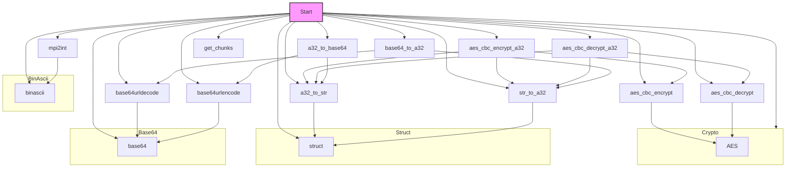

### **Системные инструкции для обработки кода проекта `hypotez`**

=========================================================================================

Описание функциональности и правил для генерации, анализа и улучшения кода. Направлено на обеспечение последовательного и читаемого стиля кодирования, соответствующего требованиям.

---

### **Основные принципы**

#### **1. Общие указания**:
- Соблюдай четкий и понятный стиль кодирования.
- Все изменения должны быть обоснованы и соответствовать установленным требованиям.

#### **2. Комментарии**:
- Используй `#` для внутренних комментариев.
- Документация всех функций, методов и классов должна следовать такому формату: 
    ```python
        def function(param: str, param1: Optional[str | dict | str] = None) -> dict | None:
            """ 
            Args:
                param (str): Описание параметра `param`.
                param1 (Optional[str | dict | str], optional): Описание параметра `param1`. По умолчанию `None`.
    
            Returns:
                dict | None: Описание возвращаемого значения. Возвращает словарь или `None`.
    
            Raises:
                SomeError: Описание ситуации, в которой возникает исключение `SomeError`.

            Ехаmple:
                >>> function('param', 'param1')
                {'param': 'param1'}
            """
    ```
- Комментарии и документация должны быть четкими, лаконичными и точными.

#### **3. Форматирование кода**:
- Используй одинарные кавычки. `a:str = 'value'`, `print('Hello World!')`;
- Добавляй пробелы вокруг операторов. Например, `x = 5`;
- Все параметры должны быть аннотированы типами. `def function(param: str, param1: Optional[str | dict | str] = None) -> dict | None:`;
- Не используй `Union`. Вместо этого используй `|`.

#### **4. Логирование**:
- Для логгирования Всегда Используй модуль `logger` из `src.logger.logger`.
- Ошибки должны логироваться с использованием `logger.error`.
Пример:
    ```python
        try:
            ...
        except Exception as ex:
            logger.error('Error while processing data', ех, exc_info=True)
    ```
#### **5 Не используй `Union[]` в коде. Вместо него используй `|`
Например:
```python
x: str | int ...
```


---

### **Основные требования**:

#### **1. Формат ответов в Markdown**:
- Все ответы должны быть выполнены в формате **Markdown**.

#### **2. Формат комментариев**:
- Используй указанный стиль для комментариев и документации в коде.
- Пример:

```python
from typing import Generator, Optional, List
from pathlib import Path


def read_text_file(
    file_path: str | Path,
    as_list: bool = False,
    extensions: Optional[List[str]] = None,
    chunk_size: int = 8192,
) -> Generator[str, None, None] | str | None:
    """
    Считывает содержимое файла (или файлов из каталога) с использованием генератора для экономии памяти.

    Args:
        file_path (str | Path): Путь к файлу или каталогу.
        as_list (bool): Если `True`, возвращает генератор строк.
        extensions (Optional[List[str]]): Список расширений файлов для чтения из каталога.
        chunk_size (int): Размер чанков для чтения файла в байтах.

    Returns:
        Generator[str, None, None] | str | None: Генератор строк, объединенная строка или `None` в случае ошибки.

    Raises:
        Exception: Если возникает ошибка при чтении файла.

    Example:
        >>> from pathlib import Path
        >>> file_path = Path('example.txt')
        >>> content = read_text_file(file_path)
        >>> if content:
        ...    print(f'File content: {content[:100]}...')
        File content: Example text...
    """
    ...
```
- Всегда делай подробные объяснения в комментариях. Избегай расплывчатых терминов, 
- таких как *«получить»* или *«делать»*. Вместо этого используйте точные термины, такие как *«извлечь»*, *«проверить»*, *«выполнить»*.
- Вместо: *«получаем»*, *«возвращаем»*, *«преобразовываем»* используй имя объекта *«функция получае»*, *«переменная возвращает»*, *«код преобразовывает»* 
- Комментарии должны непосредственно предшествовать описываемому блоку кода и объяснять его назначение.

#### **3. Пробелы вокруг операторов присваивания**:
- Всегда добавляйте пробелы вокруг оператора `=`, чтобы повысить читаемость.
- Примеры:
  - **Неправильно**: `x=5`
  - **Правильно**: `x = 5`

#### **4. Использование `j_loads` или `j_loads_ns`**:
- Для чтения JSON или конфигурационных файлов замените стандартное использование `open` и `json.load` на `j_loads` или `j_loads_ns`.
- Пример:

```python
# Неправильно:
with open('config.json', 'r', encoding='utf-8') as f:
    data = json.load(f)

# Правильно:
data = j_loads('config.json')
```

#### **5. Сохранение комментариев**:
- Все существующие комментарии, начинающиеся с `#`, должны быть сохранены без изменений в разделе «Улучшенный код».
- Если комментарий кажется устаревшим или неясным, не изменяйте его. Вместо этого отметьте его в разделе «Изменения».

#### **6. Обработка `...` в коде**:
- Оставляйте `...` как указатели в коде без изменений.
- Не документируйте строки с `...`.
```

#### **7. Аннотации**
Для всех переменных должны быть определены аннотации типа. 
Для всех функций все входные и выходные параметры аннотириваны
Для все параметров должны быть аннотации типа.


### **8. webdriver**
В коде используется webdriver. Он импртируется из модуля `webdriver` проекта `hypotez`
```python
from src.webdirver import Driver, Chrome, Firefox, Playwright, ...
driver = Driver(Firefox)

Пoсле чего может использоваться как

close_banner = {
  "attribute": null,
  "by": "XPATH",
  "selector": "//button[@id = 'closeXButton']",
  "if_list": "first",
  "use_mouse": false,
  "mandatory": false,
  "timeout": 0,
  "timeout_for_event": "presence_of_element_located",
  "event": "click()",
  "locator_description": "Закрываю pop-up окно, если оно не появилось - не страшно (`mandatory`:`false`)"
}

result = driver.execute_locator(close_banner)
```

## Анализ кода `hypotez/src/endpoints/bots/google_drive/mega/utils.py`

### 1. Блок-схема

```mermaid
graph TD
    A[Начало] --> B{Функция a32_to_str(a)};
    B --> C{Преобразует список 32-битных целых чисел в строку байтов.};
    C --> D[Пример: a32_to_str([1, 2, 3]) -> b'\\x00\\x00\\x00\\x01\\x00\\x00\\x00\\x02\\x00\\x00\\x00\\x03'];
    D --> E{Функция aes_cbc_encrypt(data, key)};
    E --> F{Шифрует данные с использованием AES в режиме CBC с заданным ключом.};
    F --> G[Пример: aes_cbc_encrypt(b'test data', b'16_byte_key_12') -> b'encrypted_data'];
    G --> H{Функция aes_cbc_encrypt_a32(data, key)};
    H --> I{Шифрует данные (представленные в виде списка 32-битных целых чисел) с использованием AES в режиме CBC.};
    I --> J[Пример: aes_cbc_encrypt_a32([1, 2, 3], [4, 5, 6]) -> (список 32-битных целых чисел)];
    J --> K{Функция str_to_a32(b)};
    K --> L{Преобразует строку байтов в список 32-битных целых чисел. Добавляет padding, если длина строки не кратна 4.};
    L --> M[Пример: str_to_a32(b'test') -> (1953719668,)];
    M --> N{Функция mpi2int(s)};
    N --> O{Преобразует строку, содержащую большое целое число, в целое число.};
    O --> P[Пример: mpi2int(b'\\x00\\x02\\x01\\x00') -> 256];
    P --> Q{Функция aes_cbc_decrypt(data, key)};
    Q --> R{Расшифровывает данные, зашифрованные AES в режиме CBC, с использованием заданного ключа.};
    R --> S[Пример: aes_cbc_decrypt(b'encrypted_data', b'16_byte_key_12') -> b'test data'];
    S --> T{Функция aes_cbc_decrypt_a32(data, key)};
    T --> U{Расшифровывает данные (представленные в виде списка 32-битных целых чисел), зашифрованные AES в режиме CBC.};
    U --> V[Пример: aes_cbc_decrypt_a32([1, 2, 3], [4, 5, 6]) -> (список 32-битных целых чисел)];
    V --> W{Функция base64urldecode(data)};
    W --> X{Декодирует строку из base64url формата в обычную base64. Добавляет padding, если необходимо.};
    X --> Y[Пример: base64urldecode('YTBi') -> b'a0b'];
    Y --> Z{Функция base64_to_a32(s)};
    Z --> AA{Декодирует строку из base64url формата и преобразует её в список 32-битных целых чисел.};
    AA --> BB[Пример: base64_to_a32('YTBi') -> (2816978432,)];
    BB --> CC{Функция base64urlencode(data)};
    CC --> DD{Кодирует строку байтов в base64url формат.};
    DD --> EE[Пример: base64urlencode(b'test') -> 'dGVzdA'];
    EE --> FF{Функция a32_to_base64(a)};
    FF --> GG{Преобразует список 32-битных целых чисел в строку в формате base64url.};
    GG --> HH[Пример: a32_to_base64([16843009]) -> 'AQEBAQ'];
    HH --> II{Функция get_chunks(size)};
    II --> JJ{Разбивает размер файла на части (chunks) для скачивания. Возвращает словарь, где ключ - начало чанка, значение - его размер.};
    JJ --> KK[Пример: get_chunks(524288) -> {0: 131072, 131072: 393216}];
    KK --> End[Конец];
```

### 2. Диаграмма



**Объяснение зависимостей:**

-   `base64`: Используется для кодирования и декодирования данных в формате Base64. Функции `base64urldecode`, `base64_to_a32`, `base64urlencode` зависят от этого модуля.
-   `struct`: Используется для упаковки и распаковки данных между строками байтов и 32-битными целыми числами. Функции `a32_to_str` и `str_to_a32` зависят от этого модуля.
-   `binascii`: Используется для преобразования между двоичными и ASCII представлениями двоичных данных. Функция `mpi2int` зависит от этого модуля.
-   `Crypto.Cipher.AES`: Используется для шифрования и расшифрования данных с использованием алгоритма AES. Функции `aes_cbc_encrypt` и `aes_cbc_decrypt` зависят от этого модуля.

### 3. Объяснение

**Импорты:**

*   `base64`: Этот модуль используется для кодирования и декодирования данных в формат Base64, который часто применяется для передачи двоичных данных в текстовом виде. В данном коде он используется для кодирования и декодирования URL-safe Base64.
*   `struct`: Этот модуль используется для преобразования между строками байтов и различными типами данных Python, такими как целые числа. Он необходим для преобразования 32-битных целых чисел в строки байтов и обратно.
*   `binascii`: Этот модуль содержит функции для преобразования между двоичными данными и различными представлениями ASCII. В данном коде он используется для преобразования больших целых чисел в шестнадцатеричный формат.
*   `Crypto.Cipher.AES`: Этот модуль из библиотеки PyCryptodome предоставляет функциональность для шифрования и расшифровки данных с использованием алгоритма AES (Advanced Encryption Standard). AES является широко используемым симметричным алгоритмом шифрования.

**Функции:**

*   `a32_to_str(a: list[int]) -> bytes`:
    *   Аргументы:
        *   `a`: Список 32-битных целых чисел.
    *   Возвращаемое значение:
        *   Строка байтов, полученная из списка целых чисел.
    *   Назначение: Преобразует список 32-битных целых чисел в строку байтов, используя модуль `struct` для упаковки каждого целого числа в 4 байта.
    *   Пример: `a32_to_str([1, 2, 3])` возвращает `b'\x00\x00\x00\x01\x00\x00\x00\x02\x00\x00\x00\x03'`
*   `aes_cbc_encrypt(data: bytes, key: bytes) -> bytes`:
    *   Аргументы:
        *   `data`: Строка байтов, которую необходимо зашифровать.
        *   `key`: Ключ шифрования (строка байтов).
    *   Возвращаемое значение:
        *   Зашифрованная строка байтов.
    *   Назначение: Шифрует данные с использованием алгоритма AES в режиме CBC (Cipher Block Chaining) с заданным ключом. Использует `Crypto.Cipher.AES` для выполнения шифрования.
*   `aes_cbc_encrypt_a32(data: list[int], key: list[int]) -> tuple`:
    *   Аргументы:
        *   `data`: Список 32-битных целых чисел, представляющих данные для шифрования.
        *   `key`: Список 32-битных целых чисел, представляющих ключ шифрования.
    *   Возвращаемое значение:
        *   Кортеж 32-битных целых чисел, представляющих зашифрованные данные.
    *   Назначение: Шифрует данные, представленные в виде списка 32-битных целых чисел, используя AES в режиме CBC. Сначала преобразует данные и ключ в строки байтов, затем шифрует, и, наконец, преобразует зашифрованную строку обратно в список 32-битных целых чисел.
*   `str_to_a32(b: bytes) -> tuple[int]`:
    *   Аргументы:
        *   `b`: Строка байтов, которую необходимо преобразовать.
    *   Возвращаемое значение:
        *   Кортеж 32-битных целых чисел, полученный из строки байтов.
    *   Назначение: Преобразует строку байтов в список 32-битных целых чисел. Добавляет padding (заполнение нулями), если длина строки не кратна 4, чтобы обеспечить правильное преобразование.
*   `mpi2int(s: bytes) -> int`:
    *   Аргументы:
        *   `s`: Строка байтов, содержащая большое целое число в формате MPI (Multi-Precision Integer).
    *   Возвращаемое значение:
        *   Целое число, полученное из строки байтов.
    *   Назначение: Преобразует строку байтов, содержащую большое целое число в формате MPI, в целое число. Удаляет первые два байта (обычно содержащие информацию о длине) и преобразует оставшуюся часть строки из шестнадцатеричного представления в целое число.
*   `aes_cbc_decrypt(data: bytes, key: bytes) -> bytes`:
    *   Аргументы:
        *   `data`: Строка байтов, которую необходимо расшифровать.
        *   `key`: Ключ расшифрования (строка байтов).
    *   Возвращаемое значение:
        *   Расшифрованная строка байтов.
    *   Назначение: Расшифровывает данные, зашифрованные AES в режиме CBC, с использованием заданного ключа.
*   `aes_cbc_decrypt_a32(data: list[int], key: list[int]) -> tuple[int]`:
    *   Аргументы:
        *   `data`: Список 32-битных целых чисел, представляющих зашифрованные данные.
        *   `key`: Список 32-битных целых чисел, представляющих ключ расшифрования.
    *   Возвращаемое значение:
        *   Кортеж 32-битных целых чисел, представляющих расшифрованные данные.
    *   Назначение: Расшифровывает данные, представленные в виде списка 32-битных целых чисел, используя AES в режиме CBC.
*   `base64urldecode(data: str) -> bytes`:
    *   Аргументы:
        *   `data`: Строка в формате base64url.
    *   Возвращаемое значение:
        *   Декодированная строка байтов.
    *   Назначение: Декодирует строку из base64url формата в обычную base64. Сначала добавляет padding, если необходимо, а затем заменяет символы, чтобы соответствовать стандартному формату Base64.
*   `base64_to_a32(s: str) -> tuple[int]`:
    *   Аргументы:
        *   `s`: Строка в формате base64url.
    *   Возвращаемое значение:
        *   Кортеж 32-битных целых чисел, полученный из декодированной строки.
    *   Назначение: Декодирует строку из base64url формата и преобразует её в список 32-битных целых чисел.
*   `base64urlencode(data: bytes) -> str`:
    *   Аргументы:
        *   `data`: Строка байтов, которую необходимо закодировать.
    *   Возвращаемое значение:
        *   Строка в формате base64url.
    *   Назначение: Кодирует строку байтов в base64url формат. Сначала кодирует данные в Base64, а затем заменяет символы, чтобы соответствовать формату base64url.
*   `a32_to_base64(a: list[int]) -> str`:
    *   Аргументы:
        *   `a`: Список 32-битных целых чисел.
    *   Возвращаемое значение:
        *   Строка в формате base64url, полученная из списка целых чисел.
    *   Назначение: Преобразует список 32-битных целых чисел в строку в формате base64url.
*   `get_chunks(size: int) -> dict[int, int]`:
    *   Аргументы:
        *   `size`: Размер файла (в байтах), который необходимо разбить на части.
    *   Возвращаемое значение:
        *   Словарь, где ключ - это начальная позиция чанка, а значение - его размер.
    *   Назначение: Разбивает размер файла на части (chunks) для скачивания. Возвращает словарь, где ключ - начало чанка, значение - его размер. Размеры чанков выбираются таким образом, чтобы обеспечить эффективную загрузку файла.

**Переменные:**

В данном коде нет глобальных переменных. Все переменные используются внутри функций.

**Потенциальные ошибки и области для улучшения:**

*   Код содержит небезопасное использование фиксированного IV (Initialization Vector) `\0` * 16 для AES в режиме CBC. Это может сделать шифрование уязвимым для определенных типов атак. Рекомендуется использовать случайный IV для каждого шифрования.
*   В функции `str_to_a32` предполагается, что входная строка использует кодировку UTF-8. Это может быть неверно для всех случаев. Лучше явно указывать кодировку или позволить пользователю указывать её.
*   Функция `get_chunks` использует эвристический подход для определения размеров чанков. Этот подход может быть неоптимальным для всех размеров файлов. Рассмотрите возможность использования более адаптивного алгоритма.

**Взаимосвязь с другими частями проекта:**

Этот модуль, вероятно, используется для обработки данных, связанных с сервисом Mega, так как он включает в себя функции шифрования, кодирования и разбиения данных на части. Он может быть частью более крупной системы, которая взаимодействует с API Mega для загрузки и скачивания файлов. Функции шифрования и кодирования используются для защиты данных при передаче, а функция разбиения на части используется для эффективной загрузки больших файлов.