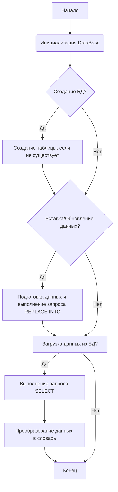
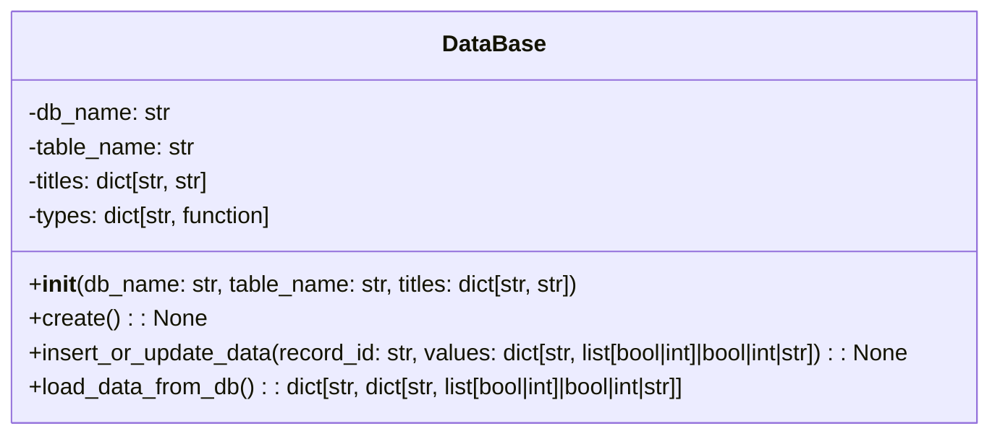

### **Системные инструкции для обработки кода проекта `hypotez`**

=========================================================================================

Описание функциональности и правил для генерации, анализа и улучшения кода. Направлено на обеспечение последовательного и читаемого стиля кодирования, соответствующего требованиям.

---

### **Основные принципы**

#### **1. Общие указания**:
- Соблюдай четкий и понятный стиль кодирования.
- Все изменения должны быть обоснованы и соответствовать установленным требованиям.

#### **2. Комментарии**:
- Используй `#` для внутренних комментариев.
- Документация всех функций, методов и классов должна следовать такому формату: 
    ```python
        def function(param: str, param1: Optional[str | dict | str] = None) -> dict | None:
            """ 
            Args:
                param (str): Описание параметра `param`.
                param1 (Optional[str | dict | str], optional): Описание параметра `param1`. По умолчанию `None`.
    
            Returns:
                dict | None: Описание возвращаемого значения. Возвращает словарь или `None`.
    
            Raises:
                SomeError: Описание ситуации, в которой возникает исключение `SomeError`.

            Ехаmple:
                >>> function('param', 'param1')
                {'param': 'param1'}
            """
    ```
- Комментарии и документация должны быть четкими, лаконичными и точными.

#### **3. Форматирование кода**:
- Используй одинарные кавычки. `a:str = 'value'`, `print('Hello World!')`;
- Добавляй пробелы вокруг операторов. Например, `x = 5`;
- Все параметры должны быть аннотированы типами. `def function(param: str, param1: Optional[str | dict | str] = None) -> dict | None:`;
- Не используй `Union`. Вместо этого используй `|`.

#### **4. Логирование**:
- Для логгирования Всегда Используй модуль `logger` из `src.logger.logger`.
- Ошибки должны логироваться с использованием `logger.error`.
Пример:
    ```python
        try:
            ...
        except Exception as ex:
            logger.error('Error while processing data', ех, exc_info=True)
    ```
#### **5 Не используй `Union[]` в коде. Вместо него используй `|`
Например:
```python
x: str | int ...
```


---

### **Основные требования**:

#### **1. Формат ответов в Markdown**:
- Все ответы должны быть выполнены в формате **Markdown**.

#### **2. Формат комментариев**:
- Используй указанный стиль для комментариев и документации в коде.
- Пример:

```python
from typing import Generator, Optional, List
from pathlib import Path


def read_text_file(
    file_path: str | Path,
    as_list: bool = False,
    extensions: Optional[List[str]] = None,
    chunk_size: int = 8192,
) -> Generator[str, None, None] | str | None:
    """
    Считывает содержимое файла (или файлов из каталога) с использованием генератора для экономии памяти.

    Args:
        file_path (str | Path): Путь к файлу или каталогу.
        as_list (bool): Если `True`, возвращает генератор строк.
        extensions (Optional[List[str]]): Список расширений файлов для чтения из каталога.
        chunk_size (int): Размер чанков для чтения файла в байтах.

    Returns:
        Generator[str, None, None] | str | None: Генератор строк, объединенная строка или `None` в случае ошибки.

    Raises:
        Exception: Если возникает ошибка при чтении файла.

    Example:
        >>> from pathlib import Path
        >>> file_path = Path('example.txt')
        >>> content = read_text_file(file_path)
        >>> if content:
        ...    print(f'File content: {content[:100]}...')
        File content: Example text...
    """
    ...
```
- Всегда делай подробные объяснения в комментариях. Избегай расплывчатых терминов, 
- таких как *«получить»* или *«делать»*. Вместо этого используйте точные термины, такие как *«извлечь»*, *«проверить»*, *«выполнить»*.
- Вместо: *«получаем»*, *«возвращаем»*, *«преобразовываем»* используй имя объекта *«функция получае»*, *«переменная возвращает»*, *«код преобразовывает»* 
- Комментарии должны непосредственно предшествовать описываемому блоку кода и объяснять его назначение.

#### **3. Пробелы вокруг операторов присваивания**:
- Всегда добавляйте пробелы вокруг оператора `=`, чтобы повысить читаемость.
- Примеры:
  - **Неправильно**: `x=5`
  - **Правильно**: `x = 5`

#### **4. Использование `j_loads` или `j_loads_ns`**:
- Для чтения JSON или конфигурационных файлов замените стандартное использование `open` и `json.load` на `j_loads` или `j_loads_ns`.
- Пример:

```python
# Неправильно:
with open('config.json', 'r', encoding='utf-8') as f:
    data = json.load(f)

# Правильно:
data = j_loads('config.json')
```

#### **5. Сохранение комментариев**:
- Все существующие комментарии, начинающиеся с `#`, должны быть сохранены без изменений в разделе «Улучшенный код».
- Если комментарий кажется устаревшим или неясным, не изменяйте его. Вместо этого отметьте его в разделе «Изменения».

#### **6. Обработка `...` в коде**:
- Оставляйте `...` как указатели в коде без изменений.
- Не документируйте строки с `...`.
```

#### **7. Аннотации**
Для всех переменных должны быть определены аннотации типа. 
Для всех функций все входные и выходные параметры аннотириваны
Для все параметров должны быть аннотации типа.


### **8. webdriver**
В коде используется webdriver. Он импртируется из модуля `webdriver` проекта `hypotez`
```python
from src.webdirver import Driver, Chrome, Firefox, Playwright, ...
driver = Driver(Firefox)

Пoсле чего может использоваться как

close_banner = {
  "attribute": null,
  "by": "XPATH",
  "selector": "//button[@id = 'closeXButton']",
  "if_list": "first",
  "use_mouse": false,
  "mandatory": false,
  "timeout": 0,
  "timeout_for_event": "presence_of_element_located",
  "event": "click()",
  "locator_description": "Закрываю pop-up окно, если оно не появилось - не страшно (`mandatory`:`false`)"
}

result = driver.execute_locator(close_banner)
```

### Анализ кода `hypotez/src/endpoints/bots/telegram/ToolBoxbot-main/ToolBox/ToolBox_DataBase.py`

#### 1. Блок-схема



**Примеры для каждого логического блока:**

*   **A (Начало)**: Начало выполнения скрипта.
*   **B (Инициализация `DataBase`)**:
    ```python
    base = DataBase(db_name="UsersData.db", table_name="users_data_table", titles={"id": "TEXT PRIMARY KEY", "text": "INTEGER[]", ...})
    ```
*   **C (Создание БД?)**: Проверка, нужно ли создавать базу данных и таблицу. Если таблица не существует, она будет создана.
*   **D (Создание таблицы, если не существует)**:
    ```python
    base.create()
    ```
    Создает таблицу `users_data_table` в базе данных `UsersData.db`, если она еще не существует.
*   **E (Вставка/Обновление данных?)**: Проверка, нужно ли вставлять или обновлять данные.
*   **F (Подготовка данных и выполнение запроса `REPLACE INTO`)**:
    ```python
    base.insert_or_update_data(uid.split()[0], db[uid.split()[0]])
    ```
    Вставляет или обновляет данные пользователя в таблице.
*   **G (Загрузка данных из БД?)**: Проверка, нужно ли загружать данные из базы данных.
*   **H (Выполнение запроса `SELECT`)**:
    ```python
    db = base.load_data_from_db()
    ```
    Загружает все данные из таблицы `users_data_table` в словарь.
*   **I (Преобразование данных в словарь)**: Преобразование полученных данных из базы данных в словарь, где ключом является `id` пользователя, а значением - словарь с остальными данными.
*   **J (Конец)**: Конец выполнения скрипта.

#### 2. Диаграмма



**Объяснение зависимостей:**

*   `sqlite3`: Используется для работы с SQLite базой данных.
*   `json`: Используется для сериализации и десериализации данных в формате JSON, особенно при работе с массивами строк.
*   `re.sub`: Используется для выполнения операций замены по регулярному выражению.
*   `datetime` (из `datetime`): Используется для работы с датами и временем.
*   `relativedelta` (из `dateutil.relativedelta`):  Используется для удобного добавления или вычитания интервалов времени (например, месяцев, лет) к объектам `datetime`.
*   `literal_eval` (из `ast`):  Используется для безопасного преобразования строк, представляющих литералы Python (например, списки, словари), в соответствующие объекты Python.

#### 3. Объяснение

**Импорты:**

*   `sqlite3`: Предоставляет интерфейс для работы с базами данных SQLite. Используется для создания базы данных, таблиц, выполнения запросов и т.д.
*   `json`: Используется для работы с JSON-строками, в частности, для преобразования строковых представлений списков словарей в объекты Python.
*   `re.sub`: Используется для замены подстрок, соответствующих регулярному выражению. В данном случае, используется для преобразования строкового представления списков, полученных из базы данных, в формат, который можно безопасно преобразовать в Python список.
*   `datetime` (из `datetime`): Используется для работы с датами и временем.  Используется для установки времени подписки пользователя.
*   `relativedelta` (из `dateutil.relativedelta`):  Используется для добавления временных интервалов к датам. В данном случае, используется для установки времени подписки пользователя (добавление месяца, года).
*   `literal_eval` (из `ast`):  Используется для безопасного преобразования строк, представляющих литералы Python (например, списки, словари), в соответствующие объекты Python.

**Класс `DataBase`:**

*   **Роль**: Предоставляет интерфейс для работы с базой данных SQLite.
*   **Атрибуты**:
    *   `db_name` (str): Имя файла базы данных.
    *   `table_name` (str): Имя таблицы в базе данных.
    *   `titles` (dict\[str, str]): Словарь, определяющий структуру таблицы (имена столбцов и их типы данных).
    *   `types` (dict\[str, function]): Словарь, содержащий функции для преобразования строковых значений из базы данных в соответствующие типы Python.
*   **Методы**:
    *   `__init__(self, db_name: str, table_name: str, titles: dict[str, str]) -> None`: Конструктор класса. Инициализирует атрибуты объекта.
    *   `create(self) -> None`: Создает таблицу в базе данных, если она еще не существует.
    *   `insert_or_update_data(self, record_id: str, values: dict[str, list[bool|int]|bool|int|str]) -> None`: Вставляет новую запись или обновляет существующую запись в таблице. Использует `REPLACE INTO`, чтобы перезаписать запись, если `record_id` уже существует.
    *   `load_data_from_db(self) -> dict[str, dict[str, list[bool|int]|bool|int|str]]`: Загружает данные из таблицы в словарь Python. Ключами словаря являются значения столбца `id`, а значениями - словари, содержащие остальные данные для каждой записи.

**Функции:**

*   `__init__(self, db_name: str, table_name: str, titles: dict[str, str]) -> None`:
    *   **Аргументы**:
        *   `db_name` (str): Имя файла базы данных.
        *   `table_name` (str): Имя таблицы в базе данных.
        *   `titles` (dict\[str, str]): Словарь, определяющий структуру таблицы (имена столбцов и их типы данных).
    *   **Возвращаемое значение**: `None`
    *   **Назначение**: Инициализация объекта `DataBase` с указанными параметрами.
*   `create(self) -> None`:
    *   **Аргументы**: Отсутствуют.
    *   **Возвращаемое значение**: `None`
    *   **Назначение**: Создает таблицу в базе данных, если она не существует.
*   `insert_or_update_data(self, record_id: str, values: dict[str, list[bool|int]|bool|int|str]) -> None`:
    *   **Аргументы**:
        *   `record_id` (str): Значение первичного ключа (столбец `id`).
        *   `values` (dict\[str, list\[bool|int]|bool|int|str]): Словарь со значениями для вставки или обновления.
    *   **Возвращаемое значение**: `None`
    *   **Назначение**: Вставляет или обновляет данные в таблице.  Использует запрос `REPLACE INTO`, который автоматически заменяет существующую запись, если `id` уже существует.
*   `load_data_from_db(self) -> dict[str, dict[str, list[bool|int]|bool|int|str]]`:
    *   **Аргументы**: Отсутствуют.
    *   **Возвращаемое значение**: `dict[str, dict[str, list[bool|int]|bool|int|str]]`: Словарь, содержащий данные из базы данных.
    *   **Назначение**: Загружает все данные из таблицы в словарь Python.

**Переменные:**

*   `self.db_name` (str): Имя базы данных.
*   `self.table_name` (str): Имя таблицы.
*   `self.titles` (dict\[str, str]): Заголовки таблицы и типы данных.
*   `self.types` (dict\[str, function]):  Словарь функций для преобразования типов данных из строк в Python типы.
*   `conn` (sqlite3.Connection): Объект соединения с базой данных SQLite.
*   `cursor` (sqlite3.Cursor): Объект курсора, используемый для выполнения SQL-запросов.
*   `rows` (list): Результат выполнения запроса `SELECT`, содержащий список строк из таблицы.
*   `loaded_data` (dict): Словарь, в который загружаются данные из базы данных.
*   `base` (DataBase): Объект класса `DataBase`, используемый для работы с базой данных.
*   `db` (dict): Словарь, содержащий загруженные данные из базы данных.
* `N` (int): Константа, определяющая размерность списка, используемого для инициализации данных.
* `uid` (str):  Ввод пользователя, используемый как идентификатор для создания или обновления записи в базе данных.

**Потенциальные ошибки или области для улучшения:**

*   **Безопасность**: Использование f-строк для формирования SQL-запросов может быть небезопасным и подвержено SQL-инъекциям.  Рекомендуется использовать параметризованные запросы с плейсхолдерами `?`.
*   **Обработка ошибок**: Отсутствует явная обработка исключений при работе с базой данных. Следует добавить блоки `try...except` для обработки возможных ошибок (например, при подключении к базе данных, выполнении запросов и т.д.).
*   **Валидация данных**:  Не хватает валидации входных данных. Например, перед вставкой данных в базу данных, следует проверять, что типы данных соответствуют ожидаемым.
*   **Преобразование типов**: Преобразование строковых представлений списков в Python списки с использованием `literal_eval` и `re.sub` выглядит сложным и подвержено ошибкам.  Возможно, стоит рассмотреть другие способы хранения и извлечения списков из базы данных. Например, можно хранить списки как JSON-строки и использовать `json.loads` и `json.dumps` для сериализации и десериализации.
*   **Закрытие соединения**:  Необходимо обеспечить закрытие соединения с базой данных в блоке `finally`, чтобы гарантировать, что соединение будет закрыто даже в случае возникновения исключения.

**Цепочка взаимосвязей с другими частями проекта:**

Этот файл (`ToolBox_DataBase.py`) является частью Telegram бота (`ToolBoxbot-main/ToolBox`). Он отвечает за управление базой данных, которая хранит информацию о пользователях бота.  Данные, загруженные из базы данных, могут использоваться другими модулями бота для определения прав доступа пользователя, хранения его настроек, истории сообщений и т.д.  Взаимодействие с другими частями проекта будет происходить через методы класса `DataBase`. Другие модули будут вызывать эти методы для получения и изменения данных в базе данных.