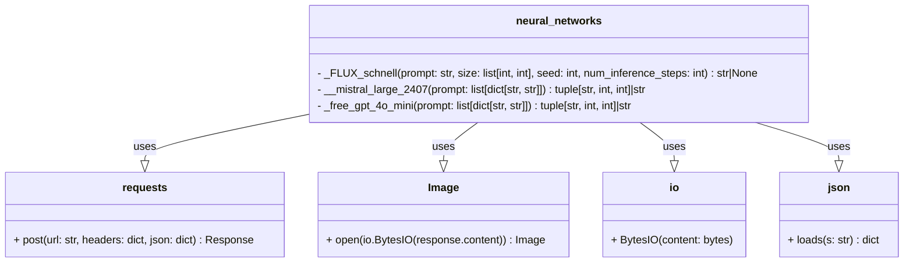

### **Системные инструкции для обработки кода проекта `hypotez`**

=========================================================================================

Описание функциональности и правил для генерации, анализа и улучшения кода. Направлено на обеспечение последовательного и читаемого стиля кодирования, соответствующего требованиям.

---

### **Основные принципы**

#### **1. Общие указания**:
- Соблюдай четкий и понятный стиль кодирования.
- Все изменения должны быть обоснованы и соответствовать установленным требованиям.

#### **2. Комментарии**:
- Используй `#` для внутренних комментариев.
- Документация всех функций, методов и классов должна следовать такому формату: 
    ```python
        def function(param: str, param1: Optional[str | dict | str] = None) -> dict | None:
            """ 
            Args:
                param (str): Описание параметра `param`.
                param1 (Optional[str | dict | str], optional): Описание параметра `param1`. По умолчанию `None`.
    
            Returns:
                dict | None: Описание возвращаемого значения. Возвращает словарь или `None`.
    
            Raises:
                SomeError: Описание ситуации, в которой возникает исключение `SomeError`.

            Ехаmple:
                >>> function('param', 'param1')
                {'param': 'param1'}
            """
    ```
- Комментарии и документация должны быть четкими, лаконичными и точными.

#### **3. Форматирование кода**:
- Используй одинарные кавычки. `a:str = 'value'`, `print('Hello World!')`;
- Добавляй пробелы вокруг операторов. Например, `x = 5`;
- Все параметры должны быть аннотированы типами. `def function(param: str, param1: Optional[str | dict | str] = None) -> dict | None:`;
- Не используй `Union`. Вместо этого используй `|`.

#### **4. Логирование**:
- Для логгирования Всегда Используй модуль `logger` из `src.logger.logger`.
- Ошибки должны логироваться с использованием `logger.error`.
Пример:
    ```python
        try:
            ...
        except Exception as ex:
            logger.error('Error while processing data', ех, exc_info=True)
    ```
#### **5 Не используй `Union[]` в коде. Вместо него используй `|`
Например:
```python
x: str | int ...
```


---

### **Основные требования**:

#### **1. Формат ответов в Markdown**:
- Все ответы должны быть выполнены в формате **Markdown**.

#### **2. Формат комментариев**:
- Используй указанный стиль для комментариев и документации в коде.
- Пример:

```python
from typing import Generator, Optional, List
from pathlib import Path


def read_text_file(
    file_path: str | Path,
    as_list: bool = False,
    extensions: Optional[List[str]] = None,
    chunk_size: int = 8192,
) -> Generator[str, None, None] | str | None:
    """
    Считывает содержимое файла (или файлов из каталога) с использованием генератора для экономии памяти.

    Args:
        file_path (str | Path): Путь к файлу или каталогу.
        as_list (bool): Если `True`, возвращает генератор строк.
        extensions (Optional[List[str]]): Список расширений файлов для чтения из каталога.
        chunk_size (int): Размер чанков для чтения файла в байтах.

    Returns:
        Generator[str, None, None] | str | None: Генератор строк, объединенная строка или `None` в случае ошибки.

    Raises:
        Exception: Если возникает ошибка при чтении файла.

    Example:
        >>> from pathlib import Path
        >>> file_path = Path('example.txt')
        >>> content = read_text_file(file_path)
        >>> if content:
        ...    print(f'File content: {content[:100]}...')
        File content: Example text...
    """
    ...
```
- Всегда делай подробные объяснения в комментариях. Избегай расплывчатых терминов, 
- таких как *«получить»* или *«делать»*. Вместо этого используйте точные термины, такие как *«извлечь»*, *«проверить»*, *«выполнить»*.
- Вместо: *«получаем»*, *«возвращаем»*, *«преобразовываем»* используй имя объекта *«функция получае»*, *«переменная возвращает»*, *«код преобразовывает»* 
- Комментарии должны непосредственно предшествовать описываемому блоку кода и объяснять его назначение.

#### **3. Пробелы вокруг операторов присваивания**:
- Всегда добавляйте пробелы вокруг оператора `=`, чтобы повысить читаемость.
- Примеры:
  - **Неправильно**: `x=5`
  - **Правильно**: `x = 5`

#### **4. Использование `j_loads` или `j_loads_ns`**:
- Для чтения JSON или конфигурационных файлов замените стандартное использование `open` и `json.load` на `j_loads` или `j_loads_ns`.
- Пример:

```python
# Неправильно:
with open('config.json', 'r', encoding='utf-8') as f:
    data = json.load(f)

# Правильно:
data = j_loads('config.json')
```

#### **5. Сохранение комментариев**:
- Все существующие комментарии, начинающиеся с `#`, должны быть сохранены без изменений в разделе «Улучшенный код».
- Если комментарий кажется устаревшим или неясным, не изменяйте его. Вместо этого отметьте его в разделе «Изменения».

#### **6. Обработка `...` в коде**:
- Оставляйте `...` как указатели в коде без изменений.
- Не документируйте строки с `...`.
```

#### **7. Аннотации**
Для всех переменных должны быть определены аннотации типа. 
Для всех функций все входные и выходные параметры аннотириваны
Для все параметров должны быть аннотации типа.


### **8. webdriver**
В коде используется webdriver. Он импртируется из модуля `webdriver` проекта `hypotez`
```python
from src.webdirver import Driver, Chrome, Firefox, Playwright, ...
driver = Driver(Firefox)

Пoсле чего может использоваться как

close_banner = {
  "attribute": null,
  "by": "XPATH",
  "selector": "//button[@id = 'closeXButton']",
  "if_list": "first",
  "use_mouse": false,
  "mandatory": false,
  "timeout": 0,
  "timeout_for_event": "presence_of_element_located",
  "event": "click()",
  "locator_description": "Закрываю pop-up окно, если оно не появилось - не страшно (`mandatory`:`false`)"
}

result = driver.execute_locator(close_banner)
```

## Анализ кода `hypotez/src/endpoints/bots/telegram/ToolBoxbot-main/ToolBox/ToolBox_n_networks.py`

### 1. Блок-схема

```mermaid
graph LR
    A[Начало] --> B(Класс neural_networks);
    
    subgraph neural_networks
    B --> C{_FLUX_schnell(prompt, size, seed, num_inference_steps)};
    C -- payload --> D[Создание payload для запроса к FLUX.1-schnell];
    D --> E{Цикл по HF_TOKEN1..HF_TOKEN6};
    E --> F[Отправка POST запроса к FLUX.1-schnell];
    F -- status_code == 200 --> G[Обработка изображения через PIL.Image];
    G --> H[Возврат изображения];
    F -- status_code != 200 --> E;
    E -- исчерпаны токены --> I;

    B --> J{__mistral_large_2407(prompt)};
    J --> K[Создание data для запроса к Mistral AI];
    K --> L[Отправка POST запроса к Mistral AI];
    L --> M[Обработка ответа JSON];
    M --> N[Возврат сообщения, prompt_tokens, completion_tokens];

    B --> O{_free_gpt_4o_mini(prompt)};
    O --> P[Создание data для запроса к GPT-4o-mini];
    P --> Q{Цикл по GIT_TOKEN1..GIT_TOKEN6};
    Q --> R[Отправка POST запроса к GPT-4o-mini];
    R -- status_code == 200 --> S[Обработка ответа JSON];
    S --> T[Возврат сообщения, prompt_tokens, completion_tokens];
    R -- status_code != 200 --> Q;
    Q -- исчерпаны токены --> U[Вызов __mistral_large_2407(prompt)];
    U --> J;
    end
    
    I -- ошибка --> Z[Завершение с ошибкой];
    N --> Z;
    T --> Z;
    H --> Z;
    
    style A fill:#f9f,stroke:#333,stroke-width:2px
    style Z fill:#f9f,stroke:#333,stroke-width:2px
```

### 2. Диаграмма



**Объяснение зависимостей:**

*   `requests`: Используется для выполнения HTTP-запросов к серверам inference API (FLUX.1-schnell, Mistral AI, GPT-4o-mini). Метод `post` отправляет запросы и получает ответы.
*   `Image`: Из модуля `PIL` (Pillow). Используется для обработки изображений, полученных от FLUX.1-schnell. Метод `open` открывает изображение из байтового потока.
*   `io`: Используется для работы с байтовыми потоками. `BytesIO` позволяет представить содержимое HTTP-ответа в виде файла, который можно открыть с помощью `Image.open`.
*   `json`: Используется для обработки ответов от Mistral AI и GPT-4o-mini, которые приходят в формате JSON. Метод `loads` преобразует JSON-строку в словарь Python.

### 3. Объяснение

**Импорты:**

*   `requests`: Библиотека для отправки HTTP-запросов. Используется для взаимодействия с API нейронных сетей.
*   `json`: Модуль для работы с данными в формате JSON. Используется для обработки ответов от API.
*   `os`: Модуль для взаимодействия с операционной системой. Используется для получения значений переменных окружения (токенов доступа к API).
*   `io`: Модуль для работы с потоками ввода-вывода. Используется для обработки содержимого ответа от API как байтового потока.
*   `random.randint`: Функция для генерации случайных целых чисел. Используется для генерации `seed` при запросе к FLUX.1-schnell.
*   `PIL.Image`: Класс для работы с изображениями. Используется для открытия и обработки изображений, полученных от FLUX.1-schnell.

**Класс `neural_networks`:**

*   **Роль:** Класс предназначен для предоставления интерфейса к различным нейронным сетям. Он инкапсулирует методы для взаимодействия с API этих сетей.
*   **Атрибуты:** Класс не имеет явно определенных атрибутов. Он использует переменные окружения для хранения токенов доступа к API.
*   **Методы:**
    *   `_FLUX_schnell(self, prompt: str, size: list[int, int], seed: int, num_inference_steps: int) -> str|None`:
        *   **Аргументы:**
            *   `prompt (str)`: Текстовый запрос для генерации изображения.
            *   `size (list[int, int])`: Список, содержащий ширину и высоту изображения.
            *   `seed (int)`: Случайное число для инициализации генератора изображения.
            *   `num_inference_steps (int)`: Количество шагов для генерации изображения.
        *   **Возвращаемое значение:** Объект `Image` в случае успеха, `None` в случае ошибки.
        *   **Назначение:** Отправляет запрос к API FLUX.1-schnell для генерации изображения на основе текстового запроса. Использует несколько токенов доступа из переменных окружения (`HF_TOKEN1` - `HF_TOKEN6`) и пробует каждый из них, пока не получит успешный ответ (status code 200).
        *   **Пример:**
            ```python
            nn = neural_networks()
            image = nn._FLUX_schnell("a cat", [512, 512], 12345, 50)
            if image:
                image.save("cat.png")
            ```
    *   `__mistral_large_2407(self, prompt: list[dict[str, str]]) -> tuple[str, int, int]|str`:
        *   **Аргументы:**
            *   `prompt (list[dict[str, str]])`: Список словарей, представляющих собой сообщение для чат-модели.
        *   **Возвращаемое значение:** Кортеж, содержащий сообщение, количество токенов в запросе и количество токенов в ответе. Возвращает строку.
        *   **Назначение:** Отправляет запрос к API Mistral AI для получения ответа от чат-модели.
        *   **Пример:**
            ```python
            nn = neural_networks()
            prompt = [{"role": "user", "content": "What is the capital of France?"}]
            response, prompt_tokens, completion_tokens = nn.__mistral_large_2407(prompt)
            print(response)
            ```
    *   `_free_gpt_4o_mini(self, prompt: list[dict[str, str]]) -> tuple[str, int, int]|str`:
        *   **Аргументы:**
            *   `prompt (list[dict[str, str]])`: Список словарей, представляющих собой сообщение для чат-модели.
        *   **Возвращаемое значение:** Кортеж, содержащий сообщение, количество токенов в запросе и количество токенов в ответе. Возвращает строку.
        *   **Назначение:** Отправляет запрос к API GPT-4o-mini для получения ответа от чат-модели. Использует несколько токенов доступа из переменных окружения (`GIT_TOKEN1` - `GIT_TOKEN6`) и пробует каждый из них, пока не получит успешный ответ (status code 200). Если ни один из токенов не сработал, вызывает метод `__mistral_large_2407` как запасной вариант.
        *   **Пример:**
            ```python
            nn = neural_networks()
            prompt = [{"role": "user", "content": "What is the capital of France?"}]
            response, prompt_tokens, completion_tokens = nn._free_gpt_4o_mini(prompt)
            print(response)
            ```

**Переменные:**

*   `payload (dict)`: Словарь, содержащий данные для отправки в запросе к FLUX.1-schnell.
*   `data (dict)`: Словарь, содержащий данные для отправки в запросе к Mistral AI и GPT-4o-mini.
*   `response (requests.Response)`: Объект, представляющий собой ответ от API.
*   `image (PIL.Image.Image)`: Объект, представляющий собой изображение, полученное от FLUX.1-schnell.

**Потенциальные ошибки и области для улучшения:**

*   **Обработка ошибок:** В методе `_FLUX_schnell` отсутствует явная обработка ошибок при неудачном запросе (status code != 200). Желательно добавить логирование ошибок и, возможно, реализовать повторные попытки с экспоненциальной задержкой.
*   **Управление токенами:** Использование нескольких токенов доступа в циклах `for i in range(1, 7)` может быть неэффективным. Если токен не работает, все последующие запросы также, вероятно, будут неудачными. Рассмотреть возможность реализации более интеллектуального механизма управления токенами (например, хранить список рабочих токенов и выбирать случайный токен из этого списка).
*   **Обработка исключений:** В коде отсутствуют блоки `try...except` для обработки возможных исключений (например, `requests.exceptions.RequestException` при проблемах с сетью).
*   **Типизация:** В коде используются аннотации типов, но не для всех переменных. Желательно добавить аннотации типов для всех переменных, чтобы улучшить читаемость и облегчить отладку.
*   **Разделение ответственности:** Класс `neural_networks` выполняет несколько задач (взаимодействие с разными API). Рассмотреть возможность разделения класса на несколько классов, каждый из которых отвечает за взаимодействие с конкретным API.

**Взаимосвязи с другими частями проекта:**

*   Этот файл (`ToolBox_n_networks.py`) вероятно используется в боте `ToolBoxbot`, который является частью проекта `hypotez`. Он предоставляет функциональность для работы с нейронными сетями, которую бот может использовать для генерации изображений или обработки текста.
*   Токены доступа к API (`HF_TOKEN`, `GIT_TOKEN`, `MISTRAL_TOKEN`) хранятся в переменных окружения, что подразумевает наличие механизма для управления этими переменными (например, `.env` файлы или переменные окружения на сервере).