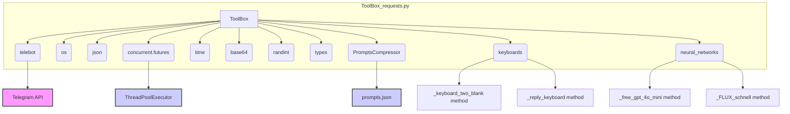

### **Системные инструкции для обработки кода проекта `hypotez`**

=========================================================================================

Описание функциональности и правил для генерации, анализа и улучшения кода. Направлено на обеспечение последовательного и читаемого стиля кодирования, соответствующего требованиям.

---

### **Основные принципы**

#### **1. Общие указания**:
- Соблюдай четкий и понятный стиль кодирования.
- Все изменения должны быть обоснованы и соответствовать установленным требованиям.

#### **2. Комментарии**:
- Используй `#` для внутренних комментариев.
- Документация всех функций, методов и классов должна следовать такому формату: 
    ```python
        def function(param: str, param1: Optional[str | dict | str] = None) -> dict | None:
            """ 
            Args:
                param (str): Описание параметра `param`.
                param1 (Optional[str | dict | str], optional): Описание параметра `param1`. По умолчанию `None`.
    
            Returns:
                dict | None: Описание возвращаемого значения. Возвращает словарь или `None`.
    
            Raises:
                SomeError: Описание ситуации, в которой возникает исключение `SomeError`.

            Ехаmple:
                >>> function('param', 'param1')
                {'param': 'param1'}
            """
    ```
- Комментарии и документация должны быть четкими, лаконичными и точными.

#### **3. Форматирование кода**:
- Используй одинарные кавычки. `a:str = 'value'`, `print('Hello World!')`;
- Добавляй пробелы вокруг операторов. Например, `x = 5`;
- Все параметры должны быть аннотированы типами. `def function(param: str, param1: Optional[str | dict | str] = None) -> dict | None:`;
- Не используй `Union`. Вместо этого используй `|`.

#### **4. Логирование**:
- Для логгирования Всегда Используй модуль `logger` из `src.logger.logger`.
- Ошибки должны логироваться с использованием `logger.error`.
Пример:
    ```python
        try:
            ...
        except Exception as ex:
            logger.error('Error while processing data', ех, exc_info=True)
    ```
#### **5 Не используй `Union[]` в коде. Вместо него используй `|`
Например:
```python
x: str | int ...
```


---

### **Основные требования**:

#### **1. Формат ответов в Markdown**:
- Все ответы должны быть выполнены в формате **Markdown**.

#### **2. Формат комментариев**:
- Используй указанный стиль для комментариев и документации в коде.
- Пример:

```python
from typing import Generator, Optional, List
from pathlib import Path


def read_text_file(
    file_path: str | Path,
    as_list: bool = False,
    extensions: Optional[List[str]] = None,
    chunk_size: int = 8192,
) -> Generator[str, None, None] | str | None:
    """
    Считывает содержимое файла (или файлов из каталога) с использованием генератора для экономии памяти.

    Args:
        file_path (str | Path): Путь к файлу или каталогу.
        as_list (bool): Если `True`, возвращает генератор строк.
        extensions (Optional[List[str]]): Список расширений файлов для чтения из каталога.
        chunk_size (int): Размер чанков для чтения файла в байтах.

    Returns:
        Generator[str, None, None] | str | None: Генератор строк, объединенная строка или `None` в случае ошибки.

    Raises:
        Exception: Если возникает ошибка при чтении файла.

    Example:
        >>> from pathlib import Path
        >>> file_path = Path('example.txt')
        >>> content = read_text_file(file_path)
        >>> if content:
        ...    print(f'File content: {content[:100]}...')
        File content: Example text...
    """
    ...
```
- Всегда делай подробные объяснения в комментариях. Избегай расплывчатых терминов, 
- таких как *«получить»* или *«делать»*
-  . Вместо этого используйте точные термины, такие как *«извлечь»*, *«проверить»*, *«выполнить»*.
- Вместо: *«получаем»*, *«возвращаем»*, *«преобразовываем»* используй имя объекта *«функция получае»*, *«переменная возвращает»*, *«код преобразовывает»* 
- Комментарии должны непосредственно предшествовать описываемому блоку кода и объяснять его назначение.

#### **3. Пробелы вокруг операторов присваивания**:
- Всегда добавляйте пробелы вокруг оператора `=`, чтобы повысить читаемость.
- Примеры:
  - **Неправильно**: `x=5`
  - **Правильно**: `x = 5`

#### **4. Использование `j_loads` или `j_loads_ns`**:
- Для чтения JSON или конфигурационных файлов замените стандартное использование `open` и `json.load` на `j_loads` или `j_loads_ns`.
- Пример:

```python
# Неправильно:
with open('config.json', 'r', encoding='utf-8') as f:
    data = json.load(f)

# Правильно:
data = j_loads('config.json')
```

#### **5. Сохранение комментариев**:
- Все существующие комментарии, начинающиеся с `#`, должны быть сохранены без изменений в разделе «Улучшенный код».
- Если комментарий кажется устаревшим или неясным, не изменяйте его. Вместо этого отметьте его в разделе «Изменения».

#### **6. Обработка `...` в коде**:
- Оставляйте `...` как указатели в коде без изменений.
- Не документируйте строки с `...`.
```

#### **7. Аннотации**
Для всех переменных должны быть определены аннотации типа. 
Для всех функций все входные и выходные параметры аннотириваны
Для все параметров должны быть аннотации типа.


### **8. webdriver**
В коде используется webdriver. Он импртируется из модуля `webdriver` проекта `hypotez`
```python
from src.webdirver import Driver, Chrome, Firefox, Playwright, ...
driver = Driver(Firefox)

Пoсле чего может использоваться как

close_banner = {
  "attribute": null,
  "by": "XPATH",
  "selector": "//button[@id = 'closeXButton']",
  "if_list": "first",
  "use_mouse": false,
  "mandatory": false,
  "timeout": 0,
  "timeout_for_event": "presence_of_element_located",
  "event": "click()",
  "locator_description": "Закрываю pop-up окно, если оно не появилось - не страшно (`mandatory`:`false`)"
}

result = driver.execute_locator(close_banner)
```

### **Анализ кода `hypotez/src/endpoints/bots/telegram/ToolBoxbot-main/ToolBox/ToolBox_requests.py`**

#### 1. **Блок-схема**:

```mermaid
graph TD
    A[Начало: Инициализация ToolBox] --> B{Загрузка prompts.json};
    B -- Загружено --> C[Инициализация TeleBot с токеном из env];
    C --> D{Определение lambda-функций для обработки запросов};
    D -- Запрос /start --> E[Обработка start_request: Отправка приветственного сообщения с клавиатурой];
    D -- Запрос restart --> F[Обработка restart: Отправка сообщения с выбором задачи];
    D -- Запрос OneTextArea --> G[Обработка OneTextArea: Отправка текста с кнопкой "Назад"];
    D -- Запрос SomeTextsArea --> H[Обработка SomeTextsArea: Отправка текста с кнопкой "Назад"];
    D -- Запрос ImageSize --> I[Обработка ImageSize: Отправка вариантов разрешения изображения];
    D -- Запрос ImageArea --> J[Обработка ImageArea: Запрос текста для генерации изображения];
    D -- Запрос ImageChange --> K[Обработка ImageChange: Предложение действий с изображением (upscale, regenerate, новая)];
    D -- Запрос BeforeUpscale --> L[Обработка BeforeUpscale: Предложение действий после генерации изображения];
    D -- Запрос FreeArea --> M[Обработка FreeArea: Запрос текста в свободном режиме];
    D -- Запрос TariffArea --> N[Обработка TariffArea: Отправка информации о тарифах];
    D -- Запрос TariffExit --> O[Обработка TariffExit: Выход из меню тарифов];
    D -- Запрос TarrifEnd --> P[Обработка TarrifEnd: Сообщение об окончании тарифа];
    D -- Запрос FreeTariffEnd --> Q[Обработка FreeTariffEnd: Сообщение об окончании бесплатных запросов];
    D -- Запрос SomeTexts --> R[Обработка SomeTexts: Предложение выбрать один или несколько текстов];
    
    subgraph Private Methods
    S[__gpt_4o_mini: обработка запроса к GPT-4o-mini] --> T[Отправка запроса, получение ответа]
    T --> U[Отправка ответа пользователю];
    V[__FLUX_schnell: обработка запроса к FLUX для генерации изображений] --> W[Генерация изображения]
    W --> X{Успешно?}
    X -- Да --> Y[Отправка изображения пользователю];
    X -- Нет --> Z[Повторная попытка или сообщение об ошибке];
    end
    
    subgraph Public Methods
    AA[Text_types: выбор типа текста] --> AB[Отправка вариантов типа текста];
    AC[Basic_tariff: оформление подписки на базовый тариф] --> AD[Отправка инвойса с предложением оплаты];
    AE[Pro_tariff: оформление подписки на тариф pro] --> AF[Отправка инвойса с предложением оплаты];
    AG[TextCommands: обработка текстовых команд] --> AH[Получение информации от пользователя]
    AH --> AI[Обработка и отправка запроса в __gpt_4o_mini]
    AJ[SomeTextsCommand: обработка нескольких текстов] --> AK[Запрос нескольких текстов и параметров]
    AK --> AL[Многопоточная обработка запросов через __gpt_4o_mini]
    AM[ImageCommand: обработка команды генерации изображений] --> AN[Отправка запроса в __FLUX_schnell]
    AO[Image_Regen_And_Upscale: регенерация и upscale изображения] --> AP[Отправка запроса в __FLUX_schnell]
    AQ[FreeCommand: обработка запроса в свободном режиме] --> AR[Обработка и отправка запроса в __gpt_4o_mini]
    end
```

#### 2. **Диаграмма**:



**Объяснение зависимостей:**

-   **telebot**: Используется для взаимодействия с Telegram API. Этот модуль позволяет отправлять сообщения, обрабатывать команды и управлять ботом.
-   **os**: Предоставляет функции для взаимодействия с операционной системой, например, для получения доступа к переменным окружения (в данном случае, для получения токена бота).
-   **json**: Используется для работы с JSON-данными, в частности, для загрузки данных из файла `prompts.json`.
-   **concurrent.futures**: Предоставляет инструменты для параллельного выполнения задач, в частности, `ThreadPoolExecutor` для многопоточной обработки запросов.
-   **time**: Используется для работы со временем, например, для задержек (`time.sleep`).
-   **base64**: Возможно, не используется напрямую в данном коде, но может быть частью функциональности, предоставляемой классами `keyboards` или `neural_networks`.
-   **random.randint**: Используется для генерации случайных чисел, например, для генерации seed для генерации изображений.
-   **telebot.types**: Используется для определения различных типов объектов Telegram API, таких как `InlineKeyboardButton`, `InlineKeyboardMarkup` и `LabeledPrice`.
-   **BaseSettings.AuxiliaryClasses.PromptsCompressor**: Класс, предназначенный для сжатия и управления промптами.
-   **BaseSettings.AuxiliaryClasses.keyboards**: Класс, предоставляющий функциональность для создания различных типов клавиатур для Telegram-бота.
-   **ToolBox_n_networks.neural_networks**: Класс, предоставляющий функциональность для взаимодействия с нейронными сетями (например, GPT-4o-mini и FLUX).

#### 3. **Объяснение**:

*   **Импорты**:
    *   `telebot`: Для работы с Telegram Bot API.
    *   `os`: Для доступа к переменным окружения, например, к токену бота.
    *   `json`: Для работы с файлами JSON (например, `prompts.json`).
    *   `concurrent.futures`: Для параллельного выполнения задач.
    *   `time`: Для временных задержек в коде.
    *   `base64`: Вероятно, используется для кодирования и декодирования данных (например, изображений).
    *   `random.randint`: Для генерации случайных чисел (например, seed для генерации изображений).
    *   `telebot.types`: Для создания различных типов клавиатур и других элементов интерфейса Telegram.
    *   `BaseSettings.AuxiliaryClasses.PromptsCompressor`: Класс для сжатия промптов.
    *   `BaseSettings.AuxiliaryClasses.keyboards`: Класс для создания клавиатур.
    *   `ToolBox_n_networks.neural_networks`: Класс для работы с нейронными сетями.
*   **Классы**:

    *   **`ToolBox(keyboards, neural_networks)`**:
        *   **Роль**: Основной класс, управляющий логикой Telegram-бота.
        *   **Атрибуты**:
            *   `name`: Список названий кнопок главного меню.
            *   `data`: Список данных, связанных с кнопками главного меню.
            *   `prompts_text`: Словарь с текстами промптов, загруженный из файла `prompts.json`.
            *   `bot`: Экземпляр класса `telebot.TeleBot` для взаимодействия с Telegram API.
            *   `keyboard_blank`, `reply_keyboard`, `__delay`, `start_request`, `restart`, `restart_markup`, `OneTextArea`, `SomeTextsArea`, `ImageSize`, `ImageArea`, `ImageChange`, `BeforeUpscale`, `FreeArea`, `TariffArea`, `TariffExit`, `TarrifEnd`, `FreeTariffEnd`, `SomeTexts`: Лямбда-функции для упрощения отправки сообщений и обработки запросов.
        *   **Методы**:
            *   `__init__`: Инициализирует класс, загружает промпты, создает экземпляр бота, определяет лямбда-функции для обработки запросов.
            *   `__gpt_4o_mini`: Приватный метод для обработки текста с использованием GPT-4o-mini.
            *   `__FLUX_schnell`: Приватный метод для генерации изображений с использованием FLUX.
            *   `Text_types`: Отправляет пользователю варианты типов текста.
            *   `Basic_tariff`: Отправляет инвойс для оплаты базового тарифа.
            *   `Pro_tariff`: Отправляет инвойс для оплаты pro-тарифа.
            *   `TextCommands`: Обрабатывает команды, связанные с генерацией текста.
            *   `SomeTextsCommand`: Обрабатывает команды, связанные с генерацией нескольких текстов.
            *   `ImageCommand`: Обрабатывает команды, связанные с генерацией изображений.
            *   `Image_Regen_And_Upscale`: Обрабатывает команды для регенерации и upscale изображений.
            *   `FreeCommand`: Обрабатывает запросы в свободном режиме.
*   **Функции**:
    *   Лямбда-функции, определенные в `__init__`, упрощают отправку сообщений и обработку запросов.

*   **Переменные**:
    *   `self.name`, `self.data`, `self.prompts_text`, `self.bot`, `keyboard_blank`, `reply_keyboard` и т.д.: Атрибуты класса `ToolBox`, хранящие информацию о состоянии бота, промптах и функциях обработки запросов.

*   **Потенциальные ошибки и области для улучшения**:
    *   Обработка исключений в `__FLUX_schnell` может быть улучшена для предоставления более информативных сообщений об ошибках.
    *   Использование `time.sleep` в циклах `while` может быть неэффективным. Рассмотрение асинхронных методов может улучшить производительность.
    *   Лямбда-функции могут быть заменены на обычные функции для повышения читаемости кода.

*   **Взаимосвязи с другими частями проекта**:
    *   Класс `ToolBox` использует классы `PromptsCompressor`, `keyboards` и `neural_networks` из других модулей проекта.
    *   Файл `prompts.json` содержит тексты промптов, используемые ботом.
    *   Для работы с Telegram API используется токен бота, хранящийся в переменной окружения `TOKEN`.