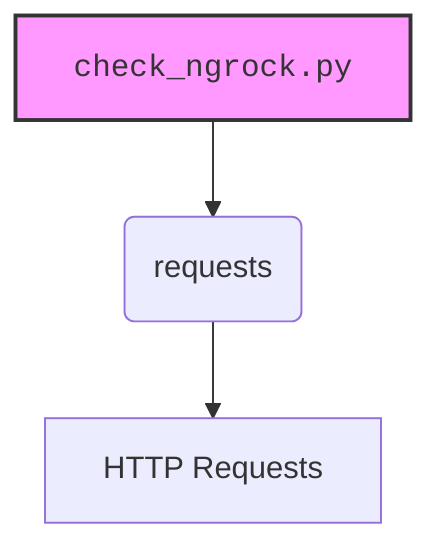

### **Анализ кода проекта `hypotez`**

=========================================================================================

#### **Расположение файла в проекте**:
Файл расположен по адресу `hypotez/src/endpoints/bots/telegram/_experiments/check_ngrock.py`. Это указывает на то, что файл является частью экспериментов, связанных с Telegram-ботами и, возможно, использованием ngrok для доступа к локальному серверу.

---

### **1. Блок-схема**

```mermaid
graph TD
    A[Начало] --> B{Определение URL API};
    B --> C{Определение заголовков};
    C --> D{Определение данных};
    D --> E{Отправка POST-запроса};
    E --> F{Проверка статуса ответа (response.status_code == 200)?};
    F -- Да --> G[Вывод успешного ответа: response.json()];
    F -- Нет --> H[Вывод ошибки: response.status_code, response.text];
    G --> I[Конец];
    H --> I;
```

**Примеры для каждого блока**:
- **A (Начало)**: Начало выполнения скрипта.
- **B (Определение URL API)**: `url = "127.0.0.1:8443"` - Указывает адрес локального сервера ngrok.
- **C (Определение заголовков)**:
```python
headers = {
    "Authorization": "Bearer YOUR_API_TOKEN",
    "Content-Type": "application/json"
}
```
  Устанавливает заголовки для авторизации и указания типа контента.
- **D (Определение данных)**:
```python
data = {
    "key1": "value1",
    "key2": "value2"
}
```
  Данные, которые будут отправлены в теле запроса.
- **E (Отправка POST-запроса)**: `response = requests.post(url, headers=headers, json=data)` - Отправка данных на сервер.
- **F (Проверка статуса ответа)**: `if response.status_code == 200:` - Проверка, был ли запрос успешным.
- **G (Вывод успешного ответа)**: `print("Успешно:", response.json())` - Вывод JSON-ответа в случае успеха.
- **H (Вывод ошибки)**: `print("Ошибка:", response.status_code, response.text)` - Вывод кода ошибки и текста ответа в случае неудачи.
- **I (Конец)**: Завершение выполнения скрипта.

### **2. Диаграмма зависимостей**



**Объяснение зависимостей**:
- **requests**: Библиотека `requests` используется для отправки HTTP-запросов. Она позволяет отправлять POST-запросы к указанному URL, передавая данные и заголовки.

### **3. Объяснение**

#### **Импорты**:
- **requests**: Используется для отправки HTTP-запросов. В данном случае, POST-запрос отправляется на указанный URL с заданными заголовками и данными.

#### **Переменные**:
- **url**: Содержит URL API, к которому отправляется запрос. В данном случае, это `127.0.0.1:8443`, что указывает на локальный сервер, возможно, работающий через ngrok.
- **headers**: Словарь, содержащий заголовки HTTP-запроса. `Authorization` используется для передачи токена авторизации, а `Content-Type` указывает, что тело запроса содержит данные в формате JSON.
- **data**: Словарь, содержащий данные, которые будут отправлены в теле POST-запроса в формате JSON.
- **response**: Объект, содержащий ответ от сервера после отправки запроса.

#### **Функциональность**:
Скрипт отправляет POST-запрос к API, указанному в переменной `url`. Запрос содержит JSON-данные и заголовки авторизации. Затем скрипт проверяет статус ответа. Если статус равен 200, то выводится JSON-ответ. В противном случае выводится код ошибки и текст ответа.

#### **Потенциальные ошибки и области для улучшения**:
- **Обработка исключений**: В коде отсутствует обработка исключений. Например, если сервер недоступен или произошла ошибка при отправке запроса, скрипт завершится с ошибкой. Рекомендуется добавить блок `try...except` для обработки возможных исключений.
- **Токен авторизации**: В коде используется плейсхолдер `YOUR_API_TOKEN` для токена авторизации. Необходимо убедиться, что используется реальный токен.
- **Логирование**: Отсутствует логирование. Рекомендуется использовать модуль `logger` из `src.logger.logger` для логирования запросов, ответов и ошибок.
- **Жестко закодированные значения**: URL и данные жестко закодированы. Желательно вынести их в конфигурационный файл или переменные окружения.

#### **Пример улучшения**:

```python
import requests
import json
from src.logger.logger import logger

# URL API
url = "127.0.0.1:8443"

# Заголовки
headers = {
    "Authorization": "Bearer YOUR_API_TOKEN",
    "Content-Type": "application/json"
}

# Данные для отправки
data = {
    "key1": "value1",
    "key2": "value2"
}

try:
    # Отправка POST-запроса
    response = requests.post(url, headers=headers, json=data)

    # Обработка ответа
    if response.status_code == 200:
        logger.info(f"Успешный запрос: {response.json()}")  # Логирование успешного запроса
        print("Успешно:", response.json())
    else:
        logger.error(f"Ошибка: {response.status_code}, {response.text}")  # Логирование ошибки
        print("Ошибка:", response.status_code, response.text)

except requests.exceptions.RequestException as e:
    logger.error(f"Произошла ошибка при отправке запроса: {e}", exc_info=True)
    print(f"Произошла ошибка при отправке запроса: {e}")
except json.JSONDecodeError as e:
    logger.error(f"Ошибка при декодировании JSON: {e}", exc_info=True)
    print(f"Ошибка при декодировании JSON: {e}")
except Exception as e:
    logger.error(f"Непредвиденная ошибка: {e}", exc_info=True)
    print(f"Непредвиденная ошибка: {e}")
```
---