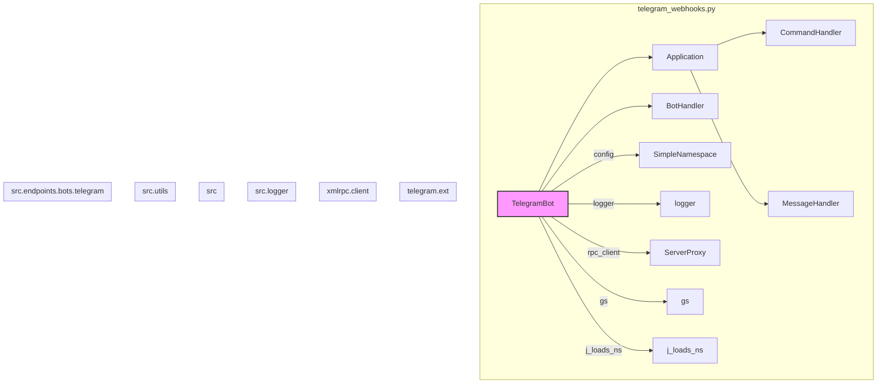
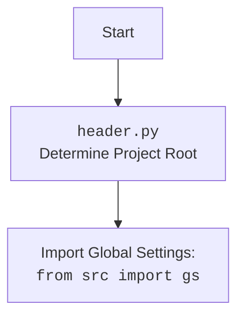

### **Системные инструкции для обработки кода проекта `hypotez`**

=========================================================================================

Описание функциональности и правил для генерации, анализа и улучшения кода. Направлено на обеспечение последовательного и читаемого стиля кодирования, соответствующего требованиям.

---

### **Основные принципы**

#### **1. Общие указания**:
- Соблюдай четкий и понятный стиль кодирования.
- Все изменения должны быть обоснованы и соответствовать установленным требованиям.

#### **2. Комментарии**:
- Используй `#` для внутренних комментариев.
- Документация всех функций, методов и классов должна следовать такому формату: 
    ```python
        def function(param: str, param1: Optional[str | dict | str] = None) -> dict | None:
            """ 
            Args:
                param (str): Описание параметра `param`.
                param1 (Optional[str | dict | str], optional): Описание параметра `param1`. По умолчанию `None`.
    
            Returns:
                dict | None: Описание возвращаемого значения. Возвращает словарь или `None`.
    
            Raises:
                SomeError: Описание ситуации, в которой возникает исключение `SomeError`.

            Ехаmple:
                >>> function('param', 'param1')
                {'param': 'param1'}
            """
    ```
- Комментарии и документация должны быть четкими, лаконичными и точными.

#### **3. Форматирование кода**:
- Используй одинарные кавычки. `a:str = 'value'`, `print('Hello World!')`;
- Добавляй пробелы вокруг операторов. Например, `x = 5`;
- Все параметры должны быть аннотированы типами. `def function(param: str, param1: Optional[str | dict | str] = None) -> dict | None:`;
- Не используй `Union`. Вместо этого используй `|`.

#### **4. Логирование**:
- Для логгирования Всегда Используй модуль `logger` из `src.logger.logger`.
- Ошибки должны логироваться с использованием `logger.error`.
Пример:
    ```python
        try:
            ...
        except Exception as ex:
            logger.error('Error while processing data', ех, exc_info=True)
    ```
#### **5 Не используй `Union[]` в коде. Вместо него используй `|`
Например:
```python
x: str | int ...
```


---

### **Основные требования**:

#### **1. Формат ответов в Markdown**:
- Все ответы должны быть выполнены в формате **Markdown**.

#### **2. Формат комментариев**:
- Используй указанный стиль для комментариев и документации в коде.
- Пример:

```python
from typing import Generator, Optional, List
from pathlib import Path


def read_text_file(
    file_path: str | Path,
    as_list: bool = False,
    extensions: Optional[List[str]] = None,
    chunk_size: int = 8192,
) -> Generator[str, None, None] | str | None:
    """
    Считывает содержимое файла (или файлов из каталога) с использованием генератора для экономии памяти.

    Args:
        file_path (str | Path): Путь к файлу или каталогу.
        as_list (bool): Если `True`, возвращает генератор строк.
        extensions (Optional[List[str]]): Список расширений файлов для чтения из каталога.
        chunk_size (int): Размер чанков для чтения файла в байтах.

    Returns:
        Generator[str, None, None] | str | None: Генератор строк, объединенная строка или `None` в случае ошибки.

    Raises:
        Exception: Если возникает ошибка при чтении файла.

    Example:
        >>> from pathlib import Path
        >>> file_path = Path('example.txt')
        >>> content = read_text_file(file_path)
        >>> if content:
        ...    print(f'File content: {content[:100]}...')
        File content: Example text...
    """
    ...
```
- Всегда делай подробные объяснения в комментариях. Избегай расплывчатых терминов, 
- таких как *«получить»* или *«делать»*. Вместо этого используйте точные термины, такие как *«извлечь»*, *«проверить»*, *«выполнить»*.
- Вместо: *«получаем»*, *«возвращаем»*, *«преобразовываем»* используй имя объекта *«функция получае»*, *«переменная возвращает»*, *«код преобразовывает»* 
- Комментарии должны непосредственно предшествовать описываемому блоку кода и объяснять его назначение.

#### **3. Пробелы вокруг операторов присваивания**:
- Всегда добавляйте пробелы вокруг оператора `=`, чтобы повысить читаемость.
- Примеры:
  - **Неправильно**: `x=5`
  - **Правильно**: `x = 5`

#### **4. Использование `j_loads` или `j_loads_ns`**:
- Для чтения JSON или конфигурационных файлов замените стандартное использование `open` и `json.load` на `j_loads` или `j_loads_ns`.
- Пример:

```python
# Неправильно:
with open('config.json', 'r', encoding='utf-8') as f:
    data = json.load(f)

# Правильно:
data = j_loads('config.json')
```

#### **5. Сохранение комментариев**:
- Все существующие комментарии, начинающиеся с `#`, должны быть сохранены без изменений в разделе «Улучшенный код».
- Если комментарий кажется устаревшим или неясным, не изменяйте его. Вместо этого отметьте его в разделе «Изменения».

#### **6. Обработка `...` в коде**:
- Оставляйте `...` как указатели в коде без изменений.
- Не документируйте строки с `...`.
```

#### **7. Аннотации**
Для всех переменных должны быть определены аннотации типа. 
Для всех функций все входные и выходные параметры аннотириваны
Для все параметров должны быть аннотации типа.


### **8. webdriver**
В коде используется webdriver. Он импртируется из модуля `webdriver` проекта `hypotez`
```python
from src.webdirver import Driver, Chrome, Firefox, Playwright, ...
driver = Driver(Firefox)

Пoсле чего может использоваться как

close_banner = {
  "attribute": null,
  "by": "XPATH",
  "selector": "//button[@id = 'closeXButton']",
  "if_list": "first",
  "use_mouse": false,
  "mandatory": false,
  "timeout": 0,
  "timeout_for_event": "presence_of_element_located",
  "event": "click()",
  "locator_description": "Закрываю pop-up окно, если оно не появилось - не страшно (`mandatory`:`false`)"
}

result = driver.execute_locator(close_banner)
```

## Анализ кода `hypotez/src/endpoints/bots/telegram/telegram_webhooks.py`

### 1. Блок-схема

```mermaid
graph LR
    A[Начало: Инициализация TelegramBot] --> B{Загрузка конфигурации из telegram.json};
    B -- Да --> C[Создание экземпляра Application (Telegram Bot)];
    B -- Нет --> E[Обработка ошибки загрузки конфигурации];
    C --> D[Регистрация обработчиков (handlers)];
    D --> F{Запуск бота: RPC или Webhook};
    F -- RPC --> G[Инициализация RPC клиента];
    G --> H[Запуск сервера через RPC];
    H --> I[Регистрация маршрута через RPC];
    I --> J[Запуск webhook через application.run_webhook];
    F -- Webhook не удался --> K[Запуск polling через application.run_polling];
    F -- RPC не удался --> L[Вывод ошибки, завершение];
    K --> End[Конец];
    J --> End;
    L --> End;
    E --> End;
    style End fill:#f9f,stroke:#333,stroke-width:2px
```

**Примеры для логических блоков:**

*   **A:** `bot = TelegramBot(token='YOUR_TOKEN', route='/my_webhook')`
*   **B:** Файл `telegram.json` содержит параметры конфигурации бота.
*   **C:** Создается объект `Application` с использованием токена.
*   **D:** Регистрируются обработчики команд `/start`, `/help`, обработчик текстовых сообщений и т.д.
*   **F:** Если настроен RPC, то инициализируется RPC клиент и регистрируется маршрут для webhook.
*   **G:** `rpc_client = ServerProxy(f"http://{gs.host}:9000", allow_none=True)`
*   **H:** `rpc_client.start_server(self.port, gs.host)`
*   **I:** `rpc_client.add_new_route(route, 'self.bot_handler.handle_message', ['POST'])`
*   **J:** `self.application.run_webhook(listen='0.0.0.0', webhook_url=webhook_url, port=self.port)`
*   **K:** Если не удалось запустить webhook, запускается polling: `self.application.run_polling()`
*   **L:** Вывод сообщения об ошибке и завершение работы.
*   **E:**  Если не удалось загрузить конфигурацию, выводится сообщение об ошибке.

### 2. Диаграмма



**Объяснение зависимостей:**

*   `TelegramBot`: Главный класс, управляющий ботом.
*   `Application` (из `telegram.ext`): Класс для управления ботом Telegram.
*   `CommandHandler` (из `telegram.ext`): Класс для обработки команд.
*   `MessageHandler` (из `telegram.ext`): Класс для обработки сообщений.
*   `BotHandler` (из `src.endpoints.bots.telegram`): Класс-обработчик логики бота.
*   `ServerProxy` (из `xmlrpc.client`): Клиент для вызова RPC-сервисов.
*   `gs` (из `src`): Глобальные настройки.
*    `j_loads_ns` (из `src.utils`): Функция для загрузки JSON-файлов в пространство имен.
*   `logger` (из `src.logger`): Модуль для логирования.



### 3. Объяснение

**Импорты:**

*   `pathlib.Path`: Для работы с путями файлов.
*   `asyncio`: Для асинхронного программирования.
*   `json`: Для работы с JSON-данными.
*   `sys`: Для доступа к системным параметрам и функциям.
*   `types.SimpleNamespace`: Для создания объектов, доступ к атрибутам которых осуществляется через точку.
*   `typing.Optional`: Для обозначения необязательных типов.
*   `telegram.Update`: Класс, представляющий входящее обновление от Telegram.
*   `telegram.ext.Application`: Класс для управления ботом Telegram.
*   `telegram.ext.CommandHandler`: Класс для обработки команд.
*   `telegram.ext.MessageHandler`: Класс для обработки сообщений.
*   `telegram.ext.filters`: Классы для фильтрации сообщений.
*   `telegram.ext.CallbackContext`: Класс, содержащий контекст обратного вызова.
*   `xmlrpc.client.ServerProxy`: Класс для создания RPC-клиента.
*   `fastapi.FastAPI`: Класс для создания веб-сервера FastAPI.
*   `fastapi.Request`: Класс, представляющий входящий HTTP-запрос.
*   `fastapi.Response`: Класс, представляющий HTTP-ответ.
*   `socket`: Для работы с сетевыми сокетами.
*   `os`: Для доступа к переменным окружения.
*   `header`: Модуль для определения корневой директории проекта.
*   `src.gs`: Модуль, содержащий глобальные настройки.
*   `src.endpoints.bots.telegram.handlers.BotHandler`: Класс, содержащий обработчики для различных событий бота.
*   `src.utils.printer.pprint`: Функция для красивой печати.
*   `src.logger.logger.logger`: Модуль для логирования.
*   `src.utils.jjson.j_loads_ns`: Функция для загрузки JSON-файлов в пространство имен.

**Классы:**

*   `TelegramBot`:
    *   **Роль:** Управляет жизненным циклом Telegram-бота, обрабатывает обновления и взаимодействует с внешними сервисами через RPC.
    *   **Атрибуты:**
        *   `token`: Токен Telegram-бота.
        *   `port`: Порт для вебхука.
        *   `route`: Маршрут для вебхука.
        *   `config`: Конфигурация бота, загруженная из JSON.
        *   `application`: Экземпляр `telegram.ext.Application`.
        *   `handler`: Экземпляр `BotHandler`.
    *   **Методы:**
        *   `__init__`: Инициализирует бота, загружает конфигурацию, создает `Application` и регистрирует обработчики.
        *   `run`: Запускает бота, инициализирует RPC-клиент, регистрирует маршрут и запускает вебхук или polling.
        *   `_register_default_handlers`: Регистрирует обработчики команд и сообщений.
        *   `_handle_message`: Обрабатывает текстовые сообщения (async).
        *   `initialize_bot_webhook`: Инициализирует вебхук для бота.
        *   `_register_route_via_rpc`: Регистрирует маршрут для вебхука через RPC.
        *   `stop`: Останавливает бота и удаляет вебхук.

**Функции:**

*   `TelegramBot.__init__(self, token: str, route: str = 'telegram_webhook')`:
    *   **Аргументы:**
        *   `token`: Токен Telegram-бота.
        *   `route`: Маршрут для вебхука (по умолчанию `'telegram_webhook'`).
    *   **Возвращаемое значение:** `None`.
    *   **Назначение:** Инициализирует экземпляр класса `TelegramBot`, настраивает токен, маршрут, загружает конфигурацию из `telegram.json`, создает экземпляр `telegram.ext.Application` и регистрирует обработчики.

*   `TelegramBot.run(self)`:
    *   **Аргументы:** `None`.
    *   **Возвращаемое значение:** `None`.
    *   **Назначение:** Запускает Telegram-бота. Инициализирует RPC-клиент для взаимодействия с сервером, запускает сервер через RPC, регистрирует маршрут для вебхука через RPC и запускает вебхук или polling. Логирует ошибки, если возникают проблемы с RPC или вебхуком.

*   `TelegramBot._register_default_handlers(self)`:
    *   **Аргументы:** `None`.
    *   **Возвращаемое значение:** `None`.
    *   **Назначение:** Регистрирует обработчики команд (`/start`, `/help`, `/sendpdf`) и сообщений различных типов (текст, голос, документы).

*   `TelegramBot._handle_message(self, update: Update, context: CallbackContext) -> None`:
    *   **Аргументы:**
        *   `update`: Объект `telegram.Update`, содержащий информацию об обновлении.
        *   `context`: Объект `telegram.ext.CallbackContext`, содержащий контекст обратного вызова.
    *   **Возвращаемое значение:** `None`.
    *   **Назначение:** Асинхронно обрабатывает текстовые сообщения, вызывая метод `handle_message` объекта `self.bot_handler`.

*   `TelegramBot.initialize_bot_webhook(self, route: str)`:
    *   **Аргументы:**
        *   `route`: Маршрут для вебхука.
    *   **Возвращаемое значение:** `webhook_url` (str) или `False` (bool).
    *   **Назначение:** Инициализирует вебхук для бота. Если хост `localhost` или `127.0.0.1`, использует `ngrok` для создания публичного URL. Устанавливает вебхук с использованием `self.application.bot.set_webhook`.

*   `TelegramBot._register_route_via_rpc(self, rpc_client: ServerProxy)`:
    *   **Аргументы:**
        *   `rpc_client`: Объект `xmlrpc.client.ServerProxy` для взаимодействия с RPC-сервером.
    *   **Возвращаемое значение:** `None`.
    *   **Назначение:** Регистрирует маршрут для вебхука через RPC-сервер, вызывая метод `add_new_route` RPC-клиента.

*   `TelegramBot.stop(self)`:
    *   **Аргументы:** `None`.
    *   **Возвращаемое значение:** `None`.
    *   **Назначение:** Останавливает бота и удаляет вебхук.

**Переменные:**

*   `self.token`: Токен Telegram-бота (тип: `str`).
*   `self.port`: Порт для вебхука (тип: `int`).
*   `self.route`: Маршрут для вебхука (тип: `str`).
*   `self.config`: Конфигурация бота, загруженная из JSON (тип: `SimpleNamespace`).
*   `self.application`: Экземпляр `telegram.ext.Application` (тип: `Application`).
*   `self.handler`: Экземпляр `BotHandler` (тип: `BotHandler`).
*   `rpc_client`: Экземпляр `xmlrpc.client.ServerProxy` (тип: `ServerProxy`).
*   `webhook_url`: URL вебхука (тип: `str`).

**Потенциальные ошибки и области для улучшения:**

*   **Обработка ошибок RPC:** Более детальная обработка ошибок при взаимодействии с RPC-сервером.
*   **Обработка ошибок Webhook:**  Улучшить обработку ошибок при установке и удалении вебхука, добавить больше информации в логи.
*   **Конфигурация:**  Использовать более надежный способ для управления конфигурацией, чем `SimpleNamespace`.
*   **Асинхронность:** Рассмотреть возможность использования `asyncio` для всех операций, которые могут быть блокирующими.
*   **Использование ngrok:** Использование `ngrok` только в dev-окружении.

**Взаимосвязи с другими частями проекта:**

*   `src.gs`: Используется для получения глобальных настроек, таких как хост и порт.
*   `src.endpoints.bots.telegram.handlers.BotHandler`:  Используется для обработки различных событий бота (команд, сообщений).
*   `src.logger.logger`: Используется для логирования событий и ошибок.
*   RPC-сервер:  Взаимодействие с внешним RPC-сервером для запуска сервера, регистрации маршрута и обработки сообщений.
*   `header`: Модуль для определения корневой директории проекта, используется для загрузки конфигурационного файла `telegram.json`.