### **Системные инструкции для обработки кода проекта `hypotez`**

=========================================================================================

Описание функциональности и правил для генерации, анализа и улучшения кода. Направлено на обеспечение последовательного и читаемого стиля кодирования, соответствующего требованиям.

---

### **Основные принципы**

#### **1. Общие указания**:
- Соблюдай четкий и понятный стиль кодирования.
- Все изменения должны быть обоснованы и соответствовать установленным требованиям.

#### **2. Комментарии**:
- Используй `#` для внутренних комментариев.
- Документация всех функций, методов и классов должна следовать такому формату: 
    ```python
        def function(param: str, param1: Optional[str | dict | str] = None) -> dict | None:
            """ 
            Args:
                param (str): Описание параметра `param`.
                param1 (Optional[str | dict | str], optional): Описание параметра `param1`. По умолчанию `None`.
    
            Returns:
                dict | None: Описание возвращаемого значения. Возвращает словарь или `None`.
    
            Raises:
                SomeError: Описание ситуации, в которой возникает исключение `SomeError`.

            Ехаmple:
                >>> function('param', 'param1')
                {'param': 'param1'}
            """
    ```
- Комментарии и документация должны быть четкими, лаконичными и точными.

#### **3. Форматирование кода**:
- Используй одинарные кавычки. `a:str = 'value'`, `print('Hello World!')`;
- Добавляй пробелы вокруг операторов. Например, `x = 5`;
- Все параметры должны быть аннотированы типами. `def function(param: str, param1: Optional[str | dict | str] = None) -> dict | None:`;
- Не используй `Union`. Вместо этого используй `|`.

#### **4. Логирование**:
- Для логгирования Всегда Используй модуль `logger` из `src.logger.logger`.
- Ошибки должны логироваться с использованием `logger.error`.
Пример:
    ```python
        try:
            ...
        except Exception as ex:
            logger.error('Error while processing data', ех, exc_info=True)
    ```
#### **5 Не используй `Union[]` в коде. Вместо него используй `|`
Например:
```python
x: str | int ...
```


---

### **Основные требования**:

#### **1. Формат ответов в Markdown**:
- Все ответы должны быть выполнены в формате **Markdown**.

#### **2. Формат комментариев**:
- Используй указанный стиль для комментариев и документации в коде.
- Пример:

```python
from typing import Generator, Optional, List
from pathlib import Path


def read_text_file(
    file_path: str | Path,
    as_list: bool = False,
    extensions: Optional[List[str]] = None,
    chunk_size: int = 8192,
) -> Generator[str, None, None] | str | None:
    """
    Считывает содержимое файла (или файлов из каталога) с использованием генератора для экономии памяти.

    Args:
        file_path (str | Path): Путь к файлу или каталогу.
        as_list (bool): Если `True`, возвращает генератор строк.
        extensions (Optional[List[str]]): Список расширений файлов для чтения из каталога.
        chunk_size (int): Размер чанков для чтения файла в байтах.

    Returns:
        Generator[str, None, None] | str | None: Генератор строк, объединенная строка или `None` в случае ошибки.

    Raises:
        Exception: Если возникает ошибка при чтении файла.

    Example:
        >>> from pathlib import Path
        >>> file_path = Path('example.txt')
        >>> content = read_text_file(file_path)
        >>> if content:
        ...    print(f'File content: {content[:100]}...')
        File content: Example text...
    """
    ...
```
- Всегда делай подробные объяснения в комментариях. Избегай расплывчатых терминов, 
- таких как *«получить»* или *«делать»*
-  . Вместо этого используйте точные термины, такие как *«извлечь»*, *«проверить»*, *«выполнить»*.
- Вместо: *«получаем»*, *«возвращаем»*, *«преобразовываем»* используй имя объекта *«функция получае»*, *«переменная возвращает»*, *«код преобразовывает»* 
- Комментарии должны непосредственно предшествовать описываемому блоку кода и объяснять его назначение.

#### **3. Пробелы вокруг операторов присваивания**:
- Всегда добавляйте пробелы вокруг оператора `=`, чтобы повысить читаемость.
- Примеры:
  - **Неправильно**: `x=5`
  - **Правильно**: `x = 5`

#### **4. Использование `j_loads` или `j_loads_ns`**:
- Для чтения JSON или конфигурационных файлов замените стандартное использование `open` и `json.load` на `j_loads` или `j_loads_ns`.
- Пример:

```python
# Неправильно:
with open('config.json', 'r', encoding='utf-8') as f:
    data = json.load(f)

# Правильно:
data = j_loads('config.json')
```

#### **5. Сохранение комментариев**:
- Все существующие комментарии, начинающиеся с `#`, должны быть сохранены без изменений в разделе «Улучшенный код».
- Если комментарий кажется устаревшим или неясным, не изменяйте его. Вместо этого отметьте его в разделе «Изменения».

#### **6. Обработка `...` в коде**:
- Оставляйте `...` как указатели в коде без изменений.
- Не документируйте строки с `...`.
```

#### **7. Аннотации**
Для всех переменных должны быть определены аннотации типа. 
Для всех функций все входные и выходные параметры аннотириваны
Для все параметров должны быть аннотации типа.


### **8. webdriver**
В коде используется webdriver. Он импртируется из модуля `webdriver` проекта `hypotez`
```python
from src.webdirver import Driver, Chrome, Firefox, Playwright, ...
driver = Driver(Firefox)

Пoсле чего может использоваться как

close_banner = {
  "attribute": null,
  "by": "XPATH",
  "selector": "//button[@id = 'closeXButton']",
  "if_list": "first",
  "use_mouse": false,
  "mandatory": false,
  "timeout": 0,
  "timeout_for_event": "presence_of_element_located",
  "event": "click()",
  "locator_description": "Закрываю pop-up окно, если оно не появилось - не страшно (`mandatory`:`false`)"
}

result = driver.execute_locator(close_banner)
```

## Анализ кода `hypotez/src/endpoints/bots/telegram/digital_market/bot/admin/kbs.py`

### 1. Блок-схема

```mermaid
graph TD
    A[Начало] --> B{catalog_admin_kb};
    B --> C{InlineKeyboardBuilder};
    C --> D{Цикл по catalog_data};
    D -- Для каждой category --> E{kb.button(text=category.category_name, callback_data=f"add_category_{category.id}")};
    D -- Конец цикла --> F{kb.button(text="Отмена", callback_data="admin_panel")};
    F --> G{kb.adjust(2)};
    G --> H{return kb.as_markup()};
    H --> I[Конец catalog_admin_kb];

    J[Начало] --> K{admin_send_file_kb};
    K --> L{InlineKeyboardBuilder};
    L --> M{kb.button(text="Без файла", callback_data="without_file")};
    M --> N{kb.button(text="Отмена", callback_data="admin_panel")};
    N --> O{kb.adjust(2)};
    O --> P{return kb.as_markup()};
    P --> Q[Конец admin_send_file_kb];

    R[Начало] --> S{admin_kb};
    S --> T{InlineKeyboardBuilder};
    T --> U{kb.button(text="📊 Статистика", callback_data="statistic")};
    U --> V{kb.button(text="🛍️ Управлять товарами", callback_data="process_products")};
    V --> W{kb.button(text="🏠 На главную", callback_data="home")};
    W --> X{kb.adjust(2)};
    X --> Y{return kb.as_markup()};
    Y --> Z[Конец admin_kb];
    
    AA[Начало] --> BB{admin_kb_back};
    BB --> CC{InlineKeyboardBuilder};
    CC --> DD{kb.button(text="⚙️ Админ панель", callback_data="admin_panel")};
    DD --> EE{kb.button(text="🏠 На главную", callback_data="home")};
    EE --> FF{kb.adjust(1)};
    FF --> GG{return kb.as_markup()};
    GG --> HH[Конец admin_kb_back];

    II[Начало] --> JJ{dell_product_kb};
    JJ --> KK{InlineKeyboardBuilder};
    KK --> LL{kb.button(text="🗑️ Удалить", callback_data=f"dell_{product_id}")};
    LL --> MM{kb.button(text="⚙️ Админ панель", callback_data="admin_panel")};
    MM --> NN{kb.button(text="🏠 На главную", callback_data="home")};
    NN --> OO{kb.adjust(2, 2, 1)};
    OO --> PP{return kb.as_markup()};
    PP --> QQ[Конец dell_product_kb];

    RR[Начало] --> SS{product_management_kb};
    SS --> TT{InlineKeyboardBuilder};
    TT --> UU{kb.button(text="➕ Добавить товар", callback_data="add_product")};
    UU --> VV{kb.button(text="🗑️ Удалить товар", callback_data="delete_product")};
    VV --> WW{kb.button(text="⚙️ Админ панель", callback_data="admin_panel")};
    WW --> XX{kb.button(text="🏠 На главную", callback_data="home")};
    XX --> YY{kb.adjust(2, 2, 1)};
    YY --> ZZ{return kb.as_markup()};
    ZZ --> AAA[Конец product_management_kb];

    BBB[Начало] --> CCC{cancel_kb_inline};
    CCC --> DDD{InlineKeyboardBuilder};
    DDD --> EEE{kb.button(text="Отмена", callback_data="cancel")};
    EEE --> FFF{return kb.as_markup()};
    FFF --> GGG[Конец cancel_kb_inline];
    
        HHH[Начало] --> III{admin_confirm_kb};
    III --> JJJ{InlineKeyboardBuilder};
    JJJ --> KKK{kb.button(text="Все верно", callback_data="confirm_add")};
    KKK --> LLL{kb.button(text="Отмена", callback_data="admin_panel")};
    LLL --> MMM{kb.adjust(1)};
    MMM --> NNN{return kb.as_markup()};
    NNN --> OOO[Конец admin_confirm_kb];
```

### 2. Диаграмма

```mermaid
graph TD
    A[<code>aiogram.types</code><br>InlineKeyboardMarkup] --> B(catalog_admin_kb);
    A --> C(admin_send_file_kb);
    A --> D(admin_kb);
    A --> E(admin_kb_back);
    A --> F(dell_product_kb);
    A --> G(product_management_kb);
    A --> H(cancel_kb_inline);
    A --> I(admin_confirm_kb);
    J[<code>aiogram.utils.keyboard</code><br>InlineKeyboardBuilder] --> B;
    J --> C;
    J --> D;
    J --> E;
    J --> F;
    J --> G;
    J --> H;
    J --> I;
    K[<code>bot.dao.models</code><br>Category] --> B;
    
    style A fill:#f9f,stroke:#333,stroke-width:2px
    style J fill:#f9f,stroke:#333,stroke-width:2px
    style K fill:#f9f,stroke:#333,stroke-width:2px
    style B fill:#ccf,stroke:#333,stroke-width:2px
    style C fill:#ccf,stroke:#333,stroke-width:2px
    style D fill:#ccf,stroke:#333,stroke-width:2px
    style E fill:#ccf,stroke:#333,stroke-width:2px
    style F fill:#ccf,stroke:#333,stroke-width:2px
    style G fill:#ccf,stroke:#333,stroke-width:2px
    style H fill:#ccf,stroke:#333,stroke-width:2px
    style I fill:#ccf,stroke:#333,stroke-width:2px
```



**Объяснение зависимостей:**

-   `aiogram.types.InlineKeyboardMarkup`: Класс, используемый для создания встроенных клавиатур в Telegram ботах.  Все функции возвращают объект этого типа.
-   `aiogram.utils.keyboard.InlineKeyboardBuilder`: Класс-конструктор, упрощающий создание встроенных клавиатур. Используется для создания экземпляров клавиатур.
-   `bot.dao.models.Category`: Модель данных, представляющая категорию товара.  Используется в функции `catalog_admin_kb` для создания кнопок категорий.

### 3. Объяснение

**Импорты:**

-   `typing.List`:  Используется для аннотации типов, указывая, что `catalog_data` является списком объектов `Category`.
-   `aiogram.types.InlineKeyboardMarkup`: Класс для создания встроенных клавиатур в Telegram ботах.
-   `aiogram.utils.keyboard.InlineKeyboardBuilder`: Класс для упрощённого создания встроенных клавиатур.
-   `bot.dao.models.Category`: Класс модели данных, представляющий категорию товара.

**Функции:**

1.  **`catalog_admin_kb(catalog_data: List[Category]) -> InlineKeyboardMarkup`**:
    -   Аргументы:
        -   `catalog_data`: Список объектов `Category`, представляющих категории товаров.
    -   Возвращаемое значение: Объект `InlineKeyboardMarkup`.
    -   Назначение: Создает встроенную клавиатуру для административной панели управления каталогом.  Для каждой категории создается кнопка с названием категории и callback_data, содержащим id категории.  Добавляется кнопка "Отмена" для возврата в админ-панель. Кнопки располагаются в два столбца.
    -   Пример:
        ```python
        from aiogram.types import InlineKeyboardMarkup
        from bot.dao.models import Category
        
        # Допустим, у нас есть список категорий
        categories = [Category(id=1, category_name='Электроника'), Category(id=2, category_name='Одежда')]
        
        # Создаем клавиатуру
        keyboard: InlineKeyboardMarkup = catalog_admin_kb(categories)
        
        # Теперь keyboard содержит объект InlineKeyboardMarkup с кнопками "Электроника", "Одежда" и "Отмена"
        ```

2.  **`admin_send_file_kb() -> InlineKeyboardMarkup`**:
    -   Аргументы: Нет.
    -   Возвращаемое значение: Объект `InlineKeyboardMarkup`.
    -   Назначение: Создает встроенную клавиатуру с кнопками "Без файла" и "Отмена" для административной панели отправки файла. Кнопки располагаются в два столбца.
    -   Пример:
        ```python
        from aiogram.types import InlineKeyboardMarkup
        keyboard: InlineKeyboardMarkup = admin_send_file_kb()
        # keyboard содержит объект InlineKeyboardMarkup с кнопками "Без файла" и "Отмена"
        ```

3.  **`admin_kb() -> InlineKeyboardMarkup`**:
    -   Аргументы: Нет.
    -   Возвращаемое значение: Объект `InlineKeyboardMarkup`.
    -   Назначение: Создает основную встроенную клавиатуру для административной панели с кнопками "📊 Статистика", "🛍️ Управлять товарами" и "🏠 На главную". Кнопки располагаются в два столбца.
    -   Пример:
        ```python
        from aiogram.types import InlineKeyboardMarkup
        keyboard: InlineKeyboardMarkup = admin_kb()
        # keyboard содержит объект InlineKeyboardMarkup с кнопками "📊 Статистика", "🛍️ Управлять товарами" и "🏠 На главную"
        ```

4.  **`admin_kb_back() -> InlineKeyboardMarkup`**:
    -   Аргументы: Нет.
    -   Возвращаемое значение: Объект `InlineKeyboardMarkup`.
    -   Назначение: Создает встроенную клавиатуру для возврата в административную панель с кнопками "⚙️ Админ панель" и "🏠 На главную". Кнопки располагаются в один столбец.
    -   Пример:
        ```python
        from aiogram.types import InlineKeyboardMarkup
        keyboard: InlineKeyboardMarkup = admin_kb_back()
        # keyboard содержит объект InlineKeyboardMarkup с кнопками "⚙️ Админ панель" и "🏠 На главную"
        ```

5.  **`dell_product_kb(product_id: int) -> InlineKeyboardMarkup`**:
    -   Аргументы:
        -   `product_id`: Идентификатор продукта, который нужно удалить.
    -   Возвращаемое значение: Объект `InlineKeyboardMarkup`.
    -   Назначение: Создает встроенную клавиатуру для подтверждения удаления продукта с кнопками "🗑️ Удалить", "⚙️ Админ панель" и "🏠 На главную". Кнопки располагаются в три ряда: 2, 2 и 1 кнопка
    -   Пример:
        ```python
        from aiogram.types import InlineKeyboardMarkup
        product_id = 123
        keyboard: InlineKeyboardMarkup = dell_product_kb(product_id)
        # keyboard содержит объект InlineKeyboardMarkup с кнопками "🗑️ Удалить", "⚙️ Админ панель" и "🏠 На главную"
        ```

6.  **`product_management_kb() -> InlineKeyboardMarkup`**:
    -   Аргументы: Нет.
    -   Возвращаемое значение: Объект `InlineKeyboardMarkup`.
    -   Назначение: Создает встроенную клавиатуру для управления товарами с кнопками "➕ Добавить товар", "🗑️ Удалить товар", "⚙️ Админ панель" и "🏠 На главную". Кнопки располагаются в три ряда: 2, 2 и 1 кнопка
    -   Пример:
        ```python
        from aiogram.types import InlineKeyboardMarkup
        keyboard: InlineKeyboardMarkup = product_management_kb()
        # keyboard содержит объект InlineKeyboardMarkup с кнопками "➕ Добавить товар", "🗑️ Удалить товар", "⚙️ Админ панель" и "🏠 На главную"
        ```

7.  **`cancel_kb_inline() -> InlineKeyboardMarkup`**:
    -   Аргументы: Нет.
    -   Возвращаемое значение: Объект `InlineKeyboardMarkup`.
    -   Назначение: Создает встроенную клавиатуру с кнопкой "Отмена".
    -   Пример:
        ```python
        from aiogram.types import InlineKeyboardMarkup
        keyboard: InlineKeyboardMarkup = cancel_kb_inline()
        # keyboard содержит объект InlineKeyboardMarkup с кнопкой "Отмена"
        ```
        
8.  **`admin_confirm_kb() -> InlineKeyboardMarkup`**:
    -   Аргументы: Нет.
    -   Возвращаемое значение: Объект `InlineKeyboardMarkup`.
    -   Назначение: Создает встроенную клавиатуру для подтверждения с кнопками "Все верно" и "Отмена".
    -   Пример:
        ```python
        from aiogram.types import InlineKeyboardMarkup
        keyboard: InlineKeyboardMarkup = admin_confirm_kb()
        # keyboard содержит объект InlineKeyboardMarkup с кнопками "Все верно" и "Отмена"
        ```

**Переменные:**

-   `kb`: Объект класса `InlineKeyboardBuilder`, используемый для создания клавиатур.

**Потенциальные ошибки и области для улучшения:**

-   Отсутствует обработка ошибок.
-   Callback data формируется конкатенацией строк, что может привести к проблемам, если данные содержат символы, которые могут вызвать неоднозначность.  Рассмотреть использование JSON для сериализации данных в callback data.

**Взаимосвязи с другими частями проекта:**

-   Этот модуль используется для создания клавиатур для административной панели Telegram-бота, управляющего цифровым магазином.  Он взаимодействует с модулем `bot.dao.models` для получения данных о категориях товаров. Функции создания клавиатур вызываются из обработчиков сообщений и callback-запросов в других модулях бота.