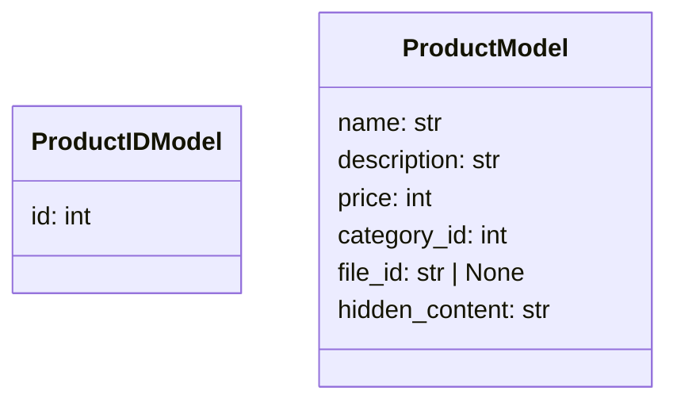

### **Анализ кода проекта `hypotez`**

=========================================================================================

#### **Расположение файла в проекте**:
Файл расположен по пути `hypotez/src/endpoints/bots/telegram/digital_market/bot/admin/schemas.py`. Это указывает на то, что файл содержит схемы данных, используемые в административной части Telegram-бота для управления цифровым рынком.

---

### **1. Блок-схема**

```mermaid
graph LR
    A[Начало] --> B{Определение схемы ProductIDModel}
    B --> C{Определение схемы ProductModel}
    C --> D[Конец]

    subgraph ProductIDModel
        E[id: int]
    end

    subgraph ProductModel
        F[name: str (min_length=5)]
        G[description: str (min_length=5)]
        H[price: int (gt=0)]
        I[category_id: int (gt=0)]
        J[file_id: str | None]
        K[hidden_content: str (min_length=5)]
    end
```

**Описание блок-схемы**:

1.  **Начало**: Начало процесса.
2.  **Определение схемы `ProductIDModel`**: Определение схемы для представления ID продукта.
    *   Пример: `ProductIDModel(id=123)`
3.  **Определение схемы `ProductModel`**: Определение схемы для представления информации о продукте.
    *   Пример: `ProductModel(name="Example Product", description="Detailed description", price=100, category_id=1, file_id="file123", hidden_content="Secret content")`
4.  **Конец**: Конец процесса.

---

### **2. Диаграмма**



**Объяснение диаграммы**:

*   `ProductIDModel`: Класс для представления ID продукта.
    *   `id`: ID продукта (целое число).
*   `ProductModel`: Класс для представления информации о продукте.
    *   `name`: Название продукта (строка, минимальная длина 5 символов).
    *   `description`: Описание продукта (строка, минимальная длина 5 символов).
    *   `price`: Цена продукта (целое число, больше 0).
    *   `category_id`: ID категории продукта (целое число, больше 0).
    *   `file_id`: ID файла продукта (строка или `None`).
    *   `hidden_content`: Скрытое содержимое продукта (строка, минимальная длина 5 символов).

---

### **3. Объяснение**

#### **Импорты**:

*   `from pydantic import BaseModel, ConfigDict, Field`: Импортирует классы и функции из библиотеки `pydantic` для создания моделей данных с валидацией типов.
    *   `BaseModel`: Базовый класс для создания моделей данных.
    *   `ConfigDict`: Класс для конфигурации модели.
    *   `Field`: Функция для определения полей модели и их параметров.

#### **Классы**:

*   `ProductIDModel(BaseModel)`:
    *   Роль: Представляет модель данных для ID продукта.
    *   Атрибуты:
        *   `id: int`: ID продукта (целое число).
    *   Методы: Наследуются от `BaseModel`.
    *   Взаимодействие: Используется для передачи и валидации ID продукта.
*   `ProductModel(BaseModel)`:
    *   Роль: Представляет модель данных для информации о продукте.
    *   Атрибуты:
        *   `name: str`: Название продукта (строка, минимальная длина 5 символов).
        *   `description: str`: Описание продукта (строка, минимальная длина 5 символов).
        *   `price: int`: Цена продукта (целое число, больше 0).
        *   `category_id: int`: ID категории продукта (целое число, больше 0).
        *   `file_id: str | None`: ID файла продукта (строка или `None`).
        *   `hidden_content: str`: Скрытое содержимое продукта (строка, минимальная длина 5 символов).
    *   Методы: Наследуются от `BaseModel`.
    *   Взаимодействие: Используется для передачи и валидации информации о продукте.

#### **Функции**:

В данном коде нет функций, только классы моделей данных.

#### **Переменные**:

*   `id: int`: Переменная, представляющая ID продукта в `ProductIDModel`.
*   `name: str`: Переменная, представляющая название продукта в `ProductModel`.
*   `description: str`: Переменная, представляющая описание продукта в `ProductModel`.
*   `price: int`: Переменная, представляющая цену продукта в `ProductModel`.
*   `category_id: int`: Переменная, представляющая ID категории продукта в `ProductModel`.
*   `file_id: str | None`: Переменная, представляющая ID файла продукта в `ProductModel`.
*   `hidden_content: str`: Переменная, представляющая скрытое содержимое продукта в `ProductModel`.

#### **Потенциальные ошибки или области для улучшения**:

*   **Обработка ошибок**: Отсутствует явная обработка ошибок валидации данных. Можно добавить обработку исключений `pydantic` для более информативных сообщений об ошибках.
*   **Валидация `file_id`**: Не определена валидация для `file_id`. Возможно, стоит добавить проверку на формат или существование файла.

#### **Взаимосвязи с другими частями проекта**:

Эти модели данных (`ProductIDModel` и `ProductModel`) используются в административной части Telegram-бота для управления цифровым рынком. Они обеспечивают валидацию и типизацию данных, что помогает избежать ошибок и повышает надежность системы. Они могут быть использованы в API-запросах для создания, обновления и удаления продуктов.