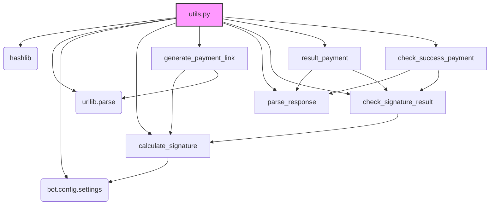

### **Системные инструкции для обработки кода проекта `hypotez`**

=========================================================================================

Описание функциональности и правил для генерации, анализа и улучшения кода. Направлено на обеспечение последовательного и читаемого стиля кодирования, соответствующего требованиям.

---

### **Основные принципы**

#### **1. Общие указания**:
- Соблюдай четкий и понятный стиль кодирования.
- Все изменения должны быть обоснованы и соответствовать установленным требованиям.

#### **2. Комментарии**:
- Используй `#` для внутренних комментариев.
- Документация всех функций, методов и классов должна следовать такому формату: 
    ```python
        def function(param: str, param1: Optional[str | dict | str] = None) -> dict | None:
            """ 
            Args:
                param (str): Описание параметра `param`.
                param1 (Optional[str | dict | str], optional): Описание параметра `param1`. По умолчанию `None`.
    
            Returns:
                dict | None: Описание возвращаемого значения. Возвращает словарь или `None`.
    
            Raises:
                SomeError: Описание ситуации, в которой возникает исключение `SomeError`.

            Ехаmple:
                >>> function('param', 'param1')
                {'param': 'param1'}
            """
    ```
- Комментарии и документация должны быть четкими, лаконичными и точными.

#### **3. Форматирование кода**:
- Используй одинарные кавычки. `a:str = 'value'`, `print('Hello World!')`;
- Добавляй пробелы вокруг операторов. Например, `x = 5`;
- Все параметры должны быть аннотированы типами. `def function(param: str, param1: Optional[str | dict | str] = None) -> dict | None:`;
- Не используй `Union`. Вместо этого используй `|`.

#### **4. Логирование**:
- Для логгирования Всегда Используй модуль `logger` из `src.logger.logger`.
- Ошибки должны логироваться с использованием `logger.error`.
Пример:
    ```python
        try:
            ...
        except Exception as ex:
            logger.error('Error while processing data', ех, exc_info=True)
    ```
#### **5 Не используй `Union[]` в коде. Вместо него используй `|`
Например:
```python
x: str | int ...
```


---

### **Основные требования**:

#### **1. Формат ответов в Markdown**:
- Все ответы должны быть выполнены в формате **Markdown**.

#### **2. Формат комментариев**:
- Используй указанный стиль для комментариев и документации в коде.
- Пример:

```python
from typing import Generator, Optional, List
from pathlib import Path


def read_text_file(
    file_path: str | Path,
    as_list: bool = False,
    extensions: Optional[List[str]] = None,
    chunk_size: int = 8192,
) -> Generator[str, None, None] | str | None:
    """
    Считывает содержимое файла (или файлов из каталога) с использованием генератора для экономии памяти.

    Args:
        file_path (str | Path): Путь к файлу или каталогу.
        as_list (bool): Если `True`, возвращает генератор строк.
        extensions (Optional[List[str]]): Список расширений файлов для чтения из каталога.
        chunk_size (int): Размер чанков для чтения файла в байтах.

    Returns:
        Generator[str, None, None] | str | None: Генератор строк, объединенная строка или `None` в случае ошибки.

    Raises:
        Exception: Если возникает ошибка при чтении файла.

    Example:
        >>> from pathlib import Path
        >>> file_path = Path('example.txt')
        >>> content = read_text_file(file_path)
        >>> if content:
        ...    print(f'File content: {content[:100]}...')
        File content: Example text...
    """
    ...
```
- Всегда делай подробные объяснения в комментариях. Избегай расплывчатых терминов, 
- таких как *«получить»* или *«делать»*. Вместо этого используйте точные термины, такие как *«извлечь»*, *«проверить»*, *«выполнить»*.
- Вместо: *«получаем»*, *«возвращаем»*, *«преобразовываем»* используй имя объекта *«функция получае»*, *«переменная возвращает»*, *«код преобразовывает»* 
- Комментарии должны непосредственно предшествовать описываемому блоку кода и объяснять его назначение.

#### **3. Пробелы вокруг операторов присваивания**:
- Всегда добавляйте пробелы вокруг оператора `=`, чтобы повысить читаемость.
- Примеры:
  - **Неправильно**: `x=5`
  - **Правильно**: `x = 5`

#### **4. Использование `j_loads` или `j_loads_ns`**:
- Для чтения JSON или конфигурационных файлов замените стандартное использование `open` и `json.load` на `j_loads` или `j_loads_ns`.
- Пример:

```python
# Неправильно:
with open('config.json', 'r', encoding='utf-8') as f:
    data = json.load(f)

# Правильно:
data = j_loads('config.json')
```

#### **5. Сохранение комментариев**:
- Все существующие комментарии, начинающиеся с `#`, должны быть сохранены без изменений в разделе «Улучшенный код».
- Если комментарий кажется устаревшим или неясным, не изменяйте его. Вместо этого отметьте его в разделе «Изменения».

#### **6. Обработка `...` в коде**:
- Оставляйте `...` как указатели в коде без изменений.
- Не документируйте строки с `...`.
```

#### **7. Аннотации**
Для всех переменных должны быть определены аннотации типа. 
Для всех функций все входные и выходные параметры аннотириваны
Для все параметров должны быть аннотации типа.


### **8. webdriver**
В коде используется webdriver. Он импртируется из модуля `webdriver` проекта `hypotez`
```python
from src.webdirver import Driver, Chrome, Firefox, Playwright, ...
driver = Driver(Firefox)

Пoсле чего может использоваться как

close_banner = {
  "attribute": null,
  "by": "XPATH",
  "selector": "//button[@id = 'closeXButton']",
  "if_list": "first",
  "use_mouse": false,
  "mandatory": false,
  "timeout": 0,
  "timeout_for_event": "presence_of_element_located",
  "event": "click()",
  "locator_description": "Закрываю pop-up окно, если оно не появилось - не страшно (`mandatory`:`false`)"
}

result = driver.execute_locator(close_banner)
```

## Анализ кода `hypotez/src/endpoints/bots/telegram/digital_market/bot/app/utils.py`

### 1. Блок-схема

```mermaid
graph TD
    A[Начало] --> B{Выбор типа URL (is_result)?};
    B -- Да --> C[Формирование строки для Result URL: cost:inv_id:password];
    B -- Нет --> D[Формирование строки для Initial/Success URL: login:cost:inv_id:password];
    C --> E[Добавление дополнительных параметров (Shp_...) в строку];
    D --> E;
    E --> F[Вычисление MD5-хеша строки];
    F --> G[Возврат хеша];
    G --> H[Генерация ссылки для оплаты];
    H --> I[Формирование данных для запроса];
    I --> J[Кодирование данных в URL-формат];
    J --> K[Возврат URL];
    K --> L[Разбор строки запроса];
    L --> M[Извлечение параметров из URL];
    M --> N[Возврат словаря с параметрами];
    N --> O[Проверка подписи результата];
    O --> P[Вычисление подписи для Result URL];
    P --> Q{Сравнение вычисленной и полученной подписи?};
    Q -- Да --> R[Успешно];
    Q -- Нет --> S[Неверная подпись];
    R --> T[Обработка результата оплаты];
    T --> U{Проверка подписи результата};
    U -- Да --> V[Возврат "OK"+номер заказа];
    U -- Нет --> W[Возврат "bad sign"];
    V --> X[Проверка успешности оплаты];
    X --> Y{Проверка подписи результата};
    Y -- Да --> Z[Возврат "Thank you..."];
    Y -- Нет --> AA[Возврат "bad sign"];
```

**Примеры для каждого логического блока:**

*   **A (Начало):** Начало выполнения любой из функций.
*   **B (Выбор типа URL):** Функция `calculate_signature` определяет, какой тип URL используется (Result или Initial/Success) на основе `is_result`.
    *   Пример: `is_result=True` для Result URL, `is_result=False` для других.
*   **C (Формирование строки для Result URL):** Строка формируется как `cost:inv_id:password`.
    *   Пример: `"100.0:12345:securepass"`.
*   **D (Формирование строки для Initial/Success URL):** Строка формируется как `login:cost:inv_id:password`.
    *   Пример: `"user123:100.0:12345:securepass"`.
*   **E (Добавление дополнительных параметров):** Дополнительные параметры (Shp\_user\_id, Shp\_user\_telegram\_id, Shp\_product\_id) добавляются в строку.
    *   Пример: `":Shp_user_id=1::Shp_user_telegram_id=123456789::Shp_product_id=10"`.
*   **F (Вычисление MD5-хеша строки):** Вычисляется MD5-хеш сформированной строки.
    *   Пример: `"e10adc3949ba59abbe56e057f20f883e"`.
*   **G (Возврат хеша):** Функция возвращает вычисленный MD5-хеш.
*   **H (Генерация ссылки для оплаты):** Функция `generate_payment_link` генерирует ссылку для оплаты с параметрами.
*   **I (Формирование данных для запроса):** Формируется словарь с данными для запроса (MerchantLogin, OutSum, InvId, Description, SignatureValue и т.д.).
*   **J (Кодирование данных в URL-формат):** Данные кодируются в URL-формат с помощью `urllib.parse.urlencode`.
    *   Пример: `"MerchantLogin=test&OutSum=100.0&InvId=12345&..."`.
*   **K (Возврат URL):** Функция возвращает полную ссылку для оплаты.
*   **L (Разбор строки запроса):** Функция `parse_response` разбирает строку запроса.
*   **M (Извлечение параметров из URL):** Извлекаются параметры из URL с помощью `urllib.parse.parse_qsl`.
*   **N (Возврат словаря с параметрами):** Функция возвращает словарь с извлеченными параметрами.
*   **O (Проверка подписи результата):** Функция `check_signature_result` проверяет подпись результата.
*   **P (Вычисление подписи для Result URL):** Вычисляется подпись для Result URL.
*   **Q (Сравнение вычисленной и полученной подписи):** Сравниваются вычисленная и полученная подписи.
*   **R (Успешно):** Подписи совпадают, операция успешна.
*   **S (Неверная подпись):** Подписи не совпадают, операция не успешна.
*   **T (Обработка результата оплаты):** Функция `result_payment` обрабатывает результат оплаты.
*   **U (Проверка подписи результата):** Проверяется подпись результата в `result_payment`.
*   **V (Возврат "OK"+номер заказа):** Возвращается "OK" + номер заказа, если подпись верна.
*   **W (Возврат "bad sign"):** Возвращается "bad sign", если подпись не верна.
*   **X (Проверка успешности оплаты):** Функция `check_success_payment` проверяет успешность оплаты.
*   **Y (Проверка подписи результата):** Проверяется подпись результата в `check_success_payment`.
*   **Z (Возврат "Thank you..."):** Возвращается "Thank you...", если подпись верна.
*   **AA (Возврат "bad sign"):** Возвращается "bad sign", если подпись не верна.

### 2. Диаграмма



**Объяснение зависимостей:**

*   `hashlib`: Используется для вычисления MD5-хешей, обеспечивающих подпись данных.
*   `urllib.parse`: Используется для кодирования параметров в URL (parse.urlencode) и для разбора URL (parse.urlparse, parse.parse_qsl).
*   `bot.config.settings`: Используется для получения настроек, таких как логин мерчанта (MRH\_LOGIN) и пароли (MRH\_PASS\_1, MRH\_PASS\_2).
*   `calculate_signature`: Функция для вычисления подписи на основе параметров. Используется в `generate_payment_link`, `check_signature_result`.
*   `generate_payment_link`: Функция для генерации ссылки на оплату. Использует `calculate_signature` и `urllib.parse`.
*   `parse_response`: Функция для разбора строки запроса и получения параметров. Используется в `result_payment` и `check_success_payment`.
*   `check_signature_result`: Функция для проверки подписи. Используется в `result_payment` и `check_success_payment`.
*   `result_payment`: Функция для обработки результата оплаты. Использует `parse_response` и `check_signature_result`.
*   `check_success_payment`: Функция для проверки успешности оплаты. Использует `parse_response` и `check_signature_result`.

### 3. Объяснение

**Импорты:**

*   `hashlib`: Используется для создания MD5-хешей, что необходимо для подписи запросов и проверки их целостности.
*   `urllib.parse`: Предоставляет инструменты для работы с URL, включая кодирование параметров в строку запроса (`urlencode`) и разбор URL (`urlparse`, `parse_qsl`).
*   `bot.config.settings`: Содержит настройки бота, такие как логин мерчанта Robokassa (`settings.MRH_LOGIN`) и пароли (`settings.MRH_PASS_1`, `settings.MRH_PASS_2`), которые используются для формирования подписи.

**Функции:**

*   `calculate_signature(login, cost, inv_id, password, user_id, user_telegram_id, product_id, is_result=False) -> str`:
    *   **Аргументы:**
        *   `login` (str): Логин мерчанта.
        *   `cost` (float): Стоимость товара.
        *   `inv_id` (int): Номер заказа.
        *   `password` (str): Пароль мерчанта.
        *   `user_id` (int): ID пользователя.
        *   `user_telegram_id` (int): Telegram ID пользователя.
        *   `product_id` (int): ID товара.
        *   `is_result` (bool, optional): Флаг, указывающий, используется ли функция для Result URL. По умолчанию `False`.
    *   **Возвращаемое значение:**
        *   str: MD5-хеш, представляющий подпись.
    *   **Назначение:** Вычисляет MD5-хеш на основе переданных параметров, который используется для проверки целостности запросов к Robokassa.  Различает формирование строки для `ResultURL` и для `SuccessURL`/`InitialURL`.
    *   **Пример:**
        ```python
        signature = calculate_signature('mylogin', 100.0, 12345, 'mypassword', 1, 123456789, 10)
        print(signature)  # Выведет MD5-хеш
        ```
*   `generate_payment_link(cost: float, number: int, description: str, user_id: int, user_telegram_id: int, product_id: int, is_test=1, robokassa_payment_url='https://auth.robokassa.ru/Merchant/Index.aspx') -> str`:
    *   **Аргументы:**
        *   `cost` (float): Стоимость товара.
        *   `number` (int): Номер заказа.
        *   `description` (str): Описание заказа.
        *   `user_id` (int): ID пользователя.
        *   `user_telegram_id` (int): Telegram ID пользователя.
        *   `product_id` (int): ID товара.
        *   `is_test` (int, optional): Флаг тестового режима (1 - тест, 0 - боевой режим). По умолчанию 1.
        *   `robokassa_payment_url` (str, optional): URL для оплаты Robokassa. По умолчанию 'https://auth.robokassa.ru/Merchant/Index.aspx'.
    *   **Возвращаемое значение:**
        *   str: Ссылка на страницу оплаты Robokassa.
    *   **Назначение:** Генерирует URL для оплаты через Robokassa с необходимыми параметрами, включая подпись.
    *   **Пример:**
        ```python
        payment_link = generate_payment_link(100.0, 12345, 'Test order', 1, 123456789, 10)
        print(payment_link)  # Выведет URL для оплаты
        ```
*   `parse_response(request: str) -> dict`:
    *   **Аргументы:**
        *   `request` (str): Строка запроса (URL).
    *   **Возвращаемое значение:**
        *   dict: Словарь с параметрами, извлеченными из URL.
    *   **Назначение:** Разбирает строку запроса и возвращает словарь с параметрами.
    *   **Пример:**
        ```python
        request = 'https://example.com?param1=value1&param2=value2'
        params = parse_response(request)
        print(params)  # Выведет {'param1': 'value1', 'param2': 'value2'}
        ```
*   `check_signature_result(out_sum, inv_id, received_signature, password, user_id, user_telegram_id, product_id) -> bool`:
    *   **Аргументы:**
        *   `out_sum` (float): Сумма оплаты.
        *   `inv_id` (int): Номер заказа.
        *   `received_signature` (str): Полученная подпись.
        *   `password` (str): Пароль мерчанта.
        *   `user_id` (int): ID пользователя.
        *   `user_telegram_id` (int): Telegram ID пользователя.
        *   `product_id` (int): ID товара.
    *   **Возвращаемое значение:**
        *   bool: `True`, если подпись верна, `False` в противном случае.
    *   **Назначение:** Проверяет, соответствует ли полученная подпись вычисленной. Используется для проверки подлинности запросов от Robokassa.
    *   **Пример:**
        ```python
        is_valid = check_signature_result(100.0, 12345, 'signature', 'mypassword', 1, 123456789, 10)
        print(is_valid)  # Выведет True или False
        ```
*   `result_payment(request: str) -> str`:
    *   **Аргументы:**
        *   `request` (str): Строка запроса с параметрами оплаты.
    *   **Возвращаемое значение:**
        *   str: `'OK{inv_id}'`, если оплата прошла успешно, `'bad sign'` в противном случае.
    *   **Назначение:** Обрабатывает результат оплаты, проверяет подпись и возвращает результат.
    *   **Пример:**
        ```python
        result = result_payment('https://example.com?OutSum=100.0&InvId=12345&SignatureValue=signature&Shp_user_id=1&Shp_user_telegram_id=123456789&Shp_product_id=10')
        print(result)  # Выведет 'OK12345' или 'bad sign'
        ```
*   `check_success_payment(request: str) -> str`:
    *   **Аргументы:**
        *   `request` (str): Строка запроса с параметрами оплаты.
    *   **Возвращаемое значение:**
        *   str: `"Thank you for using our service"`, если оплата прошла успешно, `"bad sign"` в противном случае.
    *   **Назначение:** Проверяет успешность оплаты, проверяет подпись и возвращает сообщение об успехе или ошибке.
    *   **Пример:**
        ```python
        result = check_success_payment('https://example.com?OutSum=100.0&InvId=12345&SignatureValue=signature&Shp_user_id=1&Shp_user_telegram_id=123456789&Shp_product_id=10')
        print(result)  # Выведет "Thank you for using our service" или "bad sign"
        ```

**Переменные:**

*   В основном используются локальные переменные внутри функций для хранения промежуточных результатов вычислений и параметров.
*   Используются константы из `bot.config.settings` для получения параметров мерчанта (логин, пароли).

**Потенциальные ошибки и области для улучшения:**

1.  **Обработка исключений:** В коде отсутствуют явные блоки `try...except` для обработки возможных исключений, например, при разборе URL или вычислении хеша. Рекомендуется добавить обработку исключений для повышения устойчивости кода.
2.  **Логирование:** Отсутствует логирование важных событий, таких как ошибки проверки подписи или успешные оплаты. Добавление логирования поможет в отладке и мониторинге работы системы.
3.  **Безопасность:** Хранение паролей в `bot.config.settings` может быть небезопасным. Рассмотреть возможность использования более безопасных способов хранения и передачи паролей (например, переменные среды или зашифрованные файлы конфигурации).
4.  **Типизация:** Аннотации типов добавлены, что хорошо, но можно добавить проверки типов во время выполнения для повышения надежности (например, с использованием `assert isinstance(cost, float)`).

**Взаимосвязи с другими частями проекта:**

*   Этот модуль используется для генерации ссылок для оплаты через Robokassa и обработки ответов от Robokassa. Он тесно связан с модулем `bot.config.settings`, который предоставляет необходимые настройки. Этот модуль, вероятно, используется в других частях бота, которые отвечают за обработку платежей и заказов.