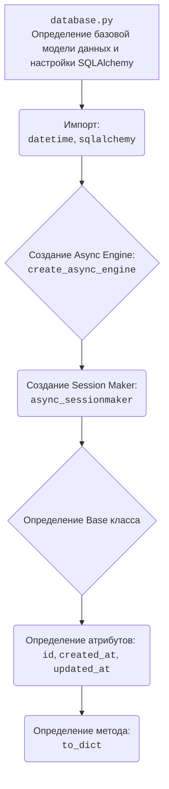

### **Анализ кода проекта `hypotez`**

=========================================================================================

#### **Расположение файла в проекте**:
Файл находится по пути `hypotez/src/endpoints/bots/telegram/digital_market/bot/dao/database.py`. Это указывает на то, что файл отвечает за взаимодействие с базой данных в Telegram-боте для цифрового рынка.

#### **1. Блок-схема**:

```mermaid
graph LR
    A[Начало] --> B(Импорт библиотек: datetime, sqlalchemy);
    B --> C{Создание движка SQLAlchemy: create_async_engine(database_url)};
    C --> D(Создание фабрики сессий: async_sessionmaker(engine, class_=AsyncSession));
    D --> E{Определение базового класса Base};
    E --> F(Атрибуты класса: id, created_at, updated_at);
    F --> G(Метод to_dict: преобразование объекта в словарь);
    G --> H[Конец];
    
    subgraph Пример использования
        I[Создание экземпляра класса] --> J{Преобразование в словарь: to_dict()};
        J --> K[Словарное представление объекта];
    end
    
    style A fill:#f9f,stroke:#333,stroke-width:2px
    style H fill:#f9f,stroke:#333,stroke-width:2px
```

#### **2. Диаграмма**:



#### **3. Объяснение**:

**Импорты**:
- `datetime` из модуля `datetime`: Используется для работы с датой и временем. В данном случае, для полей `created_at` и `updated_at`.
- `func, TIMESTAMP, Integer` из модуля `sqlalchemy`: Используются для определения типов столбцов и функций базы данных (например, `func.now()` для получения текущего времени).
- `Mapped, mapped_column, DeclarativeBase` из `sqlalchemy.orm`: Используются для определения ORM моделей, атрибутов и базового класса.
- `AsyncAttrs, async_sessionmaker, create_async_engine, AsyncSession` из `sqlalchemy.ext.asyncio`: Используются для асинхронной работы с базой данных.

**Переменные**:
- `engine`: Объект движка SQLAlchemy, созданный с использованием URL базы данных (`database_url`). Отвечает за подключение к базе данных.
- `async_session_maker`: Фабрика сессий для создания асинхронных сессий SQLAlchemy.

**Классы**:
- `Base(AsyncAttrs, DeclarativeBase)`: Базовый класс для всех ORM моделей.
    - `__abstract__ = True`: Указывает, что это абстрактный класс и не должен быть создан в базе данных как отдельная таблица.
    - `id: Mapped[int]`: Первичный ключ, целое число, автоматически увеличивается.
    - `created_at: Mapped[datetime]`: Дата и время создания записи, по умолчанию текущее время.
    - `updated_at: Mapped[datetime]`: Дата и время последнего обновления записи, по умолчанию текущее время, обновляется при каждом изменении записи.
    - `__tablename__(cls)`: Возвращает имя таблицы, образованное из имени класса в нижнем регистре с добавлением "s" в конце.
    - `to_dict(self)`: Метод для преобразования объекта в словарь, где ключи - имена столбцов, значения - значения атрибутов объекта.

**Функции**:
- Нет явных функций, кроме методов класса `Base`.

**Потенциальные улучшения**:
- Проверку существования `database_url` перед созданием движка.
- Добавление обработки исключений при создании движка и фабрики сессий.

**Взаимосвязь с другими частями проекта**:
- Этот файл является частью слоя доступа к данным (DAO) и предоставляет базовый класс для всех моделей базы данных. Он используется для взаимодействия с базой данных и определения структуры таблиц. Другие части проекта, такие как обработчики API или бизнес-логика, могут использовать эти модели для чтения и записи данных.