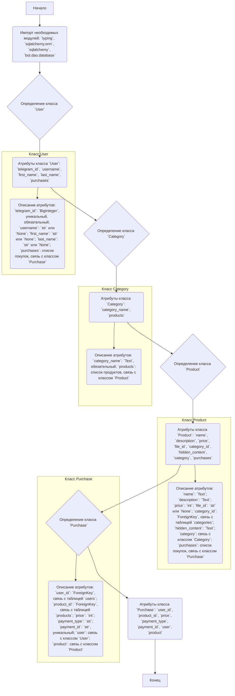
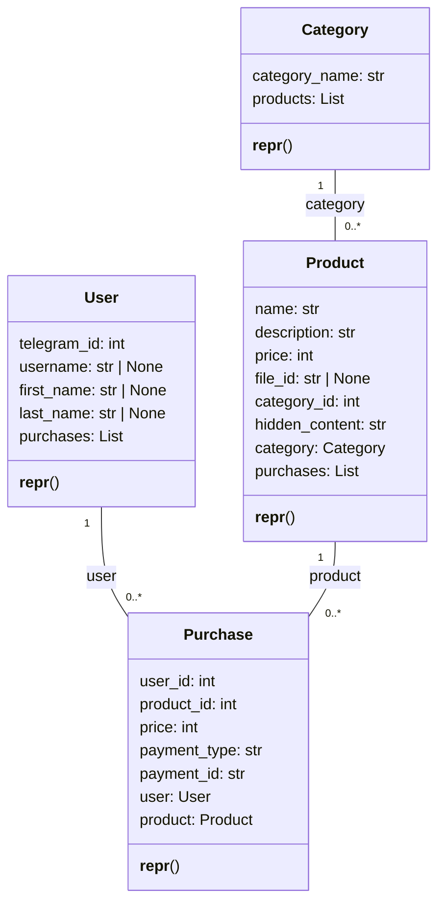

### **Системные инструкции для обработки кода проекта `hypotez`**

=========================================================================================

Описание функциональности и правил для генерации, анализа и улучшения кода. Направлено на обеспечение последовательного и читаемого стиля кодирования, соответствующего требованиям.

---

### **Основные принципы**

#### **1. Общие указания**:
- Соблюдай четкий и понятный стиль кодирования.
- Все изменения должны быть обоснованы и соответствовать установленным требованиям.

#### **2. Комментарии**:
- Используй `#` для внутренних комментариев.
- Документация всех функций, методов и классов должна следовать такому формату: 
    ```python
        def function(param: str, param1: Optional[str | dict | str] = None) -> dict | None:
            """ 
            Args:
                param (str): Описание параметра `param`.
                param1 (Optional[str | dict | str], optional): Описание параметра `param1`. По умолчанию `None`.
    
            Returns:
                dict | None: Описание возвращаемого значения. Возвращает словарь или `None`.
    
            Raises:
                SomeError: Описание ситуации, в которой возникает исключение `SomeError`.

            Ехаmple:
                >>> function('param', 'param1')
                {'param': 'param1'}
            """
    ```
- Комментарии и документация должны быть четкими, лаконичными и точными.

#### **3. Форматирование кода**:
- Используй одинарные кавычки. `a:str = 'value'`, `print('Hello World!')`;
- Добавляй пробелы вокруг операторов. Например, `x = 5`;
- Все параметры должны быть аннотированы типами. `def function(param: str, param1: Optional[str | dict | str] = None) -> dict | None:`;
- Не используй `Union`. Вместо этого используй `|`.

#### **4. Логирование**:
- Для логгирования Всегда Используй модуль `logger` из `src.logger.logger`.
- Ошибки должны логироваться с использованием `logger.error`.
Пример:
    ```python
        try:
            ...
        except Exception as ex:
            logger.error('Error while processing data', ех, exc_info=True)
    ```
#### **5 Не используй `Union[]` в коде. Вместо него используй `|`
Например:
```python
x: str | int ...
```


---

### **Основные требования**:

#### **1. Формат ответов в Markdown**:
- Все ответы должны быть выполнены в формате **Markdown**.

#### **2. Формат комментариев**:
- Используй указанный стиль для комментариев и документации в коде.
- Пример:

```python
from typing import Generator, Optional, List
from pathlib import Path


def read_text_file(
    file_path: str | Path,
    as_list: bool = False,
    extensions: Optional[List[str]] = None,
    chunk_size: int = 8192,
) -> Generator[str, None, None] | str | None:
    """
    Считывает содержимое файла (или файлов из каталога) с использованием генератора для экономии памяти.

    Args:
        file_path (str | Path): Путь к файлу или каталогу.
        as_list (bool): Если `True`, возвращает генератор строк.
        extensions (Optional[List[str]]): Список расширений файлов для чтения из каталога.
        chunk_size (int): Размер чанков для чтения файла в байтах.

    Returns:
        Generator[str, None, None] | str | None: Генератор строк, объединенная строка или `None` в случае ошибки.

    Raises:
        Exception: Если возникает ошибка при чтении файла.

    Example:
        >>> from pathlib import Path
        >>> file_path = Path('example.txt')
        >>> content = read_text_file(file_path)
        >>> if content:
        ...    print(f'File content: {content[:100]}...')
        File content: Example text...
    """
    ...
```
- Всегда делай подробные объяснения в комментариях. Избегай расплывчатых терминов, 
- таких как *«получить»* или *«делать»*. Вместо этого используйте точные термины, такие как *«извлечь»*, *«проверить»*, *«выполнить»*.
- Вместо: *«получаем»*, *«возвращаем»*, *«преобразовываем»* используй имя объекта *«функция получае»*, *«переменная возвращает»*, *«код преобразовывает»* 
- Комментарии должны непосредственно предшествовать описываемому блоку кода и объяснять его назначение.

#### **3. Пробелы вокруг операторов присваивания**:
- Всегда добавляйте пробелы вокруг оператора `=`, чтобы повысить читаемость.
- Примеры:
  - **Неправильно**: `x=5`
  - **Правильно**: `x = 5`

#### **4. Использование `j_loads` или `j_loads_ns`**:
- Для чтения JSON или конфигурационных файлов замените стандартное использование `open` и `json.load` на `j_loads` или `j_loads_ns`.
- Пример:

```python
# Неправильно:
with open('config.json', 'r', encoding='utf-8') as f:
    data = json.load(f)

# Правильно:
data = j_loads('config.json')
```

#### **5. Сохранение комментариев**:
- Все существующие комментарии, начинающиеся с `#`, должны быть сохранены без изменений в разделе «Улучшенный код».
- Если комментарий кажется устаревшим или неясным, не изменяйте его. Вместо этого отметьте его в разделе «Изменения».

#### **6. Обработка `...` в коде**:
- Оставляйте `...` как указатели в коде без изменений.
- Не документируйте строки с `...`.
```

#### **7. Аннотации**
Для всех переменных должны быть определены аннотации типа. 
Для всех функций все входные и выходные параметры аннотириваны
Для все параметров должны быть аннотации типа.


### **8. webdriver**
В коде используется webdriver. Он импртируется из модуля `webdriver` проекта `hypotez`
```python
from src.webdirver import Driver, Chrome, Firefox, Playwright, ...
driver = Driver(Firefox)

Пoсле чего может использоваться как

close_banner = {
  "attribute": null,
  "by": "XPATH",
  "selector": "//button[@id = 'closeXButton']",
  "if_list": "first",
  "use_mouse": false,
  "mandatory": false,
  "timeout": 0,
  "timeout_for_event": "presence_of_element_located",
  "event": "click()",
  "locator_description": "Закрываю pop-up окно, если оно не появилось - не страшно (`mandatory`:`false`)"
}

result = driver.execute_locator(close_banner)
```

### Анализ кода `hypotez/src/endpoints/bots/telegram/digital_market/bot/dao/models.py`

#### 1. Блок-схема



#### 2. Диаграмма



Диаграмма описывает четыре класса: `User`, `Category`, `Product` и `Purchase`.
- Класс `User` представляет пользователя с атрибутами, такими как `telegram_id`, `username`, `first_name`, `last_name` и списком покупок (`purchases`).
- Класс `Category` представляет категорию товаров с атрибутами, такими как `category_name` и списком продуктов (`products`).
- Класс `Product` представляет продукт с атрибутами, такими как `name`, `description`, `price`, `file_id`, `category_id`, `hidden_content`, `category` и списком покупок (`purchases`).
- Класс `Purchase` представляет покупку с атрибутами, такими как `user_id`, `product_id`, `price`, `payment_type`, `payment_id`, `user` и `product`.

Отношения между классами:
- `User` имеет отношение "один ко многим" с `Purchase` (один пользователь может совершить много покупок).
- `Product` имеет отношение "один ко многим" с `Purchase` (один продукт может быть куплен много раз).
- `Category` имеет отношение "один ко многим" с `Product` (одна категория может содержать много продуктов).

Импорты:
- `typing.List`: Используется для аннотации типов, указывая, что атрибуты `purchases` и `products` являются списками.
- `sqlalchemy.orm.Mapped`, `sqlalchemy.orm.mapped_column`, `sqlalchemy.orm.relationship`: Используются для определения классов как моделей SQLAlchemy, атрибутов как столбцов в базе данных и связей между таблицами.
- `sqlalchemy.BigInteger`, `sqlalchemy.Text`, `sqlalchemy.ForeignKey`, `sqlalchemy.text`: Используются для определения типов данных столбцов в базе данных и внешних ключей.
- `bot.dao.database.Base`: Используется как базовый класс для моделей SQLAlchemy, обеспечивая связь с базой данных.

#### 3. Объяснение

**Импорты:**

- `from typing import List`: Импортирует `List` из модуля `typing` для использования в аннотациях типов, указывая, что переменная является списком.
- `from sqlalchemy.orm import Mapped, mapped_column, relationship`: Импортирует классы и функции из SQLAlchemy ORM (Object Relational Mapper), которые используются для определения структуры таблиц базы данных и связей между ними.
  - `Mapped` и `mapped_column` используются для определения атрибутов класса как столбцов в таблице базы данных.
  - `relationship` используется для определения связей между таблицами.
- `from sqlalchemy import BigInteger, Text, ForeignKey, text`: Импортирует типы данных и функции из SQLAlchemy, которые используются для определения типов столбцов в таблице базы данных и создания внешних ключей.
  - `BigInteger` используется для определения столбца как большого целого числа.
  - `Text` используется для определения столбца как текста.
  - `ForeignKey` используется для определения столбца как внешнего ключа, который ссылается на столбец в другой таблице.
- `from bot.dao.database import Base`: Импортирует базовый класс `Base` из модуля `bot.dao.database`. Этот класс используется как базовый класс для всех моделей SQLAlchemy, которые представляют таблицы в базе данных.

**Классы:**

- `User(Base)`: Представляет таблицу пользователей в базе данных.
  - Атрибуты:
    - `telegram_id: Mapped[int]`: Уникальный идентификатор пользователя в Telegram (большое целое число, уникальное, не может быть `None`).
    - `username: Mapped[str | None]`: Имя пользователя в Telegram (может быть `None`).
    - `first_name: Mapped[str | None]`: Имя пользователя (может быть `None`).
    - `last_name: Mapped[str | None]`: Фамилия пользователя (может быть `None`).
    - `purchases: Mapped[List['Purchase']]`: Список покупок, связанных с пользователем (связь "один ко многим" с классом `Purchase`).
  - Методы:
    - `__repr__(self)`: Возвращает строковое представление объекта `User`.

- `Category(Base)`: Представляет таблицу категорий товаров в базе данных.
  - Атрибуты:
    - `category_name: Mapped[str]`: Название категории (текст, не может быть `None`).
    - `products: Mapped[List["Product"]]`: Список продуктов, связанных с категорией (связь "один ко многим" с классом `Product`).
  - Методы:
    - `__repr__(self)`: Возвращает строковое представление объекта `Category`.

- `Product(Base)`: Представляет таблицу продуктов в базе данных.
  - Атрибуты:
    - `name: Mapped[str]`: Название продукта (текст).
    - `description: Mapped[str]`: Описание продукта (текст).
    - `price: Mapped[int]`: Цена продукта (целое число).
    - `file_id: Mapped[str | None]`: Идентификатор файла, связанного с продуктом (текст, может быть `None`).
    - `category_id: Mapped[int]`: Идентификатор категории, к которой относится продукт (внешний ключ, ссылается на таблицу `categories`).
    - `hidden_content: Mapped[str]`: Скрытое содержимое, связанное с продуктом (текст).
    - `category: Mapped["Category"]`: Категория, к которой относится продукт (связь "один ко многим" с классом `Category`).
    - `purchases: Mapped[List['Purchase']]`: Список покупок, связанных с продуктом (связь "один ко многим" с классом `Purchase`).
  - Методы:
    - `__repr__(self)`: Возвращает строковое представление объекта `Product`.

- `Purchase(Base)`: Представляет таблицу покупок в базе данных.
  - Атрибуты:
    - `user_id: Mapped[int]`: Идентификатор пользователя, совершившего покупку (внешний ключ, ссылается на таблицу `users`).
    - `product_id: Mapped[int]`: Идентификатор продукта, который был куплен (внешний ключ, ссылается на таблицу `products`).
    - `price: Mapped[int]`: Цена продукта на момент покупки (целое число).
    - `payment_type: Mapped[str]`: Тип платежа (текст).
    - `payment_id: Mapped[str]`: Идентификатор платежа (текст, уникальный).
    - `user: Mapped["User"]`: Пользователь, совершивший покупку (связь "один ко многим" с классом `User`).
    - `product: Mapped["Product"]`: Продукт, который был куплен (связь "один ко многим" с классом `Product`).
  - Методы:
    - `__repr__(self)`: Возвращает строковое представление объекта `Purchase`.

**Переменные:**

- Атрибуты классов являются переменными, которые представляют столбцы в таблицах базы данных.
- Типы данных атрибутов определены с использованием аннотаций типов и классов SQLAlchemy (например, `int`, `str`, `BigInteger`, `Text`, `ForeignKey`).

**Взаимосвязи с другими частями проекта:**

- Модуль `bot.dao.database` предоставляет базовый класс `Base` для моделей SQLAlchemy и, вероятно, содержит информацию о подключении к базе данных.
- Эти модели используются для взаимодействия с базой данных, чтобы хранить и извлекать информацию о пользователях, категориях, продуктах и покупках.
- Модели используются в логике бота для управления пользователями, продуктами и покупками.

**Потенциальные ошибки и области для улучшения:**

- Отсутствует обработка исключений при работе с базой данных.
- Отсутствует валидация данных перед сохранением в базу данных.
- В классах `User`, `Category`, `Product` и `Purchase` не реализованы методы для добавления, изменения и удаления данных.
- Желательно добавить документацию к каждому классу и методу.
- Желательно добавить логирование операций с базой данных.