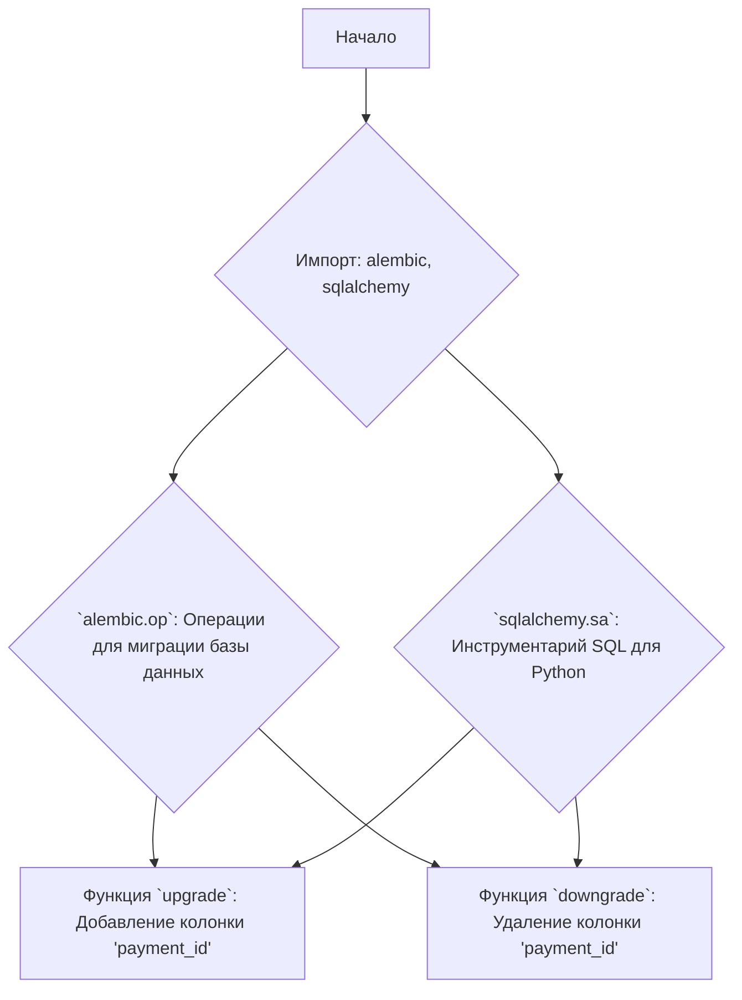

### **Системные инструкции для обработки кода проекта `hypotez`**

=========================================================================================

Описание функциональности и правил для генерации, анализа и улучшения кода. Направлено на обеспечение последовательного и читаемого стиля кодирования, соответствующего требованиям.

---

### **Основные принципы**

#### **1. Общие указания**:
- Соблюдай четкий и понятный стиль кодирования.
- Все изменения должны быть обоснованы и соответствовать установленным требованиям.

#### **2. Комментарии**:
- Используй `#` для внутренних комментариев.
- Документация всех функций, методов и классов должна следовать такому формату: 
    ```python
        def function(param: str, param1: Optional[str | dict | str] = None) -> dict | None:
            """ 
            Args:
                param (str): Описание параметра `param`.
                param1 (Optional[str | dict | str], optional): Описание параметра `param1`. По умолчанию `None`.
    
            Returns:
                dict | None: Описание возвращаемого значения. Возвращает словарь или `None`.
    
            Raises:
                SomeError: Описание ситуации, в которой возникает исключение `SomeError`.

            Ехаmple:
                >>> function('param', 'param1')
                {'param': 'param1'}
            """
    ```
- Комментарии и документация должны быть четкими, лаконичными и точными.

#### **3. Форматирование кода**:
- Используй одинарные кавычки. `a:str = 'value'`, `print('Hello World!')`;
- Добавляй пробелы вокруг операторов. Например, `x = 5`;
- Все параметры должны быть аннотированы типами. `def function(param: str, param1: Optional[str | dict | str] = None) -> dict | None:`;
- Не используй `Union`. Вместо этого используй `|`.

#### **4. Логирование**:
- Для логгирования Всегда Используй модуль `logger` из `src.logger.logger`.
- Ошибки должны логироваться с использованием `logger.error`.
Пример:
    ```python
        try:
            ...
        except Exception as ex:
            logger.error('Error while processing data', ех, exc_info=True)
    ```
#### **5 Не используй `Union[]` в коде. Вместо него используй `|`
Например:
```python
x: str | int ...
```


---

### **Основные требования**:

#### **1. Формат ответов в Markdown**:
- Все ответы должны быть выполнены в формате **Markdown**.

#### **2. Формат комментариев**:
- Используй указанный стиль для комментариев и документации в коде.
- Пример:

```python
from typing import Generator, Optional, List
from pathlib import Path


def read_text_file(
    file_path: str | Path,
    as_list: bool = False,
    extensions: Optional[List[str]] = None,
    chunk_size: int = 8192,
) -> Generator[str, None, None] | str | None:
    """
    Считывает содержимое файла (или файлов из каталога) с использованием генератора для экономии памяти.

    Args:
        file_path (str | Path): Путь к файлу или каталогу.
        as_list (bool): Если `True`, возвращает генератор строк.
        extensions (Optional[List[str]]): Список расширений файлов для чтения из каталога.
        chunk_size (int): Размер чанков для чтения файла в байтах.

    Returns:
        Generator[str, None, None] | str | None: Генератор строк, объединенная строка или `None` в случае ошибки.

    Raises:
        Exception: Если возникает ошибка при чтении файла.

    Example:
        >>> from pathlib import Path
        >>> file_path = Path('example.txt')
        >>> content = read_text_file(file_path)
        >>> if content:
        ...    print(f'File content: {content[:100]}...')
        File content: Example text...
    """
    ...
```
- Всегда делай подробные объяснения в комментариях. Избегай расплывчатых терминов, 
- таких как *«получить»* или *«делать»*
-  . Вместо этого используйте точные термины, такие как *«извлечь»*, *«проверить»*, *«выполнить»*.
- Вместо: *«получаем»*, *«возвращаем»*, *«преобразовываем»* используй имя объекта *«функция получае»*, *«переменная возвращает»*, *«код преобразовывает»* 
- Комментарии должны непосредственно предшествовать описываемому блоку кода и объяснять его назначение.

#### **3. Пробелы вокруг операторов присваивания**:
- Всегда добавляйте пробелы вокруг оператора `=`, чтобы повысить читаемость.
- Примеры:
  - **Неправильно**: `x=5`
  - **Правильно**: `x = 5`

#### **4. Использование `j_loads` или `j_loads_ns`**:
- Для чтения JSON или конфигурационных файлов замените стандартное использование `open` и `json.load` на `j_loads` или `j_loads_ns`.
- Пример:

```python
# Неправильно:
with open('config.json', 'r', encoding='utf-8') as f:
    data = json.load(f)

# Правильно:
data = j_loads('config.json')
```

#### **5. Сохранение комментариев**:
- Все существующие комментарии, начинающиеся с `#`, должны быть сохранены без изменений в разделе «Улучшенный код».
- Если комментарий кажется устаревшим или неясным, не изменяйте его. Вместо этого отметьте его в разделе «Изменения».

#### **6. Обработка `...` в коде**:
- Оставляйте `...` как указатели в коде без изменений.
- Не документируйте строки с `...`.
```

#### **7. Аннотации**
Для всех переменных должны быть определены аннотации типа. 
Для всех функций все входные и выходные параметры аннотириваны
Для все параметров должны быть аннотации типа.


### **8. webdriver**
В коде используется webdriver. Он импртируется из модуля `webdriver` проекта `hypotez`
```python
from src.webdirver import Driver, Chrome, Firefox, Playwright, ...
driver = Driver(Firefox)

Пoсле чего может использоваться как

close_banner = {
  "attribute": null,
  "by": "XPATH",
  "selector": "//button[@id = 'closeXButton']",
  "if_list": "first",
  "use_mouse": false,
  "mandatory": false,
  "timeout": 0,
  "timeout_for_event": "presence_of_element_located",
  "event": "click()",
  "locator_description": "Закрываю pop-up окно, если оно не появилось - не страшно (`mandatory`:`false`)"
}

result = driver.execute_locator(close_banner)
```

### Анализ кода `hypotez/src/endpoints/bots/telegram/digital_market/bot/migration/versions/1720ca777755_add_column_pay_id.py`

#### 1. Блок-схема:

```mermaid
graph LR
    A[Начало] --> B{Функция `upgrade`}
    B -- Да --> C{Получение соединения с базой данных}
    C --> D{Выполнение запроса PRAGMA для получения информации о таблице 'purchases'}
    D --> E{Извлечение имен колонок из результата запроса}
    E --> F{Проверка наличия колонки 'payment_id' в списке колонок}
    F -- Нет --> G{Добавление колонки 'payment_id' типа String в таблицу 'purchases'}
    G --> H{Создание уникального ограничения 'uq_purchases_payment_id' для колонки 'payment_id'}
    H --> I[Конец `upgrade`]
    F -- Да --> J{Вывод сообщения "Колонка 'payment_id' уже существует, пропускаем добавление"}
    J --> I
    B -- Нет --> K{Функция `downgrade`}
    K --> L{Получение соединения с базой данных}
    L --> M{Выполнение запроса PRAGMA для получения информации о таблице 'purchases'}
    M --> N{Извлечение имен колонок из результата запроса}
    N --> O{Проверка наличия колонки 'payment_id' в списке колонок}
    O -- Да --> P{Удаление уникального ограничения 'uq_purchases_payment_id'}
    P --> Q{Удаление колонки 'payment_id' из таблицы 'purchases'}
    Q --> R[Конец `downgrade`]
    O -- Нет --> S{Вывод сообщения "Колонка 'payment_id' не существует, пропускаем удаление"}
    S --> R
```

#### 2. Диаграмма:



#### 3. Объяснение:

**Импорты:**

-   `typing`: Используется для аннотации типов, в частности, `Sequence` и `Union`.
-   `alembic`: Библиотека для управления миграциями базы данных. Используется для определения операций обновления и отката схемы базы данных.
    -   `op`: Объект из `alembic`, предоставляющий функции для выполнения операций с базой данных (добавление/удаление колонок, ограничений и т.д.).
-   `sqlalchemy`: Библиотека для работы с базами данных SQL.
    -   `sa`: Используется для определения типов данных колонок (например, `sa.String`).

**Переменные:**

-   `revision: str = '1720ca777755'`: Идентификатор текущей ревизии миграции.
-   `down_revision: Union[str, None] = '1b95d36c8908'`: Идентификатор предыдущей ревизии, к которой нужно откатиться при выполнении `downgrade`.
-   `branch_labels: Union[str, Sequence[str], None] = None`: Метки ветвей, используемые Alembic.
-   `depends_on: Union[str, Sequence[str], None] = None`: Зависимости от других миграций.

**Функции:**

-   `upgrade() -> None`:
    -   Предназначена для применения изменений к базе данных (в данном случае, добавление колонки `payment_id` в таблицу `purchases`).
    -   Получает соединение с базой данных с использованием `op.get_bind()`.
    -   Проверяет, существует ли колонка `payment_id` в таблице `purchases` с помощью запроса `PRAGMA table_info('purchases')`.
    -   Если колонки не существует, добавляет её с помощью `op.add_column('purchases', sa.Column('payment_id', sa.String(), nullable=False))` и создает уникальное ограничение `op.create_unique_constraint('uq_purchases_payment_id', 'purchases', ['payment_id'])`.
    -   Если колонка уже существует, выводит сообщение в консоль.
-   `downgrade() -> None`:
    -   Предназначена для отмены изменений, внесенных функцией `upgrade` (в данном случае, удаление колонки `payment_id` из таблицы `purchases`).
    -   Аналогично `upgrade`, получает соединение с базой данных и проверяет наличие колонки `payment_id`.
    -   Если колонка существует, удаляет уникальное ограничение и саму колонку с помощью `op.drop_constraint` и `op.drop_column`.
    -   Если колонки не существует, выводит сообщение в консоль.

**Потенциальные улучшения:**

1.  **Логирование**: Вместо `print` использовать `logger.info` для логирования сообщений о добавлении/удалении колонки.
2.  **Обработка ошибок**: Добавить обработку возможных исключений при выполнении операций с базой данных.
3.  **Конфигурация**: Параметры, такие как имя таблицы (`purchases`) и имя колонки (`payment_id`), можно вынести в переменные конфигурации.

**Взаимосвязи с другими частями проекта:**

-   Этот файл является частью системы миграций базы данных, используемой в проекте `hypotez`. Он позволяет автоматически изменять схему базы данных при изменении модели данных.
-   Функции `upgrade` и `downgrade` используются Alembic для применения и отмены изменений схемы базы данных.
-   Таблица `purchases` и колонка `payment_id` предположительно используются в других частях проекта для хранения информации о покупках и идентификаторах платежей.