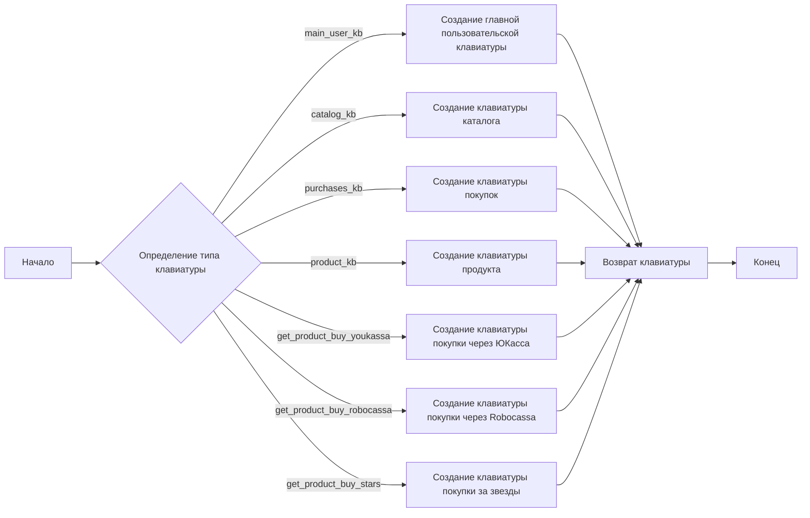
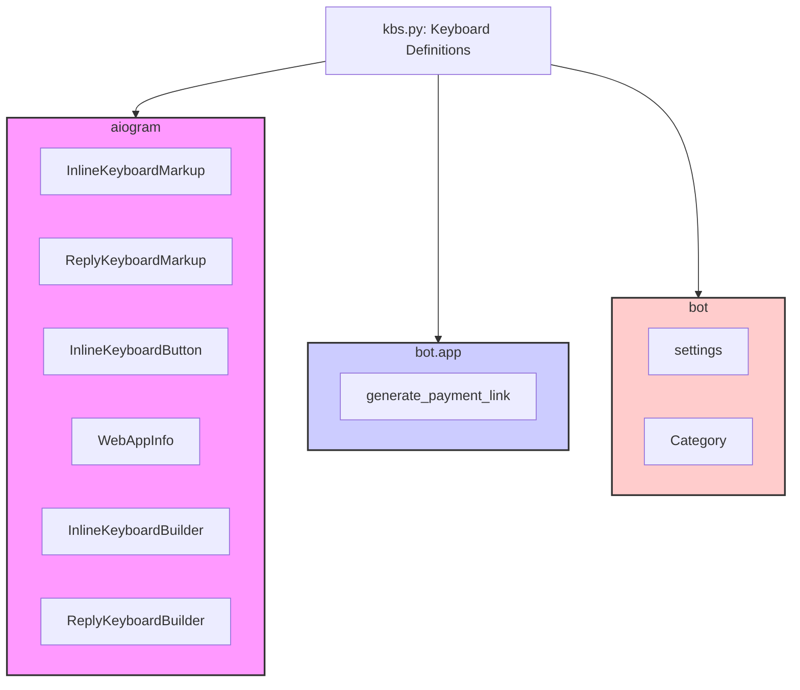

### **Системные инструкции для обработки кода проекта `hypotez`**

=========================================================================================

Описание функциональности и правил для генерации, анализа и улучшения кода. Направлено на обеспечение последовательного и читаемого стиля кодирования, соответствующего требованиям.

---

### **Основные принципы**

#### **1. Общие указания**:
- Соблюдай четкий и понятный стиль кодирования.
- Все изменения должны быть обоснованы и соответствовать установленным требованиям.

#### **2. Комментарии**:
- Используй `#` для внутренних комментариев.
- Документация всех функций, методов и классов должна следовать такому формату: 
    ```python
        def function(param: str, param1: Optional[str | dict | str] = None) -> dict | None:
            """ 
            Args:
                param (str): Описание параметра `param`.
                param1 (Optional[str | dict | str], optional): Описание параметра `param1`. По умолчанию `None`.
    
            Returns:
                dict | None: Описание возвращаемого значения. Возвращает словарь или `None`.
    
            Raises:
                SomeError: Описание ситуации, в которой возникает исключение `SomeError`.

            Ехаmple:
                >>> function('param', 'param1')
                {'param': 'param1'}
            """
    ```
- Комментарии и документация должны быть четкими, лаконичными и точными.

#### **3. Форматирование кода**:
- Используй одинарные кавычки. `a:str = 'value'`, `print('Hello World!')`;
- Добавляй пробелы вокруг операторов. Например, `x = 5`;
- Все параметры должны быть аннотированы типами. `def function(param: str, param1: Optional[str | dict | str] = None) -> dict | None:`;
- Не используй `Union`. Вместо этого используй `|`.

#### **4. Логирование**:
- Для логгирования Всегда Используй модуль `logger` из `src.logger.logger`.
- Ошибки должны логироваться с использованием `logger.error`.
Пример:
    ```python
        try:
            ...
        except Exception as ex:
            logger.error('Error while processing data', ех, exc_info=True)
    ```
#### **5 Не используй `Union[]` в коде. Вместо него используй `|`
Например:
```python
x: str | int ...
```


---

### **Основные требования**:

#### **1. Формат ответов в Markdown**:
- Все ответы должны быть выполнены в формате **Markdown**.

#### **2. Формат комментариев**:
- Используй указанный стиль для комментариев и документации в коде.
- Пример:

```python
from typing import Generator, Optional, List
from pathlib import Path


def read_text_file(
    file_path: str | Path,
    as_list: bool = False,
    extensions: Optional[List[str]] = None,
    chunk_size: int = 8192,
) -> Generator[str, None, None] | str | None:
    """
    Считывает содержимое файла (или файлов из каталога) с использованием генератора для экономии памяти.

    Args:
        file_path (str | Path): Путь к файлу или каталогу.
        as_list (bool): Если `True`, возвращает генератор строк.
        extensions (Optional[List[str]]): Список расширений файлов для чтения из каталога.
        chunk_size (int): Размер чанков для чтения файла в байтах.

    Returns:
        Generator[str, None, None] | str | None: Генератор строк, объединенная строка или `None` в случае ошибки.

    Raises:
        Exception: Если возникает ошибка при чтении файла.

    Example:
        >>> from pathlib import Path
        >>> file_path = Path('example.txt')
        >>> content = read_text_file(file_path)
        >>> if content:
        ...    print(f'File content: {content[:100]}...')
        File content: Example text...
    """
    ...
```
- Всегда делай подробные объяснения в комментариях. Избегай расплывчатых терминов, 
- таких как *«получить»* или *«делать»*
-  . Вместо этого используйте точные термины, такие как *«извлечь»*, *«проверить»*, *«выполнить»*.
- Вместо: *«получаем»*, *«возвращаем»*, *«преобразовываем»* используй имя объекта *«функция получае»*, *«переменная возвращает»*, *«код преобразовывает»* 
- Комментарии должны непосредственно предшествовать описываемому блоку кода и объяснять его назначение.

#### **3. Пробелы вокруг операторов присваивания**:
- Всегда добавляйте пробелы вокруг оператора `=`, чтобы повысить читаемость.
- Примеры:
  - **Неправильно**: `x=5`
  - **Правильно**: `x = 5`

#### **4. Использование `j_loads` или `j_loads_ns`**:
- Для чтения JSON или конфигурационных файлов замените стандартное использование `open` и `json.load` на `j_loads` или `j_loads_ns`.
- Пример:

```python
# Неправильно:
with open('config.json', 'r', encoding='utf-8') as f:
    data = json.load(f)

# Правильно:
data = j_loads('config.json')
```

#### **5. Сохранение комментариев**:
- Все существующие комментарии, начинающиеся с `#`, должны быть сохранены без изменений в разделе «Улучшенный код».
- Если комментарий кажется устаревшим или неясным, не изменяйте его. Вместо этого отметьте его в разделе «Изменения».

#### **6. Обработка `...` в коде**:
- Оставляйте `...` как указатели в коде без изменений.
- Не документируйте строки с `...`.
```

#### **7. Аннотации**
Для всех переменных должны быть определены аннотации типа. 
Для всех функций все входные и выходные параметры аннотириваны
Для все параметров должны быть аннотации типа.


### **8. webdriver**
В коде используется webdriver. Он импртируется из модуля `webdriver` проекта `hypotez`
```python
from src.webdirver import Driver, Chrome, Firefox, Playwright, ...
driver = Driver(Firefox)

Пoсле чего может использоваться как

close_banner = {
  "attribute": null,
  "by": "XPATH",
  "selector": "//button[@id = 'closeXButton']",
  "if_list": "first",
  "use_mouse": false,
  "mandatory": false,
  "timeout": 0,
  "timeout_for_event": "presence_of_element_located",
  "event": "click()",
  "locator_description": "Закрываю pop-up окно, если оно не появилось - не страшно (`mandatory`:`false`)"
}

result = driver.execute_locator(close_banner)
```

### Анализ кода `hypotez/src/endpoints/bots/telegram/digital_market/bot/user/kbs.py`

#### 1. Блок-схема



**Примеры для логических блоков:**

- **main_user_kb**: Создание главной клавиатуры пользователя с кнопками "Мои покупки", "Каталог", "О магазине", "Поддержать автора" и "Админ панель" (если пользователь является админом).
    *Пример:* `main_user_kb(user_id=123)`

- **catalog_kb**: Создание клавиатуры каталога на основе списка категорий.
    *Пример:* `catalog_kb(catalog_data=[Category(id=1, category_name="Электроника"), Category(id=2, category_name="Одежда")])`

- **purchases_kb**: Создание клавиатуры для просмотра покупок.
    *Пример:* `purchases_kb()`

- **product_kb**: Создание клавиатуры для конкретного продукта с кнопками оплаты через ЮКасса, Robocassa и звездами.
    *Пример:* `product_kb(product_id=456, price=100, stars_price=50)`

- **get_product_buy_youkassa**: Создание клавиатуры для оплаты через ЮКасса.
    *Пример:* `get_product_buy_youkassa(price=100)`

- **get_product_buy_robocassa**: Создание клавиатуры для оплаты через Robocassa с использованием web_app.
    *Пример:* `get_product_buy_robocassa(price=100, payment_link="https://example.com/payment")`

- **get_product_buy_stars**: Создание клавиатуры для оплаты звездами.
    *Пример:* `get_product_buy_stars(price=50)`

#### 2. Диаграмма



**Объяснение зависимостей:**

- **aiogram**: Этот модуль используется для создания и управления клавиатурами в Telegram боте. Он предоставляет классы для различных типов клавиатур (InlineKeyboardMarkup, ReplyKeyboardMarkup) и кнопок (InlineKeyboardButton), а также инструменты для упрощения их создания (InlineKeyboardBuilder, ReplyKeyboardBuilder).
  - `InlineKeyboardMarkup`: Используется для создания клавиатур, прикрепленных к сообщениям.
  - `ReplyKeyboardMarkup`: Используется для создания клавиатур, заменяющих стандартную клавиатуру пользователя.
  - `InlineKeyboardButton`: Используется для создания кнопок в `InlineKeyboardMarkup`.
  - `WebAppInfo`: Используется для передачи информации о веб-приложении, которое открывается при нажатии на кнопку.
  - `InlineKeyboardBuilder`: Используется для удобного создания `InlineKeyboardMarkup`.
  - `ReplyKeyboardBuilder`: Используется для удобного создания `ReplyKeyboardMarkup`.
- **bot.app.utils**: Этот модуль содержит утилиты для приложения бота, включая функцию `generate_payment_link`, которая используется для генерации ссылок для оплаты.
  - `generate_payment_link`: Функция, генерирующая ссылку для оплаты.
- **bot.config**: Этот модуль содержит настройки бота, включая список ID администраторов.
  - `settings`: Объект, содержащий настройки бота, такие как `ADMIN_IDS`.
- **bot.dao.models**: Этот модуль содержит модели данных, используемые в боте, включая модель `Category`.
  - `Category`: Класс, представляющий категорию товаров.

#### 3. Объяснение

**Импорты:**

- `from typing import List`: Импортирует `List` для аннотации типов списков.
- `from aiogram.types import InlineKeyboardMarkup, ReplyKeyboardMarkup, InlineKeyboardButton, WebAppInfo`: Импортирует классы для создания различных типов клавиатур и кнопок в Telegram боте.
    - `InlineKeyboardMarkup`: Класс для создания встроенных клавиатур в сообщениях.
    - `ReplyKeyboardMarkup`: Класс для создания клавиатур, отображаемых вместо стандартной клавиатуры пользователя.
    - `InlineKeyboardButton`: Класс для создания кнопок в `InlineKeyboardMarkup`.
    - `WebAppInfo`: Класс для передачи информации о веб-приложении, которое открывается при нажатии на кнопку.
- `from aiogram.utils.keyboard import InlineKeyboardBuilder, ReplyKeyboardBuilder`: Импортирует классы для упрощения создания клавиатур.
    - `InlineKeyboardBuilder`: Класс для удобного создания `InlineKeyboardMarkup`.
    - `ReplyKeyboardBuilder`: Класс для удобного создания `ReplyKeyboardMarkup`.
- `from bot.app.utils import generate_payment_link`: Импортирует функцию для генерации ссылок для оплаты.
    - `generate_payment_link`: Функция, генерирующая ссылку для оплаты.
- `from bot.config import settings`: Импортирует настройки бота.
    - `settings`: Объект, содержащий настройки бота, такие как `ADMIN_IDS`.
- `from bot.dao.models import Category`: Импортирует класс `Category`, представляющий категорию товаров.
    - `Category`: Класс, представляющий категорию товаров.

**Функции:**

- `main_user_kb(user_id: int) -> InlineKeyboardMarkup`: Создает главную пользовательскую клавиатуру.
    - `user_id (int)`: ID пользователя.
    - Возвращает: `InlineKeyboardMarkup` с кнопками "Мои покупки", "Каталог", "О магазине", "Поддержать автора" и "Админ панель" (если пользователь является админом).
    - Пример: `main_user_kb(user_id=123)`
- `catalog_kb(catalog_data: List[Category]) -> InlineKeyboardMarkup`: Создает клавиатуру каталога на основе списка категорий.
    - `catalog_data (List[Category])`: Список объектов `Category`.
    - Возвращает: `InlineKeyboardMarkup` с кнопками для каждой категории и кнопкой "На главную".
    - Пример: `catalog_kb(catalog_data=[Category(id=1, category_name="Электроника"), Category(id=2, category_name="Одежда")])`
- `purchases_kb() -> InlineKeyboardMarkup`: Создает клавиатуру для просмотра покупок.
    - Возвращает: `InlineKeyboardMarkup` с кнопками "Смотреть покупки" и "На главную".
    - Пример: `purchases_kb()`
- `product_kb(product_id, price, stars_price) -> InlineKeyboardMarkup`: Создает клавиатуру для конкретного продукта с кнопками оплаты через ЮКасса, Robocassa и звездами.
    - `product_id`: ID продукта.
    - `price`: Цена продукта.
    - `stars_price`: Цена продукта в звездах.
    - Возвращает: `InlineKeyboardMarkup` с кнопками оплаты и кнопками "Назад" и "На главную".
    - Пример: `product_kb(product_id=456, price=100, stars_price=50)`
- `get_product_buy_youkassa(price) -> InlineKeyboardMarkup`: Создает клавиатуру для оплаты через ЮКасса.
    - `price`: Цена продукта.
    - Возвращает: `InlineKeyboardMarkup` с кнопкой оплаты и кнопкой "Отменить".
    - Пример: `get_product_buy_youkassa(price=100)`
- `get_product_buy_robocassa(price: int, payment_link: str) -> InlineKeyboardMarkup`: Создает клавиатуру для оплаты через Robocassa с использованием web_app.
    - `price (int)`: Цена продукта.
    - `payment_link (str)`: Ссылка для оплаты.
    - Возвращает: `InlineKeyboardMarkup` с кнопкой оплаты (web_app) и кнопкой "Отменить".
    - Пример: `get_product_buy_robocassa(price=100, payment_link="https://example.com/payment")`
- `get_product_buy_stars(price) -> InlineKeyboardMarkup`: Создает клавиатуру для оплаты звездами.
    - `price`: Цена продукта.
    - Возвращает: `InlineKeyboardMarkup` с кнопкой оплаты и кнопкой "Отменить".
    - Пример: `get_product_buy_stars(price=50)`

**Переменные:**

- В основном используются локальные переменные внутри функций для создания и настройки клавиатур.

**Потенциальные ошибки и области для улучшения:**

- Отсутствует обработка ошибок при генерации клавиатур.
- Жестко заданные тексты кнопок, можно вынести в конфиг.
- В функциях `product_kb`, `get_product_buy_youkassa` и `get_product_buy_stars` не указаны типы для параметров `product_id`, `price`, `stars_price`.

**Взаимосвязи с другими частями проекта:**

- Этот модуль зависит от `bot.config` для получения настроек бота и `bot.dao.models` для работы с данными категорий.
- Модуль используется в других частях проекта для отображения клавиатур пользователям.