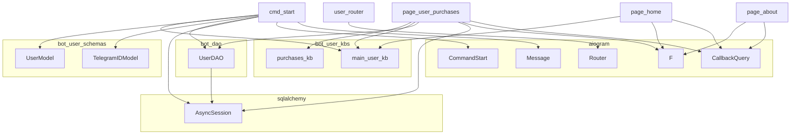

### **Системные инструкции для обработки кода проекта `hypotez`**

=========================================================================================

Описание функциональности и правил для генерации, анализа и улучшения кода. Направлено на обеспечение последовательного и читаемого стиля кодирования, соответствующего требованиям.

---

### **Основные принципы**

#### **1. Общие указания**:
- Соблюдай четкий и понятный стиль кодирования.
- Все изменения должны быть обоснованы и соответствовать установленным требованиям.

#### **2. Комментарии**:
- Используй `#` для внутренних комментариев.
- Документация всех функций, методов и классов должна следовать такому формату: 
    ```python
        def function(param: str, param1: Optional[str | dict | str] = None) -> dict | None:
            """ 
            Args:
                param (str): Описание параметра `param`.
                param1 (Optional[str | dict | str], optional): Описание параметра `param1`. По умолчанию `None`.
    
            Returns:
                dict | None: Описание возвращаемого значения. Возвращает словарь или `None`.
    
            Raises:
                SomeError: Описание ситуации, в которой возникает исключение `SomeError`.

            Ехаmple:
                >>> function('param', 'param1')
                {'param': 'param1'}
            """
    ```
- Комментарии и документация должны быть четкими, лаконичными и точными.

#### **3. Форматирование кода**:
- Используй одинарные кавычки. `a:str = 'value'`, `print('Hello World!')`;
- Добавляй пробелы вокруг операторов. Например, `x = 5`;
- Все параметры должны быть аннотированы типами. `def function(param: str, param1: Optional[str | dict | str] = None) -> dict | None:`;
- Не используй `Union`. Вместо этого используй `|`.

#### **4. Логирование**:
- Для логгирования Всегда Используй модуль `logger` из `src.logger.logger`.
- Ошибки должны логироваться с использованием `logger.error`.
Пример:
    ```python
        try:
            ...
        except Exception as ex:
            logger.error('Error while processing data', ех, exc_info=True)
    ```
#### **5 Не используй `Union[]` в коде. Вместо него используй `|`
Например:
```python
x: str | int ...
```


---

### **Основные требования**:

#### **1. Формат ответов в Markdown**:
- Все ответы должны быть выполнены в формате **Markdown**.

#### **2. Формат комментариев**:
- Используй указанный стиль для комментариев и документации в коде.
- Пример:

```python
from typing import Generator, Optional, List
from pathlib import Path


def read_text_file(
    file_path: str | Path,
    as_list: bool = False,
    extensions: Optional[List[str]] = None,
    chunk_size: int = 8192,
) -> Generator[str, None, None] | str | None:
    """
    Считывает содержимое файла (или файлов из каталога) с использованием генератора для экономии памяти.

    Args:
        file_path (str | Path): Путь к файлу или каталогу.
        as_list (bool): Если `True`, возвращает генератор строк.
        extensions (Optional[List[str]]): Список расширений файлов для чтения из каталога.
        chunk_size (int): Размер чанков для чтения файла в байтах.

    Returns:
        Generator[str, None, None] | str | None: Генератор строк, объединенная строка или `None` в случае ошибки.

    Raises:
        Exception: Если возникает ошибка при чтении файла.

    Example:
        >>> from pathlib import Path
        >>> file_path = Path('example.txt')
        >>> content = read_text_file(file_path)
        >>> if content:
        ...    print(f'File content: {content[:100]}...')
        File content: Example text...
    """
    ...
```
- Всегда делай подробные объяснения в комментариях. Избегай расплывчатых терминов, 
- таких как *«получить»* или *«делать»*
-  . Вместо этого используйте точные термины, такие как *«извлечь»*, *«проверить»*, *«выполнить»*.
- Вместо: *«получаем»*, *«возвращаем»*, *«преобразовываем»* используй имя объекта *«функция получае»*, *«переменная возвращает»*, *«код преобразовывает»* 
- Комментарии должны непосредственно предшествовать описываемому блоку кода и объяснять его назначение.

#### **3. Пробелы вокруг операторов присваивания**:
- Всегда добавляйте пробелы вокруг оператора `=`, чтобы повысить читаемость.
- Примеры:
  - **Неправильно**: `x=5`
  - **Правильно**: `x = 5`

#### **4. Использование `j_loads` или `j_loads_ns`**:
- Для чтения JSON или конфигурационных файлов замените стандартное использование `open` и `json.load` на `j_loads` или `j_loads_ns`.
- Пример:

```python
# Неправильно:
with open('config.json', 'r', encoding='utf-8') as f:
    data = json.load(f)

# Правильно:
data = j_loads('config.json')
```

#### **5. Сохранение комментариев**:
- Все существующие комментарии, начинающиеся с `#`, должны быть сохранены без изменений в разделе «Улучшенный код».
- Если комментарий кажется устаревшим или неясным, не изменяйте его. Вместо этого отметьте его в разделе «Изменения».

#### **6. Обработка `...` в коде**:
- Оставляйте `...` как указатели в коде без изменений.
- Не документируйте строки с `...`.
```

#### **7. Аннотации**
Для всех переменных должны быть определены аннотации типа. 
Для всех функций все входные и выходные параметры аннотириваны
Для все параметров должны быть аннотации типа.


### **8. webdriver**
В коде используется webdriver. Он импртируется из модуля `webdriver` проекта `hypotez`
```python
from src.webdirver import Driver, Chrome, Firefox, Playwright, ...
driver = Driver(Firefox)

Пoсле чего может использоваться как

close_banner = {
  "attribute": null,
  "by": "XPATH",
  "selector": "//button[@id = 'closeXButton']",
  "if_list": "first",
  "use_mouse": false,
  "mandatory": false,
  "timeout": 0,
  "timeout_for_event": "presence_of_element_located",
  "event": "click()",
  "locator_description": "Закрываю pop-up окно, если оно не появилось - не страшно (`mandatory`:`false`)"
}

result = driver.execute_locator(close_banner)
```

### **Анализ кода `hypotez/src/endpoints/bots/telegram/digital_market/bot/user/user_router.py`**

#### **1. Блок-схема**

```mermaid
graph TD
    A[Начало: Получение обновления от Telegram] --> B{Обработчик CommandStart?};
    B -- Да --> C{Поиск пользователя в БД};
    C --> D{Пользователь найден?};
    D -- Да --> E[Ответ: "Привет, {имя}! Выберите действие" + main_user_kb];
    D -- Нет --> F[Создание UserModel];
    F --> G[Добавление пользователя в БД];
    G --> H[Ответ: "Спасибо за регистрацию! Выберите действие." + main_user_kb];
    B -- Нет --> I{Обработчик F.data == "home"?};
    I -- Да --> J[Ответ: "Главная страница" + main_user_kb];
    I -- Нет --> K{Обработчик F.data == "about"?};
    K -- Да --> L[Ответ: Информация об магазине + call.message.reply_markup];
    K -- Нет --> M{Обработчик F.data == "my_profile"?};
    M -- Да --> N[Получение статистики покупок];
    N --> O{total_purchases == 0?};
    O -- Да --> P[Ответ: "У вас пока нет покупок" + main_user_kb];
    O -- Нет --> Q[Ответ: "Ваш профиль: ... Хотите просмотреть детали?" + purchases_kb];
    M -- Нет --> R{Обработчик F.data == "purchases"?};
    R -- Да --> S[Удаление предыдущего сообщения];
    S --> T[Получение списка покупок пользователя];
    T --> U{Покупки есть?};
    U -- Да --> V[Цикл по покупкам];
    V --> W{product.file_id?};
    W -- Да --> X[Отправка файла с текстом];
    W -- Нет --> Y[Отправка только текста];
    V --> Z[Ответ: "Спасибо за доверие!" + main_user_kb];
    U -- Нет --> AA[Ответ: "У вас пока нет покупок" + main_user_kb];
```

#### **2. Диаграмма**



**Объяснение зависимостей в диаграмме:**

*   **aiogram:** Содержит классы и функции для работы с Telegram Bot API.
    *   `Router`: Используется для организации обработчиков сообщений и колбэков.
    *   `Message`: Класс, представляющий входящее сообщение от пользователя.
    *   `CallbackQuery`: Класс, представляющий колбэк от нажатия на кнопку в инлайн-клавиатуре.
    *   `CommandStart`: Фильтр для обработки команды `/start`.
    *   `F`: Используется для фильтрации колбэков по данным (F.data).
*   **sqlalchemy:** Используется для работы с базой данных.
    *   `AsyncSession`: Асинхронная сессия для выполнения операций с базой данных.
*   **bot.dao:** Содержит Data Access Object (DAO) для работы с данными пользователей.
    *   `UserDAO`: Класс для выполнения операций с базой данных, связанных с пользователями (поиск, добавление, получение статистики и покупок).
*   **bot.user.kbs:** Содержит клавиатуры для пользовательского интерфейса.
    *   `main_user_kb`: Клавиатура с основными действиями пользователя.
    *   `purchases_kb`: Клавиатура для просмотра деталей покупок пользователя.
*   **bot.user.schemas:** Содержит схемы данных для пользователей.
    *   `TelegramIDModel`: Схема для представления Telegram ID пользователя.
    *   `UserModel`: Схема для представления данных пользователя.

#### **3. Объяснение**

**Импорты:**

*   `from aiogram import Router, F`: Импортирует `Router` для создания маршрутизатора обработчиков, `F` для фильтрации колбэков.
*   `from aiogram.filters import CommandStart`: Импортирует `CommandStart` для фильтрации команды `/start`.
*   `from aiogram.types import Message, CallbackQuery`: Импортирует `Message` для обработки текстовых сообщений, `CallbackQuery` для обработки нажатий на кнопки.
*   `from sqlalchemy.ext.asyncio import AsyncSession`: Импортирует `AsyncSession` для асинхронной работы с базой данных.
*   `from bot.dao.dao import UserDAO`: Импортирует `UserDAO` для доступа к данным пользователей в базе данных.
*   `from bot.user.kbs import main_user_kb, purchases_kb`: Импортирует клавиатуры для пользовательского интерфейса.
*   `from bot.user.schemas import TelegramIDModel, UserModel`: Импортирует схемы данных для пользователей.

**Классы:**

*   Нет явно определенных классов в данном файле, но используются импортированные классы:
    *   `Router`: Организует обработчики сообщений.
    *   `UserDAO`: Предоставляет методы для работы с данными пользователей в базе данных.
    *   `TelegramIDModel`, `UserModel`: Используются для валидации и передачи данных о пользователях.

**Функции:**

*   `cmd_start(message: Message, session_with_commit: AsyncSession)`:
    *   Обрабатывает команду `/start`.
    *   Аргументы:
        *   `message`: Объект сообщения от пользователя.
        *   `session_with_commit`: Асинхронная сессия SQLAlchemy для работы с базой данных (с возможностью коммита).
    *   Логика:
        1.  Получает `user_id` из сообщения.
        2.  Ищет пользователя в базе данных по `telegram_id`.
        3.  Если пользователь найден, отправляет приветственное сообщение с клавиатурой `main_user_kb`.
        4.  Если пользователь не найден, создает нового пользователя с данными из сообщения и добавляет его в базу данных, затем отправляет приветственное сообщение.
    *   Возвращает: `await message.answer(...)` - отправляет сообщение пользователю.
*   `page_home(call: CallbackQuery)`:
    *   Обрабатывает колбэк с данными `"home"`.
    *   Аргументы:
        *   `call`: Объект колбэка от нажатия на кнопку.
    *   Логика:
        1.  Отвечает на колбэк сообщением "Главная страница".
        2.  Отправляет приветственное сообщение с клавиатурой `main_user_kb`.
    *   Возвращает: `await call.message.answer(...)` - отправляет сообщение пользователю.
*   `page_about(call: CallbackQuery)`:
    *   Обрабатывает колбэк с данными `"about"`.
    *   Аргументы:
        *   `call`: Объект колбэка от нажатия на кнопку.
    *   Логика:
        1.  Отвечает на колбэк сообщением "О магазине".
        2.  Отправляет информационное сообщение о магазине.
    *   Возвращает: `await call.message.answer(...)` - отправляет сообщение пользователю.
*   `page_about(call: CallbackQuery, session_without_commit: AsyncSession)`:
    *   Обрабатывает колбэк с данными `"my_profile"`.
    *   Аргументы:
        *   `call`: Объект колбэка от нажатия на кнопку.
        *   `session_without_commit`: Асинхронная сессия SQLAlchemy для работы с базой данных (без возможности коммита).
    *   Логика:
        1.  Отвечает на колбэк сообщением "Профиль".
        2.  Получает статистику покупок пользователя из базы данных.
        3.  Формирует сообщение в зависимости от наличия покупок и отправляет его пользователю с соответствующей клавиатурой.
    *   Возвращает: `await call.message.answer(...)` - отправляет сообщение пользователю.
*   `page_user_purchases(call: CallbackQuery, session_without_commit: AsyncSession)`:
    *   Обрабатывает колбэк с данными `"purchases"`.
    *   Аргументы:
        *   `call`: Объект колбэка от нажатия на кнопку.
        *   `session_without_commit`: Асинхронная сессия SQLAlchemy для работы с базой данных (без возможности коммита).
    *   Логика:
        1.  Отвечает на колбэк сообщением "Мои покупки".
        2.  Удаляет предыдущее сообщение (если возможно).
        3.  Получает список покупок пользователя из базы данных.
        4.  Если покупок нет, отправляет сообщение об отсутствии покупок.
        5.  Если покупки есть, для каждой покупки отправляет информацию о товаре (текст и файл, если есть).
        6.  Отправляет сообщение "Спасибо за доверие!".
    *   Возвращает: `await call.message.answer(...)` - отправляет сообщение пользователю.

**Переменные:**

*   `user_router: Router`: Объект `Router`, используемый для регистрации обработчиков сообщений и колбэков.

**Потенциальные ошибки и области для улучшения:**

*   В функции `page_user_purchases` блок `try...except` для удаления сообщения содержит `pass`.  Вместо `pass` следует добавить логирование ошибки, используя `logger.error`, чтобы можно было отслеживать причины, по которым не удаляется сообщение. Пример:
    ```python
    try:
        await call.message.delete()
    except Exception as e:
        logger.error(f"Не удалось удалить сообщение: {e}", exc_info=True)
    ```
*   В функциях `page_about` и `page_user_purchases` используется `session_without_commit`, а в `cmd_start` - `session_with_commit`.  Возможно, следует унифицировать использование сессий, чтобы избежать путаницы.
*   В функции `page_about(call: CallbackQuery, session_without_commit: AsyncSession)` дублируется имя с `page_about(call: CallbackQuery)`. Это может привести к непредсказуемому поведению. Следут переименовать одну из функций.
*   Отсутствует обработка ошибок при запросах к базе данных в функциях `page_about` и `page_user_purchases`. Следует добавить блоки `try...except` для обработки возможных исключений, связанных с базой данных, и логировать ошибки.

**Взаимосвязи с другими частями проекта:**

*   Данный модуль (`user_router.py`) является частью Telegram-бота для цифрового магазина.  Он отвечает за обработку действий пользователя, таких как команда `/start`, нажатия на кнопки "Главная страница", "О магазине", "Мой профиль" и "Мои покупки".
*   `UserDAO` используется для взаимодействия с базой данных и получения информации о пользователях и их покупках.
*   `main_user_kb` и `purchases_kb` используются для формирования пользовательского интерфейса в виде клавиатур.
*   Схемы данных (`TelegramIDModel`, `UserModel`) используются для представления и валидации данных о пользователях.