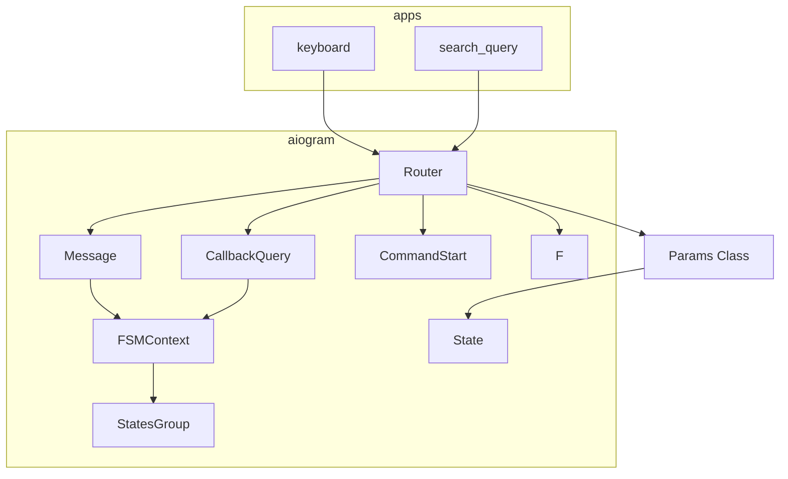

### **Системные инструкции для обработки кода проекта `hypotez`**

=========================================================================================

Описание функциональности и правил для генерации, анализа и улучшения кода. Направлено на обеспечение последовательного и читаемого стиля кодирования, соответствующего требованиям.

---

### **Основные принципы**

#### **1. Общие указания**:
- Соблюдай четкий и понятный стиль кодирования.
- Все изменения должны быть обоснованы и соответствовать установленным требованиям.

#### **2. Комментарии**:
- Используй `#` для внутренних комментариев.
- Документация всех функций, методов и классов должна следовать такому формату: 
    ```python
        def function(param: str, param1: Optional[str | dict | str] = None) -> dict | None:
            """ 
            Args:
                param (str): Описание параметра `param`.
                param1 (Optional[str | dict | str], optional): Описание параметра `param1`. По умолчанию `None`.
    
            Returns:
                dict | None: Описание возвращаемого значения. Возвращает словарь или `None`.
    
            Raises:
                SomeError: Описание ситуации, в которой возникает исключение `SomeError`.

            Ехаmple:
                >>> function('param', 'param1')
                {'param': 'param1'}
            """
    ```
- Комментарии и документация должны быть четкими, лаконичными и точными.

#### **3. Форматирование кода**:
- Используй одинарные кавычки. `a:str = 'value'`, `print('Hello World!')`;
- Добавляй пробелы вокруг операторов. Например, `x = 5`;
- Все параметры должны быть аннотированы типами. `def function(param: str, param1: Optional[str | dict | str] = None) -> dict | None:`;
- Не используй `Union`. Вместо этого используй `|`.

#### **4. Логирование**:
- Для логгирования Всегда Используй модуль `logger` из `src.logger.logger`.
- Ошибки должны логироваться с использованием `logger.error`.
Пример:
    ```python
        try:
            ...
        except Exception as ex:
            logger.error('Error while processing data', ех, exc_info=True)
    ```
#### **5 Не используй `Union[]` в коде. Вместо него используй `|`
Например:
```python
x: str | int ...
```


---

### **Основные требования**:

#### **1. Формат ответов в Markdown**:
- Все ответы должны быть выполнены в формате **Markdown**.

#### **2. Формат комментариев**:
- Используй указанный стиль для комментариев и документации в коде.
- Пример:

```python
from typing import Generator, Optional, List
from pathlib import Path


def read_text_file(
    file_path: str | Path,
    as_list: bool = False,
    extensions: Optional[List[str]] = None,
    chunk_size: int = 8192,
) -> Generator[str, None, None] | str | None:
    """
    Считывает содержимое файла (или файлов из каталога) с использованием генератора для экономии памяти.

    Args:
        file_path (str | Path): Путь к файлу или каталогу.
        as_list (bool): Если `True`, возвращает генератор строк.
        extensions (Optional[List[str]]): Список расширений файлов для чтения из каталога.
        chunk_size (int): Размер чанков для чтения файла в байтах.

    Returns:
        Generator[str, None, None] | str | None: Генератор строк, объединенная строка или `None` в случае ошибки.

    Raises:
        Exception: Если возникает ошибка при чтении файла.

    Example:
        >>> from pathlib import Path
        >>> file_path = Path('example.txt')
        >>> content = read_text_file(file_path)
        >>> if content:
        ...    print(f'File content: {content[:100]}...')
        File content: Example text...
    """
    ...
```
- Всегда делай подробные объяснения в комментариях. Избегай расплывчатых терминов, 
- таких как *«получить»* или *«делать»*
-  . Вместо этого используйте точные термины, такие как *«извлечь»*, *«проверить»*, *«выполнить»*.
- Вместо: *«получаем»*, *«возвращаем»*, *«преобразовываем»* используй имя объекта *«функция получае»*, *«переменная возвращает»*, *«код преобразовывает»* 
- Комментарии должны непосредственно предшествовать описываемому блоку кода и объяснять его назначение.

#### **3. Пробелы вокруг операторов присваивания**:
- Всегда добавляйте пробелы вокруг оператора `=`, чтобы повысить читаемость.
- Примеры:
  - **Неправильно**: `x=5`
  - **Правильно**: `x = 5`

#### **4. Использование `j_loads` или `j_loads_ns`**:
- Для чтения JSON или конфигурационных файлов замените стандартное использование `open` и `json.load` на `j_loads` или `j_loads_ns`.
- Пример:

```python
# Неправильно:
with open('config.json', 'r', encoding='utf-8') as f:
    data = json.load(f)

# Правильно:
data = j_loads('config.json')
```

#### **5. Сохранение комментариев**:
- Все существующие комментарии, начинающиеся с `#`, должны быть сохранены без изменений в разделе «Улучшенный код».
- Если комментарий кажется устаревшим или неясным, не изменяйте его. Вместо этого отметьте его в разделе «Изменения».

#### **6. Обработка `...` в коде**:
- Оставляйте `...` как указатели в коде без изменений.
- Не документируйте строки с `...`.
```

#### **7. Аннотации**
Для всех переменных должны быть определены аннотации типа. 
Для всех функций все входные и выходные параметры аннотириваны
Для все параметров должны быть аннотации типа.


### **8. webdriver**
В коде используется webdriver. Он импртируется из модуля `webdriver` проекта `hypotez`
```python
from src.webdirver import Driver, Chrome, Firefox, Playwright, ...
driver = Driver(Firefox)

Пoсле чего может использоваться как

close_banner = {
  "attribute": null,
  "by": "XPATH",
  "selector": "//button[@id = 'closeXButton']",
  "if_list": "first",
  "use_mouse": false,
  "mandatory": false,
  "timeout": 0,
  "timeout_for_event": "presence_of_element_located",
  "event": "click()",
  "locator_description": "Закрываю pop-up окно, если оно не появилось - не страшно (`mandatory`:`false`)"
}

result = driver.execute_locator(close_banner)
```

## Анализ кода `hypotez/src/endpoints/bots/telegram/movie_bot-main/apps/hendlers.py`

### 1. Блок-схема:

```mermaid
graph TD
    A[Начало: Команда /start] --> B{Приветствие пользователя};
    B --> C{Предложение найти фильм};
    C --> D{Выбор: "new_movies"};
    D -- Да --> E{Установка состояния type_movie};
    E --> F{Запрос типа фильма/сериала};
    F --> G{Выбор: "series" или "film"};
    G -- series --> H{Удаление предыдущего сообщения};
    H --> I{Обновление данных: type_movie = "series"};
    I --> J{Установка состояния name};
    J --> K{Запрос названия};
    G -- film --> L{Удаление предыдущего сообщения};
    L --> M{Обновление данных: type_movie = "film"};
    M --> J;
    K --> N{Ввод названия};
    N --> O{Обновление данных: name = message.text};
    O --> P{Получение данных из state};
    P --> Q{Поиск фильма};
    Q --> R{Ответ: Название и тип};
    R --> S{Проверка: movie != None};
    S -- Да --> T{Ответ: Найденные фильмы};
    T --> U{Предложение найти новый фильм};
    U --> V{Очистка state};
    S -- Нет --> W{Ответ: Фильм не найден};
    W --> U;
```

**Примеры для каждого логического блока:**

-   **A**: Пользователь запускает бота командой `/start`.
-   **B**: Бот отправляет приветственное сообщение пользователю.
-   **C**: Бот предлагает найти фильм.
-   **D**: Пользователь нажимает кнопку "new\_movies".
-   **E**: Бот устанавливает состояние `Params.type_movie`.
-   **F**: Бот запрашивает, что ищет пользователь: фильм или сериал.
-   **G**: Пользователь выбирает "series" или "film".
-   **H**: Бот удаляет предыдущее сообщение.
-   **I**: Бот обновляет данные в state: `type_movie = "series"`.
-   **J**: Бот устанавливает состояние `Params.name`.
-   **K**: Бот запрашивает название фильма или сериала.
-   **L**: Бот удаляет предыдущее сообщение.
-   **M**: Бот обновляет данные в state: `type_movie = "film"`.
-   **N**: Пользователь вводит название фильма.
-   **O**: Бот обновляет данные в state: `name = message.text`.
-   **P**: Бот получает данные из state.
-   **Q**: Бот выполняет поиск фильма.
-   **R**: Бот отвечает с названием и типом фильма.
-   **S**: Бот проверяет, найден ли фильм.
-   **T**: Бот отвечает с информацией о найденном фильме.
-   **U**: Бот предлагает найти новый фильм.
-   **V**: Бот очищает состояние.
-   **W**: Бот отвечает, что фильм не найден.

### 2. Диаграмма:



**Объяснение зависимостей:**

-   **aiogram**:
    -   `Router`: Используется для регистрации обработчиков.
    -   `F`: Используется для фильтрации callback-запросов.
    -   `CommandStart`: Фильтр для команды `/start`.
    -   `FSMContext`: Используется для управления состоянием пользователя.
    -   `StatesGroup`, `State`: Используются для определения состояний в FSM.
    -   `Message`: Тип объекта, представляющего входящее сообщение.
    -   `CallbackQuery`: Тип объекта, представляющего входящий callback-запрос.
-   **apps**:
    -   `keyboard (kb)`: Модуль, содержащий определения клавиатур для бота.
    -   `search_query`: Функция для выполнения поиска фильма по названию и типу.
-   **Params**:
    - Класс `Params` используется для определения состояний FSM (Finite State Machine). `type_movie` и `name` это состояния FSM.

### 3. Объяснение:

**Импорты:**

-   `from aiogram import Router, F`: Импортирует класс `Router` для обработки сообщений и `F` для создания фильтров.
-   `from aiogram.filters import CommandStart`: Импортирует фильтр `CommandStart` для обработки команды `/start`.
-   `from aiogram.fsm.context import FSMContext`: Импортирует `FSMContext` для управления состоянием пользователя в конечном автомате.
-   `from aiogram.fsm.state import StatesGroup, State`: Импортирует `StatesGroup` и `State` для определения состояний конечного автомата.
-   `from aiogram.types import Message, CallbackQuery`: Импортирует классы `Message` и `CallbackQuery` для обработки сообщений и callback-запросов.
-   `import apps.keyboard as kb`: Импортирует модуль `keyboard` из пакета `apps` и назначает ему псевдоним `kb`. Этот модуль, вероятно, содержит определения клавиатур для бота.
-   `from apps.search import search_query`: Импортирует функцию `search_query` из модуля `search` пакета `apps`. Эта функция выполняет поиск фильма по названию и типу.

**Классы:**

-   `Params(StatesGroup)`: Класс, представляющий состояния конечного автомата (FSM).
    -   `type_movie = State()`: Состояние для хранения типа фильма (фильм или сериал).
    -   `name = State()`: Состояние для хранения названия фильма.

**Функции:**

-   `command_start_handler(message: Message) -> None`:
    -   Обработчик команды `/start`.
    -   Аргументы:
        -   `message (Message)`: Объект сообщения, содержащий информацию о сообщении пользователя.
    -   Возвращаемое значение: `None`.
    -   Назначение: Отправляет приветственное сообщение пользователю и предлагает найти фильм.
    -   Пример: Пользователь отправляет команду `/start`, бот отвечает приветствием и кнопкой "Найти фильм".
-   `movie_handler(callback: CallbackQuery, state: FSMContext) -> None`:
    -   Обработчик нажатия на кнопку "new\_movies".
    -   Аргументы:
        -   `callback (CallbackQuery)`: Объект callback-запроса, содержащий информацию о нажатой кнопке.
        -   `state (FSMContext)`: Контекст конечного автомата для управления состоянием пользователя.
    -   Возвращаемое значение: `None`.
    -   Назначение: Устанавливает состояние `Params.type_movie` и запрашивает тип фильма (фильм или сериал).
    -   Пример: Пользователь нажимает кнопку "new\_movies", бот запрашивает тип фильма.
-   `series_handler(callback: CallbackQuery, state: FSMContext) -> None`:
    -   Обработчик нажатия на кнопку "series".
    -   Аргументы:
        -   `callback (CallbackQuery)`: Объект callback-запроса.
        -   `state (FSMContext)`: Контекст конечного автомата.
    -   Возвращаемое значение: `None`.
    -   Назначение: Удаляет предыдущее сообщение, обновляет данные в state (`type_movie = "series"`), устанавливает состояние `Params.name` и запрашивает название сериала.
    -   Пример: Пользователь выбирает "series", бот запрашивает название сериала.
-   `film_handler(callback: CallbackQuery, state: FSMContext) -> None`:
    -   Обработчик нажатия на кнопку "film".
    -   Аргументы:
        -   `callback (CallbackQuery)`: Объект callback-запроса.
        -   `state (FSMContext)`: Контекст конечного автомата.
    -   Возвращаемое значение: `None`.
    -   Назначение: Удаляет предыдущее сообщение, обновляет данные в state (`type_movie = "film"`), устанавливает состояние `Params.name` и запрашивает название фильма.
    -   Пример: Пользователь выбирает "film", бот запрашивает название фильма.
-   `name_handler(message: Message, state: FSMContext) -> None`:
    -   Обработчик ввода названия фильма.
    -   Аргументы:
        -   `message (Message)`: Объект сообщения, содержащий название фильма.
        -   `state (FSMContext)`: Контекст конечного автомата.
    -   Возвращаемое значение: `None`.
    -   Назначение: Обновляет данные в state (`name = message.text`), получает данные из state, выполняет поиск фильма с помощью `search_query`, отправляет информацию о найденном фильме или сообщение о том, что фильм не найден, предлагает найти новый фильм и очищает состояние.
    -   Пример: Пользователь вводит "Matrix", бот ищет фильм "Matrix" и отправляет информацию о нем.

**Переменные:**

-   `router (Router)`: Экземпляр класса `Router`, используемый для регистрации обработчиков.
-   `type_movies (dict)`: Словарь, содержащий соответствия между ключами `'film'` и `'series'` и их русскими названиями `'Фильм'` и `'Сериал'`.

**Потенциальные ошибки и области для улучшения:**

-   Не хватает обработки исключений. Например, если `search_query` возвращает ошибку, она не обрабатывается.
-   Нет валидации вводимых данных. Пользователь может ввести некорректное название фильма, что приведет к неправильному поиску.
-   Можно добавить логирование для отслеживания работы бота и выявления ошибок.
-   Жестко заданные строки (например, сообщения пользователю) можно вынести в отдельные переменные или использовать систему локализации для поддержки разных языков.

**Взаимосвязи с другими частями проекта:**

-   `apps.keyboard`: Предоставляет клавиатуры для взаимодействия с пользователем.
-   `apps.search`: Выполняет поиск фильмов по названию и типу.

Этот файл является частью Telegram-бота, который позволяет пользователю искать фильмы и сериалы. Он использует библиотеку `aiogram` для обработки сообщений и callback-запросов, а также конечный автомат (FSM) для управления состоянием пользователя.