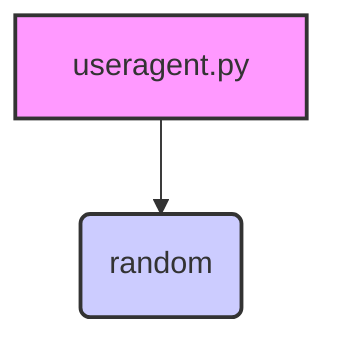

### **Анализ кода проекта `hypotez`**

=========================================================================================

#### **1. Блок-схема**:

```mermaid
graph LR
    A[Начало] --> B{Вызов функции get_useragent()};
    B -- Выбор случайного User-Agent --> C{Выбор случайного User-Agent из _useragent_list};
    C --> D[Возврат User-Agent];
    D --> E[Конец];
```

**Примеры для каждого логического блока:**

- **Начало**: Начало выполнения программы.
- **Вызов функции `get_useragent()`**: Функция вызывается для получения случайного User-Agent.
- **Выбор случайного User-Agent из `_useragent_list`**: Из списка `_useragent_list` выбирается случайная строка.
  Пример: `"Mozilla/5.0 (Windows NT 10.0; Win64; x64; rv:66.0) Gecko/20100101 Firefox/66.0"`
- **Возврат User-Agent**: Функция возвращает выбранный User-Agent.
- **Конец**: Завершение выполнения программы.

#### **2. Диаграмма зависимостей**:



**Объяснение зависимостей:**

- `random`: Модуль используется для выбора случайного User-Agent из списка.

#### **3. Объяснение**:

**Импорты**:
- `random`: Этот модуль используется для генерации случайного выбора из списка User-Agent'ов.

**Классы**:
- Отсутствуют.

**Функции**:
- `get_useragent()`:
    - Аргументы: Отсутствуют.
    - Возвращаемое значение: Случайная строка User-Agent из списка `_useragent_list`.
    - Назначение: Возвращает случайный User-Agent.
    - Пример:
        ```python
        user_agent = get_useragent()
        print(user_agent)  # Вывод: Случайный User-Agent из списка
        ```

**Переменные**:
- `_useragent_list`:
    - Тип: `list`
    - Назначение: Список строк, содержащих различные User-Agent'ы.

**Потенциальные ошибки и области для улучшения**:
- Список `_useragent_list` является фиксированным. Для поддержания актуальности его следует периодически обновлять.
- Отсутствует обработка исключений.

**Цепочка взаимосвязей с другими частями проекта**:
- Этот модуль предоставляет User-Agent'ы для использования в других частях проекта, например, для выполнения HTTP-запросов с целью имитации различных браузеров.
- Можно использовать в `src.webdirver` для инициализации User-Agent.

```python
from src.endpoints.bots.telegram.movie_bot-main.apps.useragent import get_useragent
from src.webdirver import Driver, Chrome, Firefox, Playwright, ...

driver = Driver(Firefox, user_agent=get_useragent())