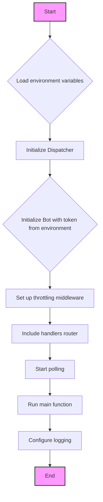

### **Системные инструкции для обработки кода проекта `hypotez`**

=========================================================================================

Описание функциональности и правил для генерации, анализа и улучшения кода. Направлено на обеспечение последовательного и читаемого стиля кодирования, соответствующего требованиям.

---

### **Основные принципы**

#### **1. Общие указания**:
- Соблюдай четкий и понятный стиль кодирования.
- Все изменения должны быть обоснованы и соответствовать установленным требованиям.

#### **2. Комментарии**:
- Используй `#` для внутренних комментариев.
- Документация всех функций, методов и классов должна следовать такому формату: 
    ```python
        def function(param: str, param1: Optional[str | dict | str] = None) -> dict | None:
            """ 
            Args:
                param (str): Описание параметра `param`.
                param1 (Optional[str | dict | str], optional): Описание параметра `param1`. По умолчанию `None`.
    
            Returns:
                dict | None: Описание возвращаемого значения. Возвращает словарь или `None`.
    
            Raises:
                SomeError: Описание ситуации, в которой возникает исключение `SomeError`.

            Ехаmple:
                >>> function('param', 'param1')
                {'param': 'param1'}
            """
    ```
- Комментарии и документация должны быть четкими, лаконичными и точными.

#### **3. Форматирование кода**:
- Используй одинарные кавычки. `a:str = 'value'`, `print('Hello World!')`;
- Добавляй пробелы вокруг операторов. Например, `x = 5`;
- Все параметры должны быть аннотированы типами. `def function(param: str, param1: Optional[str | dict | str] = None) -> dict | None:`;
- Не используй `Union`. Вместо этого используй `|`.

#### **4. Логирование**:
- Для логгирования Всегда Используй модуль `logger` из `src.logger.logger`.
- Ошибки должны логироваться с использованием `logger.error`.
Пример:
    ```python
        try:
            ...
        except Exception as ex:
            logger.error('Error while processing data', ех, exc_info=True)
    ```
#### **5 Не используй `Union[]` в коде. Вместо него используй `|`
Например:
```python
x: str | int ...
```


---

### **Основные требования**:

#### **1. Формат ответов в Markdown**:
- Все ответы должны быть выполнены в формате **Markdown**.

#### **2. Формат комментариев**:
- Используй указанный стиль для комментариев и документации в коде.
- Пример:

```python
from typing import Generator, Optional, List
from pathlib import Path


def read_text_file(
    file_path: str | Path,
    as_list: bool = False,
    extensions: Optional[List[str]] = None,
    chunk_size: int = 8192,
) -> Generator[str, None, None] | str | None:
    """
    Считывает содержимое файла (или файлов из каталога) с использованием генератора для экономии памяти.

    Args:
        file_path (str | Path): Путь к файлу или каталогу.
        as_list (bool): Если `True`, возвращает генератор строк.
        extensions (Optional[List[str]]): Список расширений файлов для чтения из каталога.
        chunk_size (int): Размер чанков для чтения файла в байтах.

    Returns:
        Generator[str, None, None] | str | None: Генератор строк, объединенная строка или `None` в случае ошибки.

    Raises:
        Exception: Если возникает ошибка при чтении файла.

    Example:
        >>> from pathlib import Path
        >>> file_path = Path('example.txt')
        >>> content = read_text_file(file_path)
        >>> if content:
        ...    print(f'File content: {content[:100]}...')
        File content: Example text...
    """
    ...
```
- Всегда делай подробные объяснения в комментариях. Избегай расплывчатых терминов, 
- таких как *«получить»* или *«делать»*. Вместо этого используйте точные термины, такие как *«извлечь»*, *«проверить»*, *«выполнить»*.
- Вместо: *«получаем»*, *«возвращаем»*, *«преобразовываем»* используй имя объекта *«функция получае»*, *«переменная возвращает»*, *«код преобразовывает»* 
- Комментарии должны непосредственно предшествовать описываемому блоку кода и объяснять его назначение.

#### **3. Пробелы вокруг операторов присваивания**:
- Всегда добавляйте пробелы вокруг оператора `=`, чтобы повысить читаемость.
- Примеры:
  - **Неправильно**: `x=5`
  - **Правильно**: `x = 5`

#### **4. Использование `j_loads` или `j_loads_ns`**:
- Для чтения JSON или конфигурационных файлов замените стандартное использование `open` и `json.load` на `j_loads` или `j_loads_ns`.
- Пример:

```python
# Неправильно:
with open('config.json', 'r', encoding='utf-8') as f:
    data = json.load(f)

# Правильно:
data = j_loads('config.json')
```

#### **5. Сохранение комментариев**:
- Все существующие комментарии, начинающиеся с `#`, должны быть сохранены без изменений в разделе «Улучшенный код».
- Если комментарий кажется устаревшим или неясным, не изменяйте его. Вместо этого отметьте его в разделе «Изменения».

#### **6. Обработка `...` в коде**:
- Оставляйте `...` как указатели в коде без изменений.
- Не документируйте строки с `...`.
```

#### **7. Аннотации**
Для всех переменных должны быть определены аннотации типа. 
Для всех функций все входные и выходные параметры аннотириваны
Для все параметров должны быть аннотации типа.


### **8. webdriver**
В коде используется webdriver. Он импртируется из модуля `webdriver` проекта `hypotez`
```python
from src.webdirver import Driver, Chrome, Firefox, Playwright, ...
driver = Driver(Firefox)

Пoсле чего может использоваться как

close_banner = {
  "attribute": null,
  "by": "XPATH",
  "selector": "//button[@id = 'closeXButton']",
  "if_list": "first",
  "use_mouse": false,
  "mandatory": false,
  "timeout": 0,
  "timeout_for_event": "presence_of_element_located",
  "event": "click()",
  "locator_description": "Закрываю pop-up окно, если оно не появилось - не страшно (`mandatory`:`false`)"
}

result = driver.execute_locator(close_banner)
```

### Анализ кода `hypotez/src/endpoints/bots/telegram/movie_bot-main/run.py`

#### 1. Блок-схема



**Примеры для каждого логического блока:**

- **Load environment variables**: `load_dotenv()` - Загружает переменные окружения из файла `.env`. Например, `TOKEN` для доступа к Telegram Bot API.
- **Initialize Dispatcher**: `dp = Dispatcher()` - Создает экземпляр диспетчера для обработки входящих обновлений.
- **Initialize Bot with token from environment**: `bot = Bot(os.getenv('TOKEN'))` - Создает экземпляр бота с использованием токена, полученного из переменных окружения.
- **Set up throttling middleware**: `dp.message.middleware(ThrottlingMiddleware())` - Добавляет middleware для ограничения частоты обработки сообщений.
- **Include handlers router**: `dp.include_router(router)` - Включает маршрутизатор с обработчиками команд и сообщений.
- **Start polling**: `await dp.start_polling(bot)` - Запускает процесс получения обновлений от Telegram Bot API и их обработки.
- **Run main function**: `asyncio.run(main())` - Запускает асинхронную функцию `main`.
- **Configure logging**: `logging.basic_colorized_config(...)` - Настраивает параметры логирования для отслеживания работы бота.

#### 2. Диаграмма

```mermaid
graph TD
    A[<code>run.py</code><br>Entry point of the bot application] --> B(<code>load_dotenv()</code><br>Load environment variables from .env file)
    B --> C(<code>os.getenv('TOKEN')</code><br>Retrieve bot token from environment)
    C --> D(<code>Bot(token)</code><br>Initialize aiogram Bot instance)
    D --> E(<code>Dispatcher()</code><br>Initialize aiogram Dispatcher instance)
    E --> F(<code>ThrottlingMiddleware()</code><br>Initialize throttling middleware)
    E --> G(<code>dp.message.middleware(ThrottlingMiddleware())</code><br>Register throttling middleware)
    E --> H(<code>router</code><br>Import message handler router)
    E --> I(<code>dp.include_router(router)</code><br>Register message handler router)
    E --> J(<code>dp.start_polling(bot)</code><br>Start polling for updates)
    A --> K(<code>asyncio.run(main())</code><br>Run the main event loop)
    A --> L(<code>logging.basicConfig(...)</code><br>Configure logging settings)
    style A fill:#f9f,stroke:#333,stroke-width:2px

```

**Объяснение зависимостей:**

- **`asyncio`**: Используется для асинхронного запуска бота.
- **`betterlogging`**: Используется для настройки логирования.
- **`os`**: Используется для получения переменных окружения.
- **`aiogram`**: Основной фреймворк для создания Telegram-ботов. `Bot` для взаимодействия с Telegram API, `Dispatcher` для обработки входящих обновлений.
- **`dotenv`**: Используется для загрузки переменных окружения из файла `.env`.
- **`apps.hendlers`**: Содержит маршрутизатор (`router`) с обработчиками команд и сообщений.
- **`middlewares.throttling`**: Содержит middleware (`ThrottlingMiddleware`) для ограничения частоты обработки сообщений.

#### 3. Объяснение

**Импорты:**

- `import asyncio`: Модуль для поддержки асинхронного программирования, используемый для запуска асинхронного main loop.
- `import betterlogging as logging`: Модуль для улучшения стандартного логирования Python, позволяющий настраивать формат и уровень логирования. Используется для отладки и мониторинга работы бота.
- `import os`: Модуль для взаимодействия с операционной системой, используется для доступа к переменным окружения, таким как токен бота.
- `from aiogram import Bot, Dispatcher`: Импортирует классы `Bot` и `Dispatcher` из библиотеки `aiogram`. `Bot` используется для взаимодействия с Telegram API, а `Dispatcher` — для обработки входящих обновлений.
- `from dotenv import load_dotenv`: Функция для загрузки переменных окружения из файла `.env`.
- `from apps.hendlers import router`: Импортирует маршрутизатор `router` из модуля `apps.hendlers`. Этот маршрутизатор содержит обработчики команд и сообщений, которые определяют поведение бота.
- `from middlewares.throttling import ThrottlingMiddleware`: Импортирует класс `ThrottlingMiddleware` из модуля `middlewares.throttling`. Этот middleware используется для ограничения частоты обработки сообщений, чтобы предотвратить злоупотребление ботом.

**Классы:**

- `Bot`: Класс из библиотеки `aiogram`, представляющий Telegram-бота. Используется для отправки сообщений, обработки команд и выполнения других действий через Telegram API.
- `Dispatcher`: Класс из библиотеки `aiogram`, предназначенный для обработки входящих обновлений от Telegram. Он регистрирует обработчики для различных типов событий (сообщения, команды, запросы обратного вызова и т. д.) и направляет обновления соответствующим обработчикам.
- `ThrottlingMiddleware`: Middleware, который ограничивает частоту обработки сообщений от пользователей, чтобы предотвратить злоупотребление ботом.

**Функции:**

- `async def main() -> None`: Асинхронная функция, которая является точкой входа в приложение бота. Она инициализирует бота, диспетчер, регистрирует middleware и обработчики, а затем запускает процесс получения и обработки обновлений.
  - **Аргументы**: Отсутствуют.
  - **Возвращаемое значение**: `None`.
  - **Назначение**: Запуск и настройка работы Telegram-бота.
  - **Пример**:
    ```python
    async def main() -> None:
        bot = Bot(os.getenv('TOKEN'))
        dp.message.middleware(ThrottlingMiddleware())
        dp.include_router(router)
        await dp.start_polling(bot)
    ```

**Переменные:**

- `dp: Dispatcher`: Экземпляр класса `Dispatcher`, используемый для регистрации и обработки входящих обновлений.
- `bot: Bot`: Экземпляр класса `Bot`, используемый для взаимодействия с Telegram API.
- `router`: Маршрутизатор, содержащий обработчики команд и сообщений.

**Потенциальные ошибки или области для улучшения:**

- Отсутствует обработка исключений при получении токена из переменных окружения. Если переменная `TOKEN` не установлена, бот не запустится.
- Нет обработки возможных ошибок при подключении к Telegram API или во время работы бота.
- Формат логирования можно вынести в отдельную функцию или константу для удобства изменения и переиспользования.
- Аннотации типов для переменных `dp`, `bot` и `router`.

**Взаимосвязи с другими частями проекта:**

- `apps.hendlers`: Содержит логику обработки команд и сообщений, определяющую поведение бота.
- `middlewares.throttling`: Обеспечивает защиту от злоупотребления ботом путем ограничения частоты обработки сообщений.
- `src.logger.logger`: В данном коде не используется напрямую, но рекомендуется использовать для логирования ошибок и важной информации о работе бота.