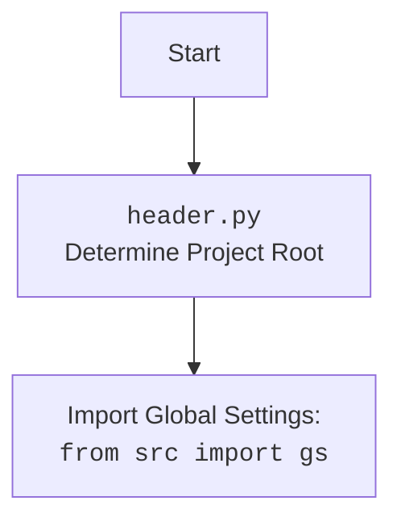

### **Системные инструкции для обработки кода проекта `hypotez`**

=========================================================================================

Описание функциональности и правил для генерации, анализа и улучшения кода. Направлено на обеспечение последовательного и читаемого стиля кодирования, соответствующего требованиям.

---

### **Основные принципы**

#### **1. Общие указания**:
- Соблюдай четкий и понятный стиль кодирования.
- Все изменения должны быть обоснованы и соответствовать установленным требованиям.

#### **2. Комментарии**:
- Используй `#` для внутренних комментариев.
- Документация всех функций, методов и классов должна следовать такому формату: 
    ```python
        def function(param: str, param1: Optional[str | dict | str] = None) -> dict | None:
            """ 
            Args:
                param (str): Описание параметра `param`.
                param1 (Optional[str | dict | str], optional): Описание параметра `param1`. По умолчанию `None`.
    
            Returns:
                dict | None: Описание возвращаемого значения. Возвращает словарь или `None`.
    
            Raises:
                SomeError: Описание ситуации, в которой возникает исключение `SomeError`.

            Ехаmple:
                >>> function('param', 'param1')
                {'param': 'param1'}
            """
    ```
- Комментарии и документация должны быть четкими, лаконичными и точными.

#### **3. Форматирование кода**:
- Используй одинарные кавычки. `a:str = 'value'`, `print('Hello World!')`;
- Добавляй пробелы вокруг операторов. Например, `x = 5`;
- Все параметры должны быть аннотированы типами. `def function(param: str, param1: Optional[str | dict | str] = None) -> dict | None:`;
- Не используй `Union`. Вместо этого используй `|`.

#### **4. Логирование**:
- Для логгирования Всегда Используй модуль `logger` из `src.logger.logger`.
- Ошибки должны логироваться с использованием `logger.error`.
Пример:
    ```python
        try:
            ...
        except Exception as ex:
            logger.error('Error while processing data', ех, exc_info=True)
    ```
#### **5 Не используй `Union[]` в коде. Вместо него используй `|`
Например:
```python
x: str | int ...
```


---

### **Основные требования**:

#### **1. Формат ответов в Markdown**:
- Все ответы должны быть выполнены в формате **Markdown**.

#### **2. Формат комментариев**:
- Используй указанный стиль для комментариев и документации в коде.
- Пример:

```python
from typing import Generator, Optional, List
from pathlib import Path


def read_text_file(
    file_path: str | Path,
    as_list: bool = False,
    extensions: Optional[List[str]] = None,
    chunk_size: int = 8192,
) -> Generator[str, None, None] | str | None:
    """
    Считывает содержимое файла (или файлов из каталога) с использованием генератора для экономии памяти.

    Args:
        file_path (str | Path): Путь к файлу или каталогу.
        as_list (bool): Если `True`, возвращает генератор строк.
        extensions (Optional[List[str]]): Список расширений файлов для чтения из каталога.
        chunk_size (int): Размер чанков для чтения файла в байтах.

    Returns:
        Generator[str, None, None] | str | None: Генератор строк, объединенная строка или `None` в случае ошибки.

    Raises:
        Exception: Если возникает ошибка при чтении файла.

    Example:
        >>> from pathlib import Path
        >>> file_path = Path('example.txt')
        >>> content = read_text_file(file_path)
        >>> if content:
        ...    print(f'File content: {content[:100]}...')
        File content: Example text...
    """
    ...
```
- Всегда делай подробные объяснения в комментариях. Избегай расплывчатых терминов, 
- таких как *«получить»* или *«делать»*. Вместо этого используйте точные термины, такие как *«извлечь»*, *«проверить»*, *«выполнить»*.
- Вместо: *«получаем»*, *«возвращаем»*, *«преобразовываем»* используй имя объекта *«функция получае»*, *«переменная возвращает»*, *«код преобразовывает»* 
- Комментарии должны непосредственно предшествовать описываемому блоку кода и объяснять его назначение.

#### **3. Пробелы вокруг операторов присваивания**:
- Всегда добавляйте пробелы вокруг оператора `=`, чтобы повысить читаемость.
- Примеры:
  - **Неправильно**: `x=5`
  - **Правильно**: `x = 5`

#### **4. Использование `j_loads` или `j_loads_ns`**:
- Для чтения JSON или конфигурационных файлов замените стандартное использование `open` и `json.load` на `j_loads` или `j_loads_ns`.
- Пример:

```python
# Неправильно:
with open('config.json', 'r', encoding='utf-8') as f:
    data = json.load(f)

# Правильно:
data = j_loads('config.json')
```

#### **5. Сохранение комментариев**:
- Все существующие комментарии, начинающиеся с `#`, должны быть сохранены без изменений в разделе «Улучшенный код».
- Если комментарий кажется устаревшим или неясным, не изменяйте его. Вместо этого отметьте его в разделе «Изменения».

#### **6. Обработка `...` в коде**:
- Оставляйте `...` как указатели в коде без изменений.
- Не документируйте строки с `...`.
```

#### **7. Аннотации**
Для всех переменных должны быть определены аннотации типа. 
Для всех функций все входные и выходные параметры аннотириваны
Для все параметров должны быть аннотации типа.


### **8. webdriver**
В коде используется webdriver. Он импртируется из модуля `webdriver` проекта `hypotez`
```python
from src.webdirver import Driver, Chrome, Firefox, Playwright, ...
driver = Driver(Firefox)

Пoсле чего может использоваться как

close_banner = {
  "attribute": null,
  "by": "XPATH",
  "selector": "//button[@id = 'closeXButton']",
  "if_list": "first",
  "use_mouse": false,
  "mandatory": false,
  "timeout": 0,
  "timeout_for_event": "presence_of_element_located",
  "event": "click()",
  "locator_description": "Закрываю pop-up окно, если оно не появилось - не страшно (`mandatory`:`false`)"
}

result = driver.execute_locator(close_banner)
```

### **Анализ кода `hypotez/src/endpoints/emil/scenarios/from_supplier_to_prestashop.py`**

#### **1. Блок-схема**

```mermaid
graph TD
    A[Начало: `main()`] --> B{Загрузка конфигурации из JSON};
    B -- Успешно --> C{Инициализация `SupplierToPrestashopProvider`};
    B -- Ошибка --> Z[Завершение с ошибкой];
    C --> D{Получение списка товаров из JSON};
    D --> E{Сохранение товаров в Prestashop: `save_in_prestashop()`};
    E --> F[Завершение];

    subgraph SupplierToPrestashopProvider
        S[Начало: `SupplierToPrestashopProvider.run_scenario()`] --> S1{Получение грабера для URL: `get_graber_by_supplier_url()`};
        S1 -- Грабер найден --> S2{Извлечение полей товара: `graber.grab_page()`};
        S1 -- Грабер не найден --> S_ERR1[Логирование ошибки];
        S2 -- Успешно --> S3{Преобразование полей товара: `convert_product_fields()`};
        S2 -- Ошибка --> S_ERR2[Логирование ошибки];
        S3 -- Успешно --> S4{Сохранение данных о товаре: `save_product_data()`};
        S3 -- Ошибка --> S_ERR3[Логирование ошибки];
        S4 -- Успешно --> S5[Добавление товара в список];
        S4 -- Ошибка --> S_ERR4[Логирование ошибки];
        S5 --> S[Следующий URL];
        S_ERR1 --> S[Следующий URL];
        S_ERR2 --> S[Следующий URL];
        S_ERR3 --> S[Следующий URL];
        S_ERR4 --> S[Следующий URL];
    end

    style A fill:#f9f,stroke:#333,stroke-width:2px
    style F fill:#f9f,stroke:#333,stroke-width:2px
```

Примеры для каждого логического блока:

-   **A (Начало `main()`):** Запускается асинхронная функция `main()`.
-   **B (Загрузка конфигурации из JSON):** Функция `j_loads_ns()` пытается загрузить конфигурацию из JSON-файла. Если файл не найден или имеет неверный формат, происходит переход к блоку Z.
    *   Пример: `config = j_loads_ns(gs.path.endpoints / ENDPOINT / f'{ENDPOINT}.json')`
-   **C (Инициализация `SupplierToPrestashopProvider`):** Создается экземпляр класса `SupplierToPrestashopProvider` с передачей параметров для доступа к API Prestashop и Gemini.
    *   Пример: `suppier_to_presta = SupplierToPrestashopProvider(lang, gemini_api, presta_api, presta_url)`
-   **D (Получение списка товаров из JSON):** Функция `j_loads_ns()` загружает список товаров из JSON-файла.
    *   Пример: `products_ns = j_loads_ns(gs.path.external_storage / ENDPOINT / 'out_250108230345305_he.json')`
-   **E (Сохранение товаров в Prestashop):** Вызывается метод `save_in_prestashop()` для каждого товара из списка. Если товар успешно сохранен, происходит переход к блоку F.
    *   Пример: `await suppier_to_presta.save_in_prestashop(products_list)`
-   **F (Завершение):** Сценарий завершается успешно.
-   **S1 (Получение грабера для URL):** Функция `get_graber_by_supplier_url()` пытается определить грабер для заданного URL. Если грабер не найден, происходит переход к блоку S_ERR1.
    *   Пример: `graber = get_graber_by_supplier_url(url)`
-   **S2 (Извлечение полей товара):** Метод `grab_page()` грабера извлекает необходимые поля товара. Если происходит ошибка, выполняется переход к блоку S_ERR2.
    *   Пример: `f = await graber.grab_page(*required_fields)`
-   **S3 (Преобразование полей товара):** Метод `convert_product_fields()` преобразует извлеченные поля товара. В случае ошибки выполняется переход к блоку S_ERR3.
    *   Пример: `product_data = await self.convert_product_fields(f)`
-   **S4 (Сохранение данных о товаре):** Метод `save_product_data()` сохраняет данные о товаре в JSON-файл. Если сохранение не удалось, выполняется переход к блоку S_ERR4.
    *   Пример: `if not await self.save_product_data(product_data):`

#### **2. Диаграмма**

```mermaid
flowchart TD
    Start --> A[from typing import Optional, List, Tuple, Generator, Any, Dict, Union]
    Start --> B[from pathlib import Path]
    Start --> C[import os, asyncio, random, shutil]
    Start --> D[from types import SimpleNamespace]
    Start --> E[import header]
    Start --> F[from src import gs]
    Start --> G[from src.endpoints.prestashop.product_fields import ProductFields]
    Start --> H[from src.endpoints.prestashop.product import PrestaProduct]
    Start --> I[from src.webdriver.driver import Driver]
    Start --> J[from src.webdriver.firefox import Firefox]
    Start --> K[from src.ai.gemini import GoogleGenerativeAI]
    Start --> L[from src.endpoints.emil.report_generator import ReportGenerator]
    Start --> M[from src.endpoints.advertisement.facebook.scenarios import post_message_title, upload_post_media, message_publish]
    Start --> N[from src.suppliers.get_graber_by_supplier import get_graber_by_supplier_url]
    Start --> O[from src.utils.jjson import j_loads, j_loads_ns, j_dumps]
    Start --> P[from src.utils.file import read_text_file, save_text_file, recursively_get_file_path]
    Start --> Q[from src.utils.image import save_image_from_url, save_image]
    Start --> R[from src.utils.convertors.unicode import decode_unicode_escape]
    Start --> S[from src.utils.printer import pprint as print]
    Start --> T[from src.logger.logger import logger]
    
    A --> Usage
    B --> Usage
    C --> Usage
    D --> Usage
    E --> Usage
    F --> Usage
    G --> Usage
    H --> Usage
    I --> Usage
    J --> Usage
    K --> Usage
    L --> Usage
    M --> Usage
    N --> Usage
    O --> Usage
    P --> Usage
    Q --> Usage
    R --> Usage
    S --> Usage
    T --> Usage

    Usage[Usage in SupplierToPrestashopProvider and related functions]
```





**Объяснение зависимостей:**

-   `typing`: Используется для статической типизации, что помогает улучшить читаемость и предотвратить ошибки. Импортируются типы: `Optional`, `List`, `Tuple`, `Generator`, `Any`, `Dict`, `Union`.
-   `pathlib`: Предоставляет способ работы с путями к файлам и директориям в объектно-ориентированном стиле. Импортируется класс `Path`.
-   `os`, `asyncio`, `random`, `shutil`:
    -   `os`: Предоставляет функции для взаимодействия с операционной системой.
    -   `asyncio`: Используется для асинхронного программирования.
    -   `random`: Для генерации случайных чисел.
    -   `shutil`: Предоставляет высокоуровневые операции с файлами и директориями.
-   `types`:  Предоставляет утилиты для работы с типами, в частности, `SimpleNamespace` для создания объектов с произвольными атрибутами.
-   `header`:  Кастомный модуль, вероятно, содержащий общие функции или настройки для проекта.
-   `src`:
    -   `gs`: Глобальные настройки проекта.
    -   `src.endpoints.prestashop.product_fields`:  Модуль, определяющий структуру данных для полей продукта Prestashop.
    -   `src.endpoints.prestashop.product`:  Модуль, содержащий класс для взаимодействия с API Prestashop и создания/обновления продуктов.
    -   `src.webdriver.driver`:  Модуль, предоставляющий абстракцию для управления веб-драйвером (например, Selenium).
    -   `src.webdriver.firefox`:  Модуль, содержащий класс для управления Firefox.
    -   `src.ai.gemini`: Модуль для взаимодействия с моделью Gemini AI.
    -   `src.endpoints.emil.report_generator`:  Модуль для генерации отчетов.
    -   `src.endpoints.advertisement.facebook.scenarios`:  Модуль, содержащий сценарии для публикации рекламы в Facebook.
    -   `src.suppliers.get_graber_by_supplier`:  Модуль, предоставляющий функции для получения грабера (парсера) для определенного поставщика.
    -   `src.utils.jjson`:  Модуль, предоставляющий функции для работы с JSON (например, чтение, запись).
    -   `src.utils.file`:  Модуль, предоставляющий функции для работы с файлами (например, чтение, запись).
    -   `src.utils.image`:  Модуль, предоставляющий функции для работы с изображениями (например, сохранение).
    -   `src.utils.convertors.unicode`:  Модуль, предоставляющий функции для работы с Unicode.
    -   `src.utils.printer`:  Модуль, предоставляющий функции для красивого вывода данных.
    -   `src.logger.logger`:  Модуль, предоставляющий функции для логирования.

#### **3. Объяснение**

**Импорты:**

-   `typing`:  Используется для статической типизации, что помогает улучшить читаемость и предотвратить ошибки.  `Optional`, `List` используются для указания типов аргументов и возвращаемых значений функций.
-   `pathlib`: Предоставляет способ работы с путями к файлам и директориям в объектно-ориентированном стиле.
-   `os`, `asyncio`, `random`, `shutil`:
    -   `os`: Предоставляет функции для взаимодействия с операционной системой (например, для получения переменных окружения).
    -   `asyncio`: Используется для асинхронного программирования, позволяя выполнять несколько задач одновременно.
    -   `random`: Для генерации случайных чисел (например, для случайной задержки).
    -   `shutil`: Предоставляет высокоуровневые операции с файлами и директориями (например, для копирования файлов).
-   `types`: Предоставляет утилиты для работы с типами, в частности, `SimpleNamespace` для создания объектов с произвольными атрибутами.
-   `header`:  Кастомный модуль, вероятно, содержащий общие функции или настройки для проекта.
-   `src.gs`:  Глобальные настройки проекта, такие как пути к директориям, учетные данные и т.д.
-   `src.endpoints.prestashop.product_fields`:  Определяет структуру данных для полей продукта, используемую для интеграции с Prestashop.
-   `src.endpoints.prestashop.product`:  Предоставляет класс `PrestaProduct` для взаимодействия с API Prestashop и создания/обновления продуктов.
-   `src.webdriver.driver`:  Абстракция для управления веб-драйвером (например, Selenium). Позволяет автоматизировать взаимодействие с веб-страницами.
-   `src.webdriver.firefox`:  Класс для управления браузером Firefox через Selenium.
-   `src.ai.gemini`: Модуль для взаимодействия с моделью Gemini AI, используемый для обработки и улучшения данных о продуктах.
-   `src.endpoints.emil.report_generator`:  Используется для генерации отчетов о созданных продуктах в формате HTML и PDF.
-   `src.endpoints.advertisement.facebook.scenarios`:  Содержит функции для публикации рекламы в Facebook.
-   `src.suppliers.get_graber_by_supplier`:  Функция для получения грабера (парсера) для определенного поставщика на основе URL.
-   `src.utils.jjson`:  Используется для работы с JSON, включая загрузку, сохранение и преобразование данных.  Функции `j_loads`, `j_loads_ns`, `j_dumps` предоставляют удобные способы работы с JSON-файлами.
-   `src.utils.file`:  Предоставляет функции для чтения и записи файлов, а также для рекурсивного поиска файлов в директориях.
-   `src.utils.image`:  Содержит функции для сохранения изображений из URL-адресов или локальных файлов.
-   `src.utils.convertors.unicode`:  Функция для декодирования Unicode-символов.
-   `src.utils.printer`:  Используется для красивого вывода данных в консоль.  `pprint` обеспечивает более читабельный формат вывода словарей и списков.
-   `src.logger.logger`:  Используется для логирования событий и ошибок.  Позволяет отслеживать ход выполнения программы и выявлять проблемы.

**Классы:**

-   `SupplierToPrestashopProvider`:
    -   **Роль**:  Организует процесс извлечения, обработки и сохранения данных о продуктах поставщиков в Prestashop.
    -   **Атрибуты**:
        -   `driver`:  Экземпляр Selenium WebDriver.
        -   `export_path`:  Путь для экспорта данных.
        -   `mexiron_name`:  Название мехирона.
        -   `price`:  Цена продукта.
        -   `timestamp`:  Временная метка.
        -   `products_list`:  Список обработанных данных о продуктах.
        -   `model`:  Экземпляр GoogleGenerativeAI.
        -   `config`:  Конфигурация, загруженная из JSON.
        -   `local_images_path`:  Путь для локального хранения изображений.
        -   `lang`:  Язык.
        -   `gemini_api`:  API ключ для Gemini.
        -   `presta_api`:  API ключ для Prestashop.
        -   `presta_url`:  URL адрес Prestashop.
    -   **Методы**:
        -   `__init__()`:  Инициализирует экземпляр класса, загружает конфигурацию, создает экземпляр WebDriver и инициализирует модель Gemini.
        -   `initialise_ai_model()`:  Инициализирует модель Gemini с системной инструкцией.
        -   `run_scenario()`:  Выполняет основной сценарий: извлекает данные о продуктах, обрабатывает их с помощью AI и сохраняет данные.
        -   `save_product_data()`:  Сохраняет данные об отдельном продукте в файл JSON.
        -   `process_llm()`:  Обрабатывает список продуктов с использованием модели AI.
        -   `read_data_from_json()`:  Загружает данные из JSON-файлов.
        -   `save_in_prestashop()`:  Сохраняет товары в Prestashop.
        -   `post_facebook()`:  Исполняет сценарий рекламного модуля `facebook`.
        -   `create_report()`:  Отправляет задание на создание отчета в формате `html` и `pdf`.

**Функции:**

-   `main(suppier_to_presta)`:
    -   **Аргументы**:
        -   `suppier_to_presta`: Экземпляр класса `SupplierToPrestashopProvider`.
    -   **Возвращаемое значение**:  `None`.
    -   **Назначение**:  Загружает список товаров из JSON и сохраняет их в Prestashop.
    -   **Пример**:  `asyncio.run(main())`
-   `get_graber_by_supplier_url(url: str)`:
    -   **Аргументы**:
        -   `url`: URL адрес поставщика.
    -   **Возвращаемое значение**:  Экземпляр класса грабера или `None`.
    -   **Назначение**:  Возвращает грабер для заданного URL.
    -   **Пример**:  `graber = get_graber_by_supplier_url(url)`

**Переменные:**

-   `ENDPOINT`:  Константа, определяющая endpoint (в данном случае `'emil'`).
-   `USE_ENV`:  Флаг, определяющий, откуда брать ключи API (из `.env` файла или из базы данных).
-   `required_fields`:  Кортеж, содержащий список необходимых полей товара.

**Потенциальные ошибки и области для улучшения:**

-   Обработка ошибок:  В коде встречаются блоки `try...except`, но не всегда обрабатываются все возможные исключения.  Рекомендуется добавить более детальную обработку ошибок и логирование.
-   Логирование:  В некоторых местах используется `logger.debug` с `None` в качестве аргумента `ex`, что не позволяет получить информацию об ошибке.
-   Отсутствие обработки `...`:  Код содержит много мест, где пропущен код (`...`).  Необходимо заменить эти места реальной логикой или удалить, если они не нужны.
-   Не все функции имеют docstring:  Необходимо добавить документацию для всех функций и методов, чтобы улучшить читаемость и понимание кода.
-   `USE_ENV`:  Использование `USE_ENV` для определения источника ключей API может быть негибким.  Рекомендуется использовать более гибкий механизм конфигурации.
-   Дублирование кода:  Некоторые блоки кода повторяются (например, логирование ошибок).  Рекомендуется вынести их в отдельные функции.

**Взаимосвязи с другими частями проекта:**

-   Модуль использует глобальные настройки из `src.gs`, что позволяет централизованно управлять конфигурацией проекта.
-   Для взаимодействия с Prestashop используется модуль `src.endpoints.prestashop`, который предоставляет классы и функции для работы с API Prestashop.
-   Для взаимодействия с моделью Gemini AI используется модуль `src.ai.gemini`.
-   Для автоматизации работы с веб-страницами используется модуль `src.webdriver`.

Этот модуль является частью endpoint `emil` и отвечает за автоматизацию процесса получения данных от поставщиков, их обработку с помощью AI и сохранение в Prestashop. Он тесно связан с другими модулями проекта, такими как `src.gs`, `src.endpoints.prestashop`, `src.ai.gemini` и `src.webdriver`.