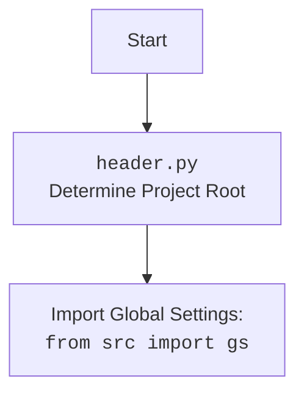

### **Системные инструкции для обработки кода проекта `hypotez`**

=========================================================================================

Описание функциональности и правил для генерации, анализа и улучшения кода. Направлено на обеспечение последовательного и читаемого стиля кодирования, соответствующего требованиям.

---

### **Основные принципы**

#### **1. Общие указания**:
- Соблюдай четкий и понятный стиль кодирования.
- Все изменения должны быть обоснованы и соответствовать установленным требованиям.

#### **2. Комментарии**:
- Используй `#` для внутренних комментариев.
- Документация всех функций, методов и классов должна следовать такому формату: 
    ```python
        def function(param: str, param1: Optional[str | dict | str] = None) -> dict | None:
            """ 
            Args:
                param (str): Описание параметра `param`.
                param1 (Optional[str | dict | str], optional): Описание параметра `param1`. По умолчанию `None`.
    
            Returns:
                dict | None: Описание возвращаемого значения. Возвращает словарь или `None`.
    
            Raises:
                SomeError: Описание ситуации, в которой возникает исключение `SomeError`.

            Ехаmple:
                >>> function('param', 'param1')
                {'param': 'param1'}
            """
    ```
- Комментарии и документация должны быть четкими, лаконичными и точными.

#### **3. Форматирование кода**:
- Используй одинарные кавычки. `a:str = 'value'`, `print('Hello World!')`;
- Добавляй пробелы вокруг операторов. Например, `x = 5`;
- Все параметры должны быть аннотированы типами. `def function(param: str, param1: Optional[str | dict | str] = None) -> dict | None:`;
- Не используй `Union`. Вместо этого используй `|`.

#### **4. Логирование**:
- Для логгирования Всегда Используй модуль `logger` из `src.logger.logger`.
- Ошибки должны логироваться с использованием `logger.error`.
Пример:
    ```python
        try:
            ...
        except Exception as ex:
            logger.error('Error while processing data', ех, exc_info=True)
    ```
#### **5 Не используй `Union[]` в коде. Вместо него используй `|`
Например:
```python
x: str | int ...
```


---

### **Основные требования**:

#### **1. Формат ответов в Markdown**:
- Все ответы должны быть выполнены в формате **Markdown**.

#### **2. Формат комментариев**:
- Используй указанный стиль для комментариев и документации в коде.
- Пример:

```python
from typing import Generator, Optional, List
from pathlib import Path


def read_text_file(
    file_path: str | Path,
    as_list: bool = False,
    extensions: Optional[List[str]] = None,
    chunk_size: int = 8192,
) -> Generator[str, None, None] | str | None:
    """
    Считывает содержимое файла (или файлов из каталога) с использованием генератора для экономии памяти.

    Args:
        file_path (str | Path): Путь к файлу или каталогу.
        as_list (bool): Если `True`, возвращает генератор строк.
        extensions (Optional[List[str]]): Список расширений файлов для чтения из каталога.
        chunk_size (int): Размер чанков для чтения файла в байтах.

    Returns:
        Generator[str, None, None] | str | None: Генератор строк, объединенная строка или `None` в случае ошибки.

    Raises:
        Exception: Если возникает ошибка при чтении файла.

    Example:
        >>> from pathlib import Path
        >>> file_path = Path('example.txt')
        >>> content = read_text_file(file_path)
        >>> if content:
        ...    print(f'File content: {content[:100]}...')
        File content: Example text...
    """
    ...
```
- Всегда делай подробные объяснения в комментариях. Избегай расплывчатых терминов, 
- таких как *«получить»* или *«делать»*. Вместо этого используйте точные термины, такие как *«извлечь»*, *«проверить»*, *«выполнить»*.
- Вместо: *«получаем»*, *«возвращаем»*, *«преобразовываем»* используй имя объекта *«функция получае»*, *«переменная возвращает»*, *«код преобразовывает»* 
- Комментарии должны непосредственно предшествовать описываемому блоку кода и объяснять его назначение.

#### **3. Пробелы вокруг операторов присваивания**:
- Всегда добавляйте пробелы вокруг оператора `=`, чтобы повысить читаемость.
- Примеры:
  - **Неправильно**: `x=5`
  - **Правильно**: `x = 5`

#### **4. Использование `j_loads` или `j_loads_ns`**:
- Для чтения JSON или конфигурационных файлов замените стандартное использование `open` и `json.load` на `j_loads` или `j_loads_ns`.
- Пример:

```python
# Неправильно:
with open('config.json', 'r', encoding='utf-8') as f:
    data = json.load(f)

# Правильно:
data = j_loads('config.json')
```

#### **5. Сохранение комментариев**:
- Все существующие комментарии, начинающиеся с `#`, должны быть сохранены без изменений в разделе «Улучшенный код».
- Если комментарий кажется устаревшим или неясным, не изменяйте его. Вместо этого отметьте его в разделе «Изменения».

#### **6. Обработка `...` в коде**:
- Оставляйте `...` как указатели в коде без изменений.
- Не документируйте строки с `...`.
```

#### **7. Аннотации**
Для всех переменных должны быть определены аннотации типа. 
Для всех функций все входные и выходные параметры аннотириваны
Для все параметров должны быть аннотации типа.


### **8. webdriver**
В коде используется webdriver. Он импртируется из модуля `webdriver` проекта `hypotez`
```python
from src.webdirver import Driver, Chrome, Firefox, Playwright, ...
driver = Driver(Firefox)

Пoсле чего может использоваться как

close_banner = {
  "attribute": null,
  "by": "XPATH",
  "selector": "//button[@id = 'closeXButton']",
  "if_list": "first",
  "use_mouse": false,
  "mandatory": false,
  "timeout": 0,
  "timeout_for_event": "presence_of_element_located",
  "event": "click()",
  "locator_description": "Закрываю pop-up окно, если оно не появилось - не страшно (`mandatory`:`false`)"
}

result = driver.execute_locator(close_banner)
```

### **Анализ кода `hypotez/src/endpoints/fast_api/main.py`**

#### **1. Блок-схема**

```mermaid
graph LR
    A[Start] --> B{Вывод меню команд}
    B --> C{Ввод команды пользователем}
    C --> D{Обработка команды}
    D --> E{start: Запуск сервера}
    D --> F{status: Статус серверов}
    D --> G{routes: Получение маршрутов}
    D --> H{stop: Остановка сервера}
    D --> I{stop_all: Остановка всех серверов}
    D --> J{add_route: Добавление маршрута}
    D --> K{shutdown: Остановка и выход}
    D --> L{help: Вывод меню}
    D --> M{exit: Выход}
    E --> N{Запрос порта и хоста}
    N --> O{Запуск сервера command_handler.start_server(port, host)}
    F --> P{Получение статуса серверов command_handler.status_servers()}
    G --> Q{Получение маршрутов command_handler.get_routes()}
    H --> R{Запрос порта}
    R --> S{Остановка сервера command_handler.stop_server(port)}
    I --> T{Остановка всех серверов command_handler.stop_all_servers()}
    J --> U{Запрос пути и методов}
    U --> V{Добавление нового маршрута command_handler.add_new_route(path, methods)}
    K --> W{Остановка всех серверов command_handler.stop_all_servers()}
    W --> X{Выход из программы sys.exit(0)}
    L --> B
    M --> Y{Выход из программы sys.exit(0)}
    D --> Z{Неизвестная команда}
    Z --> B
    O --> B
    P --> B
    Q --> B
    S --> B
    T --> B
    V --> B
    X --> End
    Y --> End
```

#### **2. Диаграмма**

```mermaid
flowchart TD
    subgraph src.fast_api
        A[main.py: Основной скрипт для управления сервером FastAPI]
        B[fast_api.py: Класс CommandHandler и связанные функции]
    end

    A --> B: Импортирует CommandHandler и logger
    B --> C[src.logger.logger: Модуль логирования]
    A --> C: Использует для логирования ошибок
    A --> D[header.py: Определение корневой директории проекта]
    D --> E[src: Глобальные настройки проекта]
    A --> F[sys: Системные функции и параметры]

    style A fill:#f9f,stroke:#333,stroke-width:2px
    style B fill:#ccf,stroke:#333,stroke-width:2px
    style C fill:#ccf,stroke:#333,stroke-width:2px
    style D fill:#ccf,stroke:#333,stroke-width:2px
    style E fill:#ccf,stroke:#333,stroke-width:2px
    style F fill:#ccf,stroke:#333,stroke-width:2px
```



#### **3. Объяснение**

**Импорты:**
- `sys`: Используется для выхода из программы (`sys.exit(0)`).
- `header`: Определяет корневую директорию проекта. Необходим для корректной работы с путями файлов и другими ресурсами проекта. Импортирует глобальные настройки проекта из `src`.
- `src.fast_api.fast_api`: Импортирует класс `CommandHandler` и модуль `logger` из `src.fast_api`.

**Классы:**
- `CommandHandler`: Класс, управляющий серверами FastAPI. Он содержит методы для запуска, остановки, получения статуса и добавления маршрутов.
    - Методы:
        - `start_server(port: int, host: str)`: Запускает сервер на указанном порту и хосте.
        - `status_servers()`: Выводит статус всех запущенных серверов.
        - `get_routes()`: Выводит список зарегистрированных маршрутов.
        - `stop_server(port: int)`: Останавливает сервер на указанном порту.
        - `stop_all_servers()`: Останавливает все запущенные серверы.
        - `add_new_route(path: str, func: str, methods: List[str])`: Добавляет новый маршрут к серверу.
- `logger`: Используется для логирования ошибок и других событий.

**Функции:**
- `display_menu()`: Выводит меню с доступными командами.
- `main()`: Основная функция управления сервером.
    - Инициализирует `CommandHandler`.
    - В бесконечном цикле:
        - Выводит меню команд.
        - Получает команду от пользователя.
        - Обрабатывает команду:
            - `start`: Запускает сервер на указанном порту и хосте.
            - `status`: Выводит статус серверов.
            - `routes`: Выводит список маршрутов.
            - `stop`: Останавливает сервер на указанном порту.
            - `stop_all`: Останавливает все серверы.
            - `add_route`: Добавляет новый маршрут.
            - `shutdown`: Останавливает все серверы и выходит.
            - `help`: Выводит меню.
            - `exit`: Выходит из программы.
        - Обрабатывает исключения и логирует ошибки.

**Переменные:**
- `command_handler`: Экземпляр класса `CommandHandler`, используемый для управления серверами.
- `command_line`: Строка, содержащая команду, введенную пользователем.
- `parts`: Список, полученный разделением строки `command_line` по пробелам.
- `command`: Первая часть списка `parts`, представляющая команду.
- `port`: Номер порта, на котором запускается или останавливается сервер.
- `host`: Адрес хоста, на котором запускается сервер.
- `path`: Путь для добавления нового маршрута.
- `methods`: Список HTTP-методов для нового маршрута.

**Потенциальные ошибки и области для улучшения:**
- Отсутствуют аннотации типов для переменных и параметров функций.
- Код для добавления маршрута (`add_route`) использует `lambda` функцию, что может быть небезопасно и трудно поддерживать. Рекомендуется использовать именованные функции.
- Обработка ошибок может быть улучшена путем предоставления более конкретных сообщений об ошибках для пользователя.

**Взаимосвязи с другими частями проекта:**
- `header` используется для определения корневой директории проекта.
- `src.fast_api.fast_api` содержит логику управления серверами FastAPI.
- `src.logger.logger` используется для логирования ошибок.