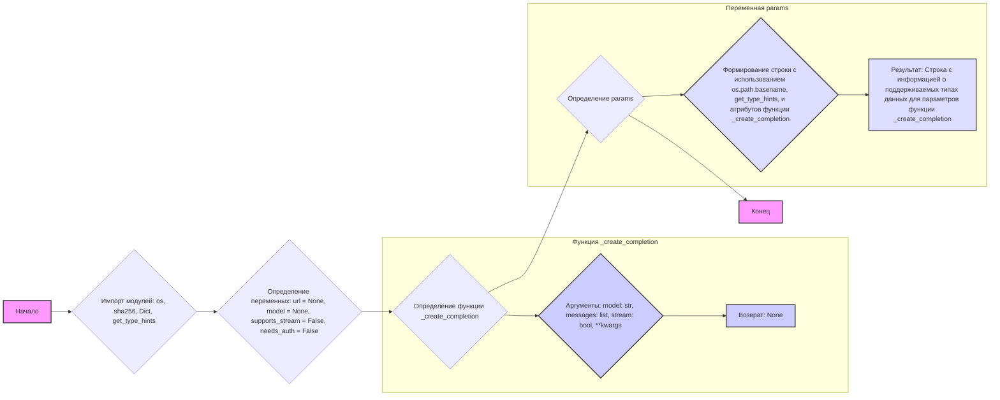
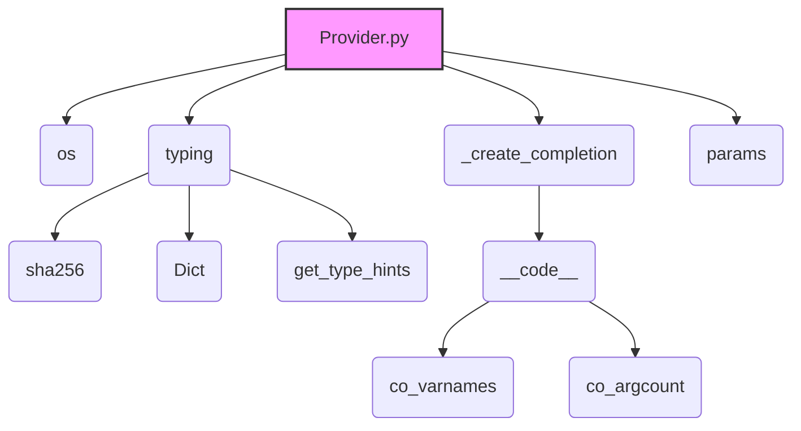

### **Анализ кода проекта `hypotez`**

=========================================================================================

Анализ файла: `hypotez/src/endpoints/freegpt-webui-ru/g4f/Provider/Provider.py`

---

### **1. Блок-схема**

**Примеры для логических блоков:**

- **Импорт модулей**:
  - `import os`: Импортирует модуль `os` для работы с операционной системой, например, для получения имени файла.
  - `from ..typing import sha256, Dict, get_type_hints`: Импортирует типы данных `sha256`, `Dict` и функцию `get_type_hints` из модуля `typing`.
- **Определение переменных**:
  - `url = None`: Определяет переменную `url` и присваивает ей значение `None`.
  - `model = None`: Определяет переменную `model` и присваивает ей значение `None`.
  - `supports_stream = False`: Определяет переменную `supports_stream` и присваивает ей значение `False`.
  - `needs_auth = False`: Определяет переменную `needs_auth` и присваивает ей значение `False`.
- **Определение функции `_create_completion`**:
  - `def _create_completion(model: str, messages: list, stream: bool, **kwargs):`: Определяет функцию `_create_completion`, которая принимает параметры `model` (строка), `messages` (список), `stream` (булево значение) и произвольные ключевые аргументы `kwargs`.
  - `return`: Функция ничего не возвращает.
- **Определение переменной `params`**:
  - `params = ...`: Формирует строку, содержащую информацию о поддерживаемых типах данных для параметров функции `_create_completion`. Использует `os.path.basename` для получения имени файла, `get_type_hints` для получения аннотаций типов и атрибуты `_create_completion.__code__.co_varnames` и `_create_completion.__code__.co_argcount` для получения информации о параметрах функции.

---

### **2. Диаграмма**

**Объяснение зависимостей:**

- `Provider.py` зависит от модулей `os` и `typing`.
- Модуль `typing` предоставляет типы данных `sha256` и `Dict`, а также функцию `get_type_hints`.
- Функция `_create_completion` используется для получения информации о параметрах через атрибут `__code__`, который предоставляет доступ к атрибутам `co_varnames` (имена переменных) и `co_argcount` (количество аргументов).
- Переменная `params` формируется с использованием всех вышеупомянутых элементов.

---

### **3. Объяснение**

**Импорты:**

- `import os`: Модуль `os` предоставляет функции для взаимодействия с операционной системой. В данном случае используется для получения имени файла с помощью `os.path.basename(__file__)`.
- `from ..typing import sha256, Dict, get_type_hints`:
  - `sha256`: Вероятно, представляет собой тип данных для SHA256 хэшей (не используется в представленном коде).
  - `Dict`: Тип данных для словарей.
  - `get_type_hints`: Функция из модуля `typing`, которая возвращает словарь, содержащий аннотации типов для функции, метода, модуля или класса.

**Переменные:**

- `url: None`: URL для доступа к API провайдера. Инициализируется как `None`.
- `model: None`: Имя модели, используемой провайдером. Инициализируется как `None`.
- `supports_stream: bool = False`: Указывает, поддерживает ли провайдер потоковую передачу данных. По умолчанию `False`.
- `needs_auth: bool = False`: Указывает, требуется ли аутентификация для использования провайдера. По умолчанию `False`.
- `params: str`: Строка, содержащая информацию о поддерживаемых типах данных для параметров функции `_create_completion`. Формируется динамически на основе аннотаций типов.

**Функции:**

- `def _create_completion(model: str, messages: list, stream: bool, **kwargs)`:
  - Аргументы:
    - `model (str)`: Модель для генерации завершения.
    - `messages (list)`: Список сообщений для передачи в модель.
    - `stream (bool)`: Флаг, указывающий, нужно ли использовать потоковую передачу.
    - `**kwargs`: Дополнительные аргументы.
  - Возвращаемое значение: `None`.
  - Назначение: Функция-заглушка, которая ничего не делает. Предположительно, должна быть переопределена в классах-наследниках.

**Объяснение кода:**

Код определяет базовые переменные и функцию для работы с провайдером, предоставляющим API для генерации текста. Переменные `url`, `model`, `supports_stream` и `needs_auth` задают основные характеристики провайдера. Функция `_create_completion` является заглушкой и должна быть реализована в подклассах. Переменная `params` формирует строку, содержащую информацию о поддерживаемых типах данных для параметров функции `_create_completion`.

**Потенциальные ошибки и области для улучшения:**

- Функция `_create_completion` не имеет реализации. Это означает, что данный код является базовым классом или интерфейсом и требует реализации в подклассах.
- Отсутствует обработка ошибок.
- Отсутствует документация для переменных `url`, `model`, `supports_stream` и `needs_auth`.

**Взаимосвязи с другими частями проекта:**

- Данный файл находится в директории `hypotez/src/endpoints/freegpt-webui-ru/g4f/Provider/`. Это указывает на то, что он является частью проекта, предоставляющего интерфейс для работы с различными провайдерами API для генерации текста, возможно, в рамках web-интерфейса `freegpt-webui-ru`.
- Модуль `typing` используется для аннотации типов, что помогает в обеспечении качества кода и упрощает отладку.
- Функция `get_type_hints` позволяет получить информацию о типах данных, ожидаемых функцией `_create_completion`, что может быть использовано для валидации входных данных или для автоматической генерации документации.