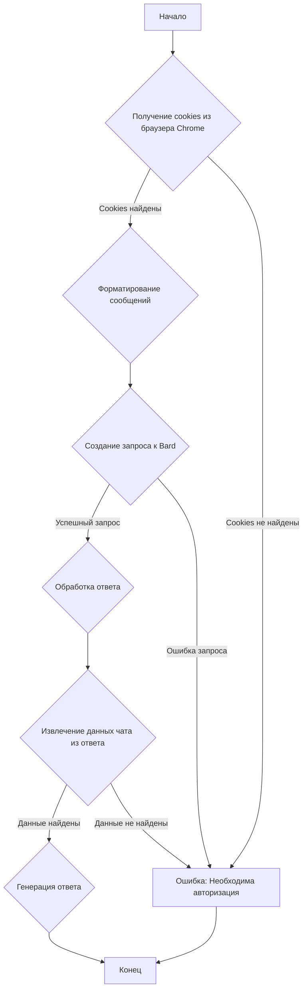
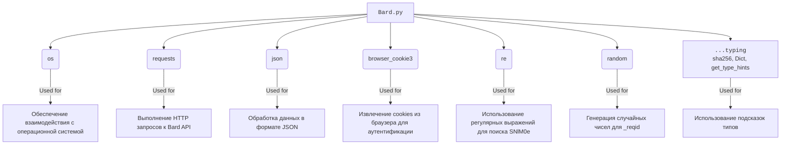

### **Системные инструкции для обработки кода проекта `hypotez`**

=========================================================================================

Описание функциональности и правил для генерации, анализа и улучшения кода. Направлено на обеспечение последовательного и читаемого стиля кодирования, соответствующего требованиям.

---

### **Основные принципы**

#### **1. Общие указания**:
- Соблюдай четкий и понятный стиль кодирования.
- Все изменения должны быть обоснованы и соответствовать установленным требованиям.

#### **2. Комментарии**:
- Используй `#` для внутренних комментариев.
- Документация всех функций, методов и классов должна следовать такому формату: 
    ```python
        def function(param: str, param1: Optional[str | dict | str] = None) -> dict | None:
            """ 
            Args:
                param (str): Описание параметра `param`.
                param1 (Optional[str | dict | str], optional): Описание параметра `param1`. По умолчанию `None`.
    
            Returns:
                dict | None: Описание возвращаемого значения. Возвращает словарь или `None`.
    
            Raises:
                SomeError: Описание ситуации, в которой возникает исключение `SomeError`.

            Ехаmple:
                >>> function('param', 'param1')
                {'param': 'param1'}
            """
    ```
- Комментарии и документация должны быть четкими, лаконичными и точными.

#### **3. Форматирование кода**:
- Используй одинарные кавычки. `a:str = 'value'`, `print('Hello World!')`;
- Добавляй пробелы вокруг операторов. Например, `x = 5`;
- Все параметры должны быть аннотированы типами. `def function(param: str, param1: Optional[str | dict | str] = None) -> dict | None:`;
- Не используй `Union`. Вместо этого используй `|`.

#### **4. Логирование**:
- Для логгирования Всегда Используй модуль `logger` из `src.logger.logger`.
- Ошибки должны логироваться с использованием `logger.error`.
Пример:
    ```python
        try:
            ...
        except Exception as ex:
            logger.error('Error while processing data', ех, exc_info=True)
    ```
#### **5 Не используй `Union[]` в коде. Вместо него используй `|`
Например:
```python
x: str | int ...
```


---

### **Основные требования**:

#### **1. Формат ответов в Markdown**:
- Все ответы должны быть выполнены в формате **Markdown**.

#### **2. Формат комментариев**:
- Используй указанный стиль для комментариев и документации в коде.
- Пример:

```python
from typing import Generator, Optional, List
from pathlib import Path


def read_text_file(
    file_path: str | Path,
    as_list: bool = False,
    extensions: Optional[List[str]] = None,
    chunk_size: int = 8192,
) -> Generator[str, None, None] | str | None:
    """
    Считывает содержимое файла (или файлов из каталога) с использованием генератора для экономии памяти.

    Args:
        file_path (str | Path): Путь к файлу или каталогу.
        as_list (bool): Если `True`, возвращает генератор строк.
        extensions (Optional[List[str]]): Список расширений файлов для чтения из каталога.
        chunk_size (int): Размер чанков для чтения файла в байтах.

    Returns:
        Generator[str, None, None] | str | None: Генератор строк, объединенная строка или `None` в случае ошибки.

    Raises:
        Exception: Если возникает ошибка при чтении файла.

    Example:
        >>> from pathlib import Path
        >>> file_path = Path('example.txt')
        >>> content = read_text_file(file_path)
        >>> if content:
        ...    print(f'File content: {content[:100]}...')
        File content: Example text...
    """
    ...
```
- Всегда делай подробные объяснения в комментариях. Избегай расплывчатых терминов, 
- таких как *«получить»* или *«делать»*. Вместо этого используйте точные термины, такие как *«извлечь»*, *«проверить»*, *«выполнить»*.
- Вместо: *«получаем»*, *«возвращаем»*, *«преобразовываем»* используй имя объекта *«функция получае»*, *«переменная возвращает»*, *«код преобразовывает»* 
- Комментарии должны непосредственно предшествовать описываемому блоку кода и объяснять его назначение.

#### **3. Пробелы вокруг операторов присваивания**:
- Всегда добавляйте пробелы вокруг оператора `=`, чтобы повысить читаемость.
- Примеры:
  - **Неправильно**: `x=5`
  - **Правильно**: `x = 5`

#### **4. Использование `j_loads` или `j_loads_ns`**:
- Для чтения JSON или конфигурационных файлов замените стандартное использование `open` и `json.load` на `j_loads` или `j_loads_ns`.
- Пример:

```python
# Неправильно:
with open('config.json', 'r', encoding='utf-8') as f:
    data = json.load(f)

# Правильно:
data = j_loads('config.json')
```

#### **5. Сохранение комментариев**:
- Все существующие комментарии, начинающиеся с `#`, должны быть сохранены без изменений в разделе «Улучшенный код».
- Если комментарий кажется устаревшим или неясным, не изменяйте его. Вместо этого отметьте его в разделе «Изменения».

#### **6. Обработка `...` в коде**:
- Оставляйте `...` как указатели в коде без изменений.
- Не документируйте строки с `...`.
```

#### **7. Аннотации**
Для всех переменных должны быть определены аннотации типа. 
Для всех функций все входные и выходные параметры аннотириваны
Для все параметров должны быть аннотации типа.


### **8. webdriver**
В коде используется webdriver. Он импртируется из модуля `webdriver` проекта `hypotez`
```python
from src.webdirver import Driver, Chrome, Firefox, Playwright, ...
driver = Driver(Firefox)

Пoсле чего может использоваться как

close_banner = {
  "attribute": null,
  "by": "XPATH",
  "selector": "//button[@id = 'closeXButton']",
  "if_list": "first",
  "use_mouse": false,
  "mandatory": false,
  "timeout": 0,
  "timeout_for_event": "presence_of_element_located",
  "event": "click()",
  "locator_description": "Закрываю pop-up окно, если оно не появилось - не страшно (`mandatory`:`false`)"
}

result = driver.execute_locator(close_banner)
```

### Анализ кода `hypotez/src/endpoints/freegpt-webui-ru/g4f/Provider/Providers/Bard.py`

#### 1. Блок-схема:



Примеры для каждого блока:

- **A (Начало)**: Начало выполнения функции `_create_completion`.
- **B (Получение cookies из браузера Chrome)**: Попытка извлечь cookie `__Secure-1PSID` для авторизации в Bard. Если cookie не найден, то выбрасывается исключение, так как для работы с Bard необходима авторизация.
  Пример: `psid = {cookie.name: cookie.value for cookie in browser_cookie3.chrome(domain_name='.google.com')}['__Secure-1PSID']`
- **C (Форматирование сообщений)**: Форматирование списка сообщений для отправки в запросе.
  Пример: `formatted = '\n'.join(['%s: %s' % (message['role'], message['content']) for message in messages])`
- **D (Создание запроса к Bard)**: Создание и отправка POST-запроса к Bard API с использованием `requests`.
  Пример: `response = client.post(f'https://bard.google.com/_/BardChatUi/data/{intents}/StreamGenerate', data=data, params=params)`
- **F (Обработка ответа)**: Разбор ответа от Bard API.
- **G (Извлечение данных чата из ответа)**: Извлечение данных чата из JSON, содержащегося в ответе.
  Пример: `chat_data = json.loads(response.content.splitlines()[3])[0][2]`
- **H (Генерация ответа)**: Предоставление сгенерированного ответа.
  Пример: `yield json_chat_data[0][0]`
- **I (Конец)**: Завершение выполнения функции `_create_completion`.
- **E (Ошибка: Необходима авторизация)**: Вывод сообщения об ошибке, если cookies не найдены, или если в процессе запроса произошла ошибка.

#### 2. Диаграмма зависимостей в формате Mermaid:



**Объяснение зависимостей:**

- `os`: Используется для работы с операционной системой. В данном коде может использоваться для получения имени файла.
- `requests`: Используется для отправки HTTP-запросов к API Bard.
- `json`: Используется для работы с данными в формате JSON, в частности, для кодирования и декодирования сообщений и ответов API.
- `browser_cookie3`: Используется для извлечения файлов cookie из браузера (в данном случае Chrome) для аутентификации.
- `re`: Используется для работы с регулярными выражениями, например, для поиска токена `SNlM0e` в HTML-коде страницы Bard.
- `random`: Используется для генерации случайных чисел, в частности, для параметра `_reqid` в запросе.
- `...typing`: Импортирует `sha256`, `Dict`, и `get_type_hints` для аннотации типов.

#### 3. Объяснение кода:

**Импорты:**

- `os`: Предоставляет функции для взаимодействия с операционной системой.
- `requests`: Библиотека для выполнения HTTP-запросов. Используется для отправки запросов к серверам Google Bard.
- `json`: Модуль для работы с данными в формате JSON.
- `browser_cookie3`: Библиотека для извлечения cookies из браузеров. Используется для получения cookies аутентификации из Chrome.
- `re`: Модуль для работы с регулярными выражениями.
- `random`: Модуль для генерации случайных чисел.
- `...typing`:  Содержит `sha256`, `Dict` и `get_type_hints`.
    - `sha256`: Функция для вычисления SHA256 хешей.
    - `Dict`: Тип для обозначения словарей.
    - `get_type_hints`: Функция для получения аннотаций типов.

**Переменные:**

- `url: str = 'https://bard.google.com'`: URL-адрес сервиса Google Bard.
- `model: list = ['Palm2']`: Список поддерживаемых моделей.
- `supports_stream: bool = False`: Указывает, поддерживается ли потоковая передача данных.
- `needs_auth: bool = True`: Указывает, требуется ли аутентификация для работы с сервисом.

**Функция `_create_completion`:**

- **Аргументы:**
    - `model: str`: Имя используемой модели.
    - `messages: list`: Список сообщений для отправки в запросе. Каждое сообщение содержит `role` и `content`.
    - `stream: bool`: Определяет, использовать ли потоковую передачу.
    - `**kwargs`: Дополнительные аргументы, такие как `proxy`.

- **Возвращаемое значение:**
    - `Generator[str, None, None]`: Генератор, возвращающий строки ответа.

- **Назначение:**
    Функция отправляет запрос к Google Bard и возвращает ответ в виде генератора строк.

- **Пример:**
  ```python
  messages = [{'role': 'user', 'content': 'Напиши стихотворение о весне.'}]
  for response in _create_completion(model='Palm2', messages=messages, stream=False):
      print(response)
  ```

**Логика работы функции `_create_completion`:**

1. **Получение cookies:**
   - Функция пытается получить cookie `__Secure-1PSID` из браузера Chrome, используя библиотеку `browser_cookie3`. Этот cookie необходим для аутентификации в Google Bard.
   - Если cookie не найден, функция завершается с ошибкой.
2. **Форматирование сообщений:**
   - Функция форматирует список сообщений в строку, где каждое сообщение имеет вид `'role: content'`.
3. **Создание HTTP-клиента:**
   - Создается сессия `requests.Session()` для выполнения HTTP-запросов.
   - Устанавливаются прокси, если они указаны в `kwargs`.
   - Устанавливаются заголовки запроса, включая cookie `__Secure-1PSID`.
4. **Получение токена `SNlM0e`:**
   - Функция выполняет GET-запрос к главной странице Bard и извлекает токен `SNlM0e` из HTML-кода страницы с использованием регулярного выражения.
5. **Создание и отправка POST-запроса:**
   - Формируются параметры запроса (`params`) и данные запроса (`data`).
   - `data` содержит отформатированные сообщения и информацию о разговоре.
   - Функция отправляет POST-запрос к API Bard (`https://bard.google.com/_/BardChatUi/data/{intents}/StreamGenerate`).
6. **Обработка ответа:**
   - Функция разбирает ответ, извлекает данные чата из JSON и возвращает их в виде генератора строк.
   - Если данные чата не найдены, функция возвращает строку `'error'`.

**Переменные внутри функции `_create_completion`:**

- `psid: str`: Значение cookie `__Secure-1PSID`, используемое для аутентификации.
- `formatted: str`: Отформатированная строка сообщений.
- `prompt: str`: Полный текст запроса, отправляемый в Bard.
- `proxy: str | bool`: Адрес прокси-сервера, если он указан.
- `snlm0e: str`: Токен, необходимый для запросов к Bard.
- `conversation_id: str | None`: Идентификатор разговора.
- `response_id: str | None`: Идентификатор ответа.
- `choice_id: str | None`: Идентификатор выбора.
- `client: requests.Session`: HTTP-клиент для выполнения запросов.
- `params: dict`: Параметры запроса.
- `data: dict`: Данные запроса.
- `intents: str`: Строка, определяющая назначение запроса.
- `response: requests.Response`: Объект ответа от сервера.
- `chat_data: str`: Данные чата, извлеченные из ответа.
- `json_chat_data: list`: Данные чата в формате JSON.

**Потенциальные ошибки и области для улучшения:**

1. **Обработка ошибок при получении cookies:** Если cookie `__Secure-1PSID` не найден, функция просто завершается без обработки ошибки. Необходимо добавить обработку исключений и предоставить более информативное сообщение об ошибке.
2. **Обработка ошибок при выполнении запроса:** Если запрос к API Bard завершается с ошибкой (например, из-за проблем с сетью или неверных параметров), функция возвращает `'error'`. Необходимо добавить более детальную обработку ошибок и логирование.
3. **Отсутствие обработки прокси:** В коде есть проверка на наличие прокси, но отсутствует логирование, если прокси не указан.
4. **Устаревший user-agent:** User-agent жестко задан и может быть устаревшим. Следует использовать более актуальный user-agent или генерировать его динамически.
5. **Жёстко закодированные URL:** URL-адреса API и главной страницы Bard жёстко закодированы в коде. Следует вынести их в конфигурационные параметры.

**Взаимосвязи с другими частями проекта:**

- Этот файл является частью проекта `hypotez` и предоставляет реализацию для работы с Google Bard.
- Он использует библиотеку `browser_cookie3` для получения cookies, что может быть полезно и в других частях проекта, где требуется аутентификация через браузер.
- Функция `_create_completion` может использоваться как часть более общего интерфейса для взаимодействия с различными языковыми моделями.

```python
params = f'g4f.Providers.{os.path.basename(__file__)[:-3]} supports: ' + \
    '({0})'.format(', '.join([f"{name}: {get_type_hints(_create_completion)[name].__name__}" for name in _create_completion.__code__.co_varnames[:_create_completion.__code__.co_argcount]]))
```

Эта строка формирует строку с информацией о поддержке параметров функцией `_create_completion`. Она использует `os.path.basename(__file__)[:-3]` для получения имени текущего файла без расширения `.py`, `get_type_hints` для получения аннотаций типов параметров функции, и `_create_completion.__code__.co_varnames[:_create_completion.__code__.co_argcount]` для получения списка имен параметров функции.