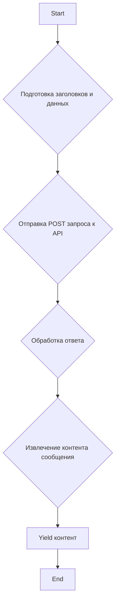

### **Системные инструкции для обработки кода проекта `hypotez`**

=========================================================================================

Описание функциональности и правил для генерации, анализа и улучшения кода. Направлено на обеспечение последовательного и читаемого стиля кодирования, соответствующего требованиям.

---

### **Основные принципы**

#### **1. Общие указания**:
- Соблюдай четкий и понятный стиль кодирования.
- Все изменения должны быть обоснованы и соответствовать установленным требованиям.

#### **2. Комментарии**:
- Используй `#` для внутренних комментариев.
- Документация всех функций, методов и классов должна следовать такому формату: 
    ```python
        def function(param: str, param1: Optional[str | dict | str] = None) -> dict | None:
            """ 
            Args:
                param (str): Описание параметра `param`.
                param1 (Optional[str | dict | str], optional): Описание параметра `param1`. По умолчанию `None`.
    
            Returns:
                dict | None: Описание возвращаемого значения. Возвращает словарь или `None`.
    
            Raises:
                SomeError: Описание ситуации, в которой возникает исключение `SomeError`.

            Ехаmple:
                >>> function('param', 'param1')
                {'param': 'param1'}
            """
    ```
- Комментарии и документация должны быть четкими, лаконичными и точными.

#### **3. Форматирование кода**:
- Используй одинарные кавычки. `a:str = 'value'`, `print('Hello World!')`;
- Добавляй пробелы вокруг операторов. Например, `x = 5`;
- Все параметры должны быть аннотированы типами. `def function(param: str, param1: Optional[str | dict | str] = None) -> dict | None:`;
- Не используй `Union`. Вместо этого используй `|`.

#### **4. Логирование**:
- Для логгирования Всегда Используй модуль `logger` из `src.logger.logger`.
- Ошибки должны логироваться с использованием `logger.error`.
Пример:
    ```python
        try:
            ...
        except Exception as ex:
            logger.error('Error while processing data', ех, exc_info=True)
    ```
#### **5 Не используй `Union[]` в коде. Вместо него используй `|`
Например:
```python
x: str | int ...
```


---

### **Основные требования**:

#### **1. Формат ответов в Markdown**:
- Все ответы должны быть выполнены в формате **Markdown**.

#### **2. Формат комментариев**:
- Используй указанный стиль для комментариев и документации в коде.
- Пример:

```python
from typing import Generator, Optional, List
from pathlib import Path


def read_text_file(
    file_path: str | Path,
    as_list: bool = False,
    extensions: Optional[List[str]] = None,
    chunk_size: int = 8192,
) -> Generator[str, None, None] | str | None:
    """
    Считывает содержимое файла (или файлов из каталога) с использованием генератора для экономии памяти.

    Args:
        file_path (str | Path): Путь к файлу или каталогу.
        as_list (bool): Если `True`, возвращает генератор строк.
        extensions (Optional[List[str]]): Список расширений файлов для чтения из каталога.
        chunk_size (int): Размер чанков для чтения файла в байтах.

    Returns:
        Generator[str, None, None] | str | None: Генератор строк, объединенная строка или `None` в случае ошибки.

    Raises:
        Exception: Если возникает ошибка при чтении файла.

    Example:
        >>> from pathlib import Path
        >>> file_path = Path('example.txt')
        >>> content = read_text_file(file_path)
        >>> if content:
        ...    print(f'File content: {content[:100]}...')
        File content: Example text...
    """
    ...
```
- Всегда делай подробные объяснения в комментариях. Избегай расплывчатых терминов, 
- таких как *«получить»* или *«делать»*. Вместо этого используйте точные термины, такие как *«извлечь»*, *«проверить»*, *«выполнить»*.
- Вместо: *«получаем»*, *«возвращаем»*, *«преобразовываем»* используй имя объекта *«функция получае»*, *«переменная возвращает»*, *«код преобразовывает»* 
- Комментарии должны непосредственно предшествовать описываемому блоку кода и объяснять его назначение.

#### **3. Пробелы вокруг операторов присваивания**:
- Всегда добавляйте пробелы вокруг оператора `=`, чтобы повысить читаемость.
- Примеры:
  - **Неправильно**: `x=5`
  - **Правильно**: `x = 5`

#### **4. Использование `j_loads` или `j_loads_ns`**:
- Для чтения JSON или конфигурационных файлов замените стандартное использование `open` и `json.load` на `j_loads` или `j_loads_ns`.
- Пример:

```python
# Неправильно:
with open('config.json', 'r', encoding='utf-8') as f:
    data = json.load(f)

# Правильно:
data = j_loads('config.json')
```

#### **5. Сохранение комментариев**:
- Все существующие комментарии, начинающиеся с `#`, должны быть сохранены без изменений в разделе «Улучшенный код».
- Если комментарий кажется устаревшим или неясным, не изменяйте его. Вместо этого отметьте его в разделе «Изменения».

#### **6. Обработка `...` в коде**:
- Оставляйте `...` как указатели в коде без изменений.
- Не документируйте строки с `...`.
```

#### **7. Аннотации**
Для всех переменных должны быть определены аннотации типа. 
Для всех функций все входные и выходные параметры аннотириваны
Для все параметров должны быть аннотации типа.


### **8. webdriver**
В коде используется webdriver. Он импртируется из модуля `webdriver` проекта `hypotez`
```python
from src.webdirver import Driver, Chrome, Firefox, Playwright, ...
driver = Driver(Firefox)

Пoсле чего может использоваться как

close_banner = {
  "attribute": null,
  "by": "XPATH",
  "selector": "//button[@id = 'closeXButton']",
  "if_list": "first",
  "use_mouse": false,
  "mandatory": false,
  "timeout": 0,
  "timeout_for_event": "presence_of_element_located",
  "event": "click()",
  "locator_description": "Закрываю pop-up окно, если оно не появилось - не страшно (`mandatory`:`false`)"
}

result = driver.execute_locator(close_banner)
```

### **Анализ кода Mishalsgpt.py**

#### **1. Блок-схема**



**Пример для каждого логического блока:**

- **A[Start]**: Начало выполнения функции `_create_completion`.
- **B{Подготовка заголовков и данных}**:
  ```python
  headers = {
      'Content-Type': 'application/json',
  }
  data = {
      'model': model,
      'temperature': 0.7,
      'messages': messages
  }
  ```
- **C{Отправка POST запроса к API}**:
  ```python
  response = requests.post(url + '/api/openai/v1/chat/completions', 
                           headers=headers, json=data, stream=True)
  ```
- **D{Обработка ответа}**:
  ```python
  response.json()
  ```
- **E{Извлечение контента сообщения}**:
  ```python
  response.json()['choices'][0]['message']['content']
  ```
- **F[Yield контент]**:
  ```python
  yield response.json()['choices'][0]['message']['content']
  ```
- **G[End]**: Завершение выполнения функции `_create_completion`.

#### **2. Диаграмма**

```mermaid
graph TD
    A[<code>Mishalsgpt.py</code>] --> B[os];
    A --> C[requests];
    A --> D[typing];
    D --> E[sha256];
    D --> F[Dict];
    D --> G[get_type_hints];
    A --> H[url = 'https://mishalsgpt.vercel.app'];
    A --> I[model = ['gpt-3.5-turbo-16k-0613', 'gpt-3.5-turbo']];
    A --> J[supports_stream = True];
    A --> K[needs_auth = False];
    A --> L[_create_completion];
    L --> B;
    L --> C;
    L --> D;
    A --> M[params];
```

**Объяснение зависимостей:**

- `os`: Используется для работы с операционной системой, в частности, для получения имени файла.
- `requests`: Используется для отправки HTTP-запросов к API Mishalsgpt.
- `typing`: Используется для аннотации типов, таких как `sha256`, `Dict` и `get_type_hints`, что помогает улучшить читаемость и надежность кода.
- `sha256`, `Dict`, `get_type_hints`: Конкретные типы, используемые для аннотаций.
- `url`: URL-адрес API Mishalsgpt.
- `model`: Список поддерживаемых моделей.
- `supports_stream`: Флаг, указывающий, поддерживает ли провайдер потоковую передачу.
- `needs_auth`: Флаг, указывающий, требуется ли аутентификация.
- `_create_completion`: Основная функция для создания завершений чата.
- `params`: строка содержащая информацию о типах параметров, принимаемых функцией `_create_completion`.

#### **3. Объяснение**

**Импорты:**

- `os`: Этот модуль предоставляет функции для взаимодействия с операционной системой. В данном коде он используется для получения имени файла текущего модуля.
- `requests`: Этот модуль позволяет отправлять HTTP-запросы, что необходимо для взаимодействия с API Mishalsgpt.
- `typing`: Этот модуль используется для аннотации типов, что улучшает читаемость и помогает выявлять ошибки на ранних этапах разработки. В данном коде используются `sha256`, `Dict` и `get_type_hints`. `sha256` - тип данных, `Dict` - словарь, `get_type_hints` - функция для получения аннотаций типов.

**Переменные:**

- `url`: `str` - URL-адрес API Mishalsgpt (`https://mishalsgpt.vercel.app`).
- `model`: `list` - Список поддерживаемых моделей (`['gpt-3.5-turbo-16k-0613', 'gpt-3.5-turbo']`).
- `supports_stream`: `bool` - Указывает, поддерживает ли провайдер потоковую передачу данных (значение `True`).
- `needs_auth`: `bool` - Указывает, требуется ли аутентификация для использования провайдера (значение `False`).

**Функции:**

- `_create_completion(model: str, messages: list, stream: bool, **kwargs)`:
    - **Аргументы:**
        - `model`: `str` - Модель для использования.
        - `messages`: `list` - Список сообщений для отправки.
        - `stream`: `bool` - Указывает, использовать ли потоковую передачу.
        - `**kwargs`: Дополнительные аргументы.
    - **Возвращаемое значение:**
        - `generator` - Генератор, выдающий контент сообщений.
    - **Назначение:**
        Отправляет запрос к API Mishalsgpt и возвращает контент сообщения.
    - **Пример:**
      ```python
      messages = [{"role": "user", "content": "Hello, how are you?"}]
      for chunk in _create_completion(model='gpt-3.5-turbo', messages=messages, stream=True):
          print(chunk)
      ```

**Выражение `params`:**

- `params = f'g4f.Providers.{os.path.basename(__file__)[:-3]} supports: ' + \' (%s)\' % \', \'.join([f"{name}: {get_type_hints(_create_completion)[name].__name__}" for name in _create_completion.__code__.co_varnames[:_create_completion.__code__.co_argcount]])`
  Эта строка формирует строку `params`, которая описывает, какие параметры поддерживает функция `_create_completion`. Она использует `get_type_hints` для получения аннотаций типов и `__code__.co_varnames` для получения имен аргументов.

**Потенциальные ошибки и области для улучшения:**

1. **Обработка ошибок:** В коде отсутствует явная обработка ошибок при отправке запроса к API. Следует добавить обработку исключений, чтобы предотвратить неожиданное завершение программы.
2. **Параметризация URL:** URL API за hardcoded в коде. Лучше вынести его в конфигурационный файл или переменную окружения.
3. **Логирование:** Отсутствует логирование. Следует добавить логирование для отслеживания запросов и ответов API, а также для выявления возможных проблем.

**Цепочка взаимосвязей с другими частями проекта:**

- Этот код является частью провайдеров для `g4f`, который, в свою очередь, используется в веб-интерфейсе `freegpt-webui-ru`. Он предоставляет способ взаимодействия с API Mishalsgpt для генерации текста.