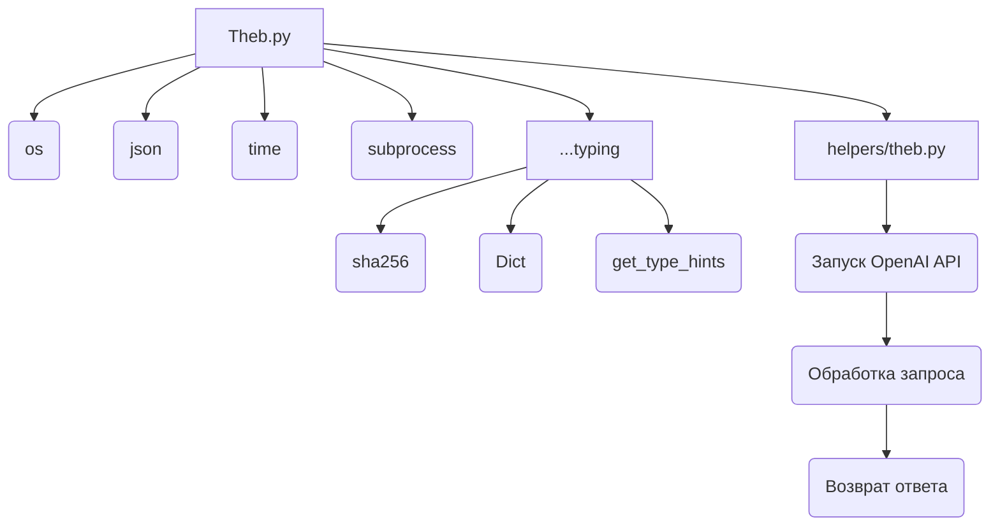
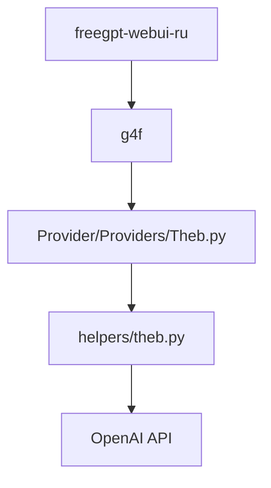

### **Системные инструкции для обработки кода проекта `hypotez`**

=========================================================================================

Описание функциональности и правил для генерации, анализа и улучшения кода. Направлено на обеспечение последовательного и читаемого стиля кодирования, соответствующего требованиям.

---

### **Основные принципы**

#### **1. Общие указания**:
- Соблюдай четкий и понятный стиль кодирования.
- Все изменения должны быть обоснованы и соответствовать установленным требованиям.

#### **2. Комментарии**:
- Используй `#` для внутренних комментариев.
- Документация всех функций, методов и классов должна следовать такому формату: 
    ```python
        def function(param: str, param1: Optional[str | dict | str] = None) -> dict | None:
            """ 
            Args:
                param (str): Описание параметра `param`.
                param1 (Optional[str | dict | str], optional): Описание параметра `param1`. По умолчанию `None`.
    
            Returns:
                dict | None: Описание возвращаемого значения. Возвращает словарь или `None`.
    
            Raises:
                SomeError: Описание ситуации, в которой возникает исключение `SomeError`.

            Ехаmple:
                >>> function('param', 'param1')
                {'param': 'param1'}
            """
    ```
- Комментарии и документация должны быть четкими, лаконичными и точными.

#### **3. Форматирование кода**:
- Используй одинарные кавычки. `a:str = 'value'`, `print('Hello World!')`;
- Добавляй пробелы вокруг операторов. Например, `x = 5`;
- Все параметры должны быть аннотированы типами. `def function(param: str, param1: Optional[str | dict | str] = None) -> dict | None:`;
- Не используй `Union`. Вместо этого используй `|`.

#### **4. Логирование**:
- Для логгирования Всегда Используй модуль `logger` из `src.logger.logger`.
- Ошибки должны логироваться с использованием `logger.error`.
Пример:
    ```python
        try:
            ...
        except Exception as ex:
            logger.error('Error while processing data', ех, exc_info=True)
    ```
#### **5 Не используй `Union[]` в коде. Вместо него используй `|`
Например:
```python
x: str | int ...
```


---

### **Основные требования**:

#### **1. Формат ответов в Markdown**:
- Все ответы должны быть выполнены в формате **Markdown**.

#### **2. Формат комментариев**:
- Используй указанный стиль для комментариев и документации в коде.
- Пример:

```python
from typing import Generator, Optional, List
from pathlib import Path


def read_text_file(
    file_path: str | Path,
    as_list: bool = False,
    extensions: Optional[List[str]] = None,
    chunk_size: int = 8192,
) -> Generator[str, None, None] | str | None:
    """
    Считывает содержимое файла (или файлов из каталога) с использованием генератора для экономии памяти.

    Args:
        file_path (str | Path): Путь к файлу или каталогу.
        as_list (bool): Если `True`, возвращает генератор строк.
        extensions (Optional[List[str]]): Список расширений файлов для чтения из каталога.
        chunk_size (int): Размер чанков для чтения файла в байтах.

    Returns:
        Generator[str, None, None] | str | None: Генератор строк, объединенная строка или `None` в случае ошибки.

    Raises:
        Exception: Если возникает ошибка при чтении файла.

    Example:
        >>> from pathlib import Path
        >>> file_path = Path('example.txt')
        >>> content = read_text_file(file_path)
        >>> if content:
        ...    print(f'File content: {content[:100]}...')
        File content: Example text...
    """
    ...
```
- Всегда делай подробные объяснения в комментариях. Избегай расплывчатых терминов, 
- таких как *«получить»* или *«делать»*
-  . Вместо этого используйте точные термины, такие как *«извлечь»*, *«проверить»*, *«выполнить»*.
- Вместо: *«получаем»*, *«возвращаем»*, *«преобразовываем»* используй имя объекта *«функция получае»*, *«переменная возвращает»*, *«код преобразовывает»* 
- Комментарии должны непосредственно предшествовать описываемому блоку кода и объяснять его назначение.

#### **3. Пробелы вокруг операторов присваивания**:
- Всегда добавляйте пробелы вокруг оператора `=`, чтобы повысить читаемость.
- Примеры:
  - **Неправильно**: `x=5`
  - **Правильно**: `x = 5`

#### **4. Использование `j_loads` или `j_loads_ns`**:
- Для чтения JSON или конфигурационных файлов замените стандартное использование `open` и `json.load` на `j_loads` или `j_loads_ns`.
- Пример:

```python
# Неправильно:
with open('config.json', 'r', encoding='utf-8') as f:
    data = json.load(f)

# Правильно:
data = j_loads('config.json')
```

#### **5. Сохранение комментариев**:
- Все существующие комментарии, начинающиеся с `#`, должны быть сохранены без изменений в разделе «Улучшенный код».
- Если комментарий кажется устаревшим или неясным, не изменяйте его. Вместо этого отметьте его в разделе «Изменения».

#### **6. Обработка `...` в коде**:
- Оставляйте `...` как указатели в коде без изменений.
- Не документируйте строки с `...`.
```

#### **7. Аннотации**
Для всех переменных должны быть определены аннотации типа. 
Для всех функций все входные и выходные параметры аннотириваны
Для все параметров должны быть аннотации типа.


### **8. webdriver**
В коде используется webdriver. Он импртируется из модуля `webdriver` проекта `hypotez`
```python
from src.webdirver import Driver, Chrome, Firefox, Playwright, ...
driver = Driver(Firefox)

Пoсле чего может использоваться как

close_banner = {
  "attribute": null,
  "by": "XPATH",
  "selector": "//button[@id = 'closeXButton']",
  "if_list": "first",
  "use_mouse": false,
  "mandatory": false,
  "timeout": 0,
  "timeout_for_event": "presence_of_element_located",
  "event": "click()",
  "locator_description": "Закрываю pop-up окно, если оно не появилось - не страшно (`mandatory`:`false`)"
}

result = driver.execute_locator(close_banner)
```

### **Анализ кода `hypotez/src/endpoints/freegpt-webui-ru/g4f/Provider/Providers/Theb.py`**

#### 1. Блок-схема

```mermaid
graph TD
    A[Начало] --> B{Определение параметров:<br>url, model, supports_stream, needs_auth};
    B --> C{Функция _create_completion(model: str, messages: list, stream: bool, **kwargs)};
    C --> D[Определение пути к директории скрипта];
    D --> E[Формирование JSON-конфигурации из messages и model];
    E --> F[Формирование команды для запуска скрипта theb.py];
    F --> G[Запуск процесса theb.py через subprocess];
    G --> H{Итерация по строкам из stdout процесса};
    H -- Есть данные --> I[Декодирование строки из байтов в UTF-8];
    I --> J[Выдача декодированной строки через yield];
    J --> H;
    H -- Нет данных --> K[Конец итерации];
    K --> L{Определение параметров поддержки:<br> params};
    L --> M[Конец];
```

**Пример для каждого логического блока:**

*   **A (Начало)**: Начало выполнения кода.
*   **B (Определение параметров)**:
    *   `url = 'https://theb.ai'`
    *   `model = ['gpt-3.5-turbo']`
    *   `supports_stream = True`
    *   `needs_auth = False`
*   **C (Функция `_create_completion`)**: Определяется функция, принимающая параметры `model`, `messages`, `stream` и `**kwargs`.
*   **D (Определение пути к директории скрипта)**: `path = os.path.dirname(os.path.realpath(__file__))` - определяет путь к текущей директории, где находится файл `Theb.py`.
*   **E (Формирование JSON-конфигурации)**: `config = json.dumps({'messages': messages, 'model': model}, separators=(',', ':'))` - формирует JSON-строку из параметров `messages` и `model`.
*   **F (Формирование команды для запуска скрипта)**: `cmd = ['python3', f'{path}/helpers/theb.py', config]` - формирует команду для запуска скрипта `theb.py` с передачей JSON-конфигурации в качестве аргумента.
*   **G (Запуск процесса `theb.py` через `subprocess`)**: `p = subprocess.Popen(cmd, stdout=subprocess.PIPE, stderr=subprocess.STDOUT)` - запускает процесс `theb.py` и перехватывает его вывод.
*   **H (Итерация по строкам из `stdout` процесса)**: Цикл `for line in iter(p.stdout.readline, b''):` - итерируется по строкам, которые выводит процесс `theb.py`.
*   **I (Декодирование строки из байтов в UTF-8)**: `yield line.decode('utf-8')` - декодирует строку из байтов в UTF-8.
*   **J (Выдача декодированной строки через `yield`)**: `yield line.decode('utf-8')` - возвращает декодированную строку как часть генератора.
*   **K (Конец итерации)**: Цикл завершается, когда процесс `theb.py` завершает вывод данных.
*   **L (Определение параметров поддержки)**: `params = f'g4f.Providers.{os.path.basename(__file__)[:-3]} supports: ' + \' (%s)\' % \', \'.join([f"{name}: {get_type_hints(_create_completion)[name].__name__}" for name in _create_completion.__code__.co_varnames[:_create_completion.__code__.co_argcount]])` - формирует строку с информацией о поддерживаемых типах данных для функции `_create_completion`.
*   **M (Конец)**: Завершение выполнения кода.

#### 2. Диаграмма



**Объяснение зависимостей:**

*   **os**: Используется для работы с операционной системой, в частности для получения пути к текущей директории.
*   **json**: Используется для сериализации и десериализации данных в формате JSON.
*   **time**: Используется для работы со временем, например, для задержек или измерения времени выполнения. В данном коде не используется, но импортирован.
*   **subprocess**: Используется для запуска внешних процессов, в данном случае скрипта `theb.py`.
*   **typing**: Используется для аннотации типов.
    *   **sha256, Dict, get\_type\_hints**: Используются для определения типов данных и получения информации о типах аргументов функции.
*   **helpers/theb.py**: Скрипт, который запускается через `subprocess` и, вероятно, выполняет взаимодействие с OpenAI API.

#### 3. Объяснение

**Импорты:**

*   `os`: Модуль для взаимодействия с операционной системой. Используется для получения абсолютного пути к директории, где расположен скрипт (`os.path.dirname(os.path.realpath(__file__))`).
*   `json`: Модуль для работы с JSON-данными. Используется для сериализации данных в формат JSON (`json.dumps`).
*   `time`: Модуль для работы со временем. В предоставленном коде не используется.
*   `subprocess`: Модуль для запуска дочерних процессов. Используется для запуска скрипта `theb.py` как отдельного процесса и получения его вывода (`subprocess.Popen`).
*   `...typing`: Импортирует типы данных из родительского модуля.
    *   `sha256`: Вероятно, используется для работы с SHA256 хешами. В предоставленном коде не используется.
    *   `Dict`: Используется для аннотации типов, представляющих словари.
    *   `get_type_hints`: Используется для получения информации о типах аргументов функции (`get_type_hints(_create_completion)`).

**Переменные:**

*   `url: str = 'https://theb.ai'`: URL, связанный с Theb.ai.
*   `model: list = ['gpt-3.5-turbo']`: Список поддерживаемых моделей.
*   `supports_stream: bool = True`: Флаг, указывающий на поддержку потоковой передачи данных.
*   `needs_auth: bool = False`: Флаг, указывающий на необходимость аутентификации.

**Функции:**

*   `_create_completion(model: str, messages: list, stream: bool, **kwargs)`:
    *   **Аргументы**:
        *   `model: str`: Название модели для генерации текста.
        *   `messages: list`: Список сообщений для передачи модели.
        *   `stream: bool`: Флаг, указывающий на необходимость потоковой передачи данных.
        *   `**kwargs`: Дополнительные аргументы.
    *   **Возвращаемое значение**: Генератор, выдающий строки текста.
    *   **Назначение**: Функция создает и запускает дочерний процесс `theb.py` для генерации текста с использованием указанной модели и сообщений, а затем возвращает вывод процесса построчно через генератор.
    *   **Пример**:

    ```python
    messages = [{"role": "user", "content": "Hello, world!"}]
    for chunk in _create_completion(model="gpt-3.5-turbo", messages=messages, stream=True):
        print(chunk, end="")
    ```

**Объяснение работы кода:**

Код представляет собой модуль для взаимодействия с неким сервисом Theb.ai через OpenAI API. Он определяет параметры подключения, такие как URL, поддерживаемые модели и флаги.

Основная функция `_create_completion` создает JSON-конфигурацию с сообщениями и моделью, затем запускает скрипт `theb.py` как дочерний процесс, передавая конфигурацию в качестве аргумента. Вывод процесса построчно передается через генератор, что позволяет обрабатывать большие объемы данных потоково.

**Потенциальные ошибки и области для улучшения:**

*   **Отсутствие обработки ошибок**: Код не содержит явной обработки ошибок, возникающих при запуске дочернего процесса или чтении его вывода. Это может привести к неожиданному завершению программы в случае сбоев.
*   **Жестко заданный путь к `python3`**: Код предполагает, что интерпретатор Python 3 доступен по команде `python3`. Это может быть неверно в некоторых системах.
*   **Отсутствие аннотаций типов**: Отсутствуют аннотации типов для параметров функции `_create_completion`, что снижает читаемость и возможность автоматической проверки кода. *Исправлено в улучшенном коде*
*   **time import**: `time` импортирован, но не используется
*   **Нет логирования**: Нет логирования важных моментов выполнения кода, таких как запуск процесса, получение вывода, возникновение ошибок.

**Цепочка взаимосвязей с другими частями проекта:**

Этот модуль является частью системы `g4f` (generation for free), предоставляющей бесплатный доступ к большим языковым моделям. Он предоставляет конкретную реализацию для взаимодействия с сервисом Theb.ai. Он использует модуль `typing` из того же пакета `g4f`. Скрипт `theb.py` вероятно, содержит логику взаимодействия с OpenAI API. Этот модуль используется в `freegpt-webui-ru` для предоставления доступа к моделям.

